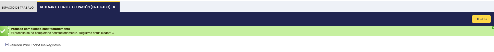
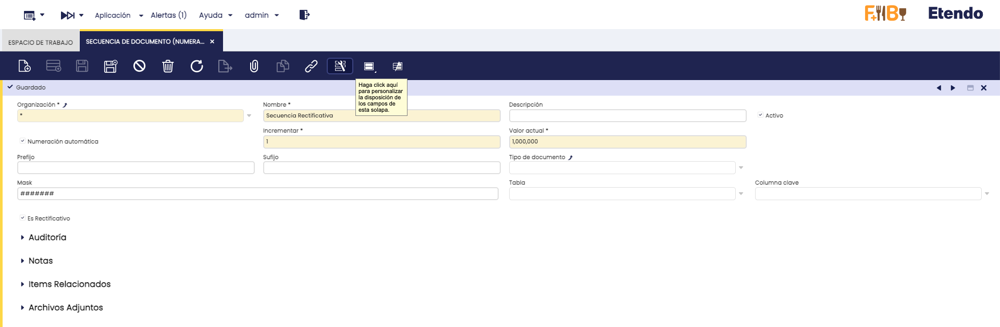
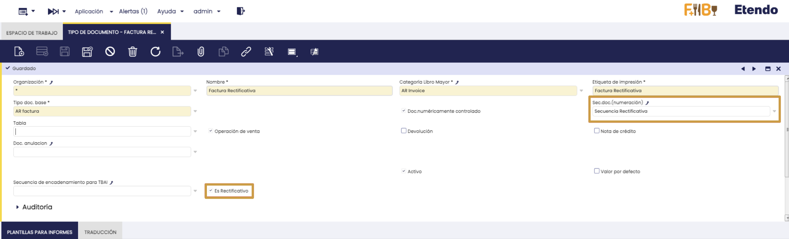

# Funcionalidades Generales Para SIFs

:octicons-package-16: Javapackage: `com.etendoerp.sif.general`

:octicons-package-16: Javapackage: `com.etendoerp.sif.general.template`

## Introducción

El módulo de Funcionalidades Generales para SIFs, incluído con la instalación de SII, Verifactu y TicketBAI, ofrece mejoras y utilidades que facilitan la unificación y funcionalidad de los Sistemas de Facturación mencionados. 

Este módulo se incluye automáticamente con los sistemas de facturación distribuídos por Etendo y es necesario para su correcto funcionamiento.

## Descripción del módulo

El módulo añade las siguientes mejoras/funcionalidades

- Carga de certificados digitales
- Unificación de campos comunes a los tres sistemas de facturación
- Restricciones de tipo de documento en facturas

## Contenido del módulo

### Ventanas nuevas

- [Rellenar Fechas de Operación](#rellenar-fechas-de-operacion): permite poblar el nuevo campo unificado de **Fecha de Operación** con los valores previos de los sistemas de facturación en uso.

### Nuevos campos

Se añaden nuevos campos y pestañas en las ventanas **Factura (cliente)**, **Factura (Proveedor)**, **Tipo de Documento**, **Secuencia de Documento (Numeración)**, **Organización**

## Rellenar Fechas de Operación

:material-menu: `Aplicación` > `Gestión Financiera` > `Sistemas de Facturación` > `Rellenar Fechas de Operación`

Para poder filtrar los datos del [**Informe Dimensional de Impuestos**](./overview.md#multidimensional-tax-report) por **Fecha de Operación**, se ha incorporado un nuevo campo **Fecha de Operación** dentro del grupo **Datos para Sistemas de Facturación** en las facturas. Este campo unifica las fechas equivalentes que existían en los sistemas Verifactu, TicketBAI y SII. 

Al instalar el módulo, cuando se crea una factura nueva, el campo se rellena automáticamente. Sin embargo, en facturas ya existentes, este campo permanecerá vacío, lo que impide que el informe dimensional muestre correctamente esos datos.

Para poblar los valores del campo **Fecha de Operación** de las facturas, con los datos anteriores en las mismas provenientes de los sistemas de facturación, se recomienda utilizar el proceso **Rellenar Fechas de Operación**. 

El proceso consta de los siguientes parámetros:

- **Rellenar Para Todos los Registros**: Si esta opción está marcada, el proceso actualizará el campo **Fecha de Operación** en todas las facturas creadas desde la fecha de acogida al sistema de facturación en uso.
- **Desde Fecha Operación**: Este parámetro se podrá rellenar si la casilla **Rellenar Para todos los Registros** está desmarcada. La fecha introducida en este campo será la mínima fecha de operación a partir de la cual se copiarán los registros.

El proceso actualizará el nuevo campo **Fecha de Operación** con los valores previos que tenían los campos homónimos de los sistemas de facturación en uso, siempre y cuando sean iguales o posteriores a la fecha seleccionada, o se haya creado la factura después de la fecha de acogida del sistema de facturación en uso. Al finalizar se mostrará un mensaje indicando la cantidad de registros que fueron actualizados.

Al ejecutar el proceso, se actualizarán los valores del campo **Fecha de Operación** con los valores previos que tenían los sistemas de facturación en uso, siempre que dichas fechas sean mayores o iguales a la fecha indicada en el parámetro **Desde Fecha Operación** o la fecha de acogida del sistema de facturación en uso, cualquiera sea posterior. 

Si está marcada la casilla **Rellenar Para Todos los Registros**, se actualizarán todas las facturas creadas desde la fecha de acogida al sistema de facturación en uso. Al finalizar, el sistema mostrará un mensaje confirmando la cantidad de registros que fueron actualizados.

## Carga de Certificados Digitales

:material-menu: `Aplicación` > `Configuración General` > `Organización` > `Organización`

Se ha añadido a la ventana `Organización` el proceso **Añadir Certificado Digital**, el cual solo puede ejecutarse para organizaciones legales. 
Este proceso se encarga de cargar para la organización seleccionada un certificado digital, el cual será utilizado luego en procesos que lo requieran, como por ejemplo la firma digital de documentos, el envío de facturas a través de un sistema de facturación, entre otros.

!!! info
    Para obtener un certificado digital se debe solicitar el mismo a través de la [FNMT (Fábrica Nacional de Moneda y Timbre)](https://www.cert.fnmt.es/){target="_blank"}. El solicitante del certificado varía según la forma jurídica de quien emite las facturas:

    1. **Autónomos (Personas Físicas)**: lo solicita el propio trabajador por cuenta propia. Se utiliza el Certificado de Persona Física. Es personal e intransferible. El autónomo debe realizar la solicitud y acreditar su identidad (ya sea presencialmente con su DNI o mediante vídeo identificación).
    2. **Sociedades (S.L., S.A., etc.)**: en el caso de empresas, el certificado no se emite a nombre de la "empresa" como ente abstracto, sino vinculado a una persona física responsable:
        - Administrador Único o Solidario: Si la empresa tiene esta estructura, el administrador puede solicitar un Certificado de Representante para Administradores Únicos o Solidarios directamente con su DNIe o certificado de persona física, sin acudir a una oficina.
        - Apoderado o Representante Legal: Si no se es administrador único, se debe solicitar un Certificado de Representante de Persona Jurídica. La persona que lo solicite debe acreditar mediante poderes notariales o certificado del Registro Mercantil que tiene autoridad para actuar en nombre de la sociedad.
    3. **Entidades sin Personalidad Jurídica**: lo solicita el representante legal de la entidad (por ejemplo, el presidente de una comunidad de propietarios o el representante de una unión temporal de empresas). Se requiere el Certificado de Representante de Entidad sin Personalidad Jurídica.
    
    Siga la siguiente [Guía de la AEAT](https://sede.agenciatributaria.gob.es/Sede/ayuda/consultas-informaticas/firma-digital-sistema-clave-pin-tecnica/informacion-pasos-obtencion-certificado-electronico.html){target="_blank"} para solicitar un certificado electrónico de la FNMT

Debe seguir los siguientes pasos para cargar su certificado digital:

1. Acceder a la ventana **Organización**

2. **Seleccionar la Organización Legal**: Elegir la organización legal que será responsable de emitir las facturas electrónicas.

    

3. Hacer clic en el botón **Añadir Certificado Digital**.
    
4. **Subir el Certificado**: En el proceso, se podrá cargar un certificado digital ingresando la clave correspondiente.

    

5. **Guardar la configuración**: Al presionar el botón **Hecho**, el sistema guardará la información del certificado digital en la solapa **Certificado Digital**.
    
    

    Una vez completados estos pasos, el certificado digital estará correctamente configurado y listo para su uso en la emisión de facturas electrónicas.

!!! info
    Tenga en cuenta que solo se puede disponer de un certificado por *Organizacion Legal* a la vez, ya que las ejecuciones posteriores del proceso sobrescribirán cualquier certificado previamente cargado.

## Tipos de Documento Rectificativos

:material-menu: `Aplicación` > `Gestión Financiera` > `Contabilidad` > `Configuración` > `Tipo de Documento`

:material-menu: `Aplicación` > `Gestión Financiera` > `Contabilidad` > `Configuración` > `Secuencia de Documento (numeración)`

Se han añadido restricciones sobre los tipos de documento utilizados en facturas, Específicamente en facturas rectificativas. Estas facturas deben ahora utilizar exclusivamente un tipo de documento y secuencia rectificativos para que se permita emitirlas

Para crear un tipo de documento y secuencia rectificativos, debe hacer lo siguiente:

- Secuencia de Documento (Numeración): Crear un nuevo registro. La secuencia creada debe tener marcada la casilla **Es Rectificativo** para que se detecte como rectificativa. 

- Tipo de Documento: Crear un nuevo registro. El tipo de documento creado debe tener marcada la casilla **Es Rectificativo**. Además, se debe asociar la secuencia rectificativa creada anteriormente en el campo **Sec.doc.(numeración)** si la misma es no transaccional. En el selector de secuencias sólo aparecerán aquellas marcardas como rectificativas si el tipo de documento de ha configurado como rectificativo

