## Introducción

Este documento describe la funcionalidad del **IVA de Caja**, disponible en Etendo Classic.

El objetivo de esta funcionalidad es **reconocer contablemente el IVA y declararlo/liquidarlo** con la Agencia Tributaria correspondiente, al realizarse el **cobro/pago** de las factura de venta/compra.

En el caso de **España** se puede concretar que:

- Este Régimen especial de carácter optativo, permite a los sujetos pasivos retrasar el devengo y la consiguiente declaración e ingreso del IVA repercutido hasta el momento del cobro a sus clientes.
- Igualmente, se retardará la deducción del IVA soportado en sus adquisiciones hasta el momento en que efectúe el pago a sus proveedores (**criterio de caja doble**).
- Todo ello con la fecha límite del 31 de diciembre del año inmediato posterior a aquel en que las operaciones se hayan efectuado.
- Por tanto, **el derecho a la deducción del IVA soportado** en el régimen especial del criterio de caja nace:

    - **En el momento del pago total o parcial** de las facturas de compra, por los importes efectivamente satisfechos.
    - **O el 31 de diciembre del año inmediato posterior** a aquel en que se haya realizado la operación si el pago no se ha producido.

- Igualmente, **el devengo del IVA en las operaciones** a las que sea de aplicación el régimen especial del criterio de caja se produce:

    - **En el momento del cobro total o parcial** de las facturas de venta, por los importes efectivamente percibidos.
    - **O el 31 de diciembre del año inmediato posterior** a aquel en que se haya realizado la operación si el cobro no se ha producido.

Es por ello que el módulo de IVA de Caja **a partir de su versión 1.0.100** permite **liquidar de forma manual el IVA de Caja** de facturas no pagadas/cobradas total o parcialmente. Esta liquidación, en el caso de España, se registrará y contabilizará con fecha 31 de Diciembre de 2024. Ver sección: [Liquidación manual del IVA de Caja
](#liquidación-manual-del-iva-de-caja)

## Descripción

El IVA de Caja es un régimen especial de IVA al que las organizaciones ya se pueden acoger en países como España.

Las organizaciones aplican el IVA al generar una factura de venta; de tal forma que este impuesto es pagado por el cliente pero es la organización que genera la factura que incluye el IVA, quien lo declara y por tanto lo liquida con la Agencia Tributaria correspondiente.

En el caso de las facturas de compra sucede lo mismo pero a la inversa; el impuesto es pagado por la organización que adquiere los bienes/servicios pero es el proveedor quien lo declara y lo liquida con la Agencia Tributaria correspondiente.

Por tanto, una organización liquida con la Agencia Tributaria la diferencia entre el IVA que ha repercutido en sus ventas y el IVA que ha soportado en sus compras y que puede deducir.

La particularidad de este régimen radica en el momento de declarar y por tanto liquidar este impuesto:

- Cuando no se aplica este régimen, el IVA se puede declarar y liquidar con la Agencia Tributaria en el momento de emitir/recibir la factura de venta/compra, independientemente de si estas facturas se han cobrado/pagado o no.
- Cuando sí se aplica este régimen, el IVA se puede declarar y liquidar con la Agencia Tributaria en el momento de cobrar/pagar la factura de venta/compra correspondiente.

Este régimen puede ser una buena opción desde el punto de vista financiero pero puede implicar un mayor esfuerzo en la gestión y presentación de los informes de impuestos oficiales. La gestión del IVA de Caja en Etendo trata de reducir esta complejidad.

### IVA de Caja en España

Este Régimen especial de carácter optativo permite a las organizaciones, sujetos pasivos del IVA, retrasar el devengo y la consiguiente declaración e ingreso del IVA repercutido en sus ventas hasta el momento del cobro a sus clientes aunque se retardará, igualmente, la deducción del IVA soportado en sus adquisiciones hasta el momento en que efectúe el pago a sus proveedores (**criterio de caja doble**); todo ello con la fecha límite del 31 de diciembre del año inmediato posterior a aquel en que las operaciones se hayan efectuado.

Dicho esto, en España puede haber organizaciones como las que se indican a continuación:

- **Organizaciones no acogidas a este régimen especial**:

    - En este caso ni las facturas de compra ni las facturas de venta están sujetas a este régimen especial, por tanto el IVA se reconoce contablemente y se devenga/declara en el momento de emitir/recibir las facturas de venta/compra.

- **Organizaciones no suscritas a este régimen especial, pero destinatarias de operaciones sujetas a este régimen especial**:

    - En este caso sólo las facturas de compra están sujetas a este régimen, pudiéndose reconocer contablemente y deducir el IVA soportado en dichas facturas sólo cuando se efectúa el pago al proveedor.

- **Organizaciones acogidas a este régimen especial**:

    - En este caso tanto las facturas de compra recibidas como las de venta emitidas por la organización se acogen a este régimen pudiéndose reconocer contablemente y liquidar el IVA en el momento del pago/cobro de dichas facturas.

Por otra parte, es importante señalar que hay ciertas operaciones que quedan excluidas de este régimen general. En el caso de España, las operaciones que se excluyen son:

- Las acogidas a los regímenes especiales simplificado, de la agricultura, ganadería y pesca, del recargo de equivalencia, del oro de inversión, aplicable a los servicios prestados por vía electrónica y del grupo de entidades.
- Las entregas de bienes exentas a las que se refieren los artículos 21, 22, 23, 24 y 25 de esta Ley (exportaciones y entregas intracomunitarias de bienes).
- Las adquisiciones intracomunitarias de bienes.
- Aquellas en las que el sujeto pasivo del impuesto sea el empresario o profesional para quien se realiza la operación conforme artículo 84.Uno.2º, 3º y 4º (supuestos de inversión del sujeto pasivo).
- Las importaciones y las operaciones asimiladas a importaciones.
- Aquellas a las que se refieren los artículos 9.1º y 12 (autoconsumos de bienes y servicios).

**Por lo tanto, si su organización está acogida a este régimen especial, no olvide desactivar la casilla "IVA de Caja" en las facturas de compra/venta que incluyen operaciones excluidas de este régimen especial.**

## Instalación

El IVA de Caja es una funcionalidad oculta de manera predeterminada en Etendo.

Para habilitarla, es necesario [instalar manualmente el módulo de IVA de Caja](https://docs.etendo.software/latest/developer-guide/etendo-classic/concepts/Datasets/#importing-reference-data-on-organization-level), que se encuentra bajo Licencia Pública de Etendo.

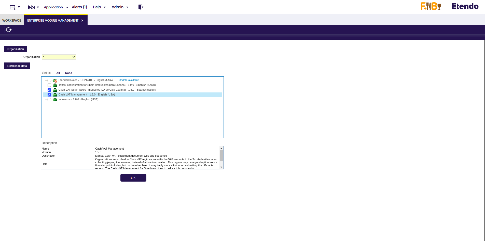

*Recuerde que debe tener previamente instalado el dataset "Taxes: Configuration for Spain".*

Una vez instalado, en la interfaz de Etendo se mostrarán las pestañas y los campos necesarios para trabajar con la funcionalidad de IVA de Caja.

## Configuración
### Dos procesos independientes: Compra y Venta

Por defecto, el IVA de Caja en Etendo aparece deshabilitado, es por ello que el usuario debe activarlo de forma manual.

Con el objetivo de ser lo más genérico posible, el manejo del IVA de Caja se puede configurar en Etendo de forma independiente para cada una de las ventas y para cada una de las compras. Dicho de otro modo, una organización puede declarar cada compra o venta acogida a este régimen especial de IVA o no.

Por otro lado, y en el caso del proceso de compra, los proveedores puede configurarse de forma individual como acogidos a este régimen de IVA o no.

Toda esta configuración permite cubrir diferentes tipo de legislación en países como España, Alemania, México, etc.

Es importante remarcar que la configuración correcta para España, en el caso de una organización sujeta a este régimen especial de IVA, es seleccionar las dos casillas que se citan a continuación en la ventana "Organización":

- **Cash VAT** ("IVA de Caja")
- **Double Cash Criteria** ("Criterio de Caja Doble")

### Proceso de Venta

Con el fin de activar el IVA de Caja para el proceso de ventas, la organización debe configurarse como acogida a este régimen especial de IVA. Es importante recalcar que las organizaciones "hijas" de la organización configurada como IVA de Caja, heredarán esta configuración.

Esta configuración se lleva a cabo seleccionado el check "Cash VAT (IVA de Caja)" en la ventana "Organización", pestaña "Información".

### Proceso de Compra

1. Organizaciones acogidas al régimen especial de IVA de Caja:

    La deducción del IVA soportado en las facturas de compra se retrasa, en el caso de organizaciones acogidas a este régimen especial de IVA, hasta el momento en que se efectúa el pago a los proveedores. Este es el "Criterio de Caja Doble".

    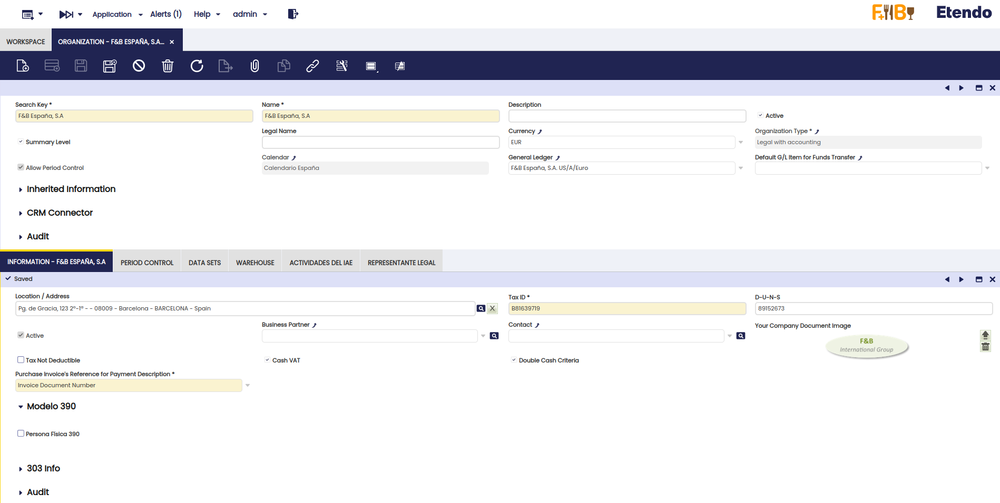

2. Organizaciones no acogidas a este régimen especial pero destinatarias de operaciones sujetas al mismo:

    En estos casos, no es necesario configurar a la organización como "acogida" al régimen especial de criterio de caja, simplemente es necesario configurar como acogidos al régimen a aquellos tercero o proveedores sujetos a este régimen especial de IVA. Esta configuración se puede hacer en la ventana "Terceros", pestaña "Proveedor/Acreedor".

    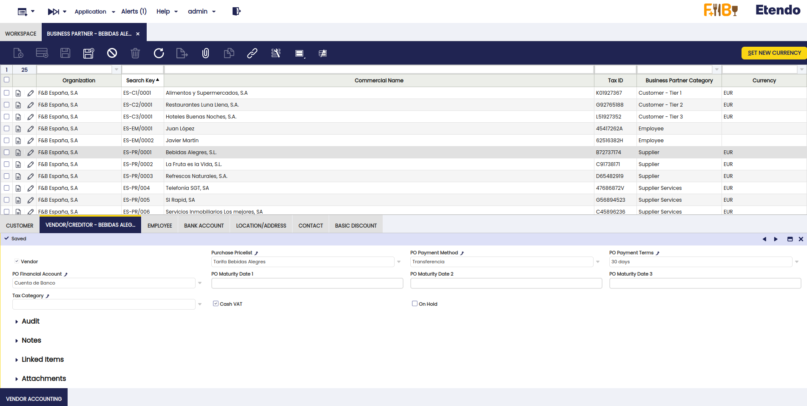

### Configuración de los rangos de impuesto

Los rangos de impuesto de IVA a utilizar en organizaciones acogidas a este régimen especial de IVA o destinatarias de este tipo de operaciones, deben configurarse como rangos de impuestos de "IVA de Caja", en la ventana "Rango de Impuestos" tal y como se muestra en la siguiente imagen.

En el caso de España, Etendo facilita un dataset o conjunto de datos con los impuestos de IVA de Caja para España.

Además, cuando una organización está acogida a este régimen especial de IVA o es destinataria de operaciones acogidas a este régimen, los importes de IVA (devengado/soportado) se contabilizan en cuentas contables transitorias de IVA, al contabilizarse las facturas de compra/venta. Estas cuentas transitorias de IVA se pueden configurar en la pestaña "Contabilidad".

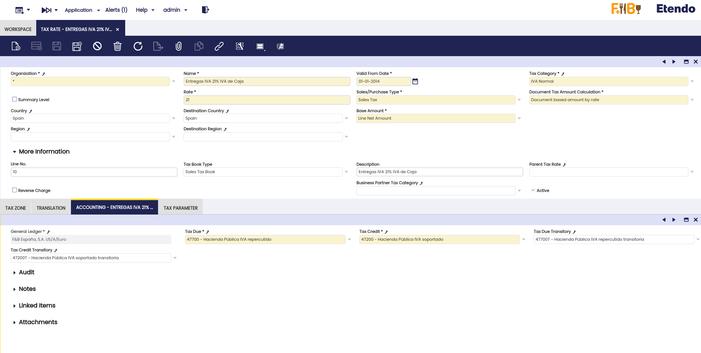

El IVA contabilizado en las cuentas contables transitorias de IVA se traspasa a las cuentas finales de IVA, cuando las facturas se pagan/cobran de forma parcial o total.

Como excepción, si una factura tiene un pago por adelantado, la contabilización de este pago por adelantado no reflejará el traslado de IVA de las cuentas contables transitorias a las finales. Ver sección [Anticipos de Venta](#anticipos-de-venta) y [Anticipos de Compra](#anticipos-de-compra).

### Configuración de las cuentas contables de IVA transitorias

Es posible definir las cuentas transitorias de IVA a utilizar por defecto para el "Esquema Contable" de la organización, en la pestaña "Valores por Defecto".

## Proceso de Ventas

### Facturas de Venta

En la cabecera de la ventana **"Factura (Cliente)"**, sección **"Más Información"** puedes encontrar el check **"Cash VAT"** (IVA de Caja). Si este check está seleccionado, la factura de venta está acogida a este régimen especial de IVA y, por tanto, todos los rangos de impuestos incluidos en la factura deben ser de IVA de Caja, con excepción de los rangos de impuestos exentos de IVA y las retenciones, de lo contrario el sistema no permitirá completar la factura.

Este check se activa de forma automática cuando la organización se ha configurado como acogida al régimen de IVA de Caja, sin embargo se puede desactivar de forma manual para aquellos casos en los que la factura de venta incluya operaciones que se excluyen de este régimen especial, por ejemplo en los casos de "Exportaciones" y "Entregas Intracomunitarias Exentas".

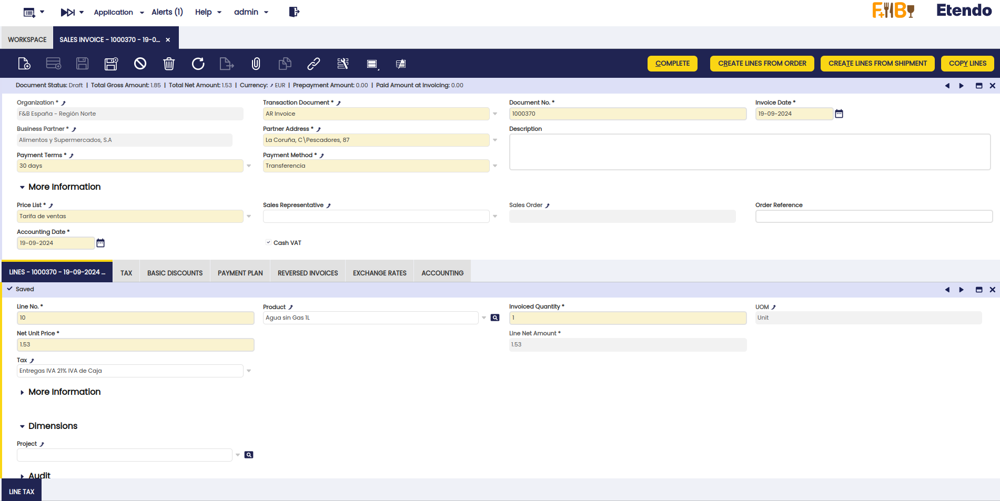

En las facturas de venta acogidas a este régimen aparecerá una nueva pestaña en la parte inferior de la factura, debajo de la pestaña "Impuestos", denominada "Cash VAT".

Cada vez que la factura se cobre de manera parcial o total, el sistema inserta automáticamente una línea con el porcentaje del IVA cobrado en cada cobro. Esta información puede ser utilizada posteriormente para la generación de los informes de impuestos correspondientes.

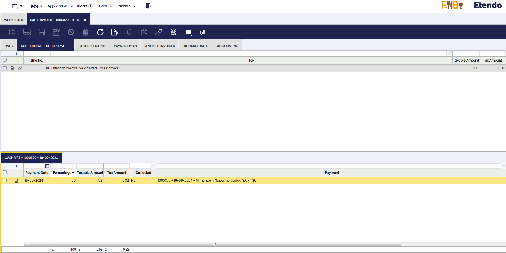

### Contabilización de las facturas de venta

Cuando una factura de venta se contabiliza, el IVA es contabilizado en las cuentas transitorias de IVA, tal y como se muestra en la siguiente imagen

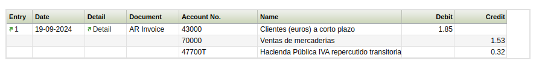

Posteriormente, cuando se contabiliza el pago/la transacción/o la reconciliación (en función de la configuración de la Forma de Pago utilizado), el importe de IVA contabilizado en la cuenta transitoria de IVA se traslada automaticamente a la cuenta de IVA correspondiente, tal y como se muestra en la siguiente imagen:

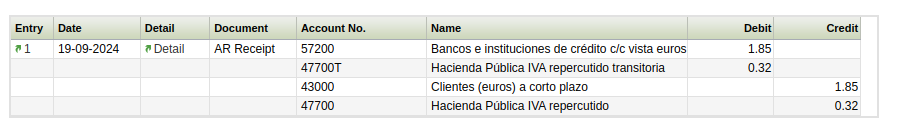

### Pedidos de Venta

Para revisar si un pedido u orden de venta está marcada como "IVA de Caja", nos dirigimos a la cabecera del pedido, sección "Más información".

El comportamiento de los pedidos es similar al de las facturas, además las facturas creadas desde los pedidos acogidos a este régimen, heredarán esta configuración.

Tenga en cuenta que cualquier proceso de facturación (incluso los creados especificamente para los usuarios finales de Etendo) mostrará en las facturas la configuración del IVA de Caja o no en función de la configuración de los pedidos, por tanto no será necesario adaptar ningún proceso de facturación que se use con anterioridad a la vigencia de este régimen especial de IVA.

### Anticipos de Venta

Etendo permite anticipar cobros de clientes al permitir registrar cobros en los pedidos de venta.

Como se ha adelantado en la sección anterior [Pedidos de Venta](#pedidos-de-venta), estos pedido pagados por anticipado, pueden estar sujetos a IVA de Caja.

Cuando se contabiliza el anticipo de un cliente, bien sea total o parcial, no se produce traslado contable alguno de IVA de Caja.

Al completar la factura de venta correspondiente, desde el pedido de venta pagado parcialmente, se reflejan dos cosas:

1. El importe prepagado **"Prepayment Amount"**, en la cabecera de la factura.

    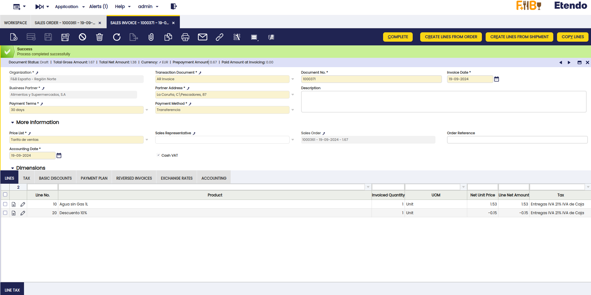

2. El **porcentaje de IVA de Caja liquidado** como final, en la pestaña "IVA de Caja" ("Cash VAT"). En este caso el importe del anticipo = 0.67 € divido entre el importe total de la factura = 1.67, nos daría un porcentaje del 40.12 %, esto es una cuota de 0.12 €

    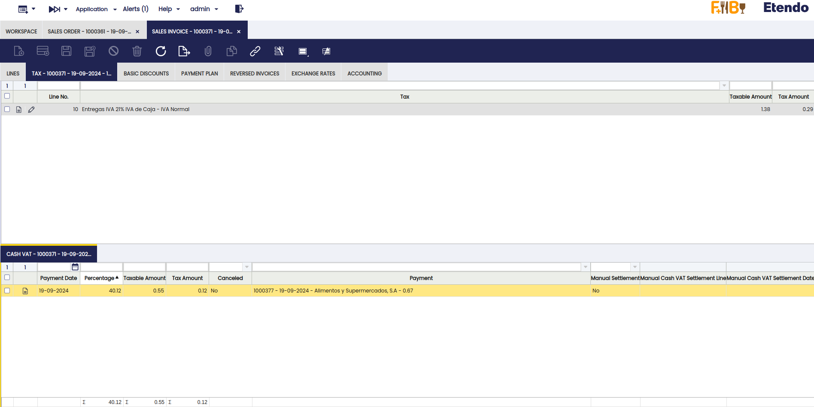

Al contabilizar la factura de venta la cuota del impuesto por importe de 0.12 € se reflejará contablemente en una cuenta de IVA final (47700) y el resto de cuota pendiente de liquidar en la cuenta de IVA transitoria.

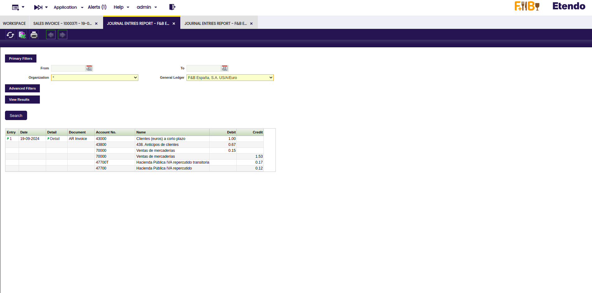

Si con posterioridad se paga la factura, la contabilización de dicho pago trasladará contablemente el IVA de Caja pendiente de liquidar a una cuenta final de IVA.

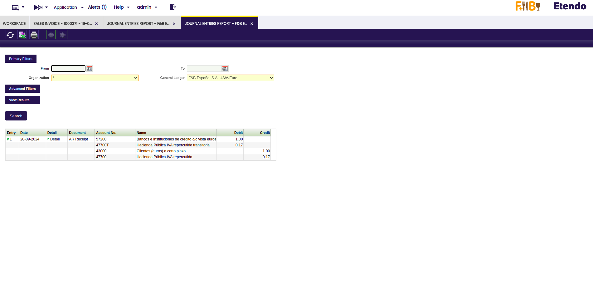

## Proceso de Compras

### Facturas de Compra

En la cabecera de la ventana **"Factura (Proveedor)"**, sección **"Más Información"**, puedes encontrar el check **"Cash VAT"** (IVA de Caja). Si este check está seleccionado la factura de compra está acogida a este régimen especial de IVA y, por tanto, todos los rangos de impuestos incluidos en la factura deben ser de IVA de Caja, con excepción de los rangos de impuestos exentos de IVA y las retenciones, de lo contrario el sistema no permitirá completar la factura.

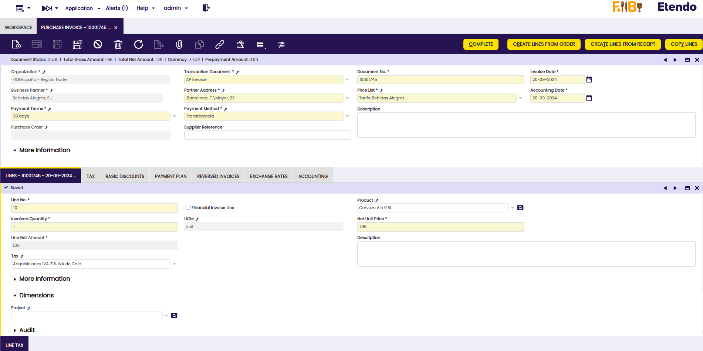

Este check se activa automáticamente:

- cuando la "Organización" se ha configurado como acogida al régimen de IVA de Caja,
- o bien cuando el "Tercero" se ha configurado como acogido al regimen de IVA de Caja

Este check se puede desactivar de forma manual para aquellos casos en los que la factura de compra incluya operaciones que se excluyen de este régimen especial, por ejemplo en los casos de "Importaciones" y "Adquisiciones Intracomunitarias".

En las facturas de compra acogidas a este régimen aparecerá una nueva pestaña en la parte inferior de la factura, debajo de la pestaña "Impuestos", denominada "Cash VAT".

Cada vez que la factura se pague de manera parcial o total, el sistema inserta automáticamente una línea con el porcentaje del IVA pagado en cada pago. Esta información puede ser utilizada posteriormente para la generación de los informes de impuestos correspondientes.

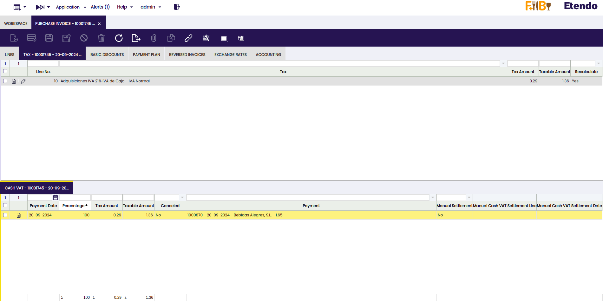

### Contabilización de las facturas de compra

Cuando una factura de compra se contabiliza, el IVA es contabilizado en las cuentas transitorias de IVA, tal y como se muestra en la siguiente imagen

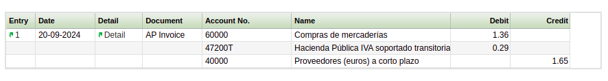

Posteriormente, cuando se contabiliza el pago/la transacción/o la reconciliación (en función de la configuración de la Forma de Pago utilizado), el importe de IVA contabilizado en la cuenta transitoria de IVA se traslada automaticamente a la cuenta de IVA correspondiente, tal y como se muestra en la siguiente imagen:

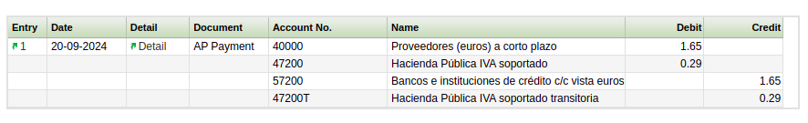

### Pedidos de Compra

Para revisar si un pedido u orden de compra está marcada como "IVA de Caja", nos dirigimos a la cabecera del pedido, sección "Más información".

El comportamiento de los pedidos es similar al de las facturas, además las facturas creadas desde los pedidos acogidos a este régimen, heredaran esta configuración.

Tenga en cuenta que cualquier proceso de facturación (incluso los creados especificamente para los usuarios finales de Etendo) mostrará en las facturas la configuración del IVA de Caja o no en función de la configuración de los pedidos, por tanto no será necesario adaptar ningún proceso de facturación que se use con anterioridad a la vigencia de este régimen especial de IVA.

### Anticipos de Compra

Etendo permite anticipar pagos a proveedores permitiendo registrar pagos en los pedidos de compra. Estos pedidos pagados por anticipado pueden estar sujetos a IVA de Caja.

Cuando se contabiliza el anticipo a un proveedor, bien sea total o parcial, no se produce traslado contable alguno de IVA de Caja.

Al completar la factura de compra correspondiente, desde el pedido de compra pagado parcialmente, se reflejan dos cosas:

1. El importe prepagado **"Prepayment Amount"**, en la cabecera de la factura.

    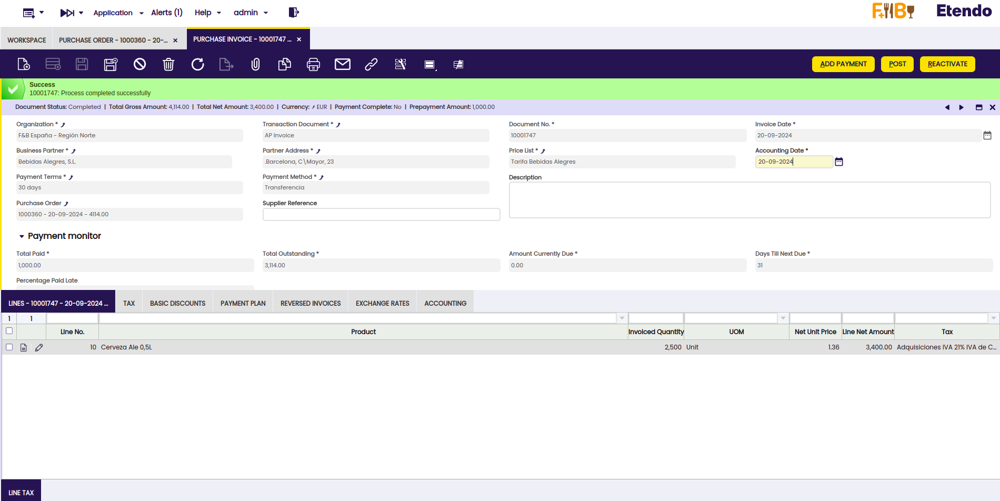

2. El **porcentaje de IVA de Caja liquidado** como final, en la pestaña "IVA de Caja" ("Cash VAT"). Por ejemplo, un anticipo de 1000 € en una factura de 4114 € nos daría un porcentaje del 24.31 %.

    

Al contabilizar la factura de compra la cuota del impuesto por importe de 173.57 € se reflejará contablemente en una cuenta de IVA final (47200) y el resto de cuota pendiente de liquidar en la cuenta de IVA transitoria.

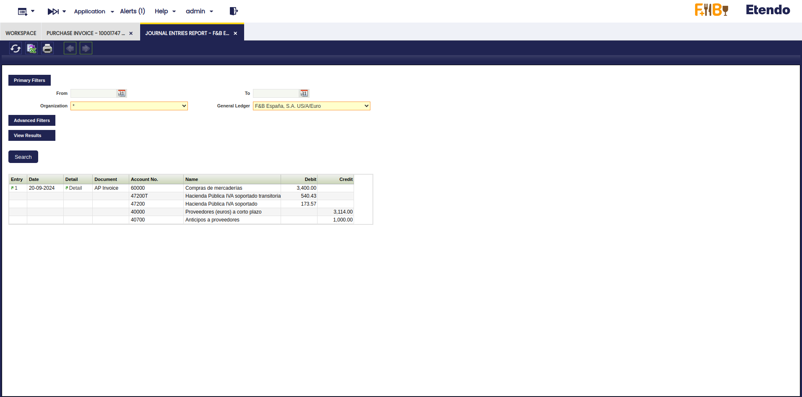

Al contabilizar la factura de compra la cuota del impuesto por importe de 173.57 € se reflejará contablemente en una cuenta de IVA final (47200) y el resto de cuota pendiente de liquidar en la cuenta de IVA transitoria.

## Liquidación manual del IVA de Caja

Tal y como ya se ha adelantado, en el caso de España **el derecho a la deducción del IVA soportado** en el régimen especial del criterio de caja nace:

- **en el momento del pago total o parcial** de las facturas de compra, por los importes efectivamente satisfechos, tal y como ya se ha explicado dentro de la sección [Proceso de Compras](#proceso-de-compra)
- **o el 31 de diciembre del año inmediato posterior** a aquel en que se haya realizado la operación si el pago no se ha producido.

Igualmente, **el devengo del IVA en las operaciones** a las que sea de aplicación el régimen especial del criterio de caja se produce:

- **en el momento del cobro total o parcial** de las facturas de venta, por los importes efectivamente percibidos, tal y como ya se ha explicado dentro de la sección [Proceso de Ventas](#proceso-de-ventas)
- **o el 31 de diciembre del año inmediato posterior** a aquel en que se haya realizado la operación si el cobro no se ha producido.

Es decir, el IVA de Caja devengado/deducible de las facturas de venta/compra de fecha 2024 que no estén cobradas/pagadas totalmente, tendrá que liquidarse y declararse a Hacienda con fecha del 31 de Diciembre de 2024.

### Documento de Liquidación Manual

El módulo de gestión de IVA de Caja de Etendo (Cash VAT Management) incluye, a partir de su **versión 1.0.100**, un nuevo "Tipo de Documento" ("Document Type"), denominado "Manual Cash VAT Settlement", así como una nueva ventana denominada **"Manual Cash VAT Settlement"** ("Liquidación Manual del IVA de Caja").

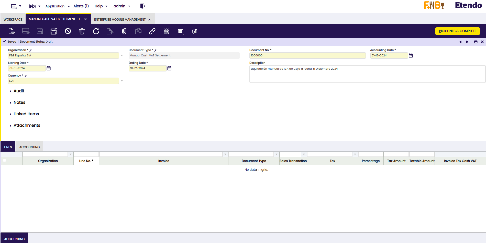

*Recuerde actualizar el dataset de este módulo, una vez instalado, en la ventana "Gestión del módulo de Empresa".*

Esta nueva ventana permite a una organización acogida o destinataria de operaciones en régimen especial de criterio de caja:

- introducir una **fecha desde/hasta** que filtre por la fecha de las facturas de IVA de Caja no pagadas/cobradas o parcialmente pagadas/cobradas (campos "Starting Date"/"Ending Date")
- así como una **fecha de contabilización de la liquidación manual del IVA de Caja** (campo "Accounting Date").

Al crearse el estado del documento ("Document Status") es borrador ("**Draft**").

A continuación el botón de proceso **"Pick Lines & Complete"** permite obtener un listado de las facturas de IVA de Caja "completadas" y no necesariamente "contabilizadas" no pagadas/cobradas. Este listado de facturas incluye la siguiente información relevante:

- **Numero de Factura**, columna "Document Nº"
- **Tipo de documento**, columna "Document Type", que puede incluir facturas o facturas rectificativas o abonos tanto de compra como de venta.
- **Fecha de Factura**, columna "Invoice Date"
- **Tercero**, columna "Business Partner"
- **Importe Total de la Factura**, columna "Grand Total Amount"
- **Impuesto de IVA de Caja**, columna "Tax"
- **Porcentaje no pagado de la factura**, columna "Percentage", que puede ser el 100% o menor.
- **Cuota del impuesto**, columna "Tax Amount" 
- **Base Imponible del impuesto**, columna "Taxable Amount".

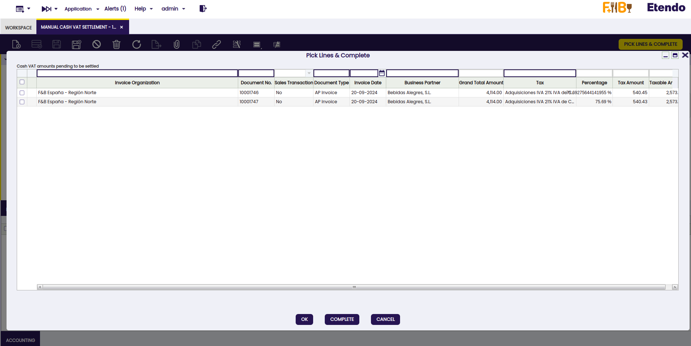

A continuación, el usuario puede seleccionar la factura o facturas para las que el IVA de Caja se tiene que liquidar de forma manual a 31 de Diciembre de 2024. En esta ventana:

- el botón **"OK"** permite cerrar la ventana de facturas de IVA de caja pendientes de liquidar y mantener las facturas seleccionadas.
- el botón **"Complete"** permite completar la selección y pasar el estado del documento "Manual Cash VAT Settlement" a "Completado". Cualquier cambio en la selección implicará la **"Reactivación"** del documento.
- el botón **"Cancel"** permite cerrar la ventana de facturas de IVA de caja pendientes de liquidar y cancelar la selección.

Una vez seleccionadas, las facturas se reflejan en la pestaña "Lines", y en la parte superior de la ventana se actualizan los campos siguientes, con la suma de cuotas y bases correspondientes:

- **Cuota de IVA Devengado**, campo "Sales Tax Amount"
- **Base Imponible Devengada**, campo "Sales Taxable Amount"
- **Cuota del IVA Deducible**, campo "Purchase Tax Amount"
- **Base Imponible Deducible**, campo "Purchase Taxable Amount"

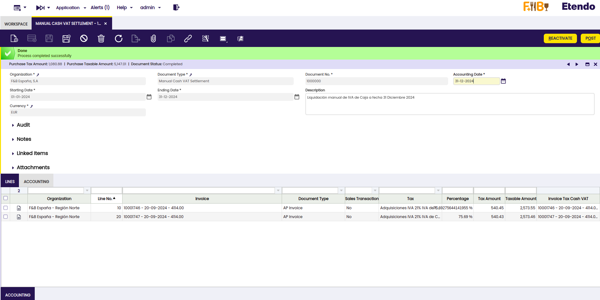

Es importante recalcar el **último campo de la pestaña "Lines"**, denominado **"Invoice Tax Cash VAT"**,"**IVA de Caja del Impuesto**").

Este campo enlaza con la pestaña "Cash VAT" relacionada con el impuesto que corresponda de la factura de compra, en este caso. Lo mismo aplicaría en el caso de una factura de venta. 

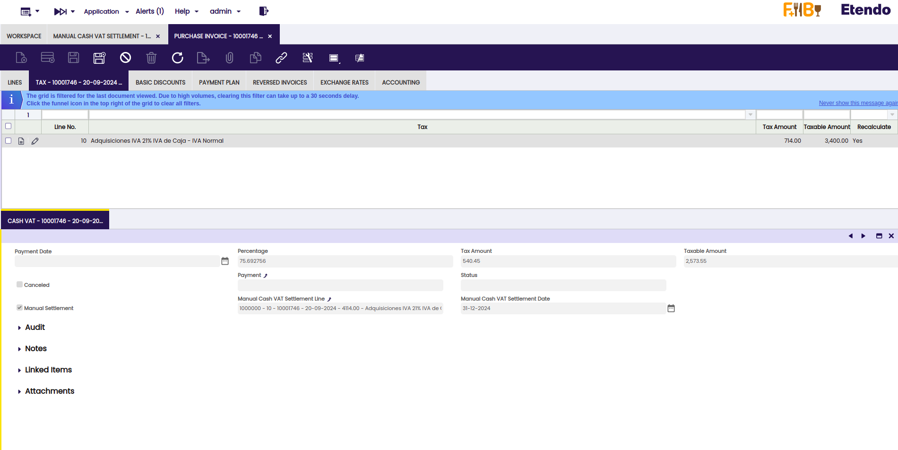

Tal y como se puede apreciar en la imagen anterior, la liquidación manual del IVA de Caja, crea de forma automática un nuevo registro en la pestaña "Cash VAT", con la siguiente información:

- **Fecha de pago** = vacío ya que la liquidación del IVA de Caja no se ha producido al pagarse la factura, sino como consecuencia de una liquidación manual.
- **Porcentaje** = se mostrará el porcentaje de liquidación de IVA de Caja pendiente para el impuesto (de IVA de Caja).
- **Impuestos** = cuota del impuesto liquidada
- **Base Imponible** = base imponible del impuesto liquidada
- **Pago** = vacío ya que la liquidación del IVA de Caja no se ha producido al pagarse la factura, sino como consecuencia de una liquidación manual.
- **Liquidación Manual** ("Manual Settlement") = Sí
- **Linea de la Liquidación** ("Manual Manual Cash VAT Settlement Line") = con información sobre el número de documento y línea de la Liquidación Manual del IVA de Caja
- **Fecha de la liquidación** ("Manual Manual Cash VAT Settlement Date") = con la fecha contable de la liquidación manual.

Como puede apreciarse en la imagen anterior, el **porcentaje total liquidado de IVA de Caja** para el impuesto es ahora de un **100%**. Por tanto, si se produjera un pago de la factura de compra, la contabilización de ese pago no generaría un traslado contable del IVA de Caja, ya que éste ya se ha producido.

### Traspaso contable del IVA de Caja

Al contabilizar la liquidación manual a 31 de Diciembre de 2024 (botón "Post"), se producirá el traslado del IVA de Caja contabilizado en las cuentas transitorias de IVA a las cuentas finales, tanto para el IVA Devengado (Cuentas: 47700T a 477000), como para el IVA Soportado Deducible (Cuentas 47200T a 472000).

Recuerde activar la tabla "OBCVAT_ManualSettlement" en la ventana "Esquema contable", pestaña "Tablas a contabilizar".

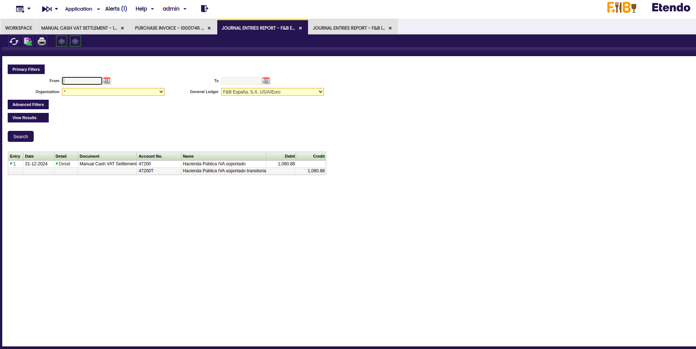

### Liquidación del IVA de Caja

En el ejemplo mencionado anteriormente, es con fecha, 31 de Diciembre de 2024, cuando se puede liquidar/declarar ese IVA de Caja a las autoridades fiscales correspondientes. En el caso de España, este IVA de Caja se tendrá que incluir para su liquidación en el Modelo 303 del último periodo (Diciembre 2024/Último Trimestre 2024), así como en el Modelo 390 de 2024.

 ---

This work is a derivative of [Openbravo Localización Española](https://wiki.openbravo.com/wiki/Openbravo_Localizaci%C3%B3n_Espa%C3%B1a){target="\_blank"} by [Openbravo Wiki](http://wiki.openbravo.com/wiki/Welcome_to_Openbravo){target="\_blank"}, used under [CC BY-SA 2.5 ES](https://creativecommons.org/licenses/by-sa/2.5/es/){target="\_blank"}. This work is licensed under [CC BY-SA 2.5](https://creativecommons.org/licenses/by-sa/2.5/){target="\_blank"} by [Etendo](https://etendo.software){target="\_blank"}.