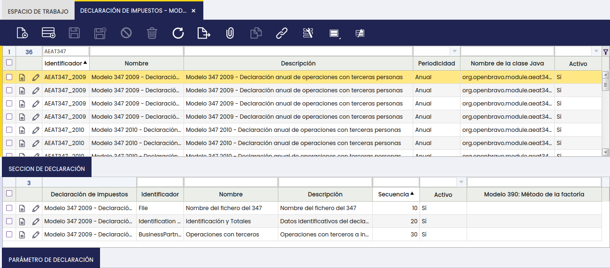
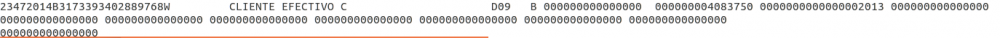

:octicons-package-16: Javapackage: `org.openbravo.module.aeat347apr.es`
:octicons-package-16: Javapackage: `org.openbravo.module.aeat347apr.es.es_es`

## **Introducción**

Esta sección describe la generación de la declaración: “**Modelo AEAT 347 - Declaración Anual de Operaciones con Terceros**” como un fichero de texto ("\*.txt") válido conforme a los requerimientos de la Hacienda Pública española, es por ello que se publicará una nueva versión de este módulo cuando dichos requerimientos cambien.

El fichero del 347 se genera desde el "**Generador de Declaraciones de Impuesto**" que se encuentra en la ruta de aplicación: "Gestión Financiera / Contabilidad / Herramientas de análisis / Generador de declaraciones de impuestos".

El Modelo/Declaración 347 es parte del módulo de Localización Española de Etendo.

## **Descripción del módulo**

### **Obligados a presentar la declaración**

De acuerdo con la normativa de la Hacienda Española, están obligados a presentar el modelo 347:

Todas aquellas personas físicas o jurídicas, de naturaleza pública o privada que desarrollen actividades empresariales o profesionales, siempre y cuando hayan realizado operaciones que, en su conjunto, respecto de otra persona o Entidad, cualquiera que sea su naturaleza o carácter, hayan superado la cifra de 3.005,06€ durante el año natural al que se refiere la declaración. Para el cálculo de la cifra de 3.005,06 € se computan de forma separada las entregas de bienes y servicios y las adquisiciones de los mismos.

De acuerdo con la normativa, no están obligados a presentar el modelo 347:

-   Quienes realicen en España actividades empresariales o profesionales sin tener en territorio español la sede de su actividad, un establecimiento permanente o su domicilio fiscal.
-   Las personas físicas y entidades en atribución de rentas en el Impuesto sobre la Renta de las Personas Físicas, por las actividades que tributen en dicho impuesto por el método de estimación objetiva y, simultáneamente, en el Impuesto sobre el Valor Añadido por los regímenes especiales simplificado o de la agricultura, ganadería y pesca o del recargo de equivalencia, salvo por las operaciones por las que emitan factura.
-   Los obligados tributarios que no hayan realizado operaciones que en su conjunto superen la cifra de 3.005,06€
-   Los obligados tributarios que hayan realizado exclusivamente operaciones no declarables.
-   Los obligados tributarios que deban informar sobre las operaciones incluidas en los libros registro de IVA (modelo 340) salvo que realicen operaciones que expresamente deban incluirse en el modelo 347.

### **Operaciones declarables**

Las operaciones declarables y que, por tanto, se incluyen en el modelo 347 son las que se detallan a continuación:

1.  Tanto las entregas de bienes y prestaciones de servicios realizadas por el declarante como sus adquisiciones de bienes y servicios incluyéndose, en ambos casos, tanto las operaciones típicas y habituales como las ocasionales e incluso las operaciones inmobiliarias. Debe tenerse en cuenta que dichas operaciones se incluirán estén o no sujetas al IVA y, en el primer caso, también las exentas de dicho impuesto.

Además, se incluyen de forma específica y aparte:

-   los Arrendamientos de locales de negocios
-   los importes superiores a 6.000,00€ percibidos en metálico de cada una de las personas o entidades relacionadas en la declaración
-   las cantidades que se perciban en contraprestación por transmisiones de bienes inmuebles que constituyan entregas sujetas a IVA
-   y las prestaciones de servicios de/a no residentes (incluyendo Canarias, Baleares, Ceuta y Melilla) que no estén sujetos a retención.

Los importes que se incluyen en el modelo 347 son los “importes totales” de la contraprestación en euros (€). En los supuestos de operaciones sujetas y no exentas de IVA se añaden, por tanto, a la base imponible, las cuotas del impuesto y recargos de equivalencia repercutidos. Los importes además se declaran netos de las devoluciones o descuentos y bonificaciones concedidos.

Las operaciones que se incluyen en el modelo 347 son las realizadas por el declarante en el año natural a que se refiere la declaración y la fecha que se tiene en cuenta para su inclusión en el 347 es la fecha contable de la factura.

Las operaciones que en ningún caso se incluirán en el 347 por ser no declarables son las que se detallan a continuación:

-   aquellas que hayan supuesto entregas de bienes o prestaciones de servicios por las que los obligados tributarios no debieron expedir y entregar factura o documento equivalente
-   aquellas operaciones realizadas al margen de la actividad empresarial o profesional
-   aquellas efectuadas a título gratuito
-   los arrendamientos de bienes exentos de IVA
-   las importaciones y exportaciones de mercancías, así como las entregas y adquisiciones de bienes que supongan envíos entre el territorio peninsular español o las islas Baleares y las islas Canarias, Ceuta y Melilla.
-   Todas aquellas que se incluyan en otros modelos de la Administración Tributaria como por ejemplo aquellas cuya contraprestación haya sido objeto de retención o ingreso a cuenta; las operaciones intracomunitarias de bienes y servicios que se declaran en el modelo 349 o las operaciones incluidas en los libros registro que deben incluirse en el modelo 340.

El nuevo módulo de generación del Modelo 347 no incluye las operaciones que se describe a continuación y que deberían incluirse en el modelo 347, por ser relativas a Administraciones Públicas, Entidades aseguradoras y Colegios Profesionales:

-   las subvenciones, auxilios o ayudas satisfechas por las entidades integradas en las distintas Administraciones Públicas
-   las operaciones de seguros realizadas por las entidades aseguradoras
-   las prestaciones de servicios realizadas por las agencias de viajes
-   los cobros por cuenta de terceros de honorarios profesionales o de derechos derivados de la propiedad intelectual, industrial, de autor u otros por cuenta de sus socios, asociados o colegiados efectuados por sociedades, asociaciones, colegios profesionales u otras entidades que, entre sus funciones, realicen las del cobro
-   las operaciones sujetas al impuesto sobre la producción, los servicios y la importación en las ciudades de Ceuta y Melilla.

Además, no se incluye en el módulo de funcionalidad el supuesto de Declaración Complementaria para aquellos casos en que deban incluirse sólo las operaciones que, debiendo haber sido declaradas en otra declaración del mismo ejercicio presentada con anterioridad, no se incluyeron. Estas operaciones deberán ser incluidas por el usuario manualmente, a través de la página de la AEAT tal y como se explica en la sección de este documento "Declaración Complementaria".

## **Instalación del módulo**

Para la instalación del módulo **“Modelo AEAT 347 - Declaración de operaciones con terceros”**” (Spain AEAT Modelo 347 for APR),el usuario debe seguir los pasos que se describen a continuación en función de la situación de partida:

-   Instalación de la última versión disponible de Etendo 
-   o la instalación del módulo de Localización Española.

!!! info
    Para la instalación del módulo de Localización Española, visite [_Marketplace_](https://marketplace.etendo.cloud/#/product-details?module=003B475055DD421B9483B5BE15AA48C5){target="_blank"}. 

Es importante recalcar que el módulo del Modelo AEAT 347 incluye el correspondiente conjunto de datos (dataset) que relaciona los rangos de impuestos de España con los parámetros del 347, este conjunto de datos se debe aplicar a la Organización para la cual se necesita obtener el 347 tal y como se explica en el siguiente apartado.

### **Aplicación del Módulo**

Una vez instalado el módulo del 347 por cualquiera de los procedimientos anteriores, el usuario debe aplicar el conjunto de datos o dataset del módulo 347 a la organización legal con contabilidad que corresponda, desde la ventana "Gestión del Módulo de Empresa".

El módulo de impuestos para España es válido para todos los modelos de declaración de impuestos, en este caso el modelo 347, y debe estar instalado previamente.

!!! info
    Es fundamental recalcar que el usuario debe tener el módulo de impuestos para España instalado y aplicado a la organización (\*) o bien a la organización legal para la que se quiera obtener el 347.

## **Configuración del módulo**

### **Configuración del modelo 347**

Una vez aplicado el conjunto de datos del Modelo 347, puede comprobar en la ruta de aplicación: Gestión Financiera / Contabilidad / Configuración / Declaración de Impuestos que el modelo 347 del periodo correspondiente está creado como informe anual de impuestos.

En la pestaña “Secciones de la declaración” se han creado 3 grupos para el modelo 347:

-   Nombre del Fichero del 347. Esta sección contiene:
    -   un parámetro de tipo “entrada” que se mostrará en el momento de generar el 347 con el fin de que el usuario introduzca manualmente el “Nombre del fichero txt del 347” que se va a generar.
-   Identificación y Totales. Esta sección contiene:
    -   2 parámetros de tipo “constante” que el sistema tendrá en cuenta a la hora de incluir las operaciones, ya que solo incluirá las que superen las cifras límite que se detallan a continuación:  
          
        -   Cifra límite de inclusión de operaciones con terceros = 3.005,06€
        -   Cifra límite para cobros percibidos en efectivo = 6.000,00€
    -   y 5 parámetros de tipo “entrada” que se mostrarán en el momento de generar el 347 con el fin de que el usuario los introduzca manualmente y que son:  
          
        -   Nombre y apellidos de la persona de contacto: Este parámetro de tipo entrada podría ser modificado a tipo constante y, por tanto, se debería especificar el valor de dicha constante que en este caso sería el nombre de la persona de contacto, para los escenarios en que la misma persona presenta la declaración. De ser así, este parámetro no tendría que informarse cada vez que se genera la declaración.
        -   Nº Teléfono de la persona de contacto. Este parámetro de tipo entrada podría ser modificado a tipo constante y, por tanto, se debería especificar el valor de dicha constante que en este caso sería el teléfono de la persona de contacto, para los escenarios en que la misma persona presenta la declaración. De ser así, este parámetro no tendría que informarse cada vez que se genera la declaración.
        -   Declaración substitutiva (si/no)
        -   Nº de la declaración a sustituir
        -   NIF del representante legal
-   **Operaciones con terceros**. Esta sección contiene:
    -   5 parámetros de tipo “salida” ligados a la clave tributaria correspondiente, que asociados a los tipos impositivos del módulo de impuestos para España, incluirán las operaciones de compra/venta en el 347:
        -   Adquisiciones de bienes - Clave A
        -   Entregas de bienes - Clave B
        -   Prestación de servicios - Clave A
        -   Servicios prestados - Clave B
        -   Transmisiones de inmuebles - Clave B

En la ruta Gestión Financiera / Contabilidad / Configuración / AEAT347 Tipo de documento, el usuario puede especificar los tipos de documentos que el 347 debe tener en cuenta. El funcionamiento de esta pantalla de parametrización es que si no se especifica ningún tipo de documento, Etendo tendrá en cuenta todos los tipos de documentos de tipo factura que se pueden contabilizar.

Si el usuario introduce algún tipo de documento, solo esos serán los que se tengan en cuenta.

### **Configuración de impuestos**

Este módulo de generación del modelo 347 se basa en el módulo de impuestos para España, ya que utiliza los rangos de impuesto que incluye dicho módulo. Además, incluye un juego de datos que liga los rangos de impuesto del módulo de impuestos para España con los parámetros del 347 que se listan a continuación, en función de la operación de que se trate:

-   **Adquisiciones de bienes – Adquisición “A”**
-   **Entregas de bienes – Entregas “B”**
-   **Prestación de servicios– Adquisición “A”**
-   **Servicios prestados– Entregas “B”**
-   **Transmisiones de inmuebles – Entregas “B”**

El usuario puede comprobar en la ruta de aplicación: Gestión Financiera / Contabilidad / Configuración / Rango impuesto - pestaña Parámetro de Impuesto que los “tipos impositivos/impuestos” que deben incluirse en el 347 se han asociado al correspondiente parámetro de impuesto del 347:

-   Los tipos de IVA de compras/adquisiciones (nacional) incluyendo las adquisiciones de bienes inmuebles y bienes de inversión, se han asociado con el parámetro “Adquisiciones de bienes” que se corresponden con la clave de operación del 347 => “A”
-   Los tipos de IVA de ventas/entregas (nacional) (incluyendo Recargo de Equivalencia) se han asociado con el parámetro “Entregas de bienes” que corresponden con la clave de operación del 347 => “B”
-   Los tipos de IVA de “inversión del sujeto pasivo NO UE” (en los casos de prestación de servicios NO intracomunitarios) se han asociado con el parámetro “Prestación de servicios” que se corresponden con la clave de operación del 347 => “A”
-   Los tipos de IVA de entregas de bienes inmuebles (nacional) se han asociado con el parámetro “Transmisiones de inmuebles” que se corresponden con la clave de operación del 347 => “B”; ya que tiene que declararse dos veces como operación de venta y consignarse a parte el importe de la transmisión del bien inmueble.
-   Se han creado los tipos de IVA específicos para prestaciones de servicios (nacional e internacional), asociados a categorías de impuestos específicas para los servicios, que se han asociado con los parámetros del 347 “Prestación de servicios – clave de operación A” o “Servicios prestados – clave de operación B” en función de que la empresa declarante reciba o preste los servicios.
-   Los tipos de IVA de servicios desde/a Canarias, Baleares, Ceuta y Melilla se han asociado bien con el parámetro “Prestaciones de servicios” clave de operación del 347 => “B” o bien con el parámetro “Operaciones de servicios (Adquisición) clave de operación del 347 => “A”, respectivamente, ya que sólo se incluyen en el 347 las operaciones de servicios y no las de bienes que supongan envíos de bienes entre el territorio peninsular español o las islas Baleares y las islas Canarias, Ceuta y Melilla
-   Y por último se han creado tipos de IVA específicos para alquileres (con y sin retenciones asociados a 2 tipos de BP tax category, respectivamente). Los tipos de IVA de alquiler sin retenciones se han asociado con los parámetros del 347 “Prestación de servicios – clave de operación A” o “Servicios prestados – clave de operación B” en función de que la empresa sea arrendatario o arrendador del local u oficina arrendado y sujeto a IVA.

### **Configuración de los locales de negocio**

En el modelo 347 se deben incluir los arrendamientos de locales de negocios, es por ello que en la ruta de aplicación: Gestión de Datos Maestros / Producto se ha creado un nuevo parámetro “Local arrendado”.

De ser así, el usuario debe introducir en el sistema la información que se detalla a continuación, ya que es necesario incluirla en el modelo 347:

-   **Situación**. El usuario debe elegir entre una de las siguientes opciones:
    -   Locales en el extranjero
    -   Referencia catastral válida en País Vasco o en Navarra
    -   Referencia catastral válida excepto en País Vasco o Navarra
    -   Sin referencia catastral
-   **Referencia catastral.** Campo de texto libre.
-   **Tipo de vía.** El usuario debe elegir el tipo de vía de una lista normalizada según el INE español.
-   **Nombre de la vía pública**. Campo de texto libre.
-   **Tipo de numeración**. El usuario debe elegir el tipo de numeración de una lista normalizada.
-   **Número**. Campo de texto libre.
-   **Calificación del número**. Campo de texto libre.
-   **Bloque**. Campo de texto libre.
-   **Portal**. Campo de texto libre.
-   **Escalera**. Campo de texto libre.
-   **Planta o piso**. Campo de texto libre.
-   **Puerta**. Campo de texto libre.
-   **Complemento**. Datos complementarios del domicilio si los hubiera.
-   **Localidad o Población**. Campo de texto libre.
-   **Municipio**.
-   **Código de municipio**. El usuario debe elegir el código del municipio de una lista normalizada según el INE español.
-   **Código de provincia.** El usuario debe elegir el código de provincia de una lista de códigos de provincia de dos dígitos numéricos.
-   **Código postal**. El usuario debe elegir el código postal.

En el caso de "Locales en el extranjero" los datos a incluir son:

-   **Tipo de vía.**
-   **Nombre de la vía pública**.

El 347 refleja este tipo de operaciones de forma separada tal y como se explica en el correspondiente caso de usuario.

## **Generación del modelo 347**

El modelo 347 se genera desde la ruta de aplicación: Gestión Financiera / Contabilidad / Herramientas de análisis / Generador de declaraciones de impuestos.

El usuario deberá introducir los siguientes datos para generar el modelo 347:

-   **Organización** para la cual quiere generar el Modelo 347. El sistema mostrará el calendario asociado a la organización en un campo no editable.
-   **Esquema contable**
-   **Declaración**. El usuario debería seleccionar aquí el modelo 347 del periodo impositivo que corresponda.
-   **Ejercicio**. El usuario puede introducir el año natural para el cual quiere generar el modelo 347
-   **Periodo**. El valor “Anual” debería mostrarse por defecto.

Una vez introducidos los datos anteriores, el usuario puede introducir los parámetros de entrada del 347 en el botón de proceso “Parámetros de entrada”

y una vez introducidos los parámetros de entrada, como por ejemplo el "Nombre del Fichero" o la "Persona/Teléfono de contacto", el usuario puede generar el fichero del Modelo 347 a través del botón de proceso “Generar fichero”.

Es entonces cuando se genera el fichero de texto ("\*.txt") del Modelo 347 conforme a los requerimientos de la AEAT, que puede presentarse directamente en la web de la AEAT.

En el módulo "Spain AEAT Modelo 347 for APR", se genera un fichero zip que contiene tres ficheros:

-   el fichero "txt" ya mencionado de igual formato y, por tanto, igualmente válido para la presentación del Modelo 347 a partir de 2014
-   un fichero denominado "Facturas.csv"
-   y un fichero denominado "Metalico.csv"

*Los dos ficheros adicionales de formato \*.csv sólo se generan si la declaración del 347 tiene contenido*.

El fichero "Facturas.csv":

-   contiene un listado con información del tipo "Tercero", "Fecha Contable", "Impuesto", "Base Imponible", "Cuota", "Total" etc, de todas las facturas susceptibles de incluirse en el fichero txt.

El fichero "Metalico.csv":

-   contiene un listado con información del tipo "Cuenta Financiera", "Identificación de Transacción", "Tercero", "Fecha Contable", "Importe" y "Ejercicio (de devengo)" de todos los cobros en efectivo susceptibles de incluirse en el fichero txt.

## **Casos de usuario**

### **Operaciones de compra y venta**

Etendo permite la introducción y contabilización de facturas de compra y de venta, a través de la ventana correspondiente.

El modelo 347 recogerá agrupando por "tercero" y "clave \[A (compras) o B (ventas)\]", las siguientes operaciones de compra/venta que superen la cifra de 3.005,06 euros:

-   compra/venta de bienes/servicios (no sujetos a retención) dentro del territorio de aplicación del impuesto (IVA), España y Baleares
-   compra/venta de servicios desde/hacia resto del mundo, incluyendo Canarias, Ceuta y Melilla.

No se van a tener en cuenta:

-   operaciones de compra/venta de bienes/servicios intracomunitarias, por reflejarse en otro modelo de hacienda, el Modelo 349, excepto las operaciones que no se incluyen en el Modelo 349.
-   importaciones/exportaciones de bienes.

#### **Operaciones de compra y venta acogidas a RECC**

Etendo permite la introducción y contabilización de facturas de compra y de venta acogidas al RECC (Régimen Especial de Critero de Caja).

Para ello:

-   la "Organización" debe estar acogida a este Régimen
-   o bien no acogida pero si alguno de los proveedores de los cuales recibe facturas de compra.

Estas organizaciones deben tener aplicado el juego de datos del módulo "Spain AEAT Modelo 347 Cash VAT compatible.

Este módulo incluye un juego de datos que relaciona los impuestos de IVA de Caja con los parámetros correspondientes del Modelo 347.

Las transacciones de compra/venta se recogen en el Modelo 347 de forma anual conforme al criterio de devengo general de IVA y marcadas como "Operación de IVA de Caja". Además, se incluye la parte correspondiente anual devengada conforme al criterio de IVA de Caja en otro campo.

**Transmisión de Inmuebles**

Etendo permite la introducción y contabilización de transmisiones (ventas) de bienes inmuebles sujetas a IVA.

Este tipo de operaciones se recogen de forma separada en el modelo 347.

Es por ello que se ha creado en el módulo de impuestos para España:

-   categorías de impuestos específicas para los B. Inmuebles (IVA Normal B.Inmuebles e IVA Reducido B.Inmuebles)
-   rangos de impuestos (IVA) de compra/venta de Bienes Inmuebles

y en el conjunto de datos del 347:

-   un parámetro específico denominado "Transmisiones de Inmuebles" ligado a los impuestos de venta de bienes inmuebles.

#### **Transmisión de Inmuebles sujetas a RECC**

Este tipo de transacciones también se incluyen en el Modelo 347 de forma separada, en computo anual, y marcadas como "Operación IVA Caja".

### **Arrendamientos**

Etendo permite la introducción y contabilización de facturas de compra y de venta que incluyan arrendamiento de locales de negocio sujetos a IVA.

Solo en el caso de arrendamientos de locales de negocio por parte del propietario de dicho local, se deberá además incluir información adicional sobre dicho inmueble/local, en un registro de tipo Inmueble específico. Para ello, aquellos locales que se den de alta en el maestro de productos susceptibles de ser alquilados deberán configurarse como tales tras activar el nuevo parámetro "Local arrendado".

Esto implica rellenar datos como los que se muestran en la siguiente imagen:

Este tipo de operaciones tienen que reportarse de forma separada en el 347 tal y como se muestra en la siguiente imagen:

La transacción de venta (B) con el cliente "Cliente Arrendamiento" por un importe anual de 30.310,50, incluye además el arrendamiento de un inmueble por un importe de 13.370.50.

#### **Arrendamientos en RECC**

Estas operaciones se reflejan de forma anual en el modelo 347,marcadas como tal, incluyéndose también la información referente al registro del inmueble arrendado por el declarado. 

### **Cobros en Efectivo**

Etendo permite la introducción y contabilización de facturas de venta y sus correspondientes cobros en efectivo depositados y contabilizados en Etendo a través de cuentas financieras del tipo "Caja".

  
Se recomienda configurar el método de pago "Contado" asociado a la cuenta financiera "Caja" como se detalla a continuación:

-   Permitido para Cobro
-   Depósito automático en cuenta
-   Cuenta de depósito = Cuenta contable para depósito.
-   los cobros que para un tercero (cliente) y para un periodo, por ejemplo 2014, que lógicamente será el periodo/año para el cual generamos el 347, superen el umbral de 6.000,00 €
    -   Dicho cobro puede referirse a operaciones incluidas en facturas de venta contabilizadas en 2014 o años anteriores.

En el fichero ejemplo anterior se puede comprobar que:

-   los cobros en efectivo tanto del "Cliente Efectivo" (por importe de 18.000,00) como del "Cliente Efectivo Varios" (por importe de 6.560,00) se especifican de forma separada en las posiciones (101-115). La diferencia entre estos cobros es:
    -   para el "Cliente Efectivo Varios", la operación que generó el cobro en efectivo en el año 2014 se devengo y se declaró en el año 2013.  
        Esa es la razón por la cual no aparece importe de operación alguno en las posiciones 83-98 y el año de devengo de la operación es 2013.
    -   para el "Cliente efectivo B", la operación que generó el cobro en efectivo se devenga y se cobra en el año 2014, y forma parte del total de operaciones por importe de 81.675,00.

Faltaría un último caso:

El caso en el que un cobro/s del año en curso (2014), sea un cobro/s de transacciones devengadas en un periodo/año anterior y, por tanto, ya declaradas, y transacciones devengadas en el periodo/año en curso y, por tanto, no declaradas, tal y como se muestra en la siguiente imagen:

En la imagen anterior, se ha producido un cobro en el año 2014 por importe de 48.188,25; de los cuales 7.350,75 son por operaciones realizadas y declaradas en el año 2014 y el resto 40.837,50 por operaciones realizadas y declaradas en un ejercicio anterior (2013).

#### **Cobros en Efectivo en RECC**

Todo lo dicho en este apartado aplica igualmente a las operaciones de venta en IVA de Caja que se cobran en efectivo, salvo que en este caso no aplicaría un "Ejercicio" de devengo anterior a 2014, ya que el periodo de validez de este régimen comenzó el 1 de enero de 2014.

Además del importe anual de las operaciones y el importe anual devengado en criterio de IVA de Caja, debe añadirse el importe percibido en metálico, junto con el ejercicio de devengo de dichas operaciones.

### **Presentación del modelo 347 en formato electrónico**

La presentación telemática del modelo 347 en formato electrónico requiere que las empresas tenga un NIF español así como un Certificado electrónico emitido por la “Fábrica Nacional de Moneda y Timbre” (FNMT) u otro Certificado válido y reconocido por Hacienda.

La presentación telemática puede realizarse a través de la página web de la [Hacienda Pública española](https://sede.agenciatributaria.gob.es/Sede/procedimientoini/GI27.shtml){target="_blank"}.

#### **Datos en los ficheros csv**

Tal y como ya se ha mencionado, con módulo "Spain AEAT Modelo 347 for APR" se generan, además del fichero "txt" del Modelo 347, dos ficheros adicionales "\*.csv", un fichero denominado "Facturas.csv" y otro fichero denominado "Metalico.csv".

El fichero csv "XXXFacturas.csv" incluye las siguientes columnas:

-   "**Tipo de documento**".  
    Estos son las facturas estándar (AP/AR Invoice, AP/AR Credit Memo..etc) de Etendo
-   "**Número de documento**"  
    O número de factura/abono.
-   "**Tercero**"  
    Cliente o proveedor.
-   "**NIF/CIF**" del tercero.
-   "**Fecha Factura**"
-   "**Fecha Contable**"  
    Fecha contable de la factura.
-   "**Impuesto**"  
    Impuestos del dataset de impuestos para España ligados al parámetro del Modelo 347 correspondiente.
-   "**IVA de Caja**"  
    Esta columna nos indica si la factura está o no sujeta a IVA de Caja.
-   "**Cuota**"  
    Cuota ligada al tipo de impuesto incluido en la factura
-   "**Base Imponible**"  
    Base imponible ligada al impuesto incluido en la factura.
-   "**Total**"  
    Suma de la base imponible y la cuota. Este valor es el que hay que tener en cuenta ya que el 347 incluye importes totales, incluído el IVA, al ser una declaración de operaciones con Terceros y no una liquidación de IVA.
-   "**Tipo de Línea**"  
    Dado que en el 347 se tiene que incluir de forma separada tanto los arrendamientos como las transmisiones de bienes inmuebles y operaciones de inversión del sujeto pasivo, por tanto, en este campo las opciones que hay son "vacío" para operaciones de compra/venta normales, "Arrendamientos", "Transmisión B. Inmuebles" e "Inversión Sujeto Pasivo".

El fichero csv "XXXMetálico.csv" incluye las siguientes columnas:

-   "**Cuenta Financiera**"  
    Cuentas financieras de tipo "Caja" de Etendo.
-   "**Línea de Transacción**"  
    Número de línea de la transacción en la pestaña "**Transacción**" de la cuenta Financiera.
-   "**Identificador de Transacción**"  
    Identificador formado por la cuenta financiera, la divisa, el número de cobro, la fecha del cobro, el tercero y el importe del depósito/cobro.
-   "**Tercero**"
-   "**NIF/CIF**" del tercero.
-   "**Fecha Contable**"  
    Fecha contable del cobro.
-   "**Ejercicio**"  
    Ejercicio en el cual se devengó la operación o factura que se cobra. Este ejercicio puede ser 2014 o anterior para declaraciones del ejercicio 2014.
-   "**Importe transacción**"  
    Importe del cobro en metálico.

Estos ficheros csv nos van a permitir saber por ejemplo:

-   que tercero se debe incluir en la declaración y con qué importes por haberse superado el límite de 3.005,06 € en el volumen anual de operaciones realizadas con él.
-   que tercero no se debe incluir en la declaración por no haberse superado el límite de 3.005,06 € en el volumen anual de operaciones realizadas con él.
-   cuales son las facturas de compra cuya suma equivale al "Importe Anual/Trimestral de Operaciones" realizadas con un proveedor en concreto
-   o bien cuales son los cobros en efectivo cuya suma equivale al "Importe percibido en metálico" de un cliente en concreto, incluido en la declaración.

#### **Presentación de declaraciones sustitutivas**

Es necesario presentar una declaración sustitutiva cuando dicha declaración tenga por objeto anular y sustituir completamente a otra declaración anterior para el mismo periodo ya enviada a Hacienda, en la cual se hubieran incluido datos inexactos o erróneos.

Para ello, el usuario deberá realizar en la aplicación los cambios en los datos/transacciones pertinentes y volver a generar la declaración 347 como fichero indicando:

-   que la declaración es sustitutiva
-   el número de la declaración original que se sustituye

 ---

This work is a derivative of [Openbravo Localización Española](https://wiki.openbravo.com/wiki/Openbravo_Localizaci%C3%B3n_Espa%C3%B1a){target="\_blank"} by [Openbravo Wiki](http://wiki.openbravo.com/wiki/Welcome_to_Openbravo){target="\_blank"}, used under [CC BY-SA 2.5 ES](https://creativecommons.org/licenses/by-sa/2.5/es/){target="\_blank"}. This work is licensed under [CC BY-SA 2.5](https://creativecommons.org/licenses/by-sa/2.5/){target="\_blank"} by [Etendo](https://etendo.software){target="\_blank"}.