## Javapackages 

:octicons-package-16: Javapackage: org.openbravo.module.aeat390.es 

## **Introducción**

El presente manual de usuario explica el contenido y funcionamiento del módulo comercial de Etendo, “**Modelo 390**”. 

## **Descripción del Modelo** 

El módulo **Modelo 390** permite a las empresas cumplir con sus obligaciones fiscales relativas a la obligatoriedad de declarar un resumen anual de la liquidación del IVA durante el ejercicio fiscal.

Esta declaración se debe enviar a la AEAT como un fichero XML de acuerdo con la normativa vigente.

El Modelo 390 se debe presentar cada año durante los primeros 30 días del mes de enero del año siguiente, junto con la autoliquidación del IVA Modelo 303 correspondiente al último periodo del año.

La liquidación anual del IVA permite al usuario calcular el importe anual que debe pagar a, o ser devuelto por Hacienda como la diferencia entre el IVA devengado y el soportado deducible.

Con este nuevo módulo comercial, el Modelo 390 se puede presentar a Hacienda como un fichero de texto válido, obtenido a través del "Generador de Declaraciones de Impuestos".

## **Contenido del fichero Modelo 390**

El fichero generado por Etendo, que cumple con el formato requerido por la Agencia Tributaria, contiene una estructura en formato XML con las siguientes secciones:

-   Sujeto Pasivo y devengo
-   Datos Estadísticos
    -   Actividad
    -   Clave
    -   Epígrafe
-   Datos del Representante
    -   Personas Físicas
    -   Personas Jurídicas
-   Operaciones realizadas en régimen general (IVA Devengado)
-   Operaciones realizadas en régimen general (IVA Deducible)
-   Resultado liquidación anual
-   Tributación por razón de territorio
-   Resultado de las liquidaciones
    -   Periodos que no tributan en Régimen especial del grupo de entidades
-   Volumen de operaciones
    -   Operaciones en Régimen General
    -   Operaciones en RECC
    -   Entregas Intracomunitarias Exentas
    -   Operaciones exentas sin derecho a deducción
    -   Exportaciones y otras operaciones exentas con derecho a deducción
    -   Operaciones no sujetas por reglas de localización o con inversión del sujeto pasivo
    -   Entregas de bienes inmuebles y operaciones financieras no habituales
    -   Entregas de bienes de inversión
-   Operaciones específicas - Operaciones realizadas en el ejercicio
    -   Adquisiciones interiores exentas
    -   Adquisiciones intracomunitarias exentas
    -   Servicios localizados en el territorio de aplicación del impuesto por inversión del sujeto pasivo
    -   Entregas de bienes y prestación de servicios en RECC, criterio devengo art 75 LIVA
    -   Adquisiciones de bienes y servicios en RECC, criterio devengo art 75 LIVA

Al contrario de otros modelos tributarios, este fichero XML no se puede importar en ningún software de la AEAT para su previsualización y edición.

Sin embargo, debido a su estructura XML, este fichero se puede abrir directamente con cualquier editor de texto plano y su contenido es fácilmente entendible.

A continuación se muestra como ejemplo un fragmento de dicho fichero:

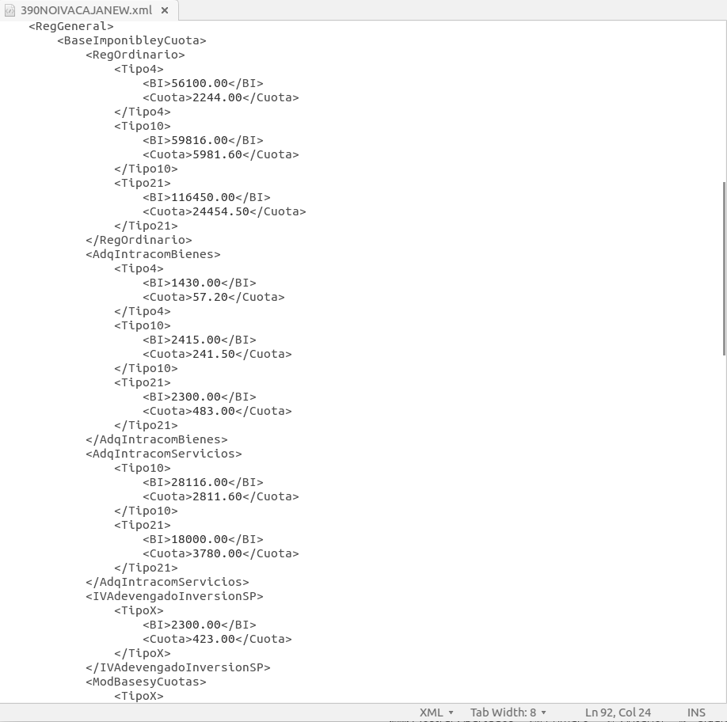

Para facilitar el estudio y la comprensión de las cifras obtenidas y, debido al gran número de transacciones y tipos de impuestos que pueden incluirse en este modelo, el módulo del Modelo 390 de Etendo genera un fichero .csv que puede abrirse con cualquier software de Hoja de Cálculo. 

Este fichero .csv lista todas las transacciones incluidas en el fichero XML, el impuesto relacionado, el importe de base imponible y cuota junto a la casilla del Modelo 390 oficial en la que se ha incluido dicha transacción.

## **Instalación y configuración del módulo**

### **Instalación**

El soporte para el Modelo 390 en Etendo se distribuye en un único módulo. Este módulo tiene un gran número de dependencias, que serán instaladas automáticamente al instalar el 390. Entre estas dependencias destacan:

-   Taxes: configuration for Spain (Impuestos para España)
-   Tax Report Launcher
-   Provincias de España
-   Epígrafes del I.A.E.
-   Legal Representative of the Organization (representante legal de la organización)

Para su instalación el usuario debe seguir los pasos que se describen a continuación en función de la situación de partida:

-   Instalación de la última versión disponible del paquete profesional de Etendo Classic para España
-   o la instalación del módulo(s) de forma separada.

!!! info
    Para la instalación del módulo de Localización Española, visite [_Marketplace_](https://marketplace.etendo.cloud/#/product-details?module=003B475055DD421B9483B5BE15AA48C5){target="_blank"}. 

Adicionalmente, el Modelo 390 se distribuye en otro módulo compatible con el "Régimen Especial de Criterio de Caja" (RECC). Este módulo sólo contiene el juego de datos que relaciona los impuestos de IVA de Caja con los parámetros de declaración del Modelo 390 correspondientes. Si su organización está sujeta a este régimen o es destinataria de operaciones sujetas a este régimen, deberá instalar además este módulo.

### **Aplicación del módulo**

Los módulos del Modelo AEAT 390 incluye un "conjunto de datos" o "configuración" que relaciona los tipos/rangos de impuestos para España, incluidos los de IVA de Caja, con los parámetros de declaración del 390.

Es por ello que, una vez instalado el módulo, la "configuración del Modelo 390" debe aplicarse a la Entidad legal con Contabilidad que corresponda, en la ruta de aplicación:

Configuración General | Organización | Gestión del módulo de Empresa.

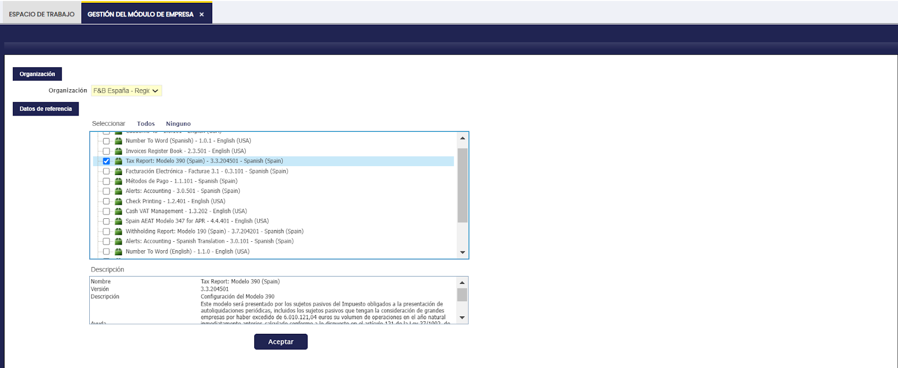

!!! info
    Es fundamental recalcar que antes de aplicar esta configuración, se debe haber aplicado previamente la configuración del módulo de [_impuestos para España_](../../../../../user-guide/etendo-classic/optional-features/bundles/spain-localization/impuestos-para-españa.md) y del módulo de impuestos para España de IVA de Caja ya que el Modelo 390 depende de estos módulos de impuestos para España.

Al instalar y aplicar los datos de referencia del Modelo 390 el usuario podrá comprobar que:

1\. Se crea una nueva declaración del Modelo 390 anual, en la ruta de aplicación: Gestión Financiera | Contabilidad | Configuración | Declaración de impuestos, tal y como se muestra en la siguiente imagen:

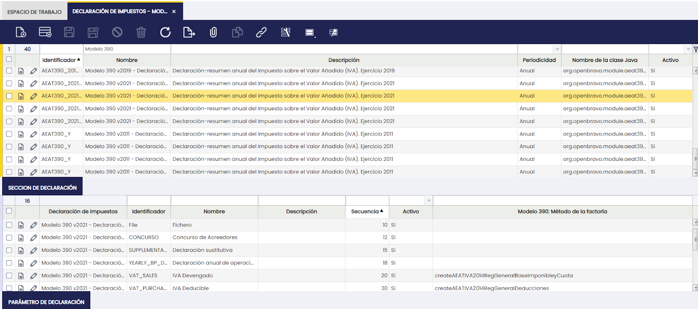

De ser necesario, para cada año fiscal se publica una nueva versión del Modelo 390 con los cambios tanto de diseño como de datos correspondientes. La última versión disponible es la relativa al periodo fiscal 2021.

2\. Cada rango de impuestos del módulo de impuestos para España se asocian con el parámetro de declaración del Modelo 390 correspondiente, con el fin de que las transacciones ligadas a dichos impuestos completadas y contabilizadas en el sistema, se tenga en cuenta en una u otra casilla/nodo del fichero XML, tal y como se muestra en la siguiente imagen: 

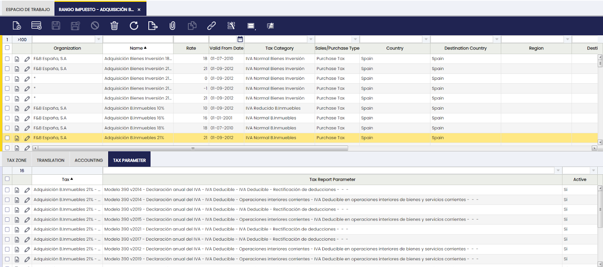

En la imagen del ejemplo se muestra como las bases imponibles/cuotas ligadas al rango de impuesto "Entregas IVA 21%" se reflejarán en las casillas correspondientes del 390 relacionadas con:

-   IVA devengado - Operaciones en Régimen General
-   IVA devengado - Modificación de bases y cuotas (en el caso de abonos o facturas rectificativas)
-   IVA devengado - Total Bases y Cuotas IVA
-   Volumen de operaciones - Operaciones en Régimen General

3\. Por último, el generador de declaraciones de impuestos permite la generación del fichero para la presentación del modelo 390 del período fiscal que corresponda, desde la ruta de aplicación:

Gestión Financiera | Contabilidad | Herramientas de análisis | Generador de declaraciones de impuestos.

### **Tipos de documentos soportados por el módulo**

El informe se genera teniendo en cuenta la información disponible en las facturas de compra y venta contabilizadas que incluyan alguno de los impuestos declarados en la configuración del informe.

Más concretamente, los tipos de factura soportados son:

-   Facturas de venta tipo AR Invoice positivas
-   Facturas de venta tipo AR Invoice negativas
-   Facturas de venta de tipo Reversal negativas
-   Abonos de venta (Credit Memo) positivos
-   Facturas de compra tipo AR Invoice positivas
-   Facturas de compra tipo AR Invoice negativas
-   Facturas de compra de tipo Reversal negativas
-   Abonos de compra (Credit Memo) positivos

### Configuración previa antes de generar el informe

#### **Impuestos**

!!! info
    No es necesario realizar ninguna configuración adicional si tiene aplicado y utiliza el Módulo de Impuestos para España y el Módulo de Impuestos para España de IVA de Caja. 

Es por ello que se recomienda utilizar estos módulos de impuestos para España.

Las transacciones relacionadas con impuestos creados manualmente sólo se incluirán en el Modelo 390 si se relacionan correctamente con el/los parámetros del 390 que corresponda:

-   si, por ejemplo, se crea un nuevo tipo de IVA de compras nacionales de bienes al 21%, dicho impuesto debería estar relacionado con los parámetros:  
    "Modelo 390 v 2021 - Declaración Anual de IVA - IVA Deducible - Operaciones Interiores Corrientes - IVA Deducible en operaciones interiores de bienes y servicios corrientes."  
    "Modelo 390 v 2021 - Declaración Anual de IVA - IVA Deducible - Rectificación de deducciones."

Recuerde que Etendo en la actualidad no contempla que un rango de impuesto de compras pueda definirse como parcialmente deducible.

Configuraciones del tipo:

-   Impuesto padre "Adquisiciones IVA 21% (no 100% deducible)"
    -   Impuesto hijo "Adquisiciones IVA 21% (50% deducible)" con un índice 10.50, marcado como "Impuesto Deducible".
    -   Impuesto hijo "Adquisiciones IVA 21% (50% no deducible)" con un índice 10.50, marcado como "Impuesto No deducible"

no permitirán la generación del Modelo 390 ya que el índice 10.50% no es un índice o tipo que reconozca el fichero del 390.

Estos impuestos no deberán estar ligados a parámetros del 390 y sus importes (base y cuota) deberán reflejarse en el programa "IVA 2021" o el que corresponda de forma manual.

#### **Actividades del I.A.E.**

En el Modelo 390 se deben declarar las principales actividades del I.A.E. (Impuesto de Actividades Económicas) en las que la empresa trabaja habitualmente.

El módulo Epígrafes I.A.E., instalado como dependencia del 390, añade una nueva solapa a la ventana de Organización en la que puede indicar todas las actividades en las que su empresa ha estado trabajando. El modelo 390 debe incluir como mínimo una actividad principal, que debe estar marcada en la aplicación como por defecto, y como máximo 5 actividades. En caso de incluir más de 5 actividades, se incluirán en el informe las 5 primeras según el número de línea.

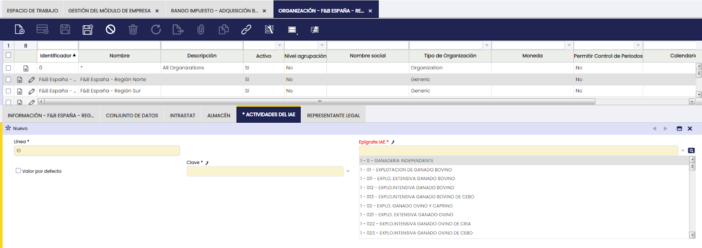

En el módulo de Epígrafes IAE se incluye el conjunto correspondiente a la clave 1. Si desea incluir un epígrafe que pertenezca a cualquier otra clave, tan sólo debe crear un nuevo registro en la ventana Epígrafes IAE e incluirlo en un registro de la solapa de Actividades del IAE de la ventana de Organización.

#### **Representante Legal de la Organización**

Si su organización tiene uno o varios representantes legales debe declararlos en la solapa correspondiente de la ventana Organización, que está disponible al instalar el módulo Legal Representative of the Organization (representante legal de la organización).

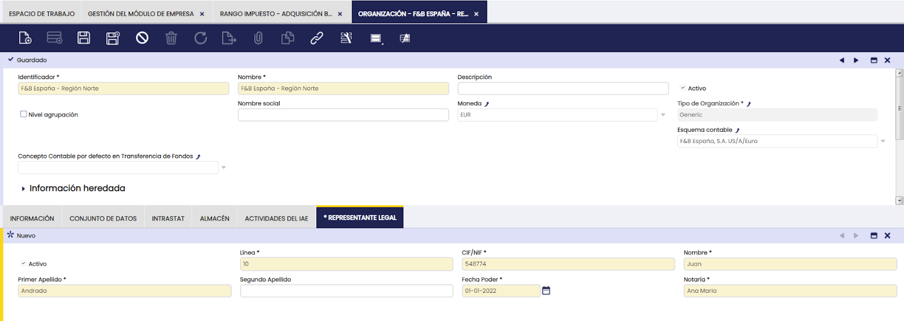

### **Generación del modelo 390**

Tal y como ya se ha explicado, el modelo 390, se genera como un fichero XML válido conforme a los requerimientos de la AEAT desde la ruta de aplicación: Gestión Financiera | Contabilidad | Herramientas de análisis | Generador de declaraciones de impuestos | Generador de declaraciones de impuestos

Una vez que el usuario ha introducido los datos genéricos, tales como la "organización", el "ejercicio" y "periodo", así como la "Declaración de Impuestos'', puede introducir los parámetros de entrada propios del Modelo 390 para posteriormente generar el fichero.

La ventana de "parámetros de entrada" del 390 se muestra en la siguiente imagen:

Los parámetros de entrada tienen que ver con datos que no pueden extraerse directamente desde Etendo. Datos como:

-   check para indicar si se está "**Inscrito en el registro de devolución mensual**"
-   campo de texto para introducir un **Nombre del fichero** del 390
-   check para indicar si "**Ha sido declarado en concurso de acreedores en el ejercicio**"
-   check para indicar si "**las autoliquidaciones del último periodo de liquidación del ejercicio corresponden a declaraciones concursales**"
-   check para indicar si se trata de una "**Declaración Sustitutiva**"
-   check para indicar si se trata de una "**Declaración sustitutiva por rectificación de cuotas**"
-   campo de texto para introducir el "**Número identificativo de la declaración anterior**" que se sustituye o rectifica
-   campo de texto para introducir si aplica la cuota a "**compensar del ejercicio anterior**" 
-   campos de texto para introducir los "**% de tributación por razón de territorio**", en los casos en que no hay una tributación al 100% al territorio común.
    -   Si se introduce un valor aquí (p.ej 50% territorio común, 50% Navarra) el resultado de la liquidación anual se borra y pasa a la casilla Resultado de la liquidación anual atribuible a territorio común.
-   campo de texto para introducir la cuota a **Compensar atribuible a territorio común** 
-   campos de texto para introducir los **resultados a ingresar en las autoliquidaciones de IVA del ejercicio**, si aplica.
-   campos de texto para introducir el **total de devoluciones mensuales/trimestrales de IVA** (Modelo 303 en los casos de inscripción en el registro de devolución mensual
-   campo de texto para introducir el **Resultado de la autoliquidación del último período a compensar**
-   campo de texto para introducir "las cuotas pendientes de compensación al término del ejercicio" 

#### **Transformación de parámetros de entrada en constantes**

Como se puede observar, el número de parámetros de entrada es muy elevado. Para evitar tener que introducir todos estos datos cada vez que se genera el informe, el módulo del 390 permite definir como constantes cada uno de los parámetros de entrada. Para ello sólo tiene que encontrar el parámetro de entrada en la definición del informe (ventana Declaración de impuestos), cambiarle el tipo de parámetro a constante y definir el valor de dicha constante.

Por ejemplo, en nuestra organización el porcentaje de tributación en Territorio Común es el 50% por lo que cambiamos ese parámetro a tipo constante con un valor de 50

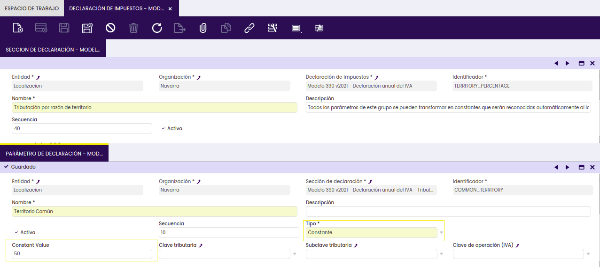

A partir de ahora, cada vez que generemos el informe de nuevo no será necesario introducir este parámetro, ya que ni siquiera aparecerá de nuevo en la ventana de parámetros de entrada del 390.

## **Resultado del Modelo 390**

Una vez que el proceso de generación del informe ha finalizado, el sistema nos devolverá un fichero comprimido ZIP. Si lo descomprimimos, en su interior encontraremos dos ficheros:

### **Fichero XML**

Este fichero XML es compatible con el formato oficial publicado en el BOE para el modelo 390 listo para ser enviado a la AEAT. Este fichero se puede abrir con cualquier editor de texto plano para examinar o editar su contenido

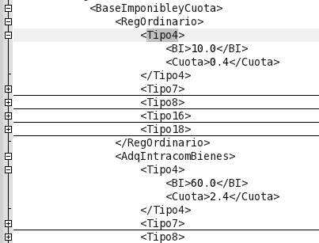

### **Fichero CSV**

Un fichero CSV con la lista de facturas e importes que se han utilizado para generar el informe. Este archivo se puede importar en cualquier software de Hoja de Cálculo. 

A la hora de importar el fichero es importante que defina los siguientes filtros:

-   Juego de caracteres: **UTF-8**
-   Separador: **punto y coma**, es decir **;**
-   Delimitador de texto: **comilla doble**, es decir **“**

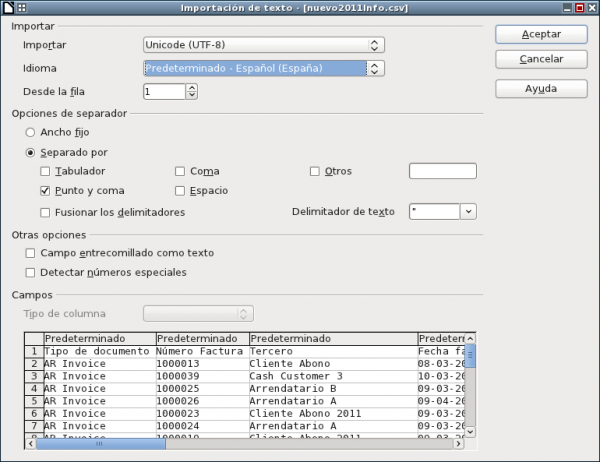

Este es el aspecto del fichero una vez importado como hoja de cálculo:

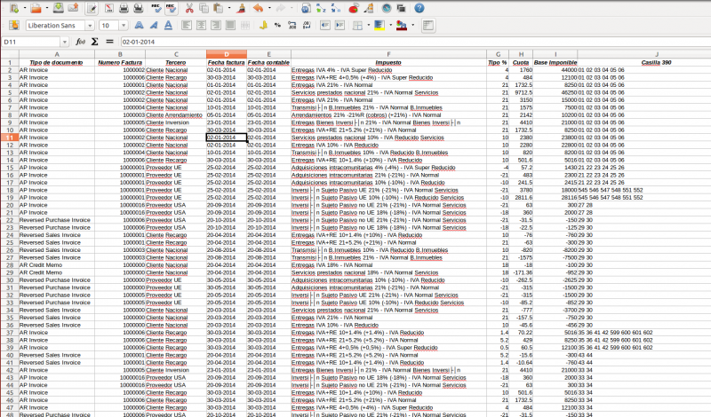

La hoja nos muestra las facturas que se han tenido en cuenta para generar el 390, el impuesto (porcentaje, cuota y base imponible en Euros) de cada factura y el grupo de casillas correspondientes del 390 en las que se ha incluido dicho importe.

La columna *Casilla 390* representa la casilla o grupo de casillas en las que se ha incluido dicho importe. Esas casillas se corresponden con nodos del fichero XML generado desde Etendo.

Por ejemplo, en la fila número 2 del ejemplo anterior vemos que esa transacción se incluye en el grupo de casillas *01 02 03 04 05 06*, que se corresponden con los siguientes nodos del fichero XML:

<RegGeneral>

<BaseImponibleyCuota>

<RegOrdinario>

<Tipo4>

Si buscamos estas casillas en el modelo 390 oficial, veremos que corresponden al Régimen ordinario del IVA devengado, por lo que esta transacción en concreto deberá reflejarse en las casillas *01* y *02* (IVA Devengado - Régimen Ordinario *4%*)

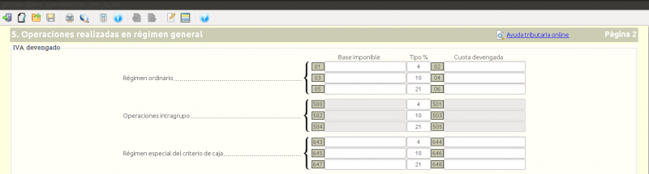

!!! warning
    *Es importante tener en cuenta que las casillas correspondientes a subtotales de los grupos de IVA deducible (por ejemplo casillas 48 y 49) no se incluyen en el fichero CSV pero sí se incluyen en el archivo XML que contiene el informe oficial. Estas casillas se autogeneran como el sumatorio de las bases imponibles y cuotas de las casillas correspondientes de su grupo (por ejemplo casillas 190 a 606) que sí se incluyen en el CSV. Esta es una limitación del fichero CSV que no afecta en absoluto al informe oficial generado.*

#### **Ventajas**

El tener todos los datos en la hoja de cálculo nos permite examinar la información con detalle. Por ejemplo:

-   se puede definir un filtro automático en la primera fila que nos permita filtrar por cualquiera de las columnas. De esta forma responderemos a preguntas del estilo: ¿la factura 1000013 en qué casillas del 390 se ha incluido? ¿Qué facturas se han incluido en un determinado grupo de casillas del 390?, etc.
-   también se puede realizar sumatorios sobre las columnas de cuota y base imponible para asegurarnos de que el importe incluido en el 390 es el correcto.
-   Otra ventaja de tener la información tan detallada es que nos puede servir para rellenar manualmente el modelo 390 en el programa de ayuda “IVA 2016”. Esto puede ser útil en caso de que queramos añadir información adicional no disponible en nuestra instancia de Etendo.

## **Presentación telemática del Modelo 390**

Una vez que ha comprobado que las cifras incluidas en el Modelo 390 generado por Etendo son correctas, puede presentar el fichero XML en el siguiente enlace [_Presentación Modelo 390_](https://sede.agenciatributaria.gob.es/Sede/ayuda/consultas-informaticas/presentacion-declaraciones-ayuda-tecnica/modelo-390/modelo-390-presentacion-mediante-fichero.html){target="_blank"} para lo cual se requiere un certificado válido.

Se mostrarán los siguientes datos:

-   Total de cuotas de IVA y RE (IVA Devengado) 
-   Suma de deducciones (IVA Deducible) 
-   Resultado Régimen General (Resultado Anual) 
-   Resultado de la liquidación, como resultado de la suma de:
    -   resultados Régimen General y Simplificado 
    -   menos la compensación de cuotas ejercicio anterior 
-   Resultado de la liquidación anual atribuible a territorio común 
-   Total volumen de operaciones 

Es importante recordar que el resultado de la liquidación anual del 390 tiene que coincidir con los resultados de las liquidaciones periódicas del Modelo 303.

Los resultados de las liquidaciones periódicas del Modelo 303 se pueden introducir al lanzar el Modelo 390 desde Etendo, como "Parámetros de Entrada":

-   "Total resultados a ingresar en las autoliquidaciones de IVA del ejercicio"
-   o bien, "Total devoluciones mensuales de IVA"
-   o bien, "Resultado de la autoliquidación el último período a compensar".