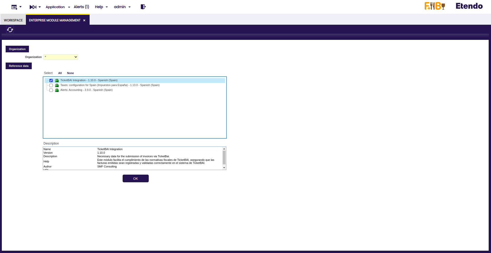
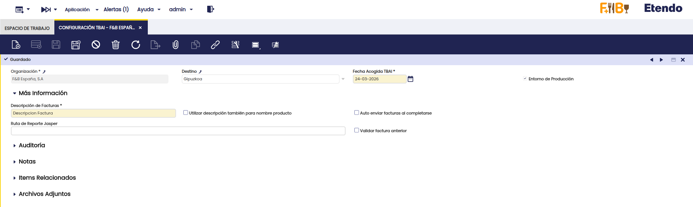
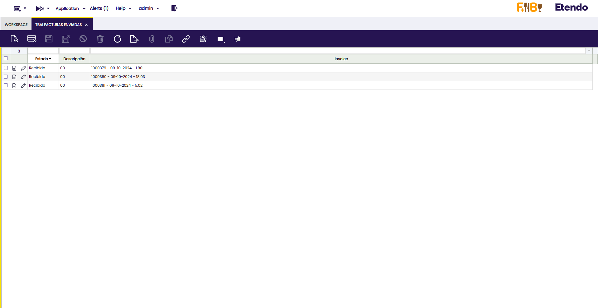
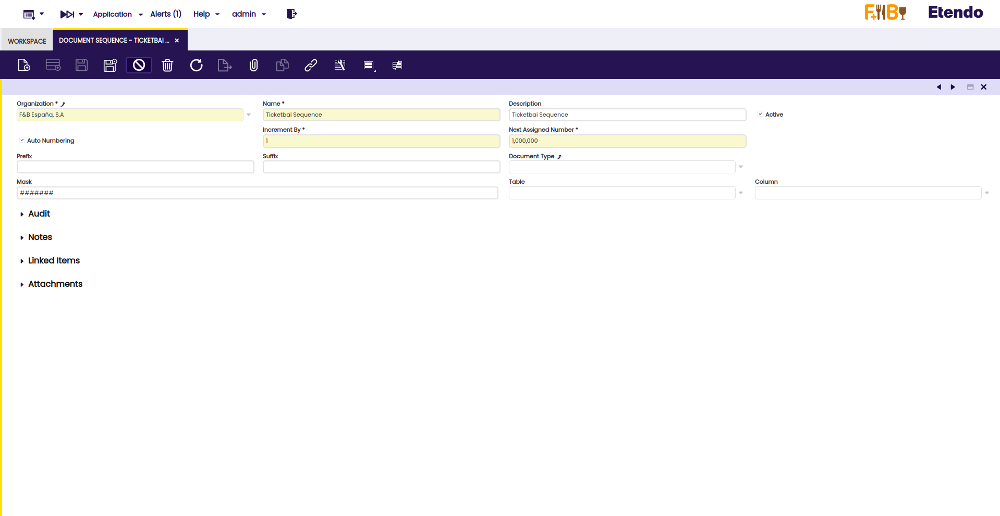
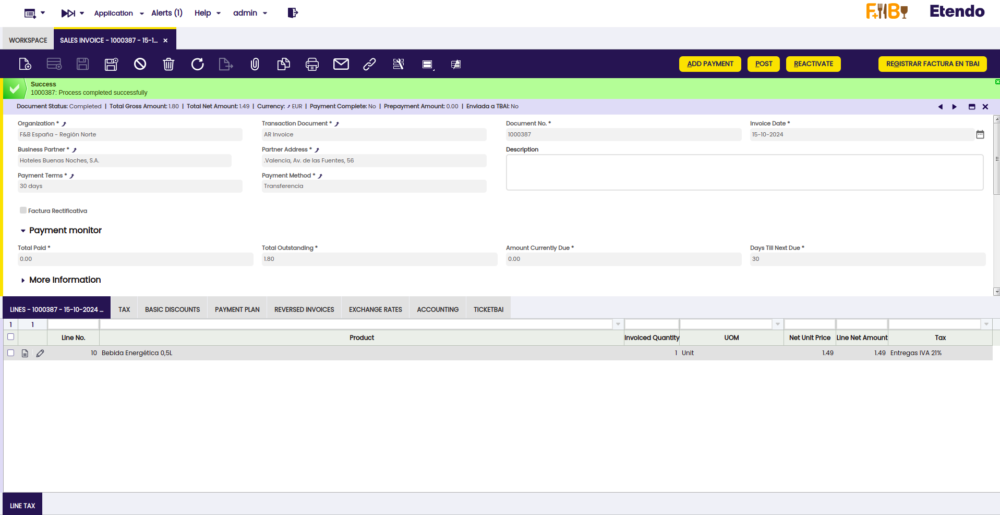
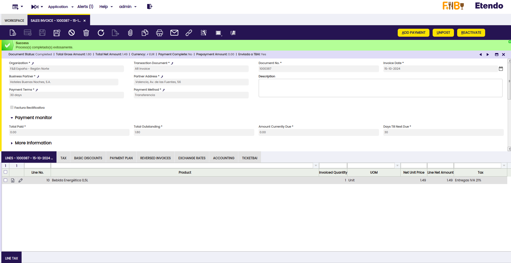
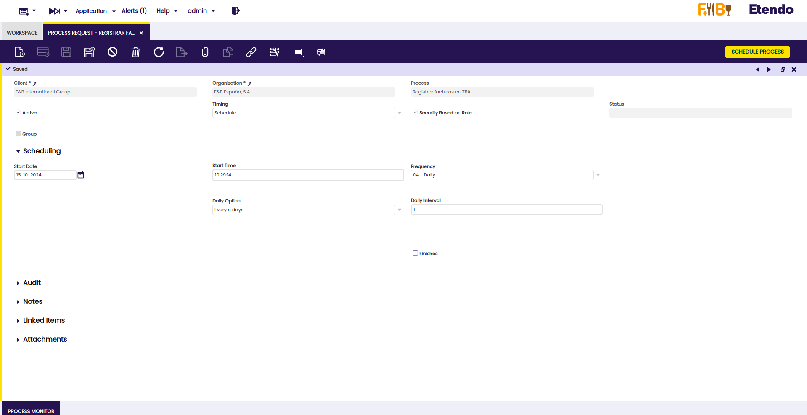
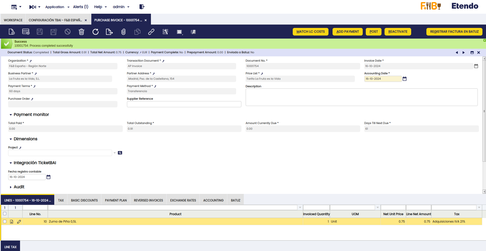
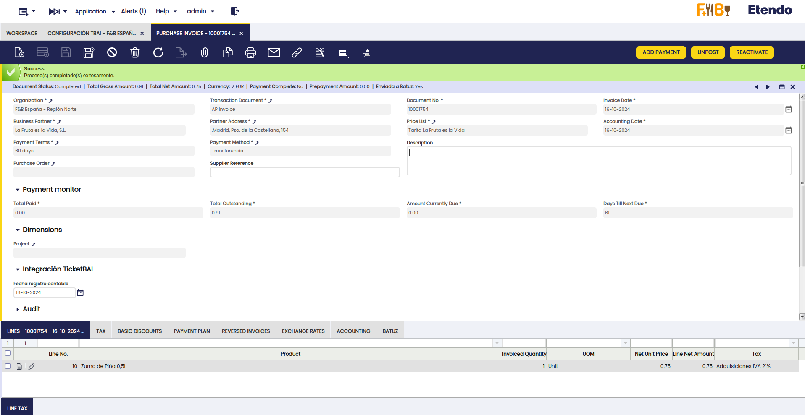
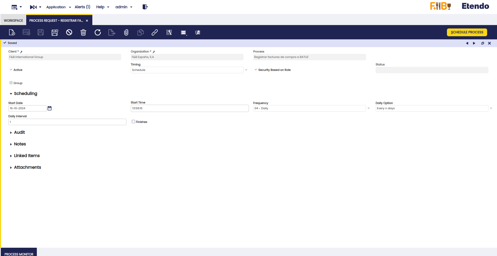

---
tags:
- Localización Española
- Ticketbai
- Tbai
- Batuz
- Bizkaia
- Factura
- Gipuzkoa
title: TicketBai y Batuz
---

## Javapackages 

:octicons-package-16: Javapackage: `com.smf.ticketbai`

## Introducción

Las funcionalidades de **TicketBai** y **Batuz** en Etendo ofrecen una solución integral para el cumplimiento de las normativas fiscales en el País Vasco, orientado a garantizar la **transparencia**, **reducir el fraude fiscal**, y **asegurar la correcta emisión de facturas** electrónicas certificadas.

**TicketBai** es obligatorio para las empresas y profesionales que **operen en Gipuzkoa y estén sujetos al IVA o IAE**, mientras que **Batuz** se centra específicamente en **Bizkaia**, incluyendo además del sistema TicketBai, el Libro Registro de Operaciones Económicas (LROE).

A través de este módulo, Etendo facilita la **automatización de procesos** clave como la **emisión**, **validación** y **envío en tiempo real** de facturas a las haciendas forales. El sistema garantiza la trazabilidad de las transacciones mediante la firma electrónica de las facturas y la transmisión telemática a las autoridades fiscales.

## Descripción del Módulo

El módulo permite:

- Enviar **automáticamente** los archivos XML con las facturas a las haciendas forales (Gipuzkoa o Bizkaia).
- Recibir los XML de respuesta con la confirmación del envío de las facturas.

La implementación cubre:

1. **Cumplimiento** de las normativas fiscales tanto para TicketBai como para Batuz.
2. **Automatización** del envío de facturas emitidas a la administración tributaria.
3. **Gestión de procesos** como el registro de facturas en TBAI y el registro de facturas de compra en Batuz.
4. **Historial** de todas las facturas enviadas a las administraciones tributarias.
## Contenido del Módulo

Al instalar este módulo, el usuario podrá comprobar que:

1. Se crearán nuevas ventanas:

    - **Configuración TBAI**, donde se podrán configurar todos los parámetros necesarios para el envío correcto de los registros de facturas a **TicketBai/Batuz**, incluyendo los destinos **Gipuzkoa** y **Bizkaia**.

    - **TBAI Facturas Enviadas**, donde se podrá revisar el historial completo de todas las facturas enviadas tanto a **TicketBai** como a **Batuz**.

2. Se crean **nuevos campos y pestañas** relativos a TicketBai/Batuz en la ventana de **Factura (Cliente)** y **Factura (Proveedor)**, para añadir la información requerida por estos sistemas para el registro de las facturas.

3. Se añade un botón en las ventanas de **Factura (Cliente)** y **Factura (Proveedor)**, con el fin de registrar las facturas de manera electrónica:

    - **En Factura (Cliente)** para Registrar factura en **TicketBai**.
    - En **Factura (Proveedor)** para Registrar factura en **Batuz**.

4. Se generan nuevos procesos en la ventana **Procesamiento de Peticiones**, denominados:

    - **Registrar facturas en TicketBai**, configurables para cada Organización o "Entidad Legal", permitiendo el alta masiva de facturas en TicketBai con la cadencia de envío configurada.

    - **Registrar facturas en Batuz**, para registrar facturas de compra en Batuz, también configurables para cada Organización o "Entidad Legal", permitiendo el alta masiva con la cadencia de envío configurada.

## Configuración

### Dataset

Una vez instalado el módulo, será necesario aplicar el dataset proporcionado para completar la integración de TicketBai/Batuz. Para ello, siga los siguientes pasos:

1.  Acceda a la ventana "**Gestión del módulo de Empresa**".

2.  En esta ventana, seleccione el dato de referencia "**TicketBai Integration**".

3.  Aplique este dataset a la organización *****

A continuación, si el proceso se ha ejecutado correctamente, el sistema mostrará una pantalla similar a la siguiente:

Este dataset proveerá los datos necesarios para gestionar el envío de facturas a Gipuzkoa y Bizkaia.

### Configuración TBAI

La ventana de Configuración TBAI le permitirá ajustar los parámetros necesarios para comenzar a enviar facturas a través de TicketBai o Batuz. A continuación, se describen los campos principales a configurar:

- **Organización**: Seleccione la organización o entidad legal que será responsable del envío de los registros de facturas.

- **Destino**: Elija el destino Gipuzkoa o Bizkaia previamente creado por el dataset.

- **Fecha Acogido TBAI**: Especifique la fecha en la que la organización se acoge al sistema TBAI.

- **Entorno de producción**: Seleccione esta opción si los registros de facturas deben ser enviados al entorno productivo. Si está realizando pruebas, desmarque esta opción para usar un entorno de test.

- **Descripción de Facturas**: Indique el texto que se incluirá en el campo **DescripcionFactura** del XML enviado.

- **Utilizar descripción también para nombre de producto**: Si está activado, se usará el valor de DescripcionFactura en el campo **DescripcionDetalle** del XML de la factura.

- **Auto enviar facturas al completarse**: Active esta opción si desea que las facturas se envíen automáticamente cuando alcancen el estado de "Completado".

- **Ruta de Reporte Jasper**: Especifique la ubicación de la plantilla Jasper que se utilizará para imprimir el reporte de la factura.

- **Validar factura anterior**: Active esta opción para que el sistema verifique si la factura anterior fue enviada correctamente antes de enviar la actual. Si no fue enviada, se mostrará una advertencia y se cancelará el envío.

- **NIF**: Ingrese el NIF del emisor de la factura.

- **Nombre y Apellido del Emisor de Certificado**: Información requerida para el certificado que se adjunta en la configuración.

- **Contraseña del certificado**: Introduzca la contraseña del certificado adjunto.

*No olvide adjuntar el certificado necesario.*

### Rango de impuesto

Al configurar los impuestos en el sistema, es importante completar correctamente los campos relacionados con los **regímenes de IVA** y las **causas de exención o no sujeción**. Estas configuraciones se realizan desde la ventana **Rango de Impuesto**. A continuación, se detallan los campos que deben ser completados según cada caso:

1. **Clave de Régimen Especial de IVA**
    Este campo debe completarse cuando se aplique un régimen especial de IVA. Esto permitirá que el sistema identifique el régimen aplicable en las facturas enviadas.

    *Condición de visualización: Se muestra si no aplica exención y no sujeción.*

2. **Causa de No Sujeción**
    Este campo debe completarse en aquellos casos donde el impuesto no esté sujeto a IVA. Este campo es necesario para facturas que no están sujetas a impuestos por alguna razón específica.

    *Condición de visualización: Se muestra cuando no está sujeta a impuestos*.

3. **Causa de Exención**
    En los casos donde la factura esté exenta de IVA, se deberá seleccionar la causa de exención. Este campo es obligatorio cuando la factura está exenta de impuestos y debe justificar dicha exención al enviar los datos.

    *Condición de visualización: Se muestra cuando la factura está exenta de impuestos*.

### TBAI Facturas enviadas

En la ventana de **TBAI Facturas Enviadas**, es posible visualizar todas las facturas que han sido enviadas desde la organización en la que está trabajando. Esta herramienta permite llevar un control detallado de los **envíos realizados**, facilitando la **gestión** y el **seguimiento** de las facturas que se han transmitido a través del sistema TicketBai o Batuz.

### Secuencia de encadenamiento para TBAI 

Antes de realizar el primer envío de facturas, es esencial configurar correctamente el tipo de documento de las facturas que se enviarán.

1. Acceder a la ventana "**Tipo de Documento**": En este registro encontrará un campo denominado "**Secuencia de Encadenamiento para TBAI**". Este campo es clave para llevar un control preciso de las facturas que ya han sido enviadas o que se ha intentado enviar.

2.  Crear una nueva Secuencia de Encadenamiento para TBAI:

    - Ingrese un nombre apropiado en el campo "**Name**".
    - Active la opción **Auto Numbering**. No es necesario modificar los campos adicionales que aparecerán tras activar esta opción.

## Proceso de Envío de Factura

=== "TicketBai"
    1. Creación de Factura de Venta
        
        Para iniciar el proceso, cree una factura de venta utilizando una organización que tenga configurada la opción de TicketBai. Esta configuración se realiza desde la ventana de "**Configuración TBAI**" en el sistema.

    2.  Registro de Factura en TicketBai

        Una vez completada la factura, se habilitará un botón titulado "**Registrar Factura en TBAI**". Al presionar este botón, se iniciará el proceso de envío de la factura a la plataforma TicketBai.
        

    3.  Resultado del Proceso

        - Si el envío es exitoso, el sistema mostrará un mensaje de confirmación indicando que la factura ha sido registrada correctamente en TicketBai.
        - En caso de error, se mostrará un mensaje con una descripción detallada del fallo, permitiendo identificar y resolver el problema.

        

    ### Detalle del Envío a TicketBai

    Además del botón para registrar la factura, existe una solapa denominada "**TicketBai**" dentro de la factura. Esta sección muestra información relevante sobre el proceso de envío de la factura a la plataforma TicketBai, incluyendo:

    -   **Estado del Envío**: Indica si la factura ha sido recibida exitosamente por la plataforma.
    -   **Descripción**: Proporciona información adicional sobre el estado del envío. En caso de error, esta descripción incluirá detalles específicos que ayudarán a identificar el problema.

    En la misma pestaña, se encuentra un apartado de **Adjuntos** donde se almacena la respuesta que TicketBai devuelve. Este archivo es generado en formato XML y contiene los detalles técnicos sobre el resultado del proceso de envío.

    ### Envío Automático 

    Dentro de la ventana "**Procesamiento de Peticiones**" se ha creado un proceso "**Registrar facturas en TBAI**", que puede configurarse para cada organización o entidad legal.

    Tal y como sucede con otros procesos de Etendo, éstos podrán configurarse para ser ejecutados de forma inmediata, planificada o programada con una cierta frecuencia, donde permitirán el alta masiva de facturas en Ticketbai con la cadencia de envío configurada.
    

=== "Batuz"

    1. Creación de Factura de Compra
        
        Para iniciar el proceso, cree una factura de compra utilizando una organización que tenga configurada el destino Bizkaia. Esta configuración se realiza desde la ventana de "**Configuración TBAI**" en el sistema.

    2.  Registro de Factura en Batuz

        Una vez completada la factura, se habilitará un botón titulado "**Registrar Factura en Batuz**". Al presionar este botón, se iniciará el proceso de envío de la factura a Batuz.
        

    3.  Resultado del Proceso

        - Si el envío es exitoso, el sistema mostrará un mensaje de confirmación indicando que la factura ha sido registrada correctamente en Batuz.
        - En caso de error, se mostrará un mensaje con una descripción detallada del fallo, permitiendo identificar y resolver el problema.

        

    ### Detalle del Envío a Batuz

    Además del botón para registrar la factura, existe una solapa denominada "**Batuz**" dentro de la factura. Esta sección muestra información relevante sobre el proceso de envío de la factura a Batuz, incluyendo:

    -   **Estado del Envío**: Indica si la factura ha sido recibida exitosamente por la plataforma.
    -   **Descripción**: Proporciona información adicional sobre el estado del envío. En caso de error, esta descripción incluirá detalles específicos que ayudarán a identificar el problema.

    En la misma pestaña, se encuentra un apartado de **Adjuntos** donde se almacena la respuesta que Batuz devuelve. Este archivo es generado en formato XML y contiene los detalles técnicos sobre el resultado del proceso de envío.

    ### Envío Automático 

    Dentro de la ventana "**Procesamiento de Peticiones**" se ha creado un proceso "**Registrar facturas de compra a Batuz**", que puede configurarse para cada organización o entidad legal.

    Tal y como sucede con otros procesos de Etendo, estos podrán configurarse para ser ejecutados de forma inmediata, planificada o programada con una cierta frecuencia, donde permitirán el alta masiva de facturas en Batuz con la cadencia de envío configurada.
    