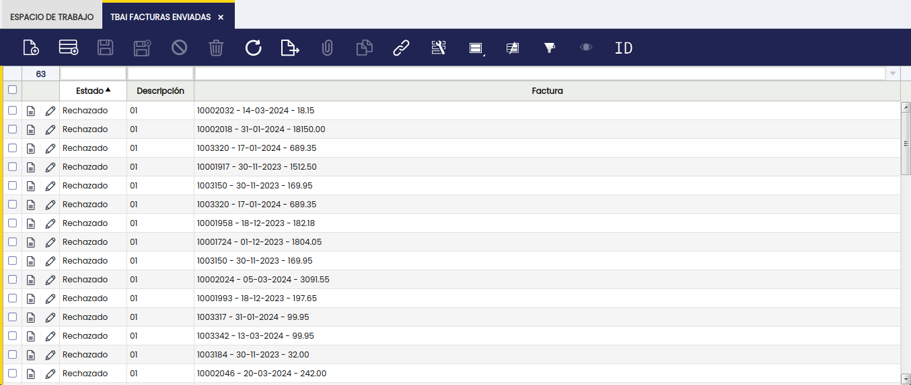

## Javapackages 

:octicons-package-16: Javapackage: com.smf.ticketbai

## **Introducción**

Esta sección explica el contenido del módulo de Etendo **Integración con TicketBAI**.

Este módulo forma parte del bundle (paquete) de Localización Española en su versión para Etendo.

## **Descripción del Módulo**

El módulo **Integración con TicketBAI** es una herramienta para las organizaciones que buscan optimizar la gestión de envio de sus facturas. 

El módulo automatiza el proceso de envío de facturas, asegurando que se cumplan los requisitos de Ticketbai garantizando el cumplimiento con las normativas de Ticketbai.

Desde Etendo vamos a poder:

- **Enviar automáticamente** los archivos XML a la **Hacienda Foral** con la información necesaria para el registro de facturas.

- **Recibir los XML de respuesta** de la Hacienda Foral.

La obligatoriedad de TicketBAI se aplica a:

- **Empresas y profesionales** que realicen actividades económicas y estén sujetos al **Impuesto sobre el Valor Añadido (IVA)** o al **Impuesto sobre Actividades Económicas (IAE)**.

- **Contribuyentes** que, independientemente de su tamaño, deban emitir facturas o documentos equivalentes.

Las ventajas de TicketBAI para el contribuyente incluyen:

- **Reducción de las obligaciones formales**, eliminando la necesidad de presentar ciertos modelos fiscales.

## **Contenido del Módulo**

Al instalar este módulo, el usuario podrá comprobar que:

1.  Se crearan nuevas pantallas 
    1.  **Configuración TBAI**, en la que se podrán configurar todos los parámetros necesarios para el envío correcto de los registros de facturas a Ticketbai en el que se incluye el desinto (Bizkaia o Gipuzkoa).
    2.  **Destinos TBAI**, en el que se podrán configurar todos los parametros necesarios  para la correcta contruccion del XML para el envio de Bizkaia o Gipuzkoa, tales como el certificado, la licencia, urls de pruebas o produccion, etc.
    3.  **TBAI Facturas Enviadas**, en el que se podra revisar el historial completo de todas las facturas enviadas a Ticketbai.
2.  Se crean nuevos **campos y pestañas relativos a Ticketbai** en la ventana de **Factura (Cliente)**, con el fin de añadir la información requerida por parte de Ticketbai, respecto del **Alta** del registro de las facturas.
3.  Igualmente, se añade un boton en las ventana de **Factura (Cliente)**, con el fin de dar de alta (Registrar factura en TBAI).
4.  Se genera un nuevo proceso en la venta **Procesamiento de Peticiones** denominado **Registrar facturas en TBAI** configurables para cada Organización o **Entidad Legal**. Estos nuevos procesos permitirán el alta masiva de facturas en Ticketbai con la cadencia de envío configurada.

## **Configuración**

A partir de aqui se va a explicar la forma correcta de configurar las ventanas **Configuracion TBAI** y **Destinos TBAI**.

### Destinos TBAI

En esta ventana se podrá configurar todos los parametros necesarios  para la correcta contruccion del XML para el envio de Bizkaia o Gipuzkoa.

- **Organización**: organización (entidad legal) para la que se configura el envío de registros a Ticketbai.Seleccionada una entidad legal (con o sin contabilidad), todas sus organizaciones **hijas** quedarán igualmente acogidas a Ticketbai.

- **Nombre de destino**: nombre que tendra el destino preferentemente Bizkaia o Gipuzkoa, tambien algun nombre personalizado.

- **Paquete java**: es el valor que ingresaremos para enviar a Gipuzkoa o a Bizkaia.

    - Gipuzkoa: `com.smf.ticketbai.process.GipuzkoaSync`
    - Bizkaia: `com.smf.ticketbai.process.bizkaia.BizkaiaSync` 

- **Politica URL**: es un valor necesario para la **firma digital de las facturas XML**. Se refiere a la dirección web donde se puede encontrar la política de firma digital, que describe los estándares técnicos y algoritmos criptográficos utilizados durante el proceso de firma. Esto **garantiza** el cumplimiento de los requisitos legales y el reconocimiento por parte de las autoridades fiscales. El valor debe **actualizarse** a medida que cambian las políticas de firma digital, generalmente obtenible en la documentación técnica de Gipuzkoa y Bizkaia, y este es una URL a un PDF.

- **Datos de produccion/test**

  - **URL para Alta Factura**: URL requerido para dar de altas las facturas a Ticketbai Por ejemplo en bizkaia, esta informacion se puede conseguir en los siguientes PDF.

      - URL produccion: [URL alta Bizkaia](https://www.batuz.eus/fitxategiak/batuz/lroe/Batuz_LROE_Especificaciones_Env%C3%ADo_Masivo_V1_0_8.pdf?hash=e3c442eb74cced18876cb8a9c6ce8226){target="_blank"}.

      - URL pruebas: [URL alta Bizkaia](https://www.batuz.eus/fitxategiak/batuz/lroe/batuz_lroe_entorno_pruebas_empresas_desarrolladoras_v1_0_7.pdf?hash=256e1c125fa6a14e66630be25a92d7dc){target="_blank"}.

  - **Url para anulacion de factura**: url requerido para anular una factura ya subida a ticketbai. Por ejemplo en `bizkaia`, tambien se puede conseguir en los links que se introducieron arriba.
  - **Url base para QR**: generacion del QR de la factira para que facilmente se pueda acceder a la informacion.

!!!info
    Esta informacion la podemos encontrar en [URL QR](https://www.batuz.eus/fitxategiak/batuz/ticketbai/TicketBAI_Especificaciones_v_1_1.pdf?hash=46c48b7073185a2434e055d86c2bf166){target="_blank"}.

  - **Nif**: nif del emisor de la factura.

- **Certificado produccion/test**
      - **Nombre y Apellido del Emisor de Certificado**: dato necesario para el **certificado** que se adjunta a la configuracion.
      - **Contraseña del certificado**: contraseña del **certificado** que se adjunta a la configuracion.

- **Licencia produccion/test**

      - **Nombre licencia**: se refiere al nombre comercial del software de facturación. Este nombre suele ser utilizado para identificar el programa dentro del sistema TicketBAI y para facilitar la asistencia técnica o consultas relacionadas.

      - **Licencia TBAI**: es un identificador único asignado a cada software de facturación que garantiza la autenticidad y la integridad de las facturas generadas. Este código se utiliza para validar las facturas ante la administración tributaria.

      - **NIF Entidad Desarrolladora**: corresponde al Número de Identificación Fiscal de la empresa que ha desarrollado el software de facturación. Este dato es importante para la trazabilidad y para responsabilizar a la entidad en caso de incidencias o irregularidades.

- **Configuracion de URIs (exlusivo Bizkaia)**
Estos campos se refieren a las configuraciones de URIs para facturas, tanto para clientes como para proveedores. Son relevantes porque proporcionan URLs específicas para acceder a diferentes tipos de esquemas de facturación. Las URLs de estos esquemas se pueden obtener a través de la **Documentación técnica** de **Bizkaia**, en la sección de **Esquemas XSD**. Cada XSD tendrá una etiqueta llamada targetNamespace, que es la que se utilizará para completar estos campos.

      - **Uri del esquema de Alta para Factura (Cliente)**: este campo se utiliza para configurar la URL específica que se requiere para registrar las facturas de clientes en TicketBAI.

      - **Uri del esquema de Alta para Factura (Proveedor)**: similar al campo anterior, este campo es para la URL necesaria para registrar nuevas facturas de proveedores en TicketBAI

      - **Uri del esquema de Anulacion para Factura (Cliente)**: Este campo es crucial para definir la URL que permite anular facturas de clientes que ya han sido registradas en TicketBAI.

- **Certificado**: El certificado se utiliza para firmar digitalmente los archivos XML de las facturas, cumpliendo así con el requisito para enviarlos a la Hacienda Foral según las normativas de TicketBAI. El certificado queda almacenado en la sección **Archivos adjuntos**.

### **Configuración TBAI**

En esta ventana, se podran configurar las preferencias básicas necesarias para comenzar a enviar facturas al destino que elijas.

Tenemos los siguientes parametros:

- **Organización**: organización (entidad legal) para la que se configura el envío de registros a Ticketbai.

- **Destino**: destino previamente creado y configurado en la ventana **Destinos TBAI**.

- **Fecha Acogido TBAI**: campo de fecha en el que se puede indicar la fecha en la que la organización se acoge a TBAI. 

- **Entorno de producción**: este entorno tiene que estar seleccionado para aquellos entornos productivos de organizaciones cuyos registros de factura se tienen que enviar al entorno productivo (final) de Ticketbai.

Si el usuario desea realizar pruebas de envío desde un entorno de test o entidad/organización de pruebas, debe desmarcar esta opción y completar toda la configuración de prueba en la ventana **Destinos TBAI**.

- **Descripcion de Facturas**: valor que contendra el campo DescripcionFactura en el XML de la factura que se va a enviar a Tickebai.

- **Utilizar descripcion tambien para nombre de producto**: si esta activado utilizará el valor de la **Descripcion de Facturas** en el campo `DescripcionDetalle` dentro del XML de la factura que se envia a Ticketbai.

- **Auto enviar facturas al completarse**: si está activado en el momento en que una factura pasa un estado **Completado**, automaticamente se enviara a ticketbai.

- **Ruta de Reporte Jasper**: ubicacion de la plantilla de jasper con la que se va a imprimir el reporte. 

- **Validar factura anterior**: si está activado al enviar la factura a Ticketbai,  verifica si la factura anterior con el Nº documento previo también ha sido enviada. En caso de que no haya sido enviada, recibirás un aviso indicando que la factura previa no ha sido enviada y se cancela el envío actual a Ticketbai.

## **TBAI Facturas enviadas**

Desde esta ventana, podremos observar todas las facturas que fueron enviadas desde la organización en la que estamos trabajando.

## **Enviar factura a Ticketbai**

### **Configuracion del tipo de documento**

Antes de que se pueda realizar el primer envío, es fundamental configurar el **tipo de documento** de las facturas que se desean enviar a ticketbai.

1. Ingresar a la ventana **Tipo de documento**, se encontrará un campo denominado **Secuencia de encadenamiento para TBAI**. Esta **Secuencia de encadenamiento para TBAI** nos permitirá llevar un control de las facturas que ya han sido enviadas o que se intentaron enviar a Ticketbai.

2. Crear una nueva **Secuencia de encadenamiento para TBAI**, 

Completamos el campo **name** con el nombre que consideremos apropiado.

Activamos el campo **Auto Numbering** sin modificar los nuevos campos que se van a mostrar.

!!!success
    Con eso ya contamos con todo lo necesario para enviar una factura a Ticketbai.