# Verifactu

:octicons-package-16: Javapackage: `com.etendoerp.verifactu`

:octicons-package-16: Javapackage: `com.etendoerp.verifactu.template`


## Introducción

<iframe width="560" height="315" src="https://www.youtube.com/embed/bOCK7A1cFms?si=VAfNntVPqse58GnU" title="YouTube video player" frameborder="0" allow="accelerometer; autoplay; clipboard-write; encrypted-media; gyroscope; picture-in-picture; web-share" referrerpolicy="strict-origin-when-cross-origin" allowfullscreen></iframe>

Las funcionalidades de *Verifactu* en Etendo proporcionan una solución integral para el cumplimiento de los nuevos requisitos establecidos por la **Agencia Estatal de Administración Tributaria Española** en materia de facturación. Su objetivo es garantizar la transparencia, prevenir el fraude fiscal y asegurar la integridad y trazabilidad de las facturas emitidas por empresas y profesionales.

*Veri\*Factu* forma parte del marco legal derivado del **Real Decreto 1007/2023** y la **Ley Antifraude (Ley 11/2021)**, que establecen la obligatoriedad de utilizar sistemas informáticos de facturación que cumplan con criterios técnicos específicos. Permite el envío automático y en tiempo real de los registros de facturación a la Agencia Tributaria.

Este módulo permite a Etendo automatizar procesos clave como la generación, el registro estructurado y el envío electrónico de facturas, cumpliendo con los estándares de *Verifactu*. El sistema garantiza la inalterabilidad de los datos, la inclusión de códigos QR y la generación de eventos asociados, aportando total trazabilidad a cada operación registrada.

!!! warning
    Al utilizar este módulo, **se restringirán** las siguientes funcionalidades:

    - Reactivación de facturas.
    - Anulación de facturas.
    - Eliminación de facturas, pedidos o albaranes (incluso en estado borrador).
    - Modificación del Rango de un impuesto ya creado.
    - Configuración simultánea para un mismo emisor de:
        - *Verifactu* + *SII*.
        - *Verifactu* + *TBAI*.
        - La combinación *SII* + *TBAI* **sí está permitida**.
    - Eliminación de registros de facturación *Verifactu* y de su respuesta asociada (deben conservarse copias de seguridad de los registros y de las *llamadas/respuestas XML* durante el plazo legal correspondiente).

## Descripción del módulo

El módulo permite:

- Generar automáticamente los archivos `XML` de registro de facturación al emitir una factura, conforme a la estructura exigida por la AEAT.
- Enviar estos archivos en tiempo real a la Agencia Tributaria.
- Recibir las respuestas electrónicas de la AEAT con el resultado del procesamiento.
- Incluir en las facturas los códigos QR y la marca *VeriFactu* exigidos por la normativa.
- Consultar un historial detallado de todos los registros enviados, incluyendo sus estados de validación por parte de la AEAT.

La implementación cubre:

1. **Cumplimiento** técnico de los requisitos de *Verifactu*.  
2. **Automatización** del envío de registros desde el Etendo a la AEAT.  
3. **Integración** con la generación de facturas en Etendo.  
4. **Trazabilidad** y **control** del proceso de facturación, con registro de errores, rechazos y confirmaciones.  
5. **Generación** de códigos QR compatibles con el visor de la AEAT.

## Contenido del módulo

### Ventanas nuevas

- [Configuración Verifactu](#configuracion-verifactu): permite configurar emisores, seleccionar el impuesto aplicable (IVA, IPSI o IGIC) y monitorear incidencias en los envíos.

- [Monitor Verifactu](#monitor-verifactu): permite consultar el estado de las facturas enviadas, así como identificar aquellas que han quedado inválidas por no superar validaciones previas.

- [Consulta Facturas Verifactu](#consulta-facturas-verifactu): permite obtener un informe de las facturas enviadas a *Verifactu*, consultando la información directamente desde la Agencia Tributaria.

### Nuevos campos

Se añaden campos y pestañas específicas de *Verifactu* en las ventanas **Factura (Cliente)**, **Rango de Impuesto**, **Tipo de Documento**, **Pedido de Venta**.

## Configuración

!!! info
    Se recomienda que las siguientes configuraciones sean realizadas por un usuario con rol **administrador**, ya que requieren ajustes técnicos.

### Configuración Verifactu
:material-menu: `Aplicación` > `Gestión Financiera` > `Verifactu` > `Configuración Verifactu`

En la ventana **Configuración Verifactu** se define quién actuará como **emisor de las facturas** y con qué **impuesto se generarán**. En este caso, **cada organización legal que se cree será la responsable de la emisión**, por lo que es necesario configurar estos campos para que el sistema pueda emitir las facturas con los datos fiscales correctos y el tratamiento impositivo correspondiente.

- **Organización**: entidad legal emisora.
- **Impuesto de Aplicación**: IVA, IPSI o IGIC.
- **QR por Defecto**: si se marca, se utilizará una implementación predefinida. En caso contrario, deberá personalizarse el reporte siguiendo [esta especificación](https://www.agenciatributaria.es/static_files/AEAT_Desarrolladores/EEDD/IVA/VERI-FACTU/DetalleEspecificacTecnCodigoQRfactura.pdf){target="_blank"}.

Además, existe una sección de **Monitoreo** donde los campos **Arranque del Sistema** y **Parada del Sistema** indican, respectivamente, cuándo el entorno comenzó a estar operativo y cuándo dejó de estarlo. Esta información es útil para identificar con precisión los períodos en los que **Verifactu estuvo disponible** y aquellos en los que **no lo estuvo**.

Por otra parte, el campo **Detalle Incidencia** se completará cuando un envío presente alguna incidencia causada por factores externos al contenido de la factura, como falta de conexión a internet, errores de servidores, timeouts u otros problemas de infraestructura o comunicación.

  


### Certificado Digital
:material-menu: `Aplicación` > `Configuración General` > `Organización` > `Organización`

!!! info
    Para más información sobre cómo obtener un certificado digital de la FNMT, [se puede seguir esta guía](https://sede.agenciatributaria.gob.es/Sede/ayuda/consultas-informaticas/firma-digital-sistema-clave-pin-tecnica/informacion-pasos-obtencion-certificado-electronico.html){target="_blank"}

Para poder emitir facturas electrónicas a través del sistema *Verifactu*, es indispensable contar con un certificado digital. Este certificado asegura la autenticidad de la identidad del emisor de la factura y garantiza que los datos transmitidos no hayan sido alterados durante su envío. Siga los siguientes pasos para configurar correctamente su **Certificado Digital**:

1. Acceder a la ventana **Organización**

2. **Seleccionar la Organización Legal**: Elige la organización legal que será responsable de emitir las facturas electrónicas.

    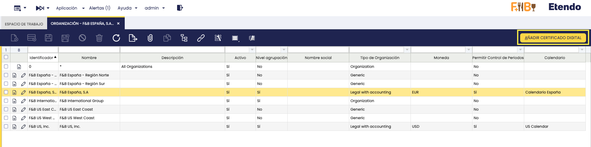

3. Haz clic en el botón **Añadir Certificado Digital**.
    
4. **Subir el Certificado**: En el proceso, podrás cargar tu certificado digital ingresando la clave correspondiente.

    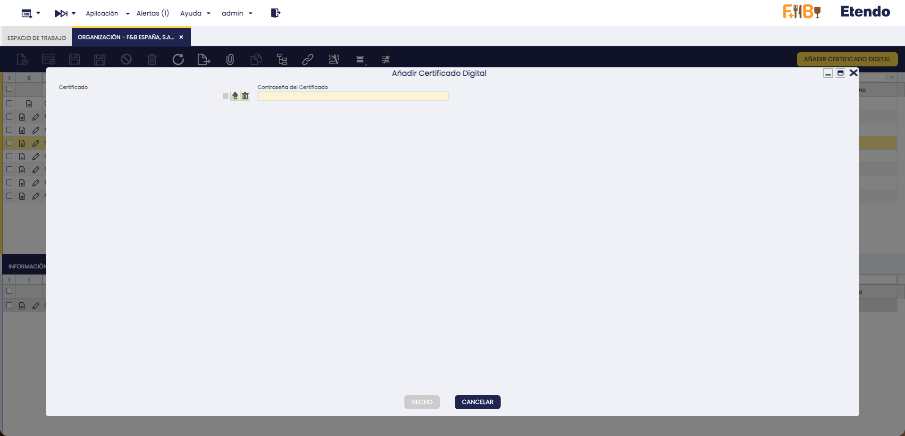

5. **Guardar la configuración**: Al presionar el botón **Hecho**, el sistema guardará la información del certificado digital en la solapa **Certificado Digital**.
    
    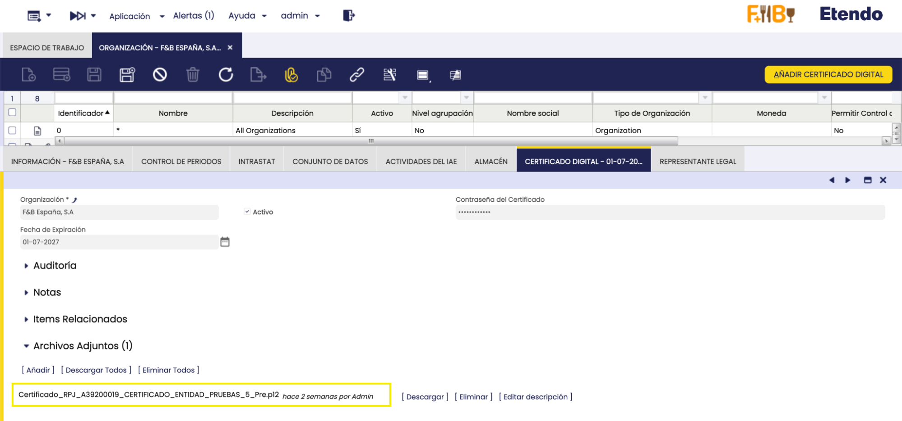

    Una vez completados estos pasos, el certificado digital estará correctamente configurado y listo para su uso en la emisión de facturas electrónicas.

### Rango Impuesto
:material-menu: `Aplicación` > `Gestión Financiera` > `Contabilidad` > `Configuración` > `Rango Impuesto`

En la ventana **Rango Impuesto**, debe completarse la información requerida para cada impuesto que se utilice al emitir facturas. Estos datos son necesarios para clasificar correctamente los impuestos según el régimen aplicable y el tipo de operación.

Se recomienda consultar con su asesor fiscal cuál es el régimen que corresponde, ya que puede variar en función de la actividad desarrollada.

- Para impuesto de aplicación IVA: **Régimen Especial IVA**

    | VALORES | DESCRIPCIÓN DE LA CLAVE DE RÉGIMEN PARA DESGLOSES DONDE EL IMPUESTO DE APLICACIÓN ES EL IVA |
    |---|---|
    | 01 | Operación de régimen general. |
    | 02 | Exportación. |
    | 03 | Operaciones a las que se aplique el régimen especial de bienes usados, objetos de arte, antigüedades y objetos de colección. |
    | 04 | Régimen especial del oro de inversión. |
    | 05 | Régimen especial de las agencias de viajes. |
    | 06 | Régimen especial grupo de entidades en IVA (Nivel Avanzado) |
    | 07 | Régimen especial del criterio de caja. |
    | 08 | Operaciones sujetas al IPSI / IGIC (Impuesto sobre la Producción, los Servicios y la Importación / Impuesto General Indirecto Canario). |
    | 09 | Facturación de las prestaciones de servicios de agencias de viaje que actúan como mediadoras en nombre y por cuenta ajena<br>(D.A.4ª RD1619/2012) |
    | 10 | Cobros por cuenta de terceros de honorarios profesionales o de derechos derivados de la propiedad industrial, de autor u otros por cuenta de sus socios, asociados o colegiados efectuados por sociedades, asociaciones, colegios profesionales u otras entidades que realicen estas funciones de cobro. |
    | 11 | Operaciones de arrendamiento de local de negocio. |
    | 14 | Factura con IVA pendiente de devengo en certificaciones de obra cuyo destinatario sea una Administración Pública. |
    | 15 | Factura con IVA pendiente de devengo en operaciones de tracto sucesivo. |
    | 17 | Operación acogida a alguno de los regímenes previstos en el Capítulo XI del Título IX (OSS e IOSS) |
    | 18 | Recargo de equivalencia. |
    | 19 | Operaciones de actividades incluidas en el Régimen Especial de Agricultura, Ganadería y Pesca (REAGYP) |
    | 20 | Régimen simplificado |

    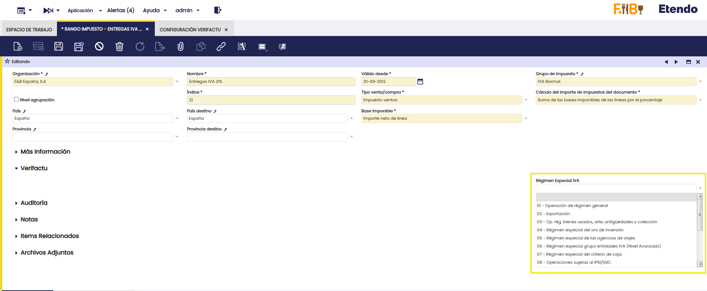


- Para impuesto de aplicación IGIC: **Régimen Especial IGIC**

    | VALORES | DESCRIPCIÓN DE LA CLAVE DE RÉGIMEN PARA DESGLOSES DONDE EL IMPUESTO DE APLICACIÓN ES EL IGIC |
    |---|---|
    | 01 | Operación de régimen general. |
    | 02 | Exportación. |
    | 03 | Operaciones a las que se aplique el régimen especial de bienes usados, objetos de arte, antigüedades y objetos de colección. |
    | 04 | Régimen especial del oro de inversión. |
    | 05 | Régimen especial de las agencias de viajes. |
    | 06 | Régimen especial grupo de entidades en IGIC (Nivel Avanzado) |
    | 07 | Régimen especial del criterio de caja. |
    | 08 | Operaciones sujetas al IPSI / IVA (Impuesto sobre la Producción, los Servicios y la Importación / Impuesto sobre el Valor Añadido). |
    | 09 | Facturación de las prestaciones de servicios de agencias de viaje que actúan como mediadoras en nombre y por cuenta ajena<br>(D.A.4ª RD1619/2012) |
    | 10 | Cobros por cuenta de terceros de honorarios profesionales o de derechos derivados de la propiedad industrial, de autor u otros por cuenta de sus socios, asociados o colegiados efectuados por sociedades, asociaciones, colegios profesionales u otras entidades que realicen estas funciones de cobro. |
    | 11 | Operaciones de arrendamiento de local de negocio. |
    | 14 | Factura con IGIC pendiente de devengo en certificaciones de obra cuyo destinatario sea una Administración Pública. |
    | 15 | Factura con IGIC pendiente de devengo en operaciones de tracto sucesivo. |
    | 17 | Régimen especial de comerciante minorista |
    | 18 | Régimen especial del pequeño empresario o profesional |
    | 19 | Operaciones interiores exentas por aplicación artículo 25 Ley 19/1994 |

    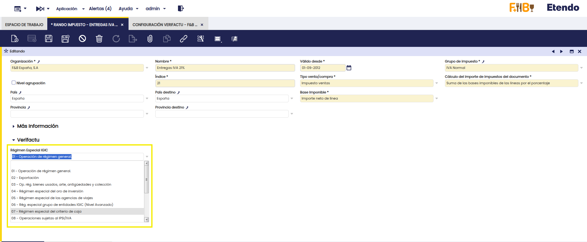

- Para impuesto de aplicación IPSI: **Régimen Especial IPSI**

    | VALORES | DESCRIPCIÓN DE LA CLAVE DE RÉGIMEN PARA DESGLOSES DONDE EL IMPUESTO DE APLICACIÓN ES EL IPSI |
    |---|---|
    | 01 | Operación de régimen general. |
    | 08 | Operaciones sujetas al IGIC / IVA (Impuesto General Indirecto Canario / Impuesto sobre el Valor Añadido). |
    | 11 | Operaciones de arrendamiento de local de negocio. |
    | 18 | Operaciones recogidas en el artículo 73.4 y 73.5 de la Ordenanza fiscal del IPSI (Sólo Ceuta). |
    | 19 | Operaciones interiores exentas. |
    | 20 | Régimen de estimación objetiva. |

    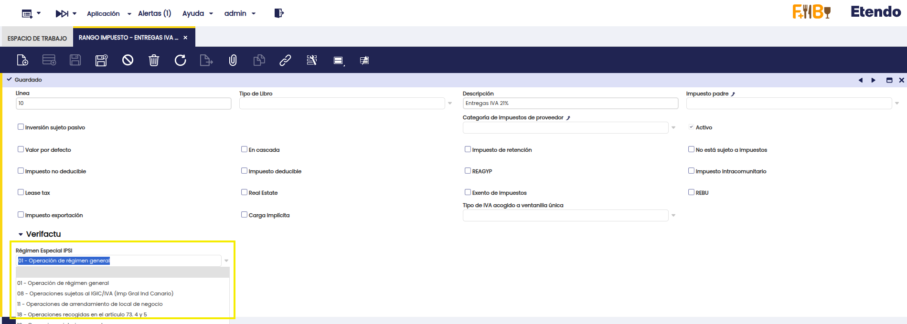


- Si no aplica impuesto: **Causa no Sujeción**
    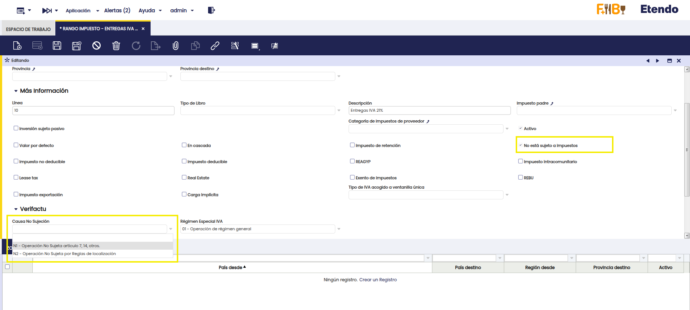

- Si está exento: **Causa de Exención**

    | VALORES | DESCRIPCIÓN |
    |---|---|
    | E1 | Exenta por el artículo 20 |
    | E2 | Exenta por el artículo 21 |
    | E3 | Exenta por el artículo 22 |
    | E4 | Exenta por los artículos 23 y 24 |
    | E5 | Exenta por el artículo 25 |
    | E6 | Exenta por otros |


    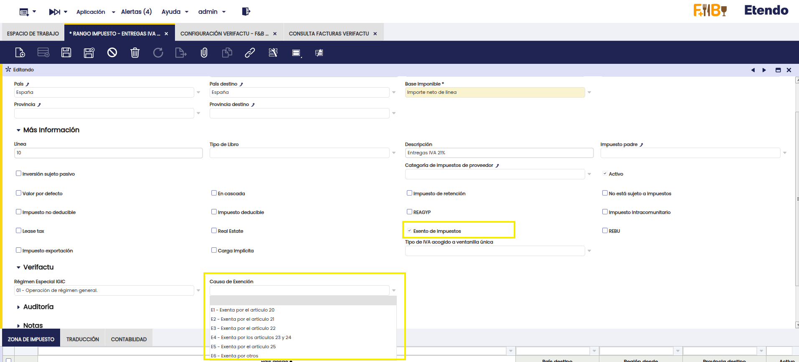

!!! note
    Si se utilizan recargos de equivalencia, basta con completar el campo en el impuesto principal. Por ejemplo, para el impuesto **Entregas IVA+RE 21+5.2%**, que incluye los subimpuestos **Entregas IVA+RE 21+5.2% (+21%)** y **Entregas IVA+RE 21+5.2% (+5.2%)**, solo es necesario rellenar el campo en el impuesto Entregas **IVA+RE 21+5.2% (+21%)**.


### Configuración para Procesos que Generan Facturas
:material-menu: `Aplicación` > `Gestión Financiera` > `Contabilidad` > `Configuración` > `Tipo de Documento`

Para enviar a *Verifactu* las facturas que se generan desde otros procesos (por ejemplo, procesos que **crean facturas directamente en estado Completado**), se debe **configurar previamente el Tipo de Documento**.


En la ventana **Tipo de Documento**, en el documento que se le asignará a la factura, se deben informar los campos de la sección **Verifactu**.  
Los siguientes campos son **obligatorios**:

- **Tipo de Factura**
- **Descripción de Operación**

    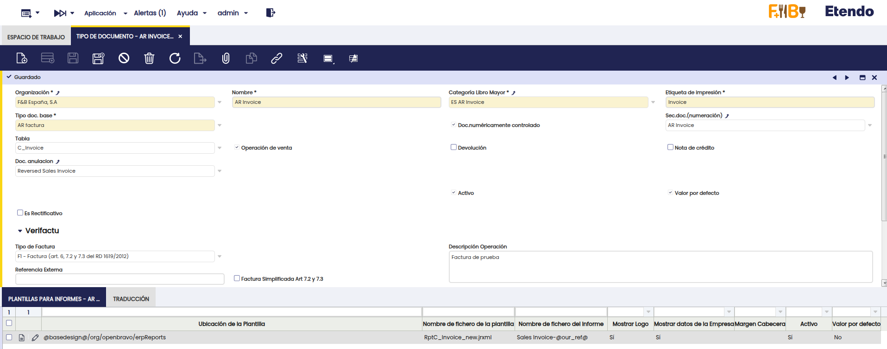

Los valores informados en esta configuración se utilizarán para generar el registro de facturación que posteriormente se enviará a *Verifactu*.

### Ajustes para Facturas Rectificativas por Sustitución o F3
Con los nuevos procedimientos de facturación introducidos por la AEAT, ya no es posible reactivar ni modificar una factura que ya haya sido emitida (completada y enviada a *Verifactu*). Para corregir errores en una factura previamente emitida, se incorpora el concepto de **Factura Rectificativa**, que se emite específicamente para corregir incidencias o rectificar datos de una factura anterior.
Por tanto, la utilización de esta funcionalidad requiere realizar determinados ajustes de configuración para garantizar que la información registrada y enviada sea correcta.

### Ajustes Contables

La emisión de una factura sustitutiva requiere ajustar los asientos contables, ya que los únicos datos contables que deben conservarse son los correspondientes a la factura que se crea para sustituir a la anterior.

Para ello, se ha desarrollado una plantilla contable que:

- Detecta la factura original relacionada.
- Copia sus apuntes contables.
- Genera los apuntes inversos (intercambiando Debe y Haber), anulando el impacto contable original.

### Configuración de la Plantilla Contable
:material-menu: `Aplicación` > `Gestión Financiera` > `Contabilidad` > `Configuración` > `Plantillas de Contabilidad`

En la ventana **Plantillas de Contabilidad**, crear un registro con los siguientes valores:

- **Entidad**: Cliente actual
- **Organización**: Organización raíz
- **Tabla**: `C_Invoice`
- **Nombre**: `Plantilla Contabilidad Verifactu`
- **Clase Java**: `com.etendoerp.verifactu.accounting.DocInvoiceVerifactu`


!!! note
    Si el sistema ya dispone de una plantilla de contabilidad, debe aplicar los cambios que tenía en su plantilla a la plantilla de contabilidad de *Verifactu*, ya que solo es posible tener configurada una única plantilla.

### Configuración de Esquema Contable
:material-menu: `Aplicación` > `Gestión Financiera` > `Contabilidad` > `Configuración` > `Esquema Contable`

En la ventana **Esquema Contable**, en la solapa **Tablas a Contabilizar**, localizar la tabla `Invoice` y vincularle la plantilla creada en el campo **Plantilla Contabilidad** (el campo puede estar oculto por lógica de aplicación).


### Cobro Cero

Cuando la **factura original** no ha sido cobrada, pero tiene un **plan de pagos** definido, al completar la **factura sustitutiva** el sistema genera automáticamente un **cobro cero** en la factura original.

Este cobro se registra en la **factura original** utilizando la **cuenta contable asociada al tercero**, con el objetivo de insertar el **concepto contable** necesario y dejar la factura original sin un plan de pagos activo. De este modo, el **único plan de pagos activo** queda vinculado a la **nueva factura sustitutiva**.

Para configurar este **concepto contable**, se debe acceder a la ventana :material-menu: `Aplicación` > `Gestión Financiera` > `Contabilidad` > `Configuración` > `Concepto Contable`, seleccionar la organización legal utilizada y, en la solapa **Contabilidad**, añadir un registro con el **esquema contable** y por último, completar el campo `Cuenta crédito` con la **cuenta asociada al tercero** utilizado.
    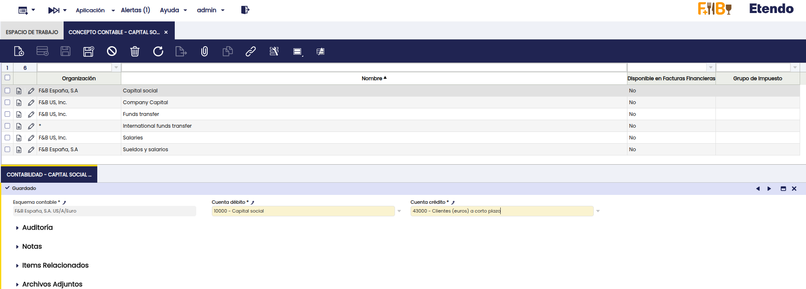


Esta cuenta es la que figura en la ventana :material-menu: `Aplicación` > `Datos Maestros` > `Terceros`, subsolapa **Contabilidad Cliente**, en el campo `Recibos de clientes` del esquema contable utilizado.
    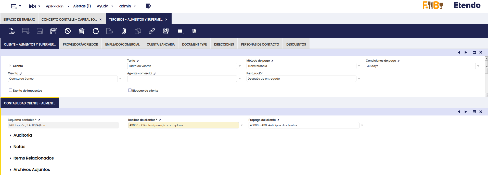


## Proceso de Envío a Verifactu

A continuación se detallan los pasos necesarios para que una factura se dé de alta en *Verifactu*.  

!!! note 
    Es importante aclarar que únicamente se envían a *Verifactu* las **facturas de venta**, facturas emitidas desde la ventana **Factura (Cliente)**.

### Creación de Factura Manualmente

Para iniciar el proceso, cree una factura de venta utilizando una organización que esté incluida en el árbol de organizaciones de aquella que ha sido configurada en la ventana :material-menu: `Aplicación` > `Gestión Financiera` > `Verifactu` > `Configuración Verifactu`.

Debe completar los siguientes campos obligatorios en la Factura:

  

- **Tipo de Factura**

    | VALORES | DESCRIPCIÓN |
    |---|---|
    | F1 | Factura (art. 6, 7.2 y 7.3 del RD 1619/2012) |
    | F2 | Factura simplificada y Facturas sin identificación del destinatario art. 6.1.d) RD 1619/2012 |
    | F3 | Factura emitida en sustitución de facturas simplificadas facturadas y declaradas |
    | R1 | Factura Rectificativa (Error fundado en derecho y Art. 80 Uno Dos y Seis LIVA) |
    | R2 | Factura Rectificativa (Art. 80.3) |
    | R3 | Factura Rectificativa (Art. 80.4) |
    | R4 | Factura Rectificativa (Resto) |
    | R5 | Factura Rectificativa en facturas simplificadas |

- **Descripción de la Operación**: Fecha en la que se ha realizado la operación.
- **Fecha de la Operación**: Descripción del objeto de la factura.

!!! note
    Si para un **Tipo de Documento** se emiten siempre facturas del **mismo tipo** o con la **misma descripción**, este proceso puede agilizarse rellenando una única vez estos campos en la ventana **Tipo de Documento**, correspondiente al documento utilizado por la factura.  

    Así, cada vez que se cree una factura con este documento, se rellenarán automáticamente los campos **Tipo de Factura** y **Descripción de la Operación**.

    


Opcionalmente, puede completar:

- **Referencia Externa**: Dato adicional de contenido libre con el objetivo de que se pueda asociar opcionalmente información interna del sistema informático de facturación al registro de facturación. Este dato puede ayudar a completar la identificación o calificación de la factura y/o su registro de facturación.
- **Factura Simplificada Art. 7.2 y 7.3**: Indicar cuando se trate de una factura simplificada emitida al amparo de lo previsto en los artículos 7.2 o 7.3 del Real Decreto [1619/2012](https://www.boe.es/buscar/act.php?id=BOE-A-2012-14696){target="_blank"}.
- **FacturaSinIdentifDestinatarioArt61d**: Indicar cuando se trate de una factura completa sin identificación del destinatario, de conformidad con lo dispuesto en el artículo 6.1.d del Real Decreto [1619/2012](https://www.boe.es/buscar/act.php?id=BOE-A-2012-14696){target="_blank"}.

#### Completar Factura de Venta

Al completar la factura:

- Se genera un archivo adjunto con el **Registro de Facturación (RF)**, que será utilizado para dar de **Alta** la factura en *Verifactu*.

    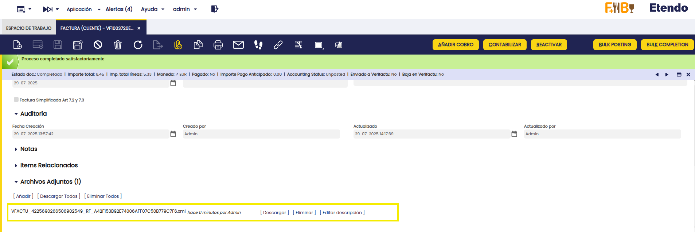

- Una vez generado el RF, un proceso automático (no requiere configuración previa y se activa automáticamente al instalar el módulo de *Verifactu*) se encargará de enviarlo a la **Agencia Tributaria**. Por defecto, este proceso se ejecuta cada *60 segundos*.

- El estado del envío puede consultarse en la solapa **Verifactu** de la factura o en la ventana **Monitor Verifactu** refrescando los datos.

    

### Creación Automática de Facturas de Venta

Para aquellas facturas de venta en estado **Completado** que se generen desde procesos externos al flujo manual de facturación, el sistema ejecuta automáticamente un proceso interno —habilitado por defecto tras la instalación del módulo *Verifactu* y sin necesidad de configuración previa— que **genera el registro de facturación** y **remite dicho registro de forma inmediata a Verifactu**, utilizando los datos configurados en el **Tipo de Documento**, tal como se describe en la sección [Configuración para Procesos que Generan Facturas](#configuracion-para-procesos-que-generan-facturas).  

!!! example

    1. Se crea un **Pedido de Venta**.
        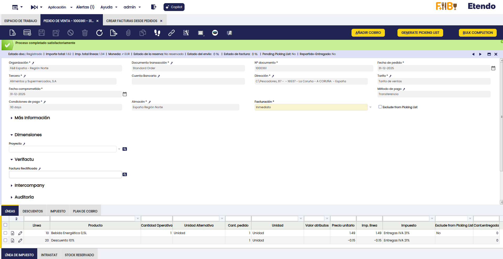
      
    2. Mediante el proceso **Crear Facturas Desde Pedidos** (o cualquier otro proceso utilizado para la generación de facturas), se genera la **Factura**, la cual tomará los datos configurados en el **Tipo de Documento** utilizado.
        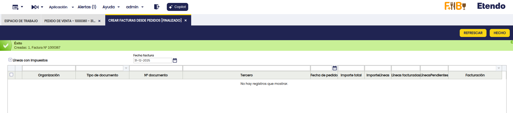

    3. Al quedar la factura en estado **Completado**, se genera el **registro de facturación** y se envía a *Verifactu*.
        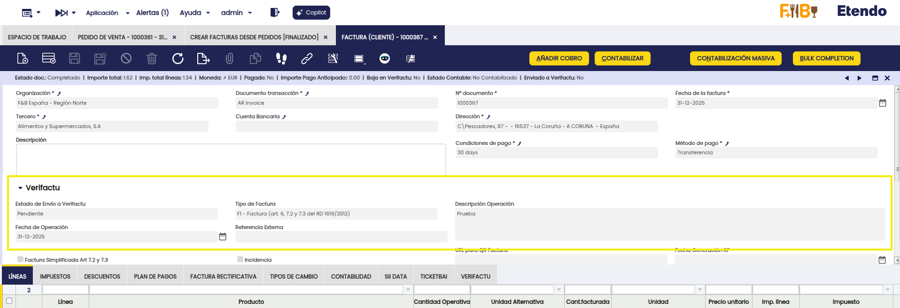

!!! warning  
    Es fundamental asegurar el cumplimiento de **todas las validaciones previas necesarias** para que la factura se envíe correctamente a *Verifactu*.  
    En este flujo automático **pueden no aplicarse** validaciones previas desarrolladas, lo que podría provocar el **rechazo** de la factura por parte de *Verifactu*.

## Proceso de Anulación de Factura

Según lo establecido en la normativa vigente (**RD 1007/2023**) y en las directrices de la Agencia Tributaria, el uso del sistema *Verifactu* en entornos de prueba está **restringido exclusivamente a fabricantes de Sistemas Informáticos de Facturación (SIF)** durante sus fases de desarrollo.

Por tanto, los **clientes finales deben operar únicamente en entorno productivo**, lo que implica que **toda factura emitida será tratada como real** y su **registro será enviado automáticamente a la Agencia Tributaria**. El uso del entorno de pruebas de *Verifactu* **no está permitido para entornos de demostración, usuarios finales o actividades de formación**.

En caso de necesitar realizar simulaciones en entorno productivo (por ejemplo, pruebas de funcionamiento o demostraciones), la Agencia Tributaria permite una operativa específica:

- Utilizar **series diferenciadas** (como `PRU-XXXXX`) para identificar las facturas de prueba.
- Añadir textos visibles que indiquen su carácter no real, como **DEMO** o **PRUEBA**.
- Generar de forma obligatoria el **registro de alta y su correspondiente registro de anulación**, enviados ambos a la AEAT.

Etendo implementa esta lógica de forma segura **exclusivamente en entornos de desarrollo**, permitiendo que las facturas se creen y anulen automáticamente como parte del flujo de testeo. **Este comportamiento no se encuentra disponible en entorno productivo**, donde las anulaciones deben gestionarse conforme al procedimiento fiscal establecido.

!!! info
    Para más información, consulta: [FAQs para desarrolladores Verifactu – Agencia Tributaria](https://www.agenciatributaria.es/static_files/AEAT_Desarrolladores/EEDD/IVA/VERI-FACTU/FAQs-Desarrolladores.pdf), apartado 11.


## Tratamiento de Errores en Facturación

Esta sección describe cómo actuar ante errores durante la emisión de facturas o registros de facturación (RF), conforme al *RD 1619/2012* y al *RD 1007/2023*.


### Subsanación 

**Sin Factura Rectificativa**

Debe utilizarse cuando el error afecta únicamente al `XML` (registro de facturación) y **no** al contenido de la factura original.

**Ejemplos comunes:**

- Hash incorrecto
- NIF no censado
- Error en el campo **ImporteTotal**

**Acción:**

1. Marcar el **check de Subsanación** en la factura.
2. Corregir los datos que ocasionaron el rechazo o se aceptó con errores.
3. El proceso automático genera un nuevo **Registro de Facturación** de **alta de subsanación** (`Subsanacion = "S"`) y lo enviará nuevamente.

    
    

    !!! warning
        No debe aplicarse subsanación si el error requiere una **factura rectificativa**, conforme al Reglamento de Facturación (ROF).


### Rectificación

**Con Factura Rectificativa**

Se utiliza cuando:

- El error afecta a elementos **patrimoniales**: base imponible, cuota, tipo de IVA, etc.
- La corrección es obligatoria conforme al *RD 1619/2012 (Reglamento de Facturación - ROF)*.

!!! info
    Puede consultar ejemplos sobre cómo proceder ante rectificaciones en el siguiente enlace: [Procedimientos de facturación](https://sede.agenciatributaria.gob.es/Sede/iva/sistemas-informaticos-facturacion-verifactu/preguntas-frecuentes/procedimientos-facturacion.html).


#### Claves Verifactu

Para crear una factura rectificativa, debe seleccionarse uno de los siguientes tipos, según corresponda:

- `R1`: Factura rectificativa (error fundado en derecho y Art. 80 Uno, Dos y Seis de la LIVA)
- `R2`: Factura rectificativa (Art. 80.3)
- `R3`: Factura rectificativa (Art. 80.4)
- `R4`: Factura rectificativa (otros casos)
- `R5`: Factura rectificativa en facturas simplificadas


#### Rectificación por diferencias

Se informa únicamente la **variación de importes** con respecto a la factura original.

**Acción:**  
Crear una nueva factura de venta utilizando un **tipo de documento para facturas rectificativas**, en una **serie distinta** a la original. Luego:

1. Seleccionar el tipo de factura correspondiente (`R1` a `R5`).
2. Indicar que se trata de una **Rectificativa por Diferencias**.
3. Enlazar la factura original en la solapa **Factura Rectificativa**.

    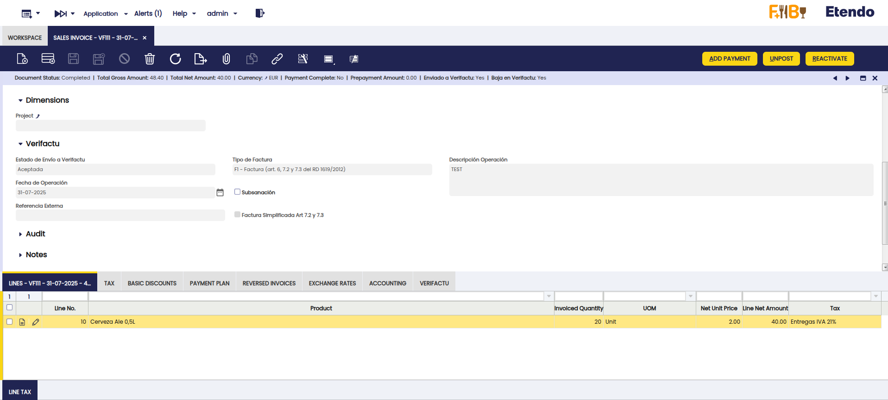  
      
    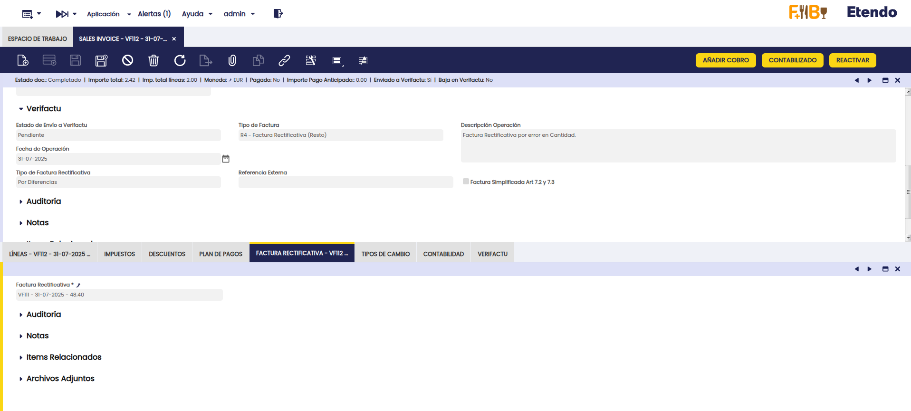

    !!! example
        En este ejemplo, la factura original declaraba 20 unidades del producto, pero en realidad se debían facturar 21. Por lo tanto, la factura rectificativa incluye una línea adicional por esa unidad faltante.

#### Rectificación por Sustitución

Se reemplaza por completo la factura original.

**Acción:**  
Crear una nueva factura de venta utilizando un **tipo de documento para facturas rectificativas**, en una **serie distinta** a la original. Luego:

1. Seleccionar el tipo de factura correspondiente (`R1` a `R5`).
2. Indicar que se trata de una **Rectificativa por Sustitución**.
3. Enlazar la factura original en la solapa **Factura Rectificativa**.

      
      
    

    !!! example
        En este ejemplo, la factura original incluía un producto incorrecto. Se genera una factura rectificativa **por sustitución** con el producto correcto y se ajusta la contabilidad para reflejar la operación correctamente.

#### Cobros Asociados

Si la factura que se está sustituyendo ya tiene cobros asociados, al enlazarla en la solapa **Factura Rectificativa** se mostrará una advertencia informando que se deben regularizar dichos cobros.

Para tener mayor control, se puede configurar una **alerta** para recibir información sobre facturas sustitutivas que tengan cobros relacionados en sus facturas enlazadas, utilizando la siguiente consulta:

```sql
SELECT DISTINCT ON (cir.C_Invoice_ID)
  cir.C_Invoice_ID AS referencekey_id,
  cir.documentno AS record_id,
  0 AS ad_role_id,
  NULL AS ad_user_id,
  cir.description AS description,
  'Y' AS isActive,
  cir.ad_org_id,
  cir.ad_client_id,
  now() AS created,
  0 AS createdBy,
  now() AS updated,
  0 AS updatedBy
FROM FIN_Payment_Schedule p
JOIN FIN_Payment_ScheduleDetail d 
  ON d.FIN_Payment_Schedule_Invoice = p.FIN_Payment_Schedule_id
JOIN c_invoice_Reverse r 
  ON r.reversed_c_invoice_id = p.C_Invoice_ID
JOIN (
  SELECT DISTINCT AD_ORG_ID, AD_GET_ORG_LE_BU(AD_ORG_ID, 'LE') AS LE_ORG_ID
  FROM c_invoice_reverse
) r_org ON r_org.AD_ORG_ID = r.ad_org_id
JOIN etvfac_verifactu_config v 
  ON v.AD_ORG_ID = r_org.LE_ORG_ID
JOIN C_Invoice ci 
  ON ci.C_Invoice_ID = p.C_Invoice_ID
JOIN C_Invoice cir 
  ON cir.C_Invoice_ID = r.C_Invoice_ID
WHERE p.created >= v.created
  AND ci.issotrx = 'Y'
  AND ci.processed = 'Y'
  AND (cir.em_etvfac_reverseinvtype = 'S' OR cir.em_etvfac_inv_type = 'F3')
  AND EXISTS (
    SELECT 1
    FROM FIN_Payment_ScheduleDetail d2
    WHERE d2.FIN_Payment_Schedule_Invoice = p.FIN_Payment_Schedule_id
      AND d2.em_etvfac_payment_zero = 'N'
      AND d2.FIN_Payment_Detail_ID IS NOT NULL
  )
```


!!! note
    Puede consultar más información sobre cómo crear una [Alerta](../../../basic-features/general-setup/application/alert.md)

### Rectificaciones desde Pedidos de Venta o Devolución de Cliente

Se pueden generar **facturas rectificativas** a partir de un **Pedido de Venta** o una **Devolución de Cliente**.  

Para hacerlo:

1. Seleccionar un tipo de documento rectificativo, en el **tipo de documento** del pedido o la devolución, seleccionar uno configurado como **rectificativo** (es decir, que tenga marcado el check **Es Rectificativo**).

2. Completar los campos de la sección **Verifactu** del **documento** indicando el **tipo de rectificación** que se usará.

3. Indicar la factura a rectificar. En la sección **Verifactu** del pedido o la devolución, completar el campo **Factura Rectificada** con la **factura original** que se va a rectificar.

Con esta configuración, al **generar la factura** desde el pedido o la devolución, el sistema emitirá automáticamente una **factura rectificativa**, utilizando la configuración definida en el **tipo de documento**.

## Consulta del Estado de Envío de Facturas

Existen dos ventanas desde las cuales es posible consultar el estado de envío de una factura. La principal diferencia entre ambas es que una **obtiene la información almacenada en el sistema**, mientras que la otra realiza la consulta **directamente contra los datos de la **Agencia Tributaria.

### Monitor Verifactu
:material-menu: `Aplicación` > `Gestión Financiera` > `Verifactu` > `Monitor Verifactu`

Permite consultar facturas en estado Rechazada, Parcialmente Aceptada, Aceptada e Inválida. Los tres primeros estados provienen de la AEAT; el último indica errores previos. Se debe pulsar Refrescar Datos para obtener los últimos registros.

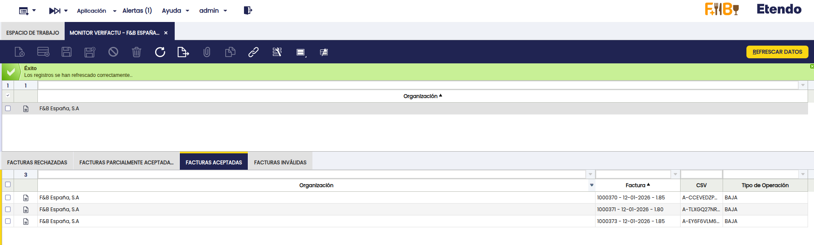

### Consulta Facturas Verifactu
:material-menu: `Aplicación` > `Gestión Financiera` > `Verifactu` > `Consulta Facturas Verifactu`

Este proceso permite obtener un **informe detallado de las facturas enviadas a Verifactu**, ofreciendo múltiples opciones de filtrado para facilitar la consulta:

- **Emisor**
- **Período**
- **Número de serie**
- **Fechas**
- **Tercero**

Cuando el resultado de la consulta **supera los 10.000 registros**, es posible aplicar **paginación** utilizando como referencia la **última factura consultada**. Para ello, se deben informar los siguientes campos:

- **Emisor**: Número de Identificación Fiscal (NIF) del obligado a expedir la factura correspondiente al **último registro consultado**.
- **Número de Serie**: Número de serie y número de factura que identifican el **último registro de facturación consultado**.
- **Fecha de Emisión**: Fecha de emisión del **último registro de facturación consultado**.

  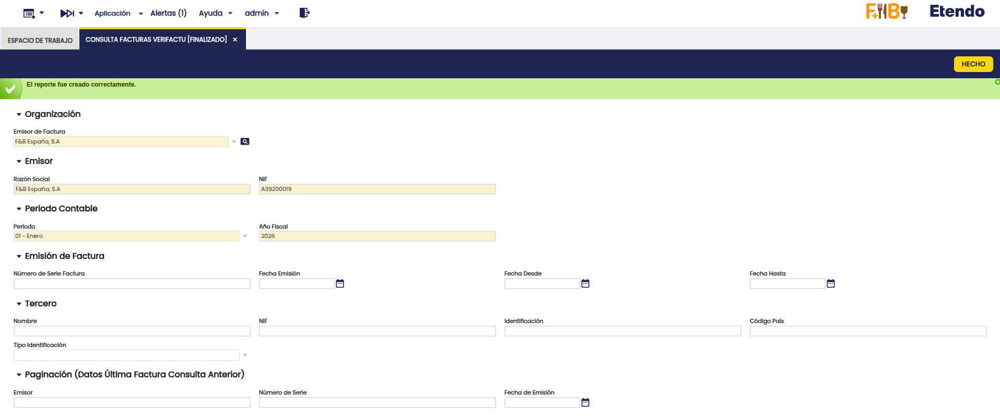


## QR Tributario

Al imprimir una factura, se incorpora un **código QR** diseñado para facilitar la verificación de su emisión y registro ante la Agencia Tributaria (AEAT).

### Beneficios

- **Verificación por el receptor:** permite comprobar si la factura ha sido efectivamente enviada a la AEAT a través del sistema *Verifactu*.
- **Transparencia fiscal:** incrementa la confianza del cliente y contribuye a la prevención del fraude.
- **Integridad documental:** garantiza la inalterabilidad y trazabilidad de las facturas una vez emitidas.

  

### Resultados Posibles al Escanear el QR

- **Factura encontrada en AEAT:**
  
  

- **Factura no encontrada en AEAT:**
  
  


## Desinstalar el Módulo

Para desinstalar el módulo y evitar futuros problemas con registros huérfanos, se debe seguir una secuencia de pasos:

1. Ejecute la siguiente consulta en la base de datos del entorno

  ```
  DELETE FROM c_attachment_conf WHERE c_attachment_method_id = 'E30F0DBF1C164251B6163AA6B078F2AD';
  ```

2. Una vez finalizada correctamente la consulta, [elimine el módulo](../../../../../developer-guide/etendo-classic/developer-tools/etendo-gradle-plugin.md#uninstall-modules-uninstallmodule) siguiendo el procedimiento correspondiente al método de instalación (Sources/JARs)

---
This work is licensed under :material-creative-commons: :fontawesome-brands-creative-commons-by: :fontawesome-brands-creative-commons-sa: [ CC BY-SA 2.5 ES](https://creativecommons.org/licenses/by-sa/2.5/es/){target="_blank"} by [Futit Services S.L](https://etendo.software){target="_blank"}.

