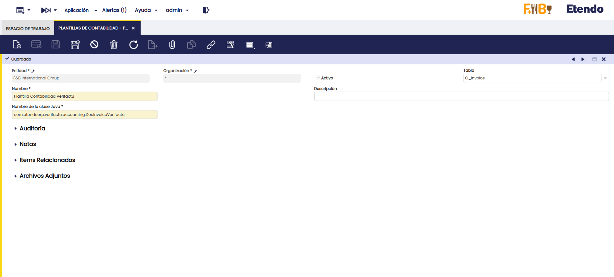

---
tags:
- Localización Española
- Veri*Factu
- Verifactu
- Facturación Electrónica

title: Veri*Factu
---

:octicons-package-16: Javapackage: `com.etendoerp.verifactu`
:octicons-package-16: Javapackage: `com.etendoerp.verifactu.template`

## Introducción

<iframe width="560" height="315" src="https://www.youtube.com/embed/bOCK7A1cFms?si=VAfNntVPqse58GnU" title="YouTube video player" frameborder="0" allow="accelerometer; autoplay; clipboard-write; encrypted-media; gyroscope; picture-in-picture; web-share" referrerpolicy="strict-origin-when-cross-origin" allowfullscreen></iframe>

Las funcionalidades de **VERI*FACTU** en Etendo proporcionan una solución integral para el cumplimiento de los nuevos requisitos establecidos por la Agencia Tributaria Española en materia de facturación. Su objetivo es garantizar la transparencia, prevenir el fraude fiscal y asegurar la integridad y trazabilidad de las facturas emitidas por empresas y profesionales.

VERI*FACTU forma parte del marco legal derivado del Real Decreto 1007/2023 y la Ley Antifraude (Ley 11/2021), que establecen la obligatoriedad de utilizar sistemas informáticos de facturación que cumplan con criterios técnicos específicos. Permite el envío automático y en tiempo real de los registros de facturación a la Agencia Tributaria.

Este módulo permite a Etendo automatizar procesos clave como la generación, el registro estructurado y el envío electrónico de facturas, cumpliendo con los estándares de VERI*FACTU. El sistema garantiza la inalterabilidad de los datos, la inclusión de códigos QR y la generación de eventos asociados, aportando total trazabilidad a cada operación registrada.

## Descripción del Módulo

El módulo permite:

- Generar automáticamente los archivos XML de registro de facturación al emitir una factura, conforme a la estructura exigida por la AEAT.
- Enviar estos archivos en tiempo real a la Agencia Tributaria.
- Recibir las respuestas electrónicas de la AEAT con el resultado del procesamiento.
- Incluir en las facturas los códigos QR y la marca "VERI*FACTU" exigidos por la normativa.
- Consultar un historial detallado de todos los registros enviados, incluyendo sus estados de validación por parte de la AEAT.

La implementación cubre:

1. **Cumplimiento** técnico de los requisitos de VERI*FACTU.  
2. **Automatización** del envío de registros desde el ERP a la AEAT.  
3. **Integración** con la generación de facturas en Etendo.  
4. **Trazabilidad** y **control** del proceso de facturación, con registro de errores, rechazos y confirmaciones.  
5. **Generación** de códigos QR compatibles con el visor de la AEAT.

## Contenido del Módulo

### Ventanas nuevas

- **Configuración Verifactu**: permite configurar emisores, seleccionar el impuesto aplicable (IVA, IPSI o IGIC), y definir valores por defecto como descripción o referencia externa.

- **Monitor Verifactu**: permite consultar facturas en estado **Rechazada**, **Parcialmente Aceptada**, **Aceptada** e **Inválida**. Los tres primeros estados provienen de la AEAT; el último indica errores previos. Se debe pulsar **Refrescar Datos** para obtener los últimos registros.

- **Consulta Facturas Verifactu**: permite obtener un informe de las facturas enviadas, con posibilidad de filtrar por emisor, período, número de serie, fechas o tercero. Si el resultado supera los 10.000 registros, se puede aplicar paginación utilizando la clave del último registro consultado. A diferencia del Monitor Verifactu, los datos de este informe provienen directamente de la Agencia Tributaria.

### Nuevos campos

- Se añaden campos y pestañas específicas de Verifactu en las ventanas **Factura(Cliente)** y **Rango de Impuesto**.

## Configuración

### Configuración Verifactu

- **Organización**: entidad legal emisora.
- **Impuesto de Aplicación**: IVA, IPSI o IGIC.
- **QR por Defecto**: si se marca, se utilizará una implementación predefinida. En caso contrario, deberá personalizarse el reporte siguiendo [esta especificación](https://www.agenciatributaria.es/static_files/AEAT_Desarrolladores/EEDD/IVA/VERI-FACTU/DetalleEspecificacTecnCodigoQRfactura.pdf).
- **Descripción por Defecto** y **Referencia Externa por Defecto**: valores opcionales que se completarán automáticamente al crear una factura.

### Certificado Digital

Para poder emitir facturas electrónicas a través del sistema VeriFactu, es indispensable contar con un certificado digital. Este certificado asegura la autenticidad de la identidad del emisor de la factura y garantiza que los datos transmitidos no hayan sido alterados durante su envío. Siga los siguientes pasos para configurar correctamente su Certificado Digital:

1. **Acceder a la ventana Organización**: :material-menu: `Aplicación` > `Configuración General` > `Organización` > `Organización`
2. **Seleccionar la Organización Legal**: Elige la organización legal que será responsable de emitir las facturas electrónicas.
3. **Añadir el Certificado Digital**: Haz clic en el botón **Añadir Certificado Digital**.
4. **Subir el Certificado**: En el proceso, podrás cargar tu certificado digital, ingresar la clave correspondiente y especificar la fecha de validez del certificado.
5. **Guardar la configuración**: Al presionar el botón **"Hecho"**, el sistema guardará la información del certificado digital en la solapa **Certificado Digital**.

Una vez completados estos pasos, el certificado digital estará correctamente configurado y listo para su uso en la emisión de facturas electrónicas.

### Rango Impuesto

:material-menu: `Aplicación` > `Gestión Financiera` > `Contabilidad` > `Configuración` > `Rango Impuesto` se deben completar los campos correspondientes:

- Para IVA: `Régimen Especial IVA`  
- Para IGIC: `Régimen Especial IGIC`  
- Si no aplica impuesto: `Causa no Sujeción`  
- Si está exento: `Causa de Exención`


### Ajustes para Facturas Rectificativas por Sustitución o F3

### Ajustes contables

La emisión de una factura sustitutiva requiere ajustar los asientos contables.

Para ello, se ha desarrollado una plantilla contable que:

- Detecta la factura original relacionada.
- Copia sus apuntes contables.
- Genera los apuntes inversos (intercambiando Debe y Haber), anulando el impacto contable original.

### Configuración de la plantilla contable

1. :material-menu: `Aplicación` > `Gestión Financiera` > `Contabilidad` > `Configuración` > `Plantillas de Contabilidad`, crear un registro con los siguientes valores:

    - **Entidad**: Cliente actual
    - **Organización**: Organización raíz
    - **Tabla**: `C_Invoice`
    - **Nombre**: `Plantilla Contabilidad Verifactu`
    - **Clase Java**: `com.etendoerp.verifactu.accounting.DocInvoiceVerifactu`

    

2. :material-menu: `Aplicación` > `Gestión Financiera` > `Contabilidad` > `Configuración` > `Esquema Contable`, solapa **Tablas a Contabilizar**, localizar la tabla `Invoice` y vincularle la plantilla creada en el campo **Plantilla Contabilidad** (el campo puede estar oculto por lógica de aplicación).

   

### Cobro Cero

Cuando la factura original no ha sido cobrada, pero tiene un plan de pagos definido, el sistema genera automáticamente un **cobro cero** al completar la factura sustitutiva. Este cobro se realiza en la factura original, utilizando la cuenta contable asociada al tercero para insertar un concepto contable. Así, el único plan de pagos activo queda vinculado a la nueva factura sustitutiva.

### Cobros Asociados

Si la factura que se está sustituyendo ya tiene cobros asociados, al enlazarla en la solapa **Factura Rectificativa** se mostrará una advertencia informando que se deben regularizar dichos cobros.

Para tener mayor control, se puede configurar una **alerta** para recibir información sobre facturas sustitutivas que tengan cobros relacionados en sus facturas enlazadas, utilizando la siguiente consulta:

```sql
SELECT DISTINCT ON (cir.C_Invoice_ID)
  cir.C_Invoice_ID AS referencekey_id,
  cir.documentno AS record_id,
  0 AS ad_role_id,
  NULL AS ad_user_id,
  cir.description AS description,
  'Y' AS isActive,
  cir.ad_org_id,
  cir.ad_client_id,
  now() AS created,
  0 AS createdBy,
  now() AS updated,
  0 AS updatedBy
FROM FIN_Payment_Schedule p
JOIN FIN_Payment_ScheduleDetail d 
  ON d.FIN_Payment_Schedule_Invoice = p.FIN_Payment_Schedule_id
JOIN c_invoice_Reverse r 
  ON r.reversed_c_invoice_id = p.C_Invoice_ID
JOIN (
  SELECT DISTINCT AD_ORG_ID, AD_GET_ORG_LE_BU(AD_ORG_ID, 'LE') AS LE_ORG_ID
  FROM c_invoice_reverse
) r_org ON r_org.AD_ORG_ID = r.ad_org_id
JOIN etvfac_verifactu_config v 
  ON v.AD_ORG_ID = r_org.LE_ORG_ID
JOIN C_Invoice ci 
  ON ci.C_Invoice_ID = p.C_Invoice_ID
JOIN C_Invoice cir 
  ON cir.C_Invoice_ID = r.C_Invoice_ID
WHERE p.created >= v.created
  AND ci.issotrx = 'Y'
  AND ci.processed = 'Y'
  AND (cir.em_etvfac_reverseinvtype = 'S' OR cir.em_etvfac_inv_type = 'F3')
  AND EXISTS (
    SELECT 1
    FROM FIN_Payment_ScheduleDetail d2
    WHERE d2.FIN_Payment_Schedule_Invoice = p.FIN_Payment_Schedule_id
      AND d2.em_etvfac_payment_zero = 'N'
      AND d2.FIN_Payment_Detail_ID IS NOT NULL
  )
```


## Proceso de Envío de Factura

### Creación de Factura de Venta

Para iniciar el proceso, cree una factura de venta utilizando una organización que esté incluida en el árbol de organizaciones de aquella que ha sido configurada en la ventana :material-menu: `Aplicación` > `Verifactu` > `Configuración Verifactu`.

Debe completar los siguientes campos obligatorios:

- **Tipo de Factura**
- **Descripción de la Operación**
- **Fecha de la Operación**

Opcionalmente, puede completar:

- **Referencia Externa**: Dato adicional de contenido libre con el objetivo de que se pueda asociar opcionalmente información interna del sistema informático de facturación al registro de facturación. Este dato puede ayudar a completar la identificación o calificación de la factura y/o su registro de facturación.
- **Factura Simplificada Art. 7.2 y 7.3** (RD 1619/2012)


---

### Completar Factura de Venta

Al completar la factura:

- Se genera un archivo adjunto con el **Registro de Facturación (RF)**, que será utilizado para dar de **Alta** la factura en VERI*FACTU.


- Una vez generado el RF, un proceso automático se encargará de enviarlo a la Agencia Tributaria. Por defecto, este proceso se ejecuta cada 60 segundos.

- El estado del envío puede consultarse en la solapa **Verifactu** de la factura o en la ventana **Monitor Verifactu** refrescando los datos.


---

### Proceso de Anulación de Factura

Existe una funcionalidad para **anular una factura** ya enviada a Verifactu, aunque **solo está disponible en entornos de desarrollo**.

Esto se debe a que cualquier factura emitida en un entorno productivo será enviada automáticamente a la Agencia Tributaria. Por este motivo, la funcionalidad de anulación está pensada únicamente para pruebas: luego del alta, la factura se dará de **baja** automáticamente como parte del flujo de testeo.

---

### Tratamiento de Errores en Facturación

Esta sección describe cómo actuar ante errores durante la emisión de facturas o registros de facturación (RF), conforme al RD 1619/2012 y al RD 1007/2023.

---

### Tipos de Tratamiento de Errores

### Subsanación (sin factura rectificativa)

Debe utilizarse cuando:

- El error afecta únicamente al XML (registro de facturación) y **no** al contenido de la factura original.

**Ejemplos comunes:**

- Hash incorrecto
- NIF no censado
- Error en el campo `ImporteTotal`

**Acción:**

1. Marcar el **check de Subsanación** en la factura.
2. Corregir los datos que ocasionaron el rechazo o se acepto con errores.
3. El proceso automático generará un nuevo **Registro de Facturación** de **alta de subsanación** (`Subsanacion = "S"`) y lo enviará nuevamente.


> **Importante:** No debe aplicarse subsanación si el error requiere una **factura rectificativa**, conforme al Reglamento de Facturación (ROF).


### Rectificación (con factura rectificativa)

Se utiliza cuando:

- El error afecta a elementos **patrimoniales**: base imponible, cuota, tipo de IVA, etc.
- La corrección es obligatoria conforme al RD 1619/2012 (Reglamento de Facturación - ROF).

### Claves VERI*FACTU

Para crear una factura rectificativa, debe seleccionarse uno de los siguientes tipos, según corresponda:

- `R1`: Factura rectificativa (error fundado en derecho y Art. 80 Uno, Dos y Seis de la LIVA)
- `R2`: Factura rectificativa (Art. 80.3)
- `R3`: Factura rectificativa (Art. 80.4)
- `R4`: Factura rectificativa (otros casos)
- `R5`: Factura rectificativa en facturas simplificadas

---

### Rectificación por Diferencias

- Se informa únicamente la **variación de importes** con respecto a la factura original.

**Acción:**  
Crear una nueva factura de venta utilizando un **tipo de documento para facturas rectificativas**, en una **serie distinta** a la original. Luego:

1. Seleccionar el tipo de factura correspondiente (`R1` a `R5`).
2. Indicar que se trata de una **Rectificativa por Diferencias**.
3. Enlazar la factura original en la solapa **Factura Rectificativa**.

  
  


> En este ejemplo, la factura original declaraba 20 unidades del producto, pero en realidad se debían facturar 21. Por lo tanto, la factura rectificativa incluye una línea adicional por esa unidad faltante.

---

### Rectificación por Sustitución

- Se reemplaza por completo la factura original.

**Acción:**  
Crear una nueva factura de venta utilizando un **tipo de documento para facturas rectificativas**, en una **serie distinta** a la original. Luego:

1. Seleccionar el tipo de factura correspondiente (`R1` a `R5`).
2. Indicar que se trata de una **Rectificativa por Sustitución**.
3. Enlazar la factura original en la solapa **Factura Rectificativa**.

  
  


> En este ejemplo, la factura original incluía un producto incorrecto. Se genera una factura rectificativa **por sustitución** con el producto correcto y se ajusta la contabilidad para reflejar la operación correctamente.

---

## QR Tributario

Al imprimir una factura, se incorpora un **código QR** diseñado para facilitar la verificación de su emisión y registro ante la Agencia Tributaria (AEAT).

### Beneficios

- **Verificación por el receptor:** permite comprobar si la factura ha sido efectivamente enviada a la AEAT a través del sistema VERI*FACTU.
- **Transparencia fiscal:** incrementa la confianza del cliente y contribuye a la prevención del fraude.
- **Integridad documental:** garantiza la inalterabilidad y trazabilidad de las facturas una vez emitidas.
  

### Resultados posibles al escanear el QR

- **Factura encontrada en AEAT:**
  

- **Factura no encontrada en AEAT:**
  
