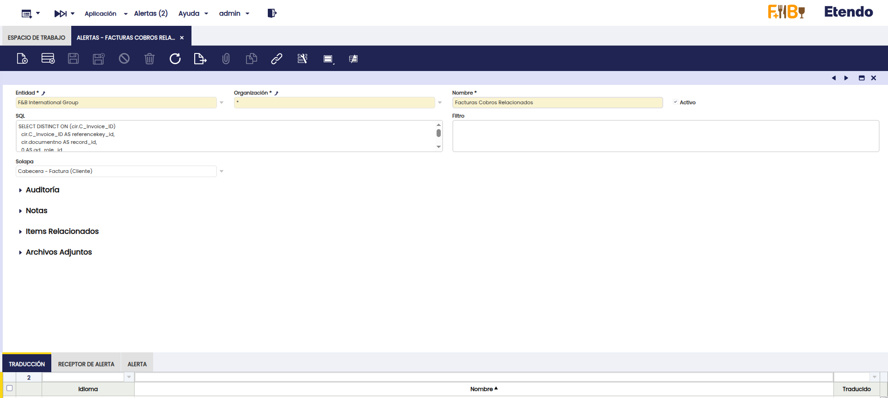
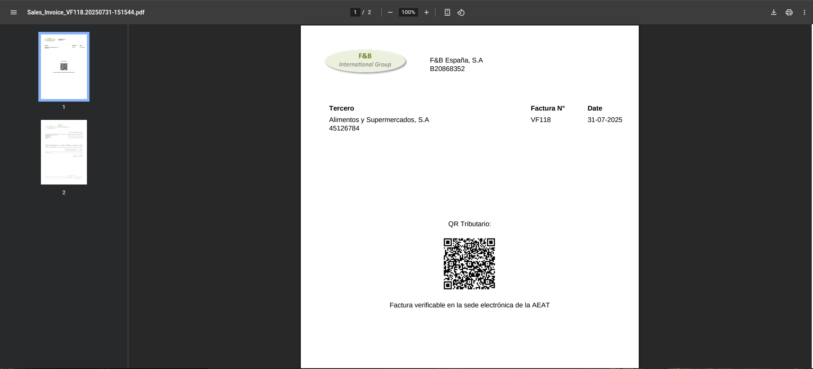

---
tags:
- Localización Española
- Veri*Factu
- Verifactu
- Facturación Electrónica

title: Veri*Factu
---

:octicons-package-16: Javapackage: `com.etendoerp.verifactu`

:octicons-package-16: Javapackage: `com.etendoerp.verifactu.template`

## Introducción

<iframe width="560" height="315" src="https://www.youtube.com/embed/bOCK7A1cFms?si=VAfNntVPqse58GnU" title="YouTube video player" frameborder="0" allow="accelerometer; autoplay; clipboard-write; encrypted-media; gyroscope; picture-in-picture; web-share" referrerpolicy="strict-origin-when-cross-origin" allowfullscreen></iframe>

Las funcionalidades de **VERI*FACTU** en Etendo proporcionan una solución integral para el cumplimiento de los nuevos requisitos establecidos por la Agencia Tributaria Española en materia de facturación. Su objetivo es garantizar la transparencia, prevenir el fraude fiscal y asegurar la integridad y trazabilidad de las facturas emitidas por empresas y profesionales.

VERI*FACTU forma parte del marco legal derivado del Real Decreto 1007/2023 y la Ley Antifraude (Ley 11/2021), que establecen la obligatoriedad de utilizar sistemas informáticos de facturación que cumplan con criterios técnicos específicos. Permite el envío automático y en tiempo real de los registros de facturación a la Agencia Tributaria.

Este módulo permite a Etendo automatizar procesos clave como la generación, el registro estructurado y el envío electrónico de facturas, cumpliendo con los estándares de VERI*FACTU. El sistema garantiza la inalterabilidad de los datos, la inclusión de códigos QR y la generación de eventos asociados, aportando total trazabilidad a cada operación registrada.

## Descripción del Módulo

El módulo permite:

- Generar automáticamente los archivos XML de registro de facturación al emitir una factura, conforme a la estructura exigida por la AEAT.
- Enviar estos archivos en tiempo real a la Agencia Tributaria.
- Recibir las respuestas electrónicas de la AEAT con el resultado del procesamiento.
- Incluir en las facturas los códigos QR y la marca **VERI*FACTU** exigidos por la normativa.
- Consultar un historial detallado de todos los registros enviados, incluyendo sus estados de validación por parte de la AEAT.

La implementación cubre:

1. **Cumplimiento** técnico de los requisitos de VERI*FACTU.  
2. **Automatización** del envío de registros desde el ERP a la AEAT.  
3. **Integración** con la generación de facturas en Etendo.  
4. **Trazabilidad** y **control** del proceso de facturación, con registro de errores, rechazos y confirmaciones.  
5. **Generación** de códigos QR compatibles con el visor de la AEAT.

## Contenido del Módulo

### Ventanas nuevas

- **Configuración Verifactu**: permite configurar emisores, seleccionar el impuesto aplicable (IVA, IPSI o IGIC) y monitorear incidencias en los envíos.

- **Monitor Verifactu**: permite consultar facturas en estado **Rechazada**, **Parcialmente Aceptada**, **Aceptada** e **Inválida**. Los tres primeros estados provienen de la AEAT; el último indica errores previos. Se debe pulsar **Refrescar Datos** para obtener los últimos registros.

- **Consulta Facturas Verifactu**: permite obtener un informe de las facturas enviadas, con posibilidad de filtrar por emisor, período, número de serie, fechas o tercero. Si el resultado supera los 10.000 registros, se puede aplicar paginación utilizando la clave del último registro consultado. A diferencia del Monitor Verifactu, los datos de este informe provienen directamente de la Agencia Tributaria.

### Nuevos campos

- Se añaden campos y pestañas específicas de Verifactu en las ventanas **Factura (Cliente)**, **Rango de Impuesto**, **Tipo de Documento**, **Pedido de Venta**.

!!! warning
    Al utilizar este módulo, se restringirán las siguientes funcionalidades:

    - Reactivación de facturas.
    - Anulación de facturas.
    - Eliminación de facturas, pedidos o albaranes (incluso en estado borrador).
    - Modificación del Rango de un impuesto ya creado.
    - Configuración simultánea para un mismo emisor de:
      - Verifactu + SII
      - Verifactu + TBAI  
      > Nota: la combinación SII + TBAI sí está permitida.
    - Eliminación de registros de facturación Verifactu y de su respuesta asociada (deben conservarse copias de seguridad de los registros y de las llamadas/respuestas XML durante el plazo legal correspondiente).

## Configuración

!!! info
    Se recomienda que las siguientes configuraciones sean realizadas por un usuario con rol **administrador**, ya que requieren ajustes técnicos.

### Configuración Verifactu

- **Organización**: entidad legal emisora.
- **Impuesto de Aplicación**: IVA, IPSI o IGIC.
- **QR por Defecto**: si se marca, se utilizará una implementación predefinida. En caso contrario, deberá personalizarse el reporte siguiendo [esta especificación](https://www.agenciatributaria.es/static_files/AEAT_Desarrolladores/EEDD/IVA/VERI-FACTU/DetalleEspecificacTecnCodigoQRfactura.pdf){target="_blank"}.

### Certificado Digital

Para poder emitir facturas electrónicas a través del sistema VeriFactu, es indispensable contar con un certificado digital. Este certificado asegura la autenticidad de la identidad del emisor de la factura y garantiza que los datos transmitidos no hayan sido alterados durante su envío. Siga los siguientes pasos para configurar correctamente su Certificado Digital:

1. **Acceder a la ventana Organización**: :material-menu: `Aplicación` > `Configuración General` > `Organización` > `Organización`
2. **Seleccionar la Organización Legal**: Elige la organización legal que será responsable de emitir las facturas electrónicas.
3. **Añadir el Certificado Digital**: Haz clic en el botón **Añadir Certificado Digital**.
4. **Subir el Certificado**: En el proceso, podrás cargar tu certificado digital ingresando la clave correspondiente.
5. **Guardar la configuración**: Al presionar el botón **Hecho**, el sistema guardará la información del certificado digital en la solapa **Certificado Digital**.

Una vez completados estos pasos, el certificado digital estará correctamente configurado y listo para su uso en la emisión de facturas electrónicas.

### Rango Impuesto

En la ventana :material-menu: `Aplicación` > `Gestión Financiera` > `Contabilidad` > `Configuración` > `Rango Impuesto`, se deben completar los siguientes campos, necesarios para clasificar los impuestos según el régimen y el tipo de operación:

- Para impuesto de aplicación IVA: `Régimen Especial IVA`

  | VALORES | DESCRIPCIÓN DE LA CLAVE DE RÉGIMEN PARA DESGLOSES DONDE EL IMPUESTO DE APLICACIÓN ES EL IVA |
  |---|---|
  | 01 | Operación de régimen general. |
  | 02 | Exportación. |
  | 03 | Operaciones a las que se aplique el régimen especial de bienes usados, objetos de arte, antigüedades y objetos de colección. |
  | 04 | Régimen especial del oro de inversión. |
  | 05 | Régimen especial de las agencias de viajes. |
  | 06 | Régimen especial grupo de entidades en IVA (Nivel Avanzado) |
  | 07 | Régimen especial del criterio de caja. |
  | 08 | Operaciones sujetas al IPSI / IGIC (Impuesto sobre la Producción, los Servicios y la Importación / Impuesto General Indirecto Canario). |
  | 09 | Facturación de las prestaciones de servicios de agencias de viaje que actúan como mediadoras en nombre y por cuenta ajena<br>(D.A.4ª RD1619/2012) |
  | 10 | Cobros por cuenta de terceros de honorarios profesionales o de derechos derivados de la propiedad industrial, de autor u otros por cuenta de sus socios, asociados o colegiados efectuados por sociedades, asociaciones, colegios profesionales u otras entidades que realicen estas funciones de cobro. |
  | 11 | Operaciones de arrendamiento de local de negocio. |
  | 14 | Factura con IVA pendiente de devengo en certificaciones de obra cuyo destinatario sea una Administración Pública. |
  | 15 | Factura con IVA pendiente de devengo en operaciones de tracto sucesivo. |
  | 17 | Operación acogida a alguno de los regímenes previstos en el Capítulo XI del Título IX (OSS e IOSS) |
  | 18 | Recargo de equivalencia. |
  | 19 | Operaciones de actividades incluidas en el Régimen Especial de Agricultura, Ganadería y Pesca (REAGYP) |
  | 20 | Régimen simplificado |

  


- Para impuesto de aplicación IGIC: `Régimen Especial IGIC`  

  | VALORES | DESCRIPCIÓN DE LA CLAVE DE RÉGIMEN PARA DESGLOSES DONDE EL IMPUESTO DE APLICACIÓN ES EL IGIC |
  |---|---|
  | 01 | Operación de régimen general. |
  | 02 | Exportación. |
  | 03 | Operaciones a las que se aplique el régimen especial de bienes usados, objetos de arte, antigüedades y objetos de colección. |
  | 04 | Régimen especial del oro de inversión. |
  | 05 | Régimen especial de las agencias de viajes. |
  | 06 | Régimen especial grupo de entidades en IGIC (Nivel Avanzado) |
  | 07 | Régimen especial del criterio de caja. |
  | 08 | Operaciones sujetas al IPSI / IVA (Impuesto sobre la Producción, los Servicios y la Importación / Impuesto sobre el Valor Añadido). |
  | 09 | Facturación de las prestaciones de servicios de agencias de viaje que actúan como mediadoras en nombre y por cuenta ajena<br>(D.A.4ª RD1619/2012) |
  | 10 | Cobros por cuenta de terceros de honorarios profesionales o de derechos derivados de la propiedad industrial, de autor u otros por cuenta de sus socios, asociados o colegiados efectuados por sociedades, asociaciones, colegios profesionales u otras entidades que realicen estas funciones de cobro. |
  | 11 | Operaciones de arrendamiento de local de negocio. |
  | 14 | Factura con IGIC pendiente de devengo en certificaciones de obra cuyo destinatario sea una Administración Pública. |
  | 15 | Factura con IGIC pendiente de devengo en operaciones de tracto sucesivo. |
  | 17 | Régimen especial de comerciante minorista |
  | 18 | Régimen especial del pequeño empresario o profesional |
  | 19 | Operaciones interiores exentas por aplicación artículo 25 Ley 19/1994 |

  


- Si no aplica impuesto: `Causa no Sujeción`  

  

- Si está exento: `Causa de Exención`

  | VALORES | DESCRIPCIÓN |
  |---|---|
  | E1 | Exenta por el artículo 20 |
  | E2 | Exenta por el artículo 21 |
  | E3 | Exenta por el artículo 22 |
  | E4 | Exenta por los artículos 23 y 24 |
  | E5 | Exenta por el artículo 25 |
  | E6 | Exenta por otros |


  

> Nota: Si se utilizan recargos de equivalencia, basta con completar el campo en el impuesto principal. Por ejemplo, para el impuesto Entregas IVA+RE 21+5.2%, que incluye los subimpuestos Entregas IVA+RE 21+5.2% (+21%) y Entregas IVA+RE 21+5.2% (+5.2%), solo es necesario rellenar el campo en el impuesto Entregas IVA+RE 21+5.2% (+21%).


### Ajustes para Facturas Rectificativas por Sustitución o F3 (emitida en sustitución de facturas simplificadas)

#### Ajustes contables

La emisión de una factura sustitutiva requiere ajustar los asientos contables, ya que los únicos datos contables que deben conservarse son los correspondientes a la factura que se crea para sustituir a la anterior.

Para ello, se ha desarrollado una plantilla contable que:

- Detecta la factura original relacionada.
- Copia sus apuntes contables.
- Genera los apuntes inversos (intercambiando Debe y Haber), anulando el impacto contable original.

#### Configuración de la plantilla contable

1. :material-menu: `Aplicación` > `Gestión Financiera` > `Contabilidad` > `Configuración` > `Plantillas de Contabilidad`, crear un registro con los siguientes valores:

    - **Entidad**: Cliente actual
    - **Organización**: Organización raíz
    - **Tabla**: `C_Invoice`
    - **Nombre**: `Plantilla Contabilidad Verifactu`
    - **Clase Java**: `com.etendoerp.verifactu.accounting.DocInvoiceVerifactu`

    

2. :material-menu: `Aplicación` > `Gestión Financiera` > `Contabilidad` > `Configuración` > `Esquema Contable`, solapa **Tablas a Contabilizar**, localizar la tabla `Invoice` y vincularle la plantilla creada en el campo **Plantilla Contabilidad** (el campo puede estar oculto por lógica de aplicación).

   

#### Cobro Cero

Cuando la **factura original** no ha sido cobrada, pero tiene un **plan de pagos** definido, al completar la **factura sustitutiva** el sistema genera automáticamente un **cobro cero** en la factura original.

Este cobro se registra en la **factura original** utilizando la **cuenta contable asociada al tercero**, con el objetivo de insertar el **concepto contable** necesario y dejar la factura original sin un plan de pagos activo. De este modo, el **único plan de pagos activo** queda vinculado a la **nueva factura sustitutiva**.

#### Cobros Asociados

Si la factura que se está sustituyendo ya tiene cobros asociados, al enlazarla en la solapa **Factura Rectificativa** se mostrará una advertencia informando que se deben regularizar dichos cobros.

Para tener mayor control, se puede configurar una **alerta** para recibir información sobre facturas sustitutivas que tengan cobros relacionados en sus facturas enlazadas, utilizando la siguiente consulta:

```sql
SELECT DISTINCT ON (cir.C_Invoice_ID)
  cir.C_Invoice_ID AS referencekey_id,
  cir.documentno AS record_id,
  0 AS ad_role_id,
  NULL AS ad_user_id,
  cir.description AS description,
  'Y' AS isActive,
  cir.ad_org_id,
  cir.ad_client_id,
  now() AS created,
  0 AS createdBy,
  now() AS updated,
  0 AS updatedBy
FROM FIN_Payment_Schedule p
JOIN FIN_Payment_ScheduleDetail d 
  ON d.FIN_Payment_Schedule_Invoice = p.FIN_Payment_Schedule_id
JOIN c_invoice_Reverse r 
  ON r.reversed_c_invoice_id = p.C_Invoice_ID
JOIN (
  SELECT DISTINCT AD_ORG_ID, AD_GET_ORG_LE_BU(AD_ORG_ID, 'LE') AS LE_ORG_ID
  FROM c_invoice_reverse
) r_org ON r_org.AD_ORG_ID = r.ad_org_id
JOIN etvfac_verifactu_config v 
  ON v.AD_ORG_ID = r_org.LE_ORG_ID
JOIN C_Invoice ci 
  ON ci.C_Invoice_ID = p.C_Invoice_ID
JOIN C_Invoice cir 
  ON cir.C_Invoice_ID = r.C_Invoice_ID
WHERE p.created >= v.created
  AND ci.issotrx = 'Y'
  AND ci.processed = 'Y'
  AND (cir.em_etvfac_reverseinvtype = 'S' OR cir.em_etvfac_inv_type = 'F3')
  AND EXISTS (
    SELECT 1
    FROM FIN_Payment_ScheduleDetail d2
    WHERE d2.FIN_Payment_Schedule_Invoice = p.FIN_Payment_Schedule_id
      AND d2.em_etvfac_payment_zero = 'N'
      AND d2.FIN_Payment_Detail_ID IS NOT NULL
  )
```



## Proceso de envío a Verifactu

A continuación se detallan los pasos necesarios para que una factura se dé de alta en Verifactu.  
Es importante aclarar que únicamente se envían a Verifactu las **facturas de venta**.

### Creación de factura manualmente

Para iniciar el proceso, cree una factura de venta utilizando una organización que esté incluida en el árbol de organizaciones de aquella que ha sido configurada en la ventana :material-menu: `Aplicación` > `Verifactu` > `Configuración Verifactu`.

Debe completar los siguientes campos obligatorios:

- **Tipo de Factura**

  | VALORES | DESCRIPCIÓN |
  |---|---|
  | F1 | Factura (art. 6, 7.2 y 7.3 del RD 1619/2012) |
  | F2 | Factura simplificada y Facturas sin identificación del destinatario art. 6.1.d) RD 1619/2012 |
  | F3 | Factura emitida en sustitución de facturas simplificadas facturadas y declaradas |
  | R1 | Factura Rectificativa (Error fundado en derecho y Art. 80 Uno Dos y Seis LIVA) |
  | R2 | Factura Rectificativa (Art. 80.3) |
  | R3 | Factura Rectificativa (Art. 80.4) |
  | R4 | Factura Rectificativa (Resto) |
  | R5 | Factura Rectificativa en facturas simplificadas |

- **Descripción de la Operación**
- **Fecha de la Operación**

Opcionalmente, puede completar:

- **Referencia Externa**: Dato adicional de contenido libre con el objetivo de que se pueda asociar opcionalmente información interna del sistema informático de facturación al registro de facturación. Este dato puede ayudar a completar la identificación o calificación de la factura y/o su registro de facturación.
- **Factura Simplificada Art. 7.2 y 7.3** (RD 1619/2012)


---

### Completar Factura de Venta

Al completar la factura:

- Se genera un archivo adjunto con el **Registro de Facturación (RF)**, que será utilizado para dar de **alta** la factura en VERI*FACTU.


- Una vez generado el RF, un proceso automático se encargará de enviarlo a la Agencia Tributaria. Por defecto, este proceso se ejecuta cada 60 segundos.

- El estado del envío puede consultarse en la solapa **Verifactu** de la factura o en la ventana **Monitor Verifactu** refrescando los datos.


---
### Creación automática de facturas de venta

Es posible enviar a **Verifactu** facturas que se generan desde procesos automáticos (por ejemplo, procesos que **crean facturas directamente en estado Completado**). Para que esto funcione correctamente, es necesario **configurar previamente el Tipo de Documento**.

#### Configuración requerida en Tipo de Documento

En la ventana **Tipo de Documento**, en el documento que se le asignará a la factura, se deben informar los campos de la sección **Verifactu**.  
Los siguientes campos son **obligatorios**:

- **Tipo de Factura**
- **Descripción de Operación**

Los valores informados en esta configuración se utilizarán para generar el registro de facturación que posteriormente se enviará a Verifactu.

#### Comportamiento del proceso automático

Una vez creada la factura en estado **Completado**:

1. Un proceso automático **generará el registro de facturación**.
2. Dicho registro se **enviará automáticamente a Verifactu**.

---

#### Ejemplo de flujo

1. Se crea un **Pedido de Venta**.
  
  

2. Mediante el proceso **Crear Facturas Desde Pedidos**, se genera la **Factura**, la cual tomará los datos configurados en el **Tipo de Documento** utilizado.
  


3. Al quedar la factura en estado **Completado**, se genera el **registro de facturación** y se envía a **Verifactu**.
  

---

!!! warning  
    Es fundamental asegurar el cumplimiento de **todas las validaciones previas necesarias** para que la factura se envíe correctamente a Verifactu.  
    En este flujo automático **pueden no aplicarse** validaciones previas desarrolladas, lo que podría provocar el **rechazo** de la factura por parte de Verifactu.

## Proceso de Anulación de Factura

Según lo establecido en la normativa vigente (RD 1007/2023) y en las directrices de la Agencia Tributaria, el uso del sistema Verifactu en entornos de prueba está **restringido exclusivamente a fabricantes de Sistemas Informáticos de Facturación (SIF)** durante sus fases de desarrollo.

Por tanto, los **clientes finales deben operar únicamente en entorno productivo**, lo que implica que **toda factura emitida será tratada como real** y su **registro será enviado automáticamente a la Agencia Tributaria**. El uso del entorno de pruebas de Verifactu **no está permitido para entornos de demostración, usuarios finales o actividades de formación**.

En caso de necesitar realizar simulaciones en entorno productivo (por ejemplo, pruebas de funcionamiento o demostraciones), la Agencia Tributaria permite una operativa específica:

- Utilizar **series diferenciadas** (como `PRU-XXXXX`) para identificar las facturas de prueba.
- Añadir textos visibles que indiquen su carácter no real, como **DEMO** o **PRUEBA**.
- Generar de forma obligatoria el **registro de alta y su correspondiente registro de anulación**, enviados ambos a la AEAT.

Etendo implementa esta lógica de forma segura exclusivamente en entornos de desarrollo, permitiendo que las facturas se creen y anulen automáticamente como parte del flujo de testeo. **Este comportamiento no se encuentra disponible en entorno productivo**, donde las anulaciones deben gestionarse conforme al procedimiento fiscal establecido.

> Para más información, consulta: [FAQs para desarrolladores Verifactu – Agencia Tributaria](https://www.agenciatributaria.es/static_files/AEAT_Desarrolladores/EEDD/IVA/VERI-FACTU/FAQs-Desarrolladores.pdf), apartado 11.

---

## Tratamiento de Errores en Facturación

Esta sección describe cómo actuar ante errores durante la emisión de facturas o registros de facturación (RF), conforme al RD 1619/2012 y al RD 1007/2023.

### Tipos de Tratamiento de Errores

#### Subsanación (sin factura rectificativa)

Debe utilizarse cuando:

- El error afecta únicamente al XML (registro de facturación) y **no** al contenido de la factura original.

**Ejemplos comunes:**

- Hash incorrecto
- NIF no censado
- Error en el campo `ImporteTotal`

**Acción:**

1. Marcar el **check de Subsanación** en la factura.
2. Corregir los datos que ocasionaron el rechazo o se aceptó con errores.
3. El proceso automático generará un nuevo **Registro de Facturación** de **alta de subsanación** (`Subsanacion = "S"`) y lo enviará nuevamente.


!!! warning
    No debe aplicarse subsanación si el error requiere una **factura rectificativa**, conforme al Reglamento de Facturación (ROF).


#### Rectificación (con factura rectificativa)

Se utiliza cuando:

- El error afecta a elementos **patrimoniales**: base imponible, cuota, tipo de IVA, etc.
- La corrección es obligatoria conforme al RD 1619/2012 (Reglamento de Facturación - ROF).

!!! info
    Puede consultar ejemplos sobre cómo proceder ante rectificaciones en el siguiente enlace: [Procedimientos de facturación](https://sede.agenciatributaria.gob.es/Sede/iva/sistemas-informaticos-facturacion-verifactu/preguntas-frecuentes/procedimientos-facturacion.html).


#### Claves VERI*FACTU

Para crear una factura rectificativa, debe seleccionarse uno de los siguientes tipos, según corresponda:

- `R1`: Factura rectificativa (error fundado en derecho y Art. 80 Uno, Dos y Seis de la LIVA)
- `R2`: Factura rectificativa (Art. 80.3)
- `R3`: Factura rectificativa (Art. 80.4)
- `R4`: Factura rectificativa (otros casos)
- `R5`: Factura rectificativa en facturas simplificadas

---

#### Rectificación por Diferencias

- Se informa únicamente la **variación de importes** con respecto a la factura original.

**Acción:**  
Crear una nueva factura de venta utilizando un **tipo de documento para facturas rectificativas**, en una **serie distinta** a la original. Luego:

1. Seleccionar el tipo de factura correspondiente (`R1` a `R5`).
2. Indicar que se trata de una **Rectificativa por Diferencias**.
3. Enlazar la factura original en la solapa **Factura Rectificativa**.

  
  


> En este ejemplo, la factura original declaraba 20 unidades del producto, pero en realidad se debían facturar 21. Por lo tanto, la factura rectificativa incluye una línea adicional por esa unidad faltante.

---

#### Rectificación por Sustitución

- Se reemplaza por completo la factura original.

**Acción:**  
Crear una nueva factura de venta utilizando un **tipo de documento para facturas rectificativas**, en una **serie distinta** a la original. Luego:

1. Seleccionar el tipo de factura correspondiente (`R1` a `R5`).
2. Indicar que se trata de una **Rectificativa por Sustitución**.
3. Enlazar la factura original en la solapa **Factura Rectificativa**.

  
  


> En este ejemplo, la factura original incluía un producto incorrecto. Se genera una factura rectificativa **por sustitución** con el producto correcto y se ajusta la contabilidad para reflejar la operación correctamente.


#### Rectificaciones desde Pedidos de Venta o Devolución de Cliente

Se pueden generar **facturas rectificativas** a partir de un **Pedido de Venta** o una **Devolución de Cliente**.  

Para hacerlo:

1. **Seleccionar un tipo de documento rectificativo**  
   En el **tipo de documento** del pedido o la devolución, seleccionar uno configurado como **rectificativo** (es decir, que tenga marcado el check **Es Rectificativo**).

2. **Completar la sección Verifactu en el documento**  
   Completar los campos de la sección **Verifactu** del **documento** indicando el **tipo de rectificación** que se usará.

3. **Indicar la factura a rectificar**  
   En la sección **Verifactu** del pedido o la devolución, completar el campo **Factura Rectificada** con la **factura original** que se va a rectificar.

Con esta configuración, al **generar la factura** desde el pedido o la devolución, el sistema emitirá automáticamente una **factura rectificativa**, utilizando la configuración definida en el **tipo de documento**.

---

## QR Tributario

Al imprimir una factura, se incorpora un **código QR** diseñado para facilitar la verificación de su emisión y registro ante la Agencia Tributaria (AEAT).

### Beneficios

- **Verificación por el receptor:** permite comprobar si la factura ha sido efectivamente enviada a la AEAT a través del sistema VERI*FACTU.
- **Transparencia fiscal:** incrementa la confianza del cliente y contribuye a la prevención del fraude.
- **Integridad documental:** garantiza la inalterabilidad y trazabilidad de las facturas una vez emitidas.
  

### Resultados posibles al escanear el QR

- **Factura encontrada en AEAT:**
  

- **Factura no encontrada en AEAT:**
  

---

## Desinstalar el módulo

Para desinstalar el módulo y evitar futuros problemas con registros huérfanos, se debe seguir una secuencia de pasos:

1. Ejecute la siguiente consulta en la base de datos del entorno
```
DELETE FROM c_attachment_conf WHERE c_attachment_method_id = 'E30F0DBF1C164251B6163AA6B078F2AD';
```

2. Una vez finalizada correctamente la consulta, elimine el módulo siguiendo el procedimiento correspondiente al método de instalación (Sources/JARs)

---

This work is licensed under :material-creative-commons: :fontawesome-brands-creative-commons-by: :fontawesome-brands-creative-commons-sa: [ CC BY-SA 2.5 ES](https://creativecommons.org/licenses/by-sa/2.5/es/){target="_blank"} by [Futit Services S.L](https://etendo.software){target="_blank"}.

