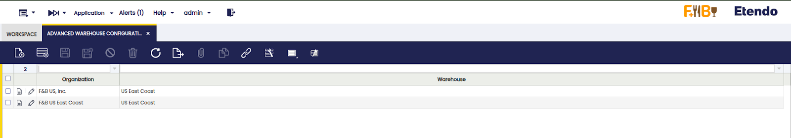
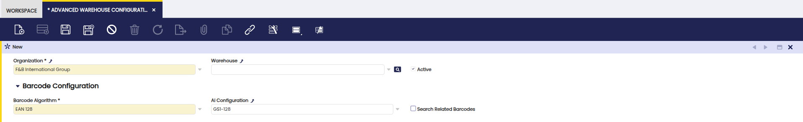
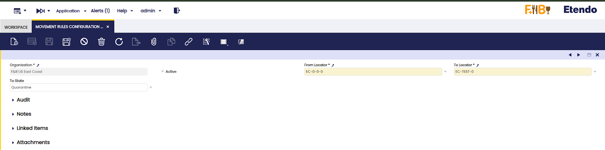
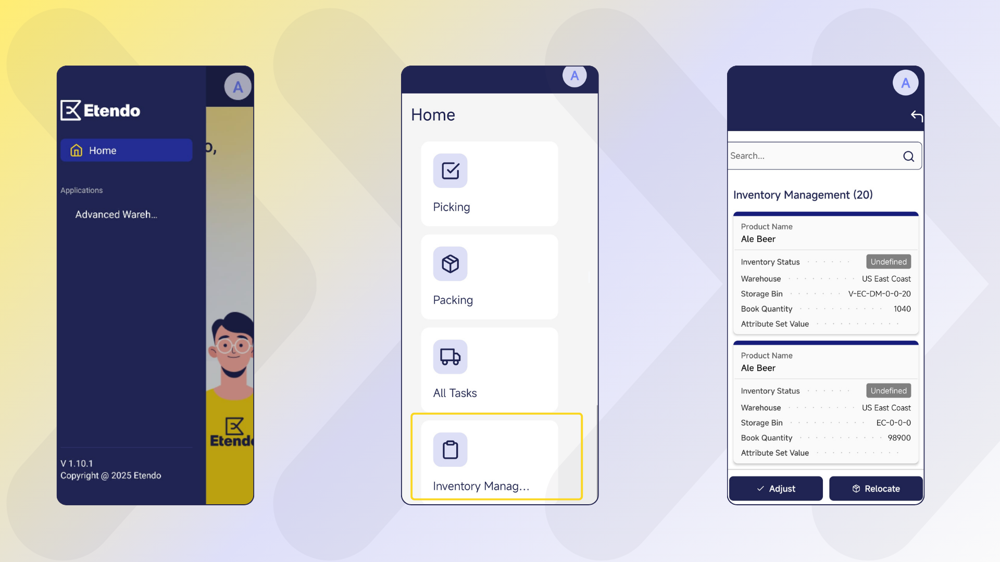
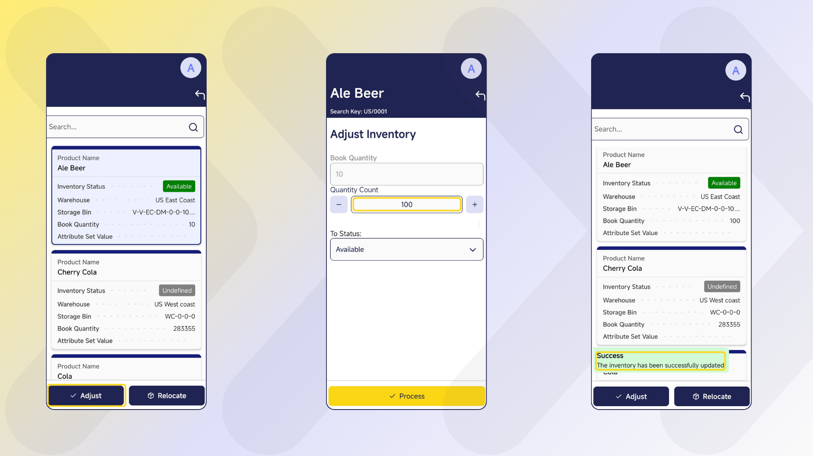
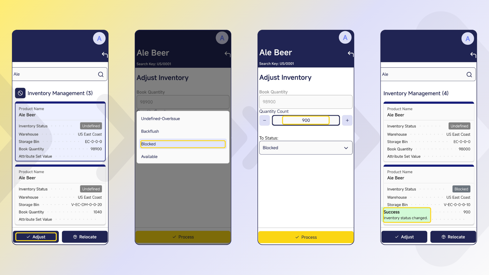
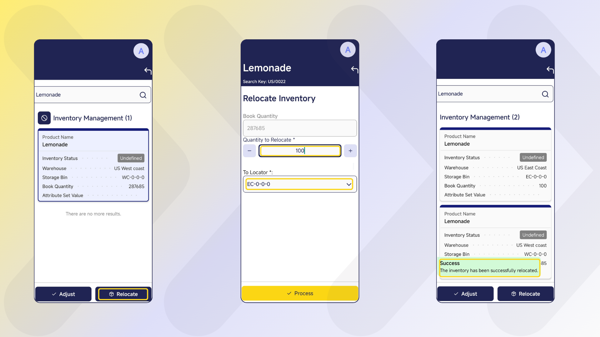
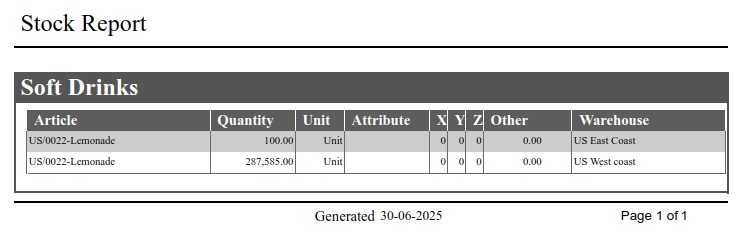

---
tags:
    - Warehouse Management
    - Advanced
    - Inventory
    - Stock
    - Etendo Mobile
---

# Advanced Warehouse Management
:octicons-package-16: Javapackage: `com.etendoerp.advanced.warehouse.management`

## Overview

The **Advanced Warehouse Management** module extends the standard capabilities of Etendo to offer comprehensive, flexible, and automated inventory management, adding integration with mobile devices. Every action performed from the mobile application is automatically synchronized with Etendo, ensuring complete traceability and consistent updates in the corresponding system windows.

This module allows the user to:

- Manage inventory in multiple predefined and customized statuses.
- Make stock adjustments and physical inventories from mobile devices.
- Automate relocations and statuses with movement rules.
- Integrate traceability using barcodes, which can be scanned from the mobile app.

## Initial Setup

To start using this module correctly, the following installation and configuration steps must be completed:

- [x] Install the Warehouse Extensions Bundle.
- [x] Install the Etendo Mobile app.
- [x] Assign the mobile user role to the Warehouse SubApp.
- [x] Load the GS1 Barcode Configs barcode configuration DataSet.
- [x] Configure key parameters in Advanced Warehouse Configuration.

**Steps to follow:**

!!! info
    To be able to include this functionality, the Advanced Warehouse Management module of the Warehouse Extensions Bundle must be installed. To do that, follow the instructions from the marketplace: [Warehouse Extensions Bundle](https://marketplace.etendo.cloud/#/product-details?module=EFDA39668E2E4DF2824FFF0A905E6A95){target="\_blank"}. For more information about the available versions, core compatibility and new features, visit [Warehouse Extensions - Release notes](../../../../whats-new/release-notes/etendo-classic/bundles/warehouse-extensions/release-notes.md).

1. Install the mobile app on a device. Follow the instructions in [Getting Started - Etendo Mobile](../../../../etendo-mobile/getting-started.md)

2. Associate the Advanced Warehouse SubApp with the user's role so that they have access from Etendo    Mobile.

    To allow access to the warehouse and inventory management subapp in Etendo Mobile, you need to configure the corresponding roles. Follow the steps described in [Configure Roles and Dynamic SubApps](../../../../etendo-mobile/getting-started.md#configure-roles-and-dynamic-subapps) to assign the subapp to the desired role.

    !!!Info
        This configuration ensures that only users with the appropriate role can access warehouse features from the mobile app.

3. Loading the GS1 Barcode Configs DataSet from the `Enterprise Module Management` window is required.

4. **Advanced Warehouse Configuration**

    `Application` > `Warehouse Management` > `Setup` > `Advanced Warehouse Configuration`

    Before using the module, in the `Advanced Warehouse Configuration` window, you must configure the key variables that define how inventory operations are managed for each organization.

    

    

    Fields to note:

    - **Organization**: allows you to manage which organization will apply the configuration.

    - **Warehouse**: is a non-mandatory field that can be used to apply the configuration to a specific warehouse or to all warehouses in the organization.

    - **Active**: is checked or unchecked to enable or disable the configuration.

    **Barcode Configuration section**

    - **Barcode algorithm**: A barcode algorithm that allows interpretation according to any of the standards defined by international organizations. The options to select are:

        - [EAN 128]()

        - SimpleBarcode

    - **Ai configuration**: A set of application identifiers (AIs) defined by GS1 standards that are used in barcodes such as GS1-128 to distinguish different types of information. Each AI specifies the type of data that follows it, such as product identifiers (GTINs), lot numbers, expiration dates, or quantities. AIs can be of fixed or variable lengths and are critical to correctly interpreting and processing barcode data. It is configured by default since it is included in the dataset.

    - **Search Related Barcode**: checkbox, which allows you to search for the product by more than one barcode.

    !!!Important
        It is mandatory to create a configuration for the organization you are working with. 

    These configurations ensure that inventory adjustments, relocations, and barcode operations follow the logic defined by the organization.

## Master Data Configuration

### Creating Statuses from Etendo

`Application` > `Warehouse Management` > `Setup` > `Inventory Status`

Inventory statuses allow the user to classify and manage stock units according to their condition or operational availability. The system includes some predefined statuses (such as *Blocked*, *Damaged*, *In Quality Control*, etc.), but it is possible to create new custom statuses according to your needs.

!!!info
    For more information on How to setup inventory statuses, visit [Inventory Status](../../../../../developer-guide/etendo-classic/concepts/inventory-status.md.).

The new status will be available in Etendo Mobile to be assigned to new or existing locators using the **Adjust** or **Relocate** options. In the latter case, the rules defined in the `Movement Rules Configuration` window, described below, are used.

### Configuring Inventory Movement Rules in Etendo

`Application` > `Warehouse Management` > `Setup` > `Movement Rules Configuration`

Movement rules allow you to automate the relocation or status change of inventory based on the action being performed. The purpose of this functionality is to automate inventory movements when they change status, exclude certain locations from operations such as picking or reservations due to their status, avoid errors in product handling, manage special products (*Damaged*, *Blocked*, etc.), and automatically handle virtual locations when there is no defined destination.

A virtual storage bin is a location automatically generated by the system to correctly maintain inventory, even when no specific location has been defined for the status to which it is being moved. 

For example: If the *Available* status does not have an associated storage bin, and a user marks a product as *Damaged*, then the system creates a virtual location in which to deposit the affected inventory. This virtual location inherits the properties of the storage bin where the product was located and is associated exclusively with the new status (e.g., *Available*).

This allows you to maintain inventory traceability and consistency, even if the team has not yet defined all physical locations. It also streamlines operations by avoiding errors or blockages when working with exceptional statuses.

To define the movement rules mentioned above, you must enter the **Movement Rules Configuration** window in Etendo.

There you can select an **Organization**, define whether or not it is activated with the **Active** checkbox, which is selected by default. Select a source storage bin in the **From Locator** field and a target storage bin in the **To Locator** field, plus an inventory status in the **To State** field.

The application of these rules can be seen from two features of the mobile application:

- From the **Relocate** option, once you have selected the location defined in a rule, this will move the inventory to the new location and, according to the configured rule, change the inventory status.

- From the **Adjust** option, when you select the new status, this will update the status and, depending on the configured rule, move the inventory to the defined location.

This creates a new record indicating:

- **From Locator**: Source location.

- **To Locator**: Destination location.

- **To State**: State to which the inventory will be transferred.

!!!Note
    If the **To State** field is filled in first, the **To Locator** field will be limited to the Storage Bins that have that state assigned.

!!!Info
    Actions performed using movement rules impact both the mobile application and Etendo's Stock Report, reflecting the location.

## Using Etendo Mobile

### Inventory Management and Status

When logging in to Etendo Mobile, the warehouse operator will be presented with the applications and menus available according to his role.

The flow of inventory management and statuses, involves the functionalities from Etendo Mobile of:

- Physical inventory

- Change of status

- Relocation

!!!Important 
    These actions are possible through the use of the [movement rules](#configuring-inventory-movement-rules-in-etendo) functionality and the creation/use of [custom statuses](#creating-statuses-from-etendo) in Etendo, explained above.

### Physical Inventory and Change of Status

!!!Info
    For more information about how to use this functionality in Etendo, visit [Physical Inventory](../../../basic-features/warehouse-management/transactions.md#physical-inventory).

The Physical Inventory functionality from Etendo Mobile can be done with the following steps:

1. Enter the **Inventory Management** menu.

2. Search and select the product from the list or by the search engine. It is possible to unselect each selected product with the button .

3. When selecting a product, the action buttons are enabled. Click on **Adjust**.

4. Enter the quantity counted in the **Quantity Count** field.

5. Confirm by pressing **Process**.

Once the adjustment has been processed, the result is reflected in real time in the same product list in Etendo Mobile, showing the updated quantity. Likewise, this information will also be seen in Etendo through the Stock Report, ensuring synchronization between both environments.

The **To Status** field, present in this screen, allows you to change the status of the selected inventory. Thus, by adding one more step, the status can be changed:

1. Enter the **Inventory Management** menu of the mobile application.

2. Search and select the product from the list or by the search engine. 

3. Press the **Adjust** button.

4. Enter the quantity to change the status in the **Quantity Count** field.

5. Select the status from the **To Status** field. 

6. Confirm by pressing **Process**.

Thus, the **Adjust** button allows two functions, physical inventory and status change.

### Inventory Relocation

!!!Info
    For more information about how to use this functionality in Etendo, visit [Goods Movement](../../../basic-features/warehouse-management/transactions.md#goods-movement).

The **Relocate** function allows you to relocate inventory by following the steps:

1. Enter the **Inventory Management** menu of the mobile application.

2. Search and select the product from the list or by the search engine.

3. Press the **Relocate** button.

4. Enter the quantity to move in the **Quantity to Relocate** field.

5. Select the destination location in the **To Locator** field.

6. Confirm with **Process**.

The result of this process is reflected both in the mobile application, where the inventory location is updated, and in the Etendo Stock Report, ensuring traceability and visibility of the relocation in both platforms.