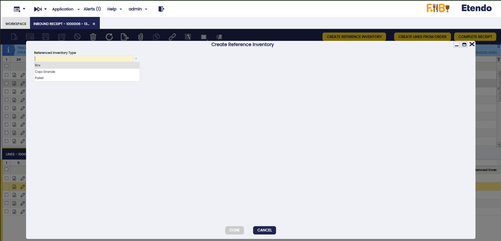
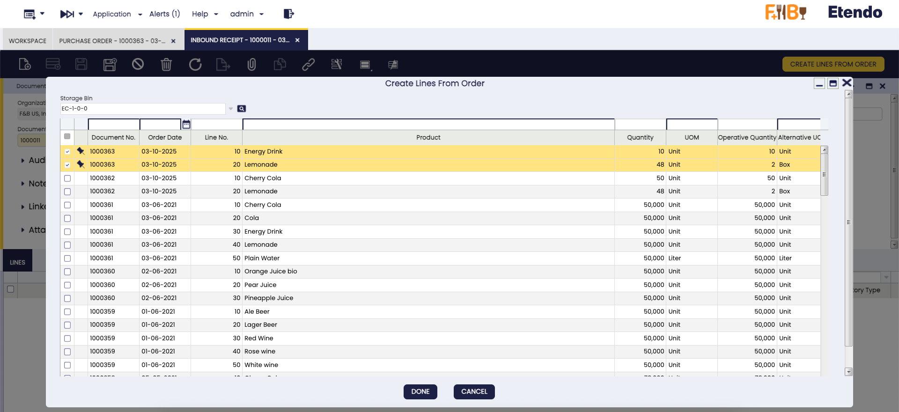
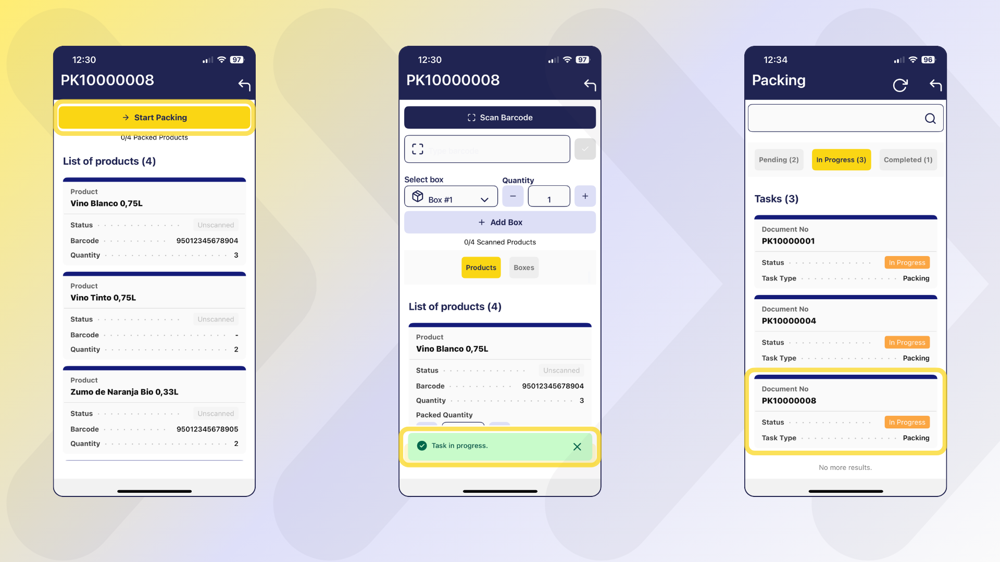
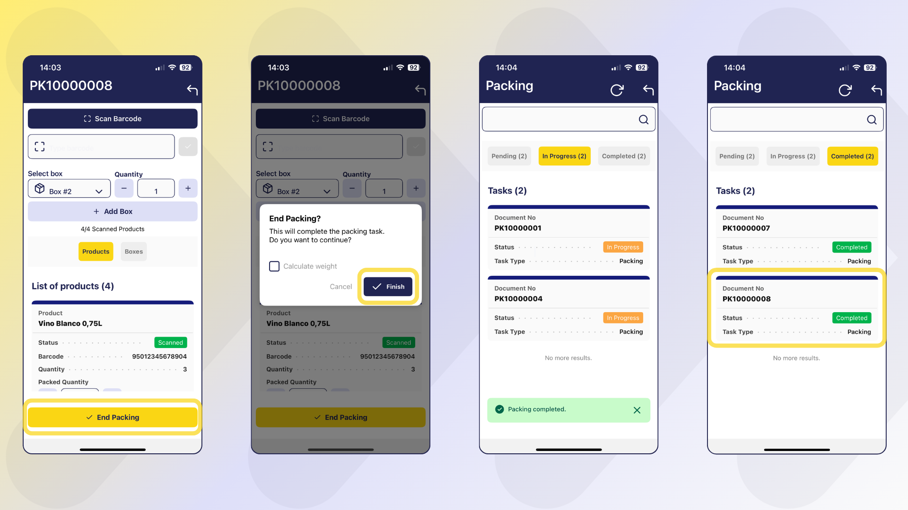

# Advanced Warehouse Management
:octicons-package-16: Javapackage: `com.etendoerp.advanced.warehouse.management`

## Overview

The **Advanced Warehouse Management** module extends the standard capabilities of Etendo to offer comprehensive, flexible, and automated inventory management, adding integration with mobile devices. Every action performed from the Etendo Mobile is automatically synchronized with Etendo, ensuring complete traceability and consistent updates in the corresponding system windows.

This module allows the user to:

- Manage inventory in multiple predefined and customized statuses.
- Make stock adjustments and physical inventories from mobile devices.
- Automate relocations and statuses with movement rules.
- Integrate traceability using barcodes, which can be scanned from Etendo Mobile.
- Extend and optimize the manual picking and packing process, incorporating the possibility of executing them from Etendo Mobile.

## Initial Setup

To start using this module correctly, the following installation and configuration steps must be completed:

- [x] Install the **Warehouse Extensions** bundle.
- [x] Install the **Etendo Mobile** app.
- [x] Enable the **Advanced Warehouse App** to the user roles that use it.
- [x] Install datasets.
- [x] Configure key parameters in **Advanced Warehouse Configuration** window.
- [x] The necessary task types for picking and packing must be created.
- [x] The picking generation option should be defined at Sales order level.

**Steps to follow:**

1. Install **Advanced Warehouse Management** module, part of **Warehouse Extensions Bundle**.
    
    !!! info
        To be able to include this functionality, the Warehouse Extensions Bundle must be installed. To do that, follow the instructions from the marketplace: [_Warehouse Extensions Bundle_](https://marketplace.etendo.cloud/?#/product-details?module=BAE67A5B5BC4496D9B1CA002BBCDC80E){target="_blank"}.  For more information about the available versions, core compatibility and new features, visit [Warehouse Extensions - Release notes](../../../../../whats-new/release-notes/etendo-classic/bundles/warehouse-extensions/release-notes.md).

2. Install **Etendo Mobile** on an Android or iOS device and follow the initial configuration steps. To do so, follow the instructions in [Getting Started - Etendo Mobile](../../../../etendo-mobile/getting-started.md)

    !!! tip
        Be sure to follow all the steps to enable the **Advanced Warehouse App**.

3. Install datasets

    :material-menu: `Application`>`General Setup` > `Enterprise Model` > `Enterprise Module Management`
    
    From the [Enterprise Module Management](../../../basic-features/general-setup/enterprise-model/enterprise-module-management.md) window is required for all roles that will use this functionality.

    This reference data includes configurations necessary to use these modules. 

    - `Warehouse Packing`
    - `Warehouse Picking List`
    - `Advanced Warehouse Management`
    - `Etendo Print Provider`
    - `Stock Logistic Unit`

    

4. **Advanced Warehouse Configuration** Window

    :material-menu:`Application` > `Warehouse Management` > `Setup` > `Advanced Warehouse Configuration`

    Before using the module, in the `Advanced Warehouse Configuration` window, you must configure the key variables that define how inventory operations are managed for each organization.

    !!! warning
        It is mandatory to create a configuration for the organization you are working with.

    
    
    Fields to note:

    - **Organization**: allows you to manage which organization will apply the configuration.
    - **Warehouse**: is a non-mandatory field that can be used to apply the configuration to a specific warehouse or to all warehouses in the organization.
    - **Active**: is checked or unchecked to enable or disable the configuration.
    - **Barcode Condiguration**

        - **Barcode Algorithm**: The default barcode algorithm that allows interpretation according to any of the standards defined by international organizations. The options to select are:

            - [GS1-128](https://www.gs1.org/standards/barcodes){target="_blank"}
            - SimpleBarcode

        - **Barcode Components Configuration**: A set of Application Identifiers defined by GS1 standards that are used in barcodes. That helps to distinguish different types of information. Each AI specifies the type of data that follows it, such as product identifiers (GTINs), lot numbers, expiration dates, or quantities.

        - **Search Related Barcode**: Checkbox, which allows the sub-app to search for the product by more than one barcode.

    - **Picking Configuration**

        - **Exact Attribute Validation**: Checkbox, defines the validation level that the system will apply during the picking process.

            - Active (Default): The system requires an exact match between the scanned code and the code defined in the Picking List, including product, attributes, and locator.

            - Inactive: The system only validates the product, without requiring a strict match in attributes or locator.

5. **Barcode Components Configuration** Window 
    
    :material-menu:`Application` > `Warehouse Management` > `Setup` > `Barcode Components Configuration`

    This window is part of the **advanced barcode settings** in the Etendo system and is used to manage and configure different types of barcodes. It allows the system to read and associate scanned codes with products and their relevant information.

    It allows users to define, configure, and apply their own identifiers so that the system can read and associate different **product attributes**, such as color, packaging type, batch, or any other relevant data, directly from the **GS1-128** codes used in logistics operations.

    !!! tip 
        The configurations shown below are predefined in the initial dataset, although they can be modified or new schemes or barcode types can be added.
    
    

    !!! note

        The system allows any **application identifier (AI)** to be freely configured to associate it with custom attributes or fields, providing flexibility to adapt to different internal coding schemes. The module is installed with a predefined configuration based on the **GS1-128** standard, which ensures the correct interpretation of codes in accordance with international standards. Nevertheless, users can adjust or redefine identifiers according to their particular needs. In such cases, the system will interpret the codes according to the user-defined configuration, but will not interpret GS1-128 codes in the standard way.

    Fields to note:

    **Header**

    - **Name**: Descriptive name of the barcode configuration to easily identify it.  
    - **Description**: Additional details about the purpose or scope of this configuration.  
    - **Separator**: Character used to delimit variable-length fields in the code, typically **FNC1**.  
    - **Apply to All Separators**: Checkbox. If checked (Yes), the configured separator is appended to the end of every identifier — both fixed‑length and variable‑length AIs must end with the separator. If unchecked (No), the separator is applied only to variable‑length identifiers.
    
    **Barcode Component Lines** tab

    - **AI**: Application Identifier code defined by GS1 (e.g., 01 for GTIN, 17 for expiration date).
    - **Description**: Explanation of the information the AI represents (e.g., product identifier, batch number).
    - **Fixed Length**: Indicates if the data length is always fixed according to the *GS1 standard* for that AI.
   - **Length**: (Mandatory) Expected number of characters for fixed-length AIs, or maximum length for variable-length AIs.
    - **Priority**: Defines the reading order when multiple identifiers are present, ensuring the system interprets the barcode correctly.  
    - **Entity**: Type Entity selector. The options are: **Attribute, Locator, Order Line, Physical Inventory Line, Product, Reference Inventory, Shipping/Receiving Line**. 
        
        If **Product** is selected, default quick options are enabled via checkboxes to define *Lot*, *Serial Number*, or *Expiration Date*. In addition, a value can be defined from the *Entity Field*, which lists the different attributes available for the product. Each of these options is unique and cannot be combined with the others.

        - **Entity Field**: Selector of fields available for the entity selected to assign the barcode value. The options depend on what is entered in Entity.
        - **Lot**: Check to indicate that the attribute is of the lot type.
        - **Serial No.**: Check to indicate that the attribute is of the serial number type. 
        - **Expiration Date**: Check to indicate that the attribute is of the expiration date type.

    By default, when installing the dataset, the module **includes two main methods for code recognition**:

    === ":material-playlist-plus: GS1-128"
        
        The [GS1-128](https://www.gs1.org/standards/barcodes){target="_blank"} standard is a globally used barcode format that encodes structured information through **Application Identifiers (AIs)**. Each AI specifies the type of data included, such as product identifiers, batch numbers, expiration dates, or logistics details. This enables detailed and standardized interpretation of product and warehouse information. For more details, see the [official GS1-128 documentation](https://www.gs1.org/standards/barcodes){target="_blank"}.
        
        !!! info 
            As indicated in the standard, when using a variable-length identifier, a separator must be added. The value declared by the standard is **FNC1**
                            
        This configuration allows recognition of different Application Identifiers (AIs) used in warehouse processes. The main implemented codes are:

        | AI Code  | Description                          | Details                                                                 | Length Type     |
        |----------|--------------------------------------|-------------------------------------------------------------------------|-----------------|
        | **(01)** | GTIN (Global Trade Item Number)      | Globally identifies a commercial product using a 14-digit code.         | Fixed length    |
        | **(10)** | Batch/Lot Number                     | Ensures traceability in manufacturing and distribution processes.       | Variable length |
        | **(17)** | Expiration Date                      | Indicates product expiration date in format YYMMDD.                     | Fixed length    |
        | **(21)** | Serial Number                        | Unique serial number of an item.                                        | Variable length |
        | **(91)** | Locator Code                         | Identifies the specific location within the warehouse.                  | Variable length |
        | **(92)** | Logistics Unit                       | Identifies a logistics unit, such as a pallet or box.                   | Variable length |
        | **(93)** | Free Use                             | -                                                                       | -               |
        | **(94)** | Free Use                             | -                                                                       | -               |
        | **(95)** | Free Use                             | -                                                                       | -               |
        | **(96)** | Free Use                             | -                                                                       | -               |
        | **(97)** | Free Use                             | -                                                                       | -               |
        | **(98)** | Free Use                             | -                                                                       | -               |
        | **(99)** | Free Use                             | -                                                                       | -               |

        Thanks to this configuration, when scanning a *GS1-128* barcode, it interprets the relevant information and applies it to the process in progress (receiving, picking, packing). For example, When it reads an identifier 91, it associates it with a locator or when it reads an identifier 92, it associates it with a logistics unit

        !!! warning "Barcode identification rules"

            Etendo interprets only the identifiers defined in this configuration.
            GS1-128 identifiers 90–99 are free-use codes and can be assigned to custom product attributes.

            By default:

            - AI 91 and 92 are used by Etendo.
            - AI 93–99 remain available for custom product attributes that are resolved dynamically (e.g., 93 = color, 94 = size).

            Users may change both the identifiers and the attributes they reference. However, any change is the user’s responsibility and may cause inconsistencies with standard GS1-128 parsing or external integrations.

            If a different interpretation is required, a developer can create a custom **barcode algorithm**.

        <figure markdown="span">
            
            <figcaption> Example: Custom Product Entity Configuration</figcaption>
        </figure>
    
        !!! info "Configuration Restrictions and Validations"
    
            - When creating or modifying identifiers (AI), the system applies a series of validations designed to maintain the consistency and uniqueness of configurations.
            - Each AI must be unique. There cannot be more than one record with the same AI number, regardless of the entity or associated field.
            - When an AI is associated with a specific type of information such as Lot, Expiration Date, or Serial Number, that type cannot be repeated within the same configuration.
            - The system allows for the inclusion of custom attributes in barcodes. During scanning, these attributes are interpreted dynamicaly as **additional product identifiers**, along with standard values, allowing for the validation and distinction of a unique product.

    === ":material-playlist-plus: Direct String Match"

        This method allows the system to read the code and compare it exactly with the codes of the products stored in the system. The comparison is direct and strict, without taking into account any additional structure in the code.    

        

6. **Task** infrastructure:

    The [Task](../platform-extensions/task.md) module, automatically installed as a dependency of this module, enables event management, triggering tasks creation and actions execution after dynamic changes, allowing automation of flows.

    En particular al crear una picking list

    !!! warning "Required"
        In order to use this module, a **developer** must follow the initial settings described in [Task - Initial Configuration](../../../../../developer-guide/etendo-classic/bundles/platform/task.md#initial-configuration).

    When installing `Advanced Warehouse Management` module, the **Task Types** required for picking and packing from the **Etendo Mobile** are included by default:

    

    **User Algorithm**
    
    Each **Task Type** will allow selecting the **warehouse operator assignment** algorithm, by default `Round-Robin By Section Algorithm` is used.

    **System Preferences**

    - `CreateWarehouseTask`: This preference is set to "Y" (Yes) by default to enable automatic generation of warehouse tasks, such as picking tasks, when creating the Picking List. If set to "N" (No), tasks will not be generated automatically and the assignment option will not be available during picking creation.

    - `fromDateCompleted`: Defines the number of days backward from the current date to display tasks with Completed status in Etendo Mobile. By default, the value is 1 and  will show the tasks completed the previous day.

## Master Data Configuration

### Creating Inventory Statuses  

`Application` > `Warehouse Management` > `Setup` > `Inventory Status`

Inventory statuses allow the user to classify and manage stock units according to their condition or operational availability. The system includes some predefined statuses (such as *Blocked*, *Damaged*, *In Quality Control*, etc.), but it is possible to create new custom statuses as `System Administrator` according to the client needs.

!!!info
    For more information on how to setup inventory statuses, visit [Inventory Status](../../../../../developer-guide/etendo-classic/concepts/inventory-status.md).

The new status will be available in **Etendo Mobile** to be assigned to new or existing locators using the **Adjust** or **Relocate** task options. In the latter case, the rules defined in the `Movement Rules Configuration` window, described below, are used.

### Movement Rules Configuration Window

`Application` > `Warehouse Management` > `Setup` > `Movement Rules Configuration`

Movement rules allow you to automate the relocation or status change of inventory based on the action being performed. The purpose of this functionality is to automate inventory movements when they change status, exclude certain locations from operations such as picking or reservations due to their status, avoid errors in product handling, manage special products (*Damaged*, *Blocked*, etc.), and automatically handle virtual locations when there is no defined destination.

A **Virtual Storage Bin** is a location automatically generated by the system to correctly maintain inventory, even when no specific location has been defined for the status to which it is being moved. 

!!! Example
    If the *Available* status does not have an associated storage bin, and a user marks a product as *Damaged*, then the system creates a virtual location in which to deposit the affected inventory. This virtual location inherits the properties of the storage bin where the product was located and is associated exclusively with the new status (e.g., *Available*).

This allows the user to maintain inventory traceability and consistency, even if the team has not yet defined all physical locations. It also streamlines operations by avoiding errors or blockages when working with exceptional statuses.

The application of these rules can be seen from two features of Etendo Mobile:

- From the **Relocate** tasks, once you have selected the location defined in a rule, this will move the inventory to the new location and, according to the configured rule, change the inventory status.

- From the **Adjust** tasks, when you select the new status, this will update the status and, depending on the configured rule, move the inventory to the defined location.

Fields to note: 

- **From Locator**: Source location.
- **To Locator**: Destination location.
- **To State**: State to which the inventory will be transferred when the movement is done.

!!!Note
    If the **To State** field is filled in first, the **To Locator** field will be limited to the Storage Bins that have that state assigned.

!!!Info
    Actions performed using movement rules impact both Etendo Mobile and Etendo's Stock Report, reflecting the location.

### Barcode

Barcode functionality is key for logistic operations. Storage bins and products with generated codes will be available to be scanned and managed both from **Etendo Mobile** and from **Etendo**, but it requires a previous configuration.

- The `Advanced Warehouse Management` dataset must be loaded.
- From the **Advanced Warehouse Configuration** window, you can define which barcode will be used by default.

It is possible to generate these unique codes for storage bins in the **Warehouse and Storage Bins** and **Product** windows:

=== "From the **Warehouse and Storage Bins** window"

    1. Select the **warehouse** and **storage bin**.
    2. Click on **Generate Barcode** and confirm with Done.

        

    3. The generated code is displayed in the storage bin in the **Barcode** field. It can also be loaded manually or modified.

        
    
    4. On the other hand, you can obtain a printout of the generated barcode by clicking on the Generate Printable button. You must select a supplier, the printer, and the number of copies.

        

    !!! info
        To use the print option, you must have the Print Provider module. For details, see [Print Provider](../../../../../user-guide/etendo-classic/optional-features/bundles/platform-extensions/print-provider.md)

=== "From the **Product** window"

    1. Select the product.
    
    2. Click on Generate Barcode and confirm with Done.
    
    3. The generated code is displayed in the header of the product window in the **UPC/EAN** field. It can also be loaded manually or modified.

        
    
    4. You can obtain a printout of the generated barcode by clicking on the *Generate Printable* button. You must select a supplier, the printer, and the number of copies.
    
        

        !!! info
            To use the print option, you must have the Print Provider module. For details, see [Print Provider](../../../../../user-guide/etendo-classic/optional-features/bundles/platform-extensions/print-provider.md)
    
    !!! info 
        In the **Product** window, there is a tab called **Barcode**, where various barcodes associated with the product, such as supplier codes, are listed. These codes are loaded manually, allowing you to specify the algorithm used to encrypt the code and the Application Identifier configuration.
        
        To configure how the system searches for barcodes:
        
        - In the **Advanced Warehouse Configuration** window, there is a checkbox labeled `Search Related Barcode`
        - If the checkbox is enabled, when scanning a product from Etendo Mobile, the system will search for matches on all codes listed in the Barcode tab, in addition to the header code.

## Inbound Receipt

### Overview

The [Referenced Inventory (RI)](../../../basic-features/warehouse-management/transactions.md#referenced-inventory) functionality has been extended to manage physical logistics units such as **pallets** and **boxes**, directly linked to the [Alternative Units of Measure (AUOM)](../../../basic-features/master-data-management/master-data.md#alternate-uom-tab) of each product. This enables defining equivalences (e.g., 1 Pallet = 100 units) and handling these units as unique, traceable entities in warehouse operations.

The [Stock Logistic Unit](./stock-logistic-unit.md) module, installed as a dependency, adds new UOMs (Box, Pallet) and reference inventory types, allowing users to configure equivalences in the **Alternate UOM** tab of the Product window. Once defined, if a different conversion is required, a new AUOM must be created.

When goods are received, the system can automatically generate RI records for each logistics unit (Box or Pallet), including product details, base unit quantity, and attributes such as batch or expiration date. Each unit is registered as a unique item from the moment it enters the warehouse, ensuring full traceability.  

!!! info
    For detailed setup and use of logistics units, see the [Stock Logistic Unit](./stock-logistic-unit.md) documentation.

### Inbound Receipt Window  

:material-menu: `Application` > `Warehouse Management` > `Transaction` > `Inbound Receipt`

The **Inbound Receipt** window enhances the [goods receipt](../../../basic-features/procurement-management/transactions.md#goods-receipts) flow by introducing an intermediate step between the purchase order and the goods receipt. This step centralizes multiple orders—even from different suppliers—into a single operation, improving flexibility, automation, and control. It also supports alternative units of measure (AUOM), enabling receipts to be recorded in pallets, boxes, or regrouped into different containers to reflect the actual inflow.

Receipts are always created from purchase orders, not manually. Order lines are loaded with product, quantity, lot, and location details, which can be adjusted (e.g., quantity or unit) to register partial or alternative receipts. This ensures the goods receipt accurately reflects what was physically received and updates the purchase order accordingly.

When AUOMs such as Pallet or Box are used, the system can automatically generate a Referenced Inventory (RI) record linked to the receipt line, representing the logistics unit and ensuring traceability.

Fields to note:

#### Header

- **Organization**: Defines the organization in which the inbound receipt will be created and filter the information.  
- **Active**: Indicates whether the record is enabled for use.  
- **Description**: Free text field to add additional information or notes about the receipt.  
- **Document No**: Unique identifier automatically generated for the receipt, with a sequence specific to this type of document.  
- **Document Type**: Loaded by default with *Inbound Receipt* to classify the document type.  
- **Movement Date**: Date on which the physical goods movement is recorded. By default, it is the current date.  
- **Accounting Date**: Date on which the transaction is recognized for accounting purposes.  

#### Lines Tab

The Lines Tab allows you to add and modify individual products from one or more purchase orders, adjusting their quantity and/or unit. It represents the list of products received, displaying the following fields in addition to the basic ones.

Fields to note:

- **Active**: Indicates whether the line is enabled for processing within the receipt.  
- **Line No**: Sequential number automatically assigned to identify the line within the receipt.  
- **Purchase Order Line**: Reference to the original purchase order line from which the receipt line was generated.  
- **Storage Bin**: Location where the received product will be stored. It can vary between lines, allowing different locations to be assigned to products from the same or different purchase orders.  
- **Product**: The product being received, linked to the purchase order.  
- **UOM**: Base unit of measure of the product (e.g., units, liters, kilograms).  
- **Ordered Quantity**: Quantity received expressed in the product's base unit of measure.  
- **Attribute Set Value**: Attributes associated with the product, such as batch, serial number, or expiration date.  
- **Alternative UOM**: Alternative unit of measure for the product. If no AUOM is defined, it defaults to the UOM. Used to record the receipt of products in pallets, boxes, or other containers.  
- **Operative Quantity**: Quantity received expressed in the product's alternative unit of measure. Matches the Ordered Quantity if no AUOM is defined. If an AUOM exists, it indicates the number of pallets, boxes, or other alternative units received.  
- **Grouped by**: Identifier of the grouping to which the line belongs, generated when using the *Group By* button. It shows which lines are part of the same container or packaging unit.  
- **Reference Inventory Type**: Type of referenced inventory associated with the grouping (e.g., Box, Pallet).  

#### Buttons

**Create Lines From Order**

Extracts product lines from purchase orders. When clicked, a pop-up shows all available products, even from multiple purchase orders. You can select one or more lines to add to the Lines tab. If a storage bin is defined, it will be assigned to all selected lines; otherwise, it can be set individually per line.

**Create Reference Inventory**

This button appears when at least one line is selected. It allows multiple/mixed grouping into a single type of logistics unit (boxes, pallets, or other types defined in the system). Its function is to gather selected products from the Lines tab into a specific grouping, according to the type of grouping chosen.

The grouping is reflected in the Grouped by column of the selected lines (e.g., Box-1). 

!!! info
    - Only lines from the same Sales Order can be grouped.  
    - If a line is already grouped and is included in a new grouping, the previous grouping will be replaced.

**Clear Group By** 

Button allows you to remove a line from your grouping without affecting the rest of the lines in the group.

**Generate Reception Task** 

Allows managing operational receptions from the mobile app through the creation of Reception Tasks. It is available when there is an Inbound Receipt that is not yet completed and has loaded lines.

By pressing the button, a task linked to the selected document is generated and becomes visible in the mobile app and in the Task window of the ERP. 
In the pop-up window, you can assign a user or enable automatic assignment. If multiple records are selected, one task will be created for each record, all assigned to the same user or role defined in the pop-up.

!!!Info
    For more information, visit [Reception Tasks](#reception-tasks).

**Complete Receipt**

Finishes the receipt, generating and completing the corresponding **goods receipts**. In addition, if the receipt includes products with AUOM (pallet or box), the associated **Inventory Reference** record is automatically created.

### Workflow

**Receipt Flow**

1. In the receipt flow, the user has a **Purchase Order** that includes product lines configured with an Alternative Unit of Measure (AUOM) of the Box or Pallet type, with its equivalence previously defined in the product window (for example, 1 Pallet = 100 units). 

    

2. From the **Inbound Receipt** window, the user creates a new receipt record using the *Create Lines From Order* button, selecting the Purchase Order as the reference document. The system incorporates the order data, such as the product, quantity (in AUOM), attributes (batch, series), and other associated information. 

    

3. When the Complete button is pressed, the system sequentially generates and completes the **Goods Receipt** and creates a record in **Referenced Inventory (RI)** for each logistics unit received (Box or Pallet), respecting the equivalencies defined in AUOM.

    

4. The Referenced Inventory is linked to the quantity received, the product, and its corresponding attributes. As a result, the stock is updated in the inventory, increasing the number of units in the defined location and enabling traceability through the generated RI.

    

**Partial Receipt Flow**

1. The partial receipt process begins when there is a **Purchase Order** that contains a product line configured with an AUOM, for example, 1 box of pineapple juice equivalent to 12 units. 
2. From the **Inbound Receipt** window, the user initiates a new receipt record using the *Create Lines From Order* button and selects the Purchase Order as a reference. The system automatically loads the order lines, including the product and expected quantity, such as 1 box.
3. Then, in the receipt line, the user modifies the quantity to reflect the partial receipt; for example, if the order is for 1 box (12 units) but only 6 units are received, the user changes the quantity to 6 and, if necessary, adjusts the unit of measure to **units** instead of **box**.
4. Once the actual quantity received has been adjusted, the user completes the receipt by pressing the *Complete* button in the Inbound Receipts window.
5. At that point, the system generates and completes the goods receipt, reflecting the partial quantity actually received. The inventory is updated with the quantity received. The **Purchase Order** will show the percentage received in the status bar.

## AUOM Stock Reservation

### Overview

The option of stock reservations based on the unit defined in the sales order (AUOM field) has been added, which determines whether the product is sold in its base unit or in an alternative unit (for example, a single bottle or a box of 12).  

!!! info
    To use reservations, enable the **Enable Stock Reservations** and **Enable UOM Managemen** preference and set the **Stock Reservation** field in the Sales Order to *Automatic*. For details, see [Stock Logistic Unit](./stock-logistic-unit.md).

### Reservation Flow

1. The process starts when a **Sales Order** is created with product lines defined with an Alternative Unit of Measure (AUOM) (e.g., 1 Box = 24 Units).
2. In each line, the **Stock Reservation** field is set to *Automatic*, so the system attempts to reserve stock when the order is confirmed.
    
3. Reservation logic:

    - The system reserves stock in the unit specified in the order line.  
    - If there is enough stock, a full reservation is created.  
    - If not, it reserves the available quantity in that unit and supplements with other AUOMs or base units.  
    - If the total is covered, the reservation is complete; otherwise, it is partial.
    
    

**Examples**

- Order: 10 units; Stock: 5 units + 1 box of 10 → Only 5 units reserved (the box cannot be split).  
- Order: 110 units; Stock: 100 units + 1 box of 10 → Reservation completed with both.  
- If no stock is available in the requested unit, the system still attempts to reserve using other AUOMs.  

### Picking/Packing Flow

In the [Picking](./picking.md) and [Packing](./packing.md) processes. If the **GS1-128** barcodes are configured,  once a [barcode](#barcode) has been validated, the system can identify not only the product, but also its alternative unit of measure (AUOM) and associated attributes, such as batch or expiration date.

During picking, when the code is scanned, the system interprets the structured information it contains (product, batch, expiration date, etc.) and compares it with the reservation, directly recording the corresponding quantity. This ensures that the stock output exact matches the actual product to be prepared.

In packing, the same validation is used when packaging products. The system recognizes what product it is, in what presentation and with what attributes, and assigns it to the corresponding box. This ensures that the shipment reflects exactly what was picked, maintaining complete traceability.

In this way, the Etendo ensures that a single scan comprehensively recognizes the product that is leaving or will leave, taking into account its alternative measurements and attributes, and avoiding errors throughout the chain from order to dispatch.

!!! Example
    Example of barcode with attributes: **01** 95012345678930 **\x1D** **10**L101 **\x1D** **17** 260910 **91** Rn-0-0-0

    where:

    - \x1D = separator for variable values
    - 01 = product identifier
    - 95012345678930 = id product
    - 10 = lot identifier
    - L101 = lot
    - 17 = expiration identifier
    - 260910 = expiration date (YYMMDD)
    - 91 = locator identifier
    - Rn-0-0-0 = logistic unit code

## Using Etendo Mobile

When logging in to Etendo Mobile, the warehouse operator will be presented with the applications and menus available according to his role.

As seen above, the Advanced Warehouse Management option includes the following menus:

- [Picking](#picking)
- [Packing](#packing)
- [All Tasks](#all-tasks)
- [Inventory Management](#inventory-management)

### Picking

The picking process allows the operator to pick the products required for an order efficiently using Etendo Mobile. The complete process flow is detailed below. 

!!!Info
    For more information about how to use this functionality in Etendo, visit [Picking](./picking.md).

#### Process Start (Etendo)

The process is started in Etendo when a [Picking List](../../../../optional-features/bundles/warehouse-extensions/picking.md#picking-list-generation) is created from the sales order, this process will create a new **task** that will be assigned to a user.

!!!Important
    Remember the only picking lists that are shown in Etendo Mobile are those marked as **Direct Picking List to Customer** type.

#### Access to Picking Tasks (Etendo Mobile)

When accessing **Etendo Mobile** into the **Picking** section, all tasks and their corresponding statuses, belonging to the logged in user, will be displayed. By default, the tasks are shown in Pending status.

{align=right width=300}
 
This screen contains:

- Refresh and Back buttons.
- A search field to filter tasks.
- Quick filters that limit between `Pending`, `In Process` or `Completed` tasks.
- A list of cards with tasks. 

!!! Note
    As explained above in the Tasks section of [Initial Setup](#initial-setup), there is a preference to define the days to show tasks in `Completed` status: `fromDateCompleted`. This allows the user to define the number of days backwards, from the current date, to be used as a criterion for displaying tasks in Completed status.

      

#### Product Picking

1. The warehouse operator must select a `Pending` task.

2. Once the task is selected, a window opens with the list of products to be picked.

3. To start the process, click on the **Start Picking** button located at the top; once this is done, the task goes to the `In Progress` status.
    

4. Once picking is started, a new window opens with the following items:

    {align=right width=300}

    - **Scan Barcode:** activates the camera of the mobile device.
    - **Type barcode:** allows to enter the barcode manually. A Validate button is available to trigger the barcode validation process.
    - **Quantity with: `+` and `-` buttons** allows manual loading of the quantity to be scanned.
    - **List of products (N):** list of cards with product information, where (N) is the total quantity of products. 

        - Product
        - Status:
            -  
                Unscanned
            
            -  
                Partially Scanned
            
            -  
                Scanned
            
        - Barcode
        - Locator
        - Movement Quantity: total quantity to be collected.
        - Counted Quantity with buttons `+` and `-`: that allow to add or subtract one by one the quantity manually.

#### Picking Methods

In the picking process, the operator has flexibility in both what to pick and how to do it. On the one hand, even if the system requests a specific code (for example, box BX100020), it is possible to replace it with another equivalent unit (such as BX100023) as long as the product and quantity match, or to adapt to stock availability (for example, delivering 10 individual units instead of a box of 10). These variations are automatically recorded in the reservation and on the goods sheepment.

On the other hand, the system also allows flexibility in the mode of operation through different selection methods:

- Scan the product the requested number of times (ex: 10 scans for 10 units).
- Scan a logistics unit, which automatically loads the requested quantity along with its equivalent in units according to the conversion rate.    
- Manually load "10" in the quantity field and scan once.
- Enter both code and quantity manually.
- Manually enter only the quantity in the Quantity field within a product card, using the + and - buttons or by entering the number from the keypad.

!!! tip
    When scanning a valid product, the Barcode field is automatically filled in, the associated card is displayed and the value 1 is incremented in the product, if the quantity was not previously changed.

!!! tip
    If a quantity other than the default quantity, e.g. 5, was previously entered in the Quantity field, and then the product is scanned, those 5 units will be added directly to the product card.

!!! Warning
    
    Possible error scenarios:

    - If an incorrect code is scanned (does not match any product in the task), the barcode field is highlighted in red, shows a cross and does not add quantity to any product.     
    - If an attempt is made to enter a quantity greater than required, the system will charge the maximum defined in the product card. Once the quantity is completed and the product code is re-scanned or reloaded, the system does not add quantity to the product.
    Additionally, if a quantity greater than the allowed maximum is entered, a popup will be displayed with the message: "Maximum quantity reached for product [ProductName]".   
    - If the quantity is manually loaded into the product card, the system allows loading the maximum quantity requested.

    
    

#### Picking Completion

Once at least one unit of any product is registered, the **End Picking** button becomes active. This allows partial picking, meaning only part of the requested quantity can be picked, which is useful when products are missing or unsuitable for use.

After confirmation, the task is marked as Completed.

!!!warning
    For partial picking, the task is closed, and no new task is automatically created for the missing products. Any remaining quantities must be handled manually.

Once completed, the task will appear in the Completed Tasks section, where it is possible to review the validated products and quantities for that specific picking task.

### Packing

The packing process allows the operator to pack the products efficiently using Etendo Mobile. The complete process flow is detailed below.

!!!Info
    For more information about how to use this functionality in Etendo, visit [Packing](./packing.md).

#### Process Start (Etendo)

Packing tasks are linked to a record in the **Packing** window.  The creation of a packing task is triggered after:

- The completion of a picking task (when the Task Type `Picking and Packing` is active).
- From the **Packing** window of Etendo when adding at least one sales order to a new Packing.

#### Access to Packing Tasks (Etendo Mobile)

{align=right width=300}

When accessing Etendo Mobile and selecting the **Packing** menu, the packing main screen with the number of available `Packing` tasks to the current user. 

This screen contains:

- Refresh and Back buttons.
- A search field to filter tasks.
- Quick filters that limit between `Pending`, `In Progress` or `Completed` tasks. By default it shows the `Pending` filter selected, and in the case of tasks in `Completed` status, there is a preference where it is defined from which day it will bring completed tasks.
- A list of cards, where each card represents a packing task and includes the following information:

    - Packing as title: The document reference is shown.
    - Status.
    - Task Type.

#### Product Packing

1. The warehouse operator must **select a task**. To select the task, scroll or enter key data in the search engine.

2. When selecting a task, a screen opens with the packing list number and the **Start Packing** button.

3. When pressing **Start Packing**, the status of the task changes to `In Progress` in both Etendo Mobile and Etendo. 

    

4. The window has the following elements:

    - **Scan Barcode** button to activate the device camera and scan.
    - **Type barcode** allows to enter the barcode manually. A Validate button is available to trigger the barcode validation process.
    - **Select Box** field to select the destination box when scanning the product.
    - **Quantity** field that acts as a multiplier to load the quantity when scanning the product.
    - **+ Add Box** button that allows you to add new boxes.
    - A list of **Product** cards, each showing:

        - Product
        - Status:
            -  
                Unscanned
            
            -  
                Scanning
            
            -  
                Scanned
            
        - Barcode
        - Quantity
        - Packed Quantity with buttons `+` and `-`: that allow to add or subtract one by one the quantity manually.

    - A list of **Boxes**, showing:

        - Box name (or number)
        - Products and their quantities

    

    The view selectors by **Product** or by **Box** allow:

    - In the **Products** view, when entering a product card, it shows how that product was distributed in the different boxes, allowing you to browse product by product to review the quantities assigned per box.

    - In the **Boxes** view, when entering a box, the detailed contents are displayed with the possibility of browsing box by box to check which products are contained in each box.

    

    !!! tip 
        In both views, it is possible to modify the quantities loaded and add boxes if necessary. However, in order to be able to assign content to the added boxes, one of the following conditions must be met: 

        - The total load of products has not yet been completed, or previously assigned quantities are modified (decreased) to allow their relocation to the new box.

5. Once packing is started, the user selects or creates a box and starts loading products by scanning or manually entering data.

    - Each packed product is registered under a specific box.
    - You can switch between boxes to distribute products as needed.

    !!!Info
        Newly created boxes cannot be deleted manually. However, if a box is left empty (no products added), it will be automatically removed at the end of the process. Only boxes with packed products will be saved and displayed.

    

#### Packing Methods

During the packing process, the operator must strictly adhere to what is to be picked, i.e., they can only scan the barcodes listed on the packing document. It is not permitted to substitute boxes for others or change logistics units, as the products have already been reserved during picking and the packing must reflect exactly what was requested.

In terms of how to perform packing, the system offers flexibility in operating methods:

- Scan the product the exact number of times (ex: 10 scans for 10 units).
- Load the amount manually in the Quantity field and then Scan the product. 

- Enter both quantity and code manually, and then press the Validate button to confirm the entry.

- Enter the quantity manually from the **Product** view or from the **Boxes** view.

!!! Warning
    Possible error scenarios:

    - If an incorrect code is scanned (does not match any product in the task), the barcode field is highlighted in red, shows a cross and does not add quantity to any product.
    - If an attempt is made to enter more than the required quantity, an error message is also displayed "Packing for product [ProductName] is already complete.".
    - If the quantity is manually loaded into the product card, the system allows loading the maximum quantity requested.

    

#### Packing Completion

Once the products have been packed: 

- The system displays a summary per box with the products included and the message *Packing completed successfully* is displayed.

- Until confirmed, the contents of the boxes can be edited.

- At the end, you can choose to calculate the weight of the boxes.

- After confirmation, the task is marked as Completed.

Once completed, the task will appear in the Completed Tasks section. From there, it is possible to review all validated information for that packing task, including:

- In the Product view: which boxes each product was packed into.
- In the Box view: which products were packed into each box.

### Inventory Tasks

Two types of tasks have been added:  **Inventory Adjustment** and **Inventory Relocation**.  These tasks are created and assigned directly from Etendo and are available in Etendo Mobile from the **Inventory Tasks** menu for the operator to execute.

**Inventory Adjustment**
Allows you to plan counting or stock adjustment tasks. It can be used to update existing quantities or to record stock for products that did not have previous inventory.

This corresponds to the same operation performed in Etendo **Physical Inventory** window: recording the actual counted quantity of a product and updating the stock accordingly, either by correcting existing quantities or entering stock where there was none. If the inventory status changes during the adjustment, the system automatically moves the product to the storage bin associated with that new status, reflecting the current stock condition.

!!!Info
    For more information about how to use this functionality in Etendo, visit [Physical Inventory](../../../basic-features/warehouse-management/transactions.md#physical-inventory).

**Inventory Relocation**

Allows inventory to be moved between storages bin. This process corresponds to the same operation performed in the Etendo using a **Goods Movement** windows: transferring stock from one state or location to another, without changing the total quantity available.

!!!Info
    For more information about how to use this functionality in Etendo, visit [Goods Movement](../../../basic-features/warehouse-management/transactions.md#goods-movement).

#### Process Start (Etendo)

The process begins with the creation of **Tasks** within Etendo, using the Task window.

**Header**

With the installation of the **Advanced Warehouse Management** module, new specific tasks are incorporated that expand the possibilities of logistics management. The header retains the basic fields for a task and adds options in the *Task Type* field, which determine the type of action to be performed:

- **Inventory Adjustment**: Used to plan stock counting or adjustment tasks. It can update existing quantities or register stock for products that previously had no inventory.
- **Inventory Relocation**: Used to plan tasks for moving products between warehouses or storage locations.

Fields to note:

- **Product**: (required) Product on which the task will be performed. When you select a product, other related fields are automatically filled in.
- **Storage bin**: (read-only) displays the current location of the selected product. It is automatically completed when the product is uploaded.
- **Attribute Set Value**: (read-only) indicates the defined attributes of the product (e.g., lot, series). It is automatically completed when the product is uploaded.
- **Quantity**: (read-only) reflects the current quantity available in the storage bin corresponding to the product. It is automatically completed when the product is uploaded.
- **UOM**: (read-only) displays the unit of measure in which the product is managed. It is automatically completed when the product is uploaded.
- **Creation Date**: (read-only) records the date and time the task was created.

#### Access to Inventory Tasks (Etendo Mobile)

When accessing Etendo Mobile into the Inventory Tasks section, all tasks and their corresponding statuses, belonging to the logged in user, will be displayed. By default, the tasks are shown in Pending status.

#### Inventory Adjustment 

!!!Important 
    These actions are possible through the use of the [movement rules](#movement-rules-configuration-window) functionality and the creation/use of [custom statuses](#creating-inventory-statuses) in Etendo, explained above.

To **Adjust** inventory:

- Enter the **Inventory Tasks** menu. There, tasks are divided by status: *Pending*, *In Progress*, and *Completed*.
- Search and select the task from the list or by the search engine.
- When a card is selected, a screen with the task information opens. 
- Press **Start Adjustment** button
- Complete **Quantity Count** field.
- Confirm by pressing **Process** button.

To change inventory **Status**:

- Change the inventory Status in **To Status** field. 
- The Default status options are: *Undefined*, *Blocked*, *Available*, *Quality-Control*, *Quarantine*, *Damage*, but each company can define its own statuses
- Confirm by pressing **Process** button.

#### Inventory Relocation

To **Relocate** inventory:

- Enter the **Inventory Tasks** menu. There, tasks are divided by status: *Pending*, *In Progress*, and *Completed*.
- Search and select the task from the list or by the search engine. 
- When a card is selected, a screen with the task information opens. 
- Press **Start Relocation** button
- Complete **Quantity Count** field.
- Complete **To Locator** field.
- Confirm by pressing **Process** button.

### Reception Tasks

It allows creating and controlling receipts directly from the mobile application using **receipt tasks**, which reproduce the same behavior and process flow as the [Goods Receipt](../../../basic-features/procurement-management/transactions/#goods-receipts) and [Inbound Receipt](#inbound-receipt) windows in the ERP.

#### Process Start (Etendo)

The process begins by clicking the **Generate Receiving Task** button in the *Inbound Receipt* window of the ERP. There, the task is assigned and then reflected in the mobile application of the assigned operator.

#### Access to Inventory Tasks (Etendo Mobile)

When accessing **Etendo Mobile** in the **Reception Tasks** section, all tasks and their corresponding statuses belonging to the logged-in user will be displayed. By default, tasks are displayed as *Pending* status.

**Reception Tasks**

To perform a **Reception**:

- Access the **Reception Tasks** menu. There, tasks are divided by status: Pending, In Progress, Completed.
- Search for and select the task from the list or using the search engine.
- When a task is selected, a screen with the task information opens.
- Press the **Start Receipt** button.
- **Scan** the products to stock them or **load** them manually.
- Confirm the task with the **End Reception** button.
- Confirm that you want to finish the task.
- See **Success message**.

### All Tasks

From this window you can view and work with all types of tasks, like Picking, Packing and Inventory Tasks.

---
This work is licensed under :material-creative-commons: :fontawesome-brands-creative-commons-by: :fontawesome-brands-creative-commons-sa: [ CC BY-SA 2.5 ES](https://creativecommons.org/licenses/by-sa/2.5/es/){target="_blank"} by [Futit Services S.L.](https://etendo.software){target="_blank"}.
