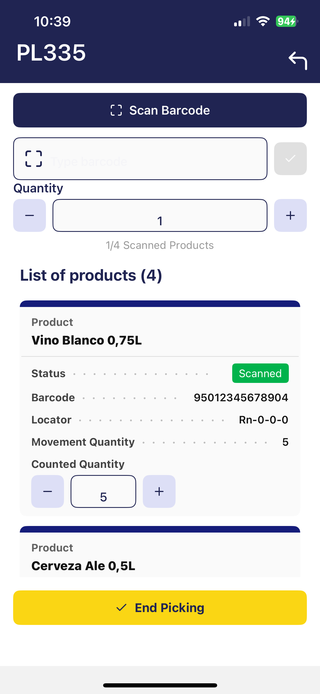

# Advanced Warehouse Management
:octicons-package-16: Javapackage: `com.etendoerp.advanced.warehouse.management`

## Overview

The **Advanced Warehouse Management** module extends the standard capabilities of Etendo to offer comprehensive, flexible, and automated inventory management, adding integration with mobile devices. Every action performed from the Etendo Mobile is automatically synchronized with Etendo, ensuring complete traceability and consistent updates in the corresponding system windows.

This module allows the user to:

- Manage inventory in multiple predefined and customized statuses.
- Make stock adjustments and physical inventories from mobile devices.
- Automate relocations and statuses with movement rules.
- Integrate traceability using barcodes, which can be scanned from Etendo Mobile.
- Extend and optimize the manual picking and packing process, incorporating the possibility of executing them from Etendo Mobile.

## Initial Setup

To start using this module correctly, the following installation and configuration steps must be completed:

- [x] Install the **Warehouse Extensions** bundle.
- [x] Install the **Etendo Mobile** app.
- [x] Enable the **Advanced Warehouse App** to the user roles that use it.
- [x] Install datasets.
- [x] Configure key parameters in **Advanced Warehouse Configuration** window.
- [x] The necessary task types for picking and packing must be created.
- [x] The picking generation option should be defined at Sales order level.

**Steps to follow:**

1. To be able to include this functionality, the **Advanced Warehouse Management** module of the **Warehouse Extensions Bundle** must be installed. To do that, follow the instructions from the marketplace: [Warehouse Extensions Bundle](https://marketplace.etendo.cloud/#/product-details?module=EFDA39668E2E4DF2824FFF0A905E6A95){target="\_blank"}.

    For more information about the available versions, core compatibility and new features, visit [Warehouse Extensions - Release notes](../../../../whats-new/release-notes/etendo-classic/bundles/warehouse-extensions/release-notes.md).

2. Install **Etendo Mobile** on an Android or iOS device and follow the initial configuration steps. To do so, follow the instructions in [Getting Started - Etendo Mobile](../../../../etendo-mobile/getting-started.md)

3. Be sure to follow all the steps to enable the **Advanced Warehouse App**.

4. Install datasets:

    - `Warehouse Packing`
    - `Warehouse Picking List`
    - `Advanced Warehouse Management`
    
    From the [Enterprise Module Management](../../../basic-features/general-setup/enterprise-model.md#enterprise-module-management) window is required for all roles that will use this functionality.

    

5. **Advanced Warehouse Configuration** Window

    :material-menu:`Application` > `Warehouse Management` > `Setup` > `Advanced Warehouse Configuration`

    Before using the module, in the `Advanced Warehouse Configuration` window, you must configure the key variables that define how inventory operations are managed for each organization.

    
    
    Fields to note:

    - **Organization**: allows you to manage which organization will apply the configuration.
    - **Warehouse**: is a non-mandatory field that can be used to apply the configuration to a specific warehouse or to all warehouses in the organization.
    - **Active**: is checked or unchecked to enable or disable the configuration.
    - **Barcode Algorithm**: The default barcode algorithm that allows interpretation according to any of the standards defined by international organizations. The options to select are:

        - EAN 128
        - SimpleBarcode (Recommended)

    - **AI Configuration**: A set of Application Identifiers  defined by GS1 standards that are used in barcodes. That helps to distinguish different types of information. Each AI specifies the type of data that follows it, such as product identifiers (GTINs), lot numbers, expiration dates, or quantities.
    
        - GS1-128
        - Direct String Match (Recommended)

    - **Search Related Barcode**: Checkbox, which allows the sub-app to search for the product by more than one barcode.

    !!! warning
        It is mandatory to create a configuration for the organization you are working with.
    

6. **Task** infrastructure:

    The [Task](../platform-extensions/task.md) module, automatically installed as a dependency of this module, enables event management and triggering tasks creation and actions execution after dynamic changes, allowing automation of flows.

    !!! warning "Required"
        In order to use this module, a **developer** must follow the initial settings described in [Task - Initial Configuration](../../../../../developer-guide/etendo-classic/bundles/platform/task.md#initial-configuration).

    When installing `Advanced Warehouse Management` module, the **Task Types** required for picking and packing are included by default:
 
    - **Warehouse Picking** (deactivated, since the picking and packing `Task Type` is active by default)
    - **Warehouse Packing** 
    - **Warehouse Picking & Packing**

        - **User Algorithm**: Each **Task Type** will allow selecting the warehouse operator assignment algorithm, by default `Round-Robin By Section Algorithm` is used.

     
    **Picking Generation**
     
    - **System Preferences**:

        - `IsTaskInstalled`: This preference by default "Y" (Yes) to enable the task module and allow automatic generation of picking tasks when creating the Picking List. If set to "N" (No), no tasks will be automatically generated and the assignment option will not be available when creating the picking.

        - `fromDateCompleted`: Defines the number of days backward from the current date to display tasks with Completed status in Etendo Mobile. By default, the value is 1 and  will show the tasks completed the previous day.

## Master Data Configuration

### Creating Inventory Statuses  

`Application` > `Warehouse Management` > `Setup` > `Inventory Status`

Inventory statuses allow the user to classify and manage stock units according to their condition or operational availability. The system includes some predefined statuses (such as *Blocked*, *Damaged*, *In Quality Control*, etc.), but it is possible to create new custom statuses as `System Administrator` according to the client needs.

!!!info
    For more information on how to setup inventory statuses, visit [Inventory Status](../../../../../developer-guide/etendo-classic/concepts/inventory-status.md).

The new status will be available in Etendo Mobile to be assigned to new or existing locators using the **Adjust** or **Relocate** options. In the latter case, the rules defined in the `Movement Rules Configuration` window, described below, are used.

### Movement Rules Configuration Window

`Application` > `Warehouse Management` > `Setup` > `Movement Rules Configuration`

Movement rules allow you to automate the relocation or status change of inventory based on the action being performed. The purpose of this functionality is to automate inventory movements when they change status, exclude certain locations from operations such as picking or reservations due to their status, avoid errors in product handling, manage special products (*Damaged*, *Blocked*, etc.), and automatically handle virtual locations when there is no defined destination.

A **Virtual Storage Bin** is a location automatically generated by the system to correctly maintain inventory, even when no specific location has been defined for the status to which it is being moved. 

!!! Example
    If the *Available* status does not have an associated storage bin, and a user marks a product as *Damaged*, then the system creates a virtual location in which to deposit the affected inventory. This virtual location inherits the properties of the storage bin where the product was located and is associated exclusively with the new status (e.g., *Available*).

This allows the user to maintain inventory traceability and consistency, even if the team has not yet defined all physical locations. It also streamlines operations by avoiding errors or blockages when working with exceptional statuses.

The application of these rules can be seen from two features of Etendo Mobile:

- From the **Relocate** option, once you have selected the location defined in a rule, this will move the inventory to the new location and, according to the configured rule, change the inventory status.

- From the **Adjust** option, when you select the new status, this will update the status and, depending on the configured rule, move the inventory to the defined location.

Fields to note: 

- **From Locator**: Source location.
- **To Locator**: Destination location.
- **To State**: State to which the inventory will be transferred when the movement is done.

!!!Note
    If the **To State** field is filled in first, the **To Locator** field will be limited to the Storage Bins that have that state assigned.

!!!Info
    Actions performed using movement rules impact both Etendo Mobile and Etendo's Stock Report, reflecting the location.

### Barcode

Barcode functionality is key for logistic operations. Storage bins and products with generated codes will be available to be scanned and managed both from Etendo Mobile and from Etendo, but it requires a previous configuration in Etendo.

- The `Advanced Warehouse Management` dataset must be loaded.
- From the **Advanced Warehouse Configuration** window, you can define which barcode will be used by default.

It is possible to generate these unique codes for storage bins in the **Warehouse and Storage Bins** and **Product** windows:

=== "From the **Warehouse and Storage Bins** window"

    1. Select the warehouse and storage bin.

    2. Click on Generate Barcode and confirm with Done.

        

    3. The generated code is displayed in the Advanced Warehouse Management section of the storage bin. It can also be loaded manually or modified.

         

=== "From the **Product** window"

    1. Select the product.

    2. Click on Generate Barcode and confirm with Done.

        

    3. The generated code is displayed in the Advanced Warehouse Management section of the product. It can also be loaded manually or modified.
        
        
    
    !!! info 
        In the **Product** window, there is a tab called Barcode, where various barcodes associated with the product, such as supplier codes, are listed. These codes are loaded manually.
        
        To configure how the system searches for barcodes:
        
        - In the **Advanced Warehouse Configuration** window, there is a checkbox labeled `Search Related Barcode`
        - If the checkbox is enabled, when scanning a product from Etendo Mobile, the system will search for matches on all codes listed in the Barcode tab, in addition to the header code.

## Using Etendo Mobile

When logging in to Etendo Mobile, the warehouse operator will be presented with the applications and menus available according to his role.

As seen above, the Advanced Warehouse Management option includes the following menus:

- [Picking](#picking)
- [Packing](#packing)
- [All Tasks](#all-tasks)
- [Inventory Management](#inventory-management)

### Picking

The picking process allows the operator to pick the products required for an order efficiently using Etendo Mobile. The complete process flow is detailed below. 

!!!Info
    For more information about how to use this functionality in Etendo, visit [Picking](../../../optional-features/bundles/warehouse-extensions/picking.md).

#### Process Start (Etendo)

The process is started in Etendo when a [Picking List](../../../../optional-features/bundles/warehouse-extensions/picking.md#picking-list-generation) is created from the sales order, this process will create a new **task** that will be assigned to a user.

!!!Important
    Remember the only picking lists that are shown in Etendo Mobile are those marked as **Direct Picking List to Customer** type.

#### Access to Picking Tasks (Etendo Mobile)

When accessing **Etendo Mobile** into the **Picking** section, all tasks and their corresponding statuses, belonging to the logged in user, will be displayed. By default, the tasks are shown in Pending status.

{align=right width=300}
 
This screen contains:

- Refresh and Back buttons.
- A search field to filter tasks.
- Quick filters that limit between `Pending`, `In Process` or `Completed` tasks.
- A list of cards with tasks. 

!!! Note
    As explained above in the Tasks section of [Initial Setup](#initial-setup), there is a preference to define the days to show tasks in `Completed` status: `fromDateCompleted`. This allows the user to define the number of days backwards, from the current date, to be used as a criterion for displaying tasks in Completed status.

      

#### Product Picking

1. The warehouse operator must select a `Pending` task.

2. Once the task is selected, a window opens with the list of products to be picked.

3. To start the process, click on the **Start Picking** button located at the top; once this is done, the task goes to the `In Progress` status.
    

4. Once picking is started, a new window opens with the following items:

    {align=right width=300}

    - Scan Barcode: activates the camera of the mobile device.
    - Scan or type barcode: allows to enter the barcode manually.
    - Quantity with `+` and `-` buttons: allows manual loading of the quantity to be scanned.
    - List of products (N): list of cards with product information, where (N) is the total quantity of products. 

        - Product
        - Status
        - Barcode
        - Locator
        - Movement Quantity: total quantity to be collected
        - Counted Quantity with buttons `+` and `-` : that allow to add or subtract one by one the quantity manually.

#### Picking Methods

The system allows flexibility in the mode of operation:

- Scan the product the requested number of times (ex: 10 scans for 10 units).
- Manually load "10" in the quantity field and scan once.
- Enter both code and quantity manually.
- Manually enter only the quantity in the Quantity field within a product card, using the + and - buttons or by entering the number from the keypad.

!!! tip
    When scanning a valid product, the Barcode field is automatically filled in, the associated card is displayed and the value 1 is incremented in the product, if the quantity was not previously changed.

!!! tip
    If a quantity other than the default quantity, e.g. 5, was previously entered in the Quantity field, and then the product is scanned, those 5 units will be added directly to the product card.

!!! Warning

    {align=right width=250}
    
    Possible error scenarios:

    - If an incorrect code is scanned (does not match any product in the task), the barcode field is highlighted in red, shows a cross and does not add quantity to any product.     
    - If an attempt is made to enter a quantity greater than required, the system will charge the maximum defined in the product card. Once the quantity is completed and the product code is re-scanned or reloaded, the system does not add quantity to the product.    
    - If the quantity is manually loaded into the product card, the system allows loading the maximum quantity requested.

    

#### Picking Completion

Once at least one unit of any product is registered, the **End Picking** button becomes active. This allows partial picking, meaning only part of the requested quantity can be picked, which is useful when products are missing or unsuitable for use.

After confirmation, the task is marked as Completed.

!!!warning
    For partial picking, the task is closed, and no new task is automatically created for the missing products. Any remaining quantities must be handled manually.

### Packing

The packing process allows the operator to pack the products efficiently using Etendo Mobile. The complete process flow is detailed below.

!!!Info
    For more information about how to use this functionality in Etendo, visit [Packing](../../../optional-features/bundles/warehouse-extensions/packing.md).

#### Process Start (Etendo)

Packing tasks are linked to a record in the **Packing** window.  The creation of a packing task is triggered after:

- The completion of a picking task (when the Task Type `Picking and Packing` is active).
- From the **Packing** window of Etendo when adding at least one sales order to a new Packing.

#### Access to Packing Tasks (Etendo Mobile)

{align=right width=300}

When accessing Etendo Mobile and selecting the **Packing** menu, the packing main screen with the number of available `Packing` tasks to the current user. 

This screen contains:

- Refresh and Back buttons.
- A search field to filter tasks.
- Quick filters that limit between `Pending`, `In Progress` or `Completed` tasks. By default it shows the `Pending` filter selected, and in the case of tasks in `Completed` status, there is a preference where it is defined from which day it will bring completed tasks.
- A list of cards, where each card represents a packing task and includes the following information:

    - Packing as title: The document reference is shown.
    - Status.
    - Task Type.

#### Product Packing

1. The warehouse operator must **select a task**. To select the task, scroll or enter key data in the search engine.

2. When selecting a task, a screen opens with the packing list number and the **Start Packing** button.

3. When pressing **Start Packing**, the status of the task changes to `In Progress` in both Etendo Mobile and Etendo. The window has the following elements:

    - **Scan Barcode** button to activate the device camera and scan.
    - **Type barcode** field for manual entry.
    - **Select Box** field to select the destination box when scanning the product.
    - **Quantity** field that acts as a multiplier to load the quantity when scanning the product.
    - **+ Add Box** button that allows you to add new boxes.
    - A list of **Product** cards, each showing:

        - Product name
        - Status
        - Barcode
        - Quantity
        - Packed Quantity

    - A list of **Boxes**, showing:

        - Box name (or number)
        - Products and their quantities

    The view selectors by **Product** or by **Box** allow:

    - In the **Products** view, when entering a product card, it shows how that product was distributed in the different boxes, allowing you to browse product by product to review the quantities assigned per box.

    - In the **Boxes** view, when entering a box, the detailed contents are displayed with the possibility of browsing box by box to check which products are contained in each box.

    !!! tip 
        In both views, it is possible to modify the quantities loaded and add boxes if necessary. However, in order to be able to assign content to the added boxes, one of the following conditions must be met: 

        - The total load of products has not yet been completed, or previously assigned quantities are modified (decreased) to allow their relocation to the new box.

4. Once packing is started, the user selects or creates a box and starts loading products by scanning or manually entering data.

    - Each packed product is registered under a specific box.
    - You can switch between boxes to distribute products as needed.

#### Loading Options

The system allows flexibility in mode of operation:

- Scan the product the exact number of times (ex: 10 scans for 10 units).

- Load the amount manually in the Quantity field and then Scan the product. 

- Enter both quantity and code manually.

- Enter the quantity manually from the **Product** view or from the **Boxes** view.

!!! Warning
    Possible error scenarios:

    - If an incorrect code is scanned (does not match any product in the task), a message is displayed indicating that the product is invalid.
    - If an attempt is made to enter more than the required quantity, an error message is also displayed.

#### Packing Completion

Once the products have been packed: 

- The system displays a summary per box with the products included and the message *Packing completed successfully* is displayed.

- Until confirmed, the contents of the boxes can be edited.

- At the end, you can choose to calculate the weight of the boxes.

### All Tasks

From this window you can view and work with all types of tasks, both Picking and Packing.

### Inventory Management

The flow of inventory management and statuses, involves the functionalities from Etendo Mobile of:

- Physical inventory.
- Change of status.
- Relocation.

!!!Important 
    These actions are possible through the use of the [movement rules](#movement-rules-configuration-window) functionality and the creation/use of [custom statuses](#creating-inventory-statuses) in Etendo, explained above.

#### Physical Inventory and Change of Status

!!!Info
    For more information about how to use this functionality in Etendo, visit [Physical Inventory](../../../basic-features/warehouse-management/transactions.md#physical-inventory).

The Physical Inventory functionality from Etendo Mobile can be done with the following steps:

1. Enter the **Inventory Management** menu.

2. Search and select the product from the list or by the search engine. It is possible to unselect each selected product with the button .

3. When selecting a product, the action buttons are enabled. Click on **Adjust**.

4. Enter the quantity counted in the **Quantity Count** field.

5. Confirm by pressing **Process**.

Once the adjustment has been processed, the result is reflected in real time in the same product list in Etendo Mobile, showing the updated quantity. Likewise, this information will also be seen in Etendo through the Stock Report, ensuring synchronization between both environments.

The **To Status** field, present in this screen, allows you to change the status of the selected inventory. Thus, by adding one more step, the status can be changed:

1. Enter the **Inventory Management** menu of Etendo Mobile.

2. Search and select the product from the list or by the search engine. 

3. Press the **Adjust** button.

4. Enter the quantity to change the status in the **Quantity Count** field.

5. Select the status from the **To Status** field. 

6. Confirm by pressing **Process**.

Thus, the **Adjust** button allows two functions, physical inventory and status change.

#### Inventory Relocation

!!!Info
    For more information about how to use this functionality in Etendo, visit [Goods Movement](../../../basic-features/warehouse-management/transactions.md#goods-movement).

The **Relocate** function allows you to relocate inventory by following the steps:

1. Enter the **Inventory Management** menu of Etendo Mobile.

2. Search and select the product from the list or by the search engine.

3. Press the **Relocate** button.

4. Enter the quantity to move in the **Quantity to Relocate** field.

5. Select the destination location in the **To Locator** field.

6. Confirm with **Process**.

The result of this process is reflected both in Etendo Mobile, where the inventory location is updated, and in the Etendo Stock Report, ensuring traceability and visibility of the relocation in both platforms.

---
This work is licensed under :material-creative-commons: :fontawesome-brands-creative-commons-by: :fontawesome-brands-creative-commons-sa: [ CC BY-SA 2.5 ES](https://creativecommons.org/licenses/by-sa/2.5/es/){target="_blank"} by [Futit Services S.L.](https://etendo.software){target="_blank"}.
