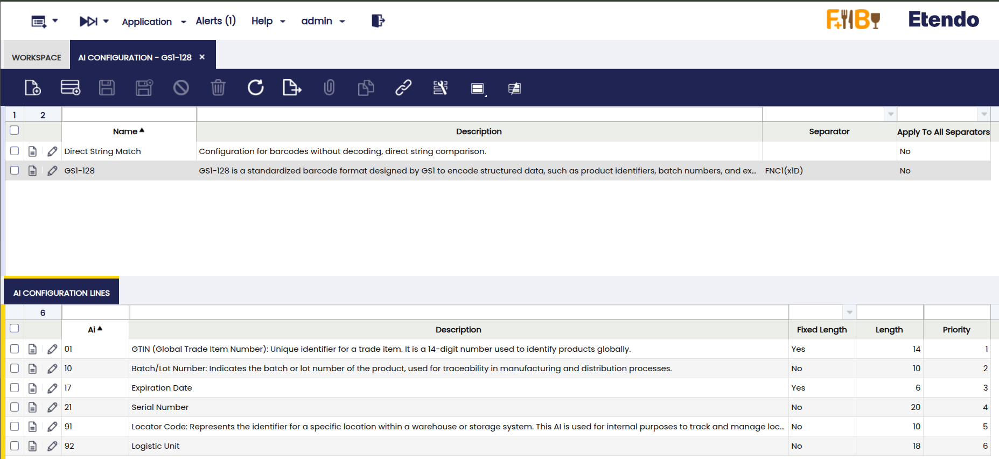
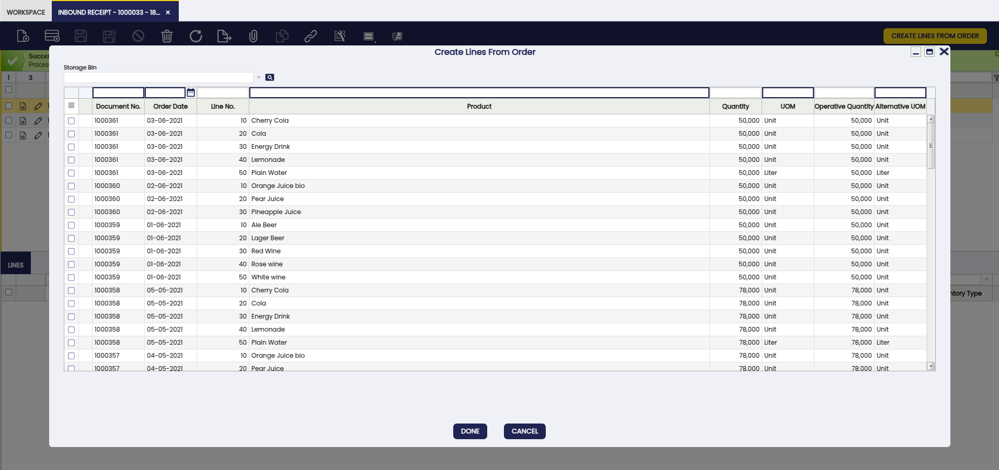
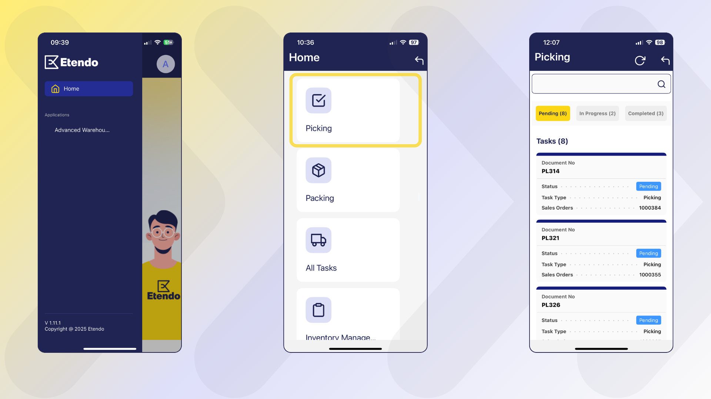

# Advanced Warehouse Management
:octicons-package-16: Javapackage: `com.etendoerp.advanced.warehouse.management`

## Overview

The **Advanced Warehouse Management** module extends the standard capabilities of Etendo to offer comprehensive, flexible, and automated inventory management, adding integration with mobile devices. Every action performed from the Etendo Mobile is automatically synchronized with Etendo, ensuring complete traceability and consistent updates in the corresponding system windows.

This module allows the user to:

- Manage inventory in multiple predefined and customized statuses.
- Make stock adjustments and physical inventories from mobile devices.
- Automate relocations and statuses with movement rules.
- Integrate traceability using barcodes, which can be scanned from Etendo Mobile.
- Extend and optimize the manual picking and packing process, incorporating the possibility of executing them from Etendo Mobile.

## Initial Setup

To start using this module correctly, the following installation and configuration steps must be completed:

- [x] Install the **Warehouse Extensions** bundle.
- [x] Install the **Etendo Mobile** app.
- [x] Enable the **Advanced Warehouse App** to the user roles that use it.
- [x] Install datasets.
- [x] Configure key parameters in **Advanced Warehouse Configuration** window.
- [x] The necessary task types for picking and packing must be created.
- [x] The picking generation option should be defined at Sales order level.

**Steps to follow:**

1. To be able to include this functionality, the **Advanced Warehouse Management** module of the **Warehouse Extensions Bundle** must be installed. To do that, follow the instructions from the marketplace: [Warehouse Extensions Bundle](https://marketplace.etendo.cloud/#/product-details?module=EFDA39668E2E4DF2824FFF0A905E6A95){target="\_blank"}.

    For more information about the available versions, core compatibility and new features, visit [Warehouse Extensions - Release notes](../../../../whats-new/release-notes/etendo-classic/bundles/warehouse-extensions/release-notes.md).

2. Install **Etendo Mobile** on an Android or iOS device and follow the initial configuration steps. To do so, follow the instructions in [Getting Started - Etendo Mobile](../../../../etendo-mobile/getting-started.md)

3. Be sure to follow all the steps to enable the **Advanced Warehouse App**.

4. Install datasets:

    - `Warehouse Packing`
    - `Warehouse Picking List`
    - `Advanced Warehouse Management`
    
    From the [Enterprise Module Management](../../../basic-features/general-setup/enterprise-model.md#enterprise-module-management) window is required for all roles that will use this functionality.

    

5. **Advanced Warehouse Configuration** Window

    :material-menu:`Application` > `Warehouse Management` > `Setup` > `Advanced Warehouse Configuration`

    Before using the module, in the `Advanced Warehouse Configuration` window, you must configure the key variables that define how inventory operations are managed for each organization.

    
    
    Fields to note:

    - **Organization**: allows you to manage which organization will apply the configuration.
    - **Warehouse**: is a non-mandatory field that can be used to apply the configuration to a specific warehouse or to all warehouses in the organization.
    - **Active**: is checked or unchecked to enable or disable the configuration.
    - **Barcode Algorithm**: The default barcode algorithm that allows interpretation according to any of the standards defined by international organizations. The options to select are:

        - GS1 128
        - SimpleBarcode

    - **AI Configuration**: A set of Application Identifiers defined by GS1 standards that are used in barcodes. That helps to distinguish different types of information. Each AI specifies the type of data that follows it, such as product identifiers (GTINs), lot numbers, expiration dates, or quantities.

    - **Search Related Barcode**: Checkbox, which allows the sub-app to search for the product by more than one barcode.

6. **AI Configuration** Window    

This window is part of the advanced barcode settings in the Etendo system and is used to manage and configure different types of barcodes. It allows the system to read and associate scanned codes with products and their relevant information.

This section covers two main methods for code recognition:

=== ":material-playlist-plus: GS1 128"
    This is a standard code type used globally to encode structured data, such as product identifiers, batch numbers, expiration dates, and other relevant information. GS1-128 uses Application Identifiers (AIs) to define what type of data it is encoding, allowing for a more detailed reading of product information.

    

    Through this window, it is possible to configure and add these types of codes, or even others, as needed. The fields in the table allow you to configure details such as the “AI” (application identifier), the length of the code, and the reading priority of each one. This is crucial to ensure that the system can correctly process barcodes, according to specific business requirements.
   
    The GS1-128 standard is a barcode format designed to encode structured information using **Application Identifiers** (AIs). Each AI defines the type of data contained in the label, allowing not only products to be identified, but also key logistics information. For more informatio, see the [GS1 128 Oficial Documentation](https://www.gs1.org/standards/barcodes){target="\_blank"}

    Etendo recognizes and validates only the identifiers shown in the list below. Any modification or inclusion of new identifiers, even those specific to the standard, requires additional development for interpretation; if an identifier that is not on the list is used, the system does not generate an error, but it will also not be able to validate its content.

    As indicated in the standard, when using a variable-length identifier, a separator must be added, which can be defined in the AI Configuration window. The value declared by the standard is **FNC1**
                        
    It configuration allows for the recognition of different Application Identifiers (AI) used in warehouse processes. Some common examples are:
                
    - **(92)**: Container Code: uniquely identifies a logistics unit (pallet, box).
    - **(01)**: GTIN (Global Trade Item Number): globally identifies a commercial product using a 14-digit code.
    - **(10)**: Batch/Lot Number: batch number to ensure traceability in manufacturing and distribution processes.
    - **(17)**: Expiration Date: product expiration date (YYMMDD).
    - **(21)**: Serial Number: uanique serial number of an item.
    - **(91)**: Locator Code: identifies the specific location within the warehouse.
    - **(37)**: Quantity of items: indicates the quantity contained in the logistics unit.

    Thanks to this configuration, when scanning a GS1-128 barcode, it interprets the relevant information and applies it to the process in progress (receiving, picking, packing). For example, when reading an SSCC (00), it associates it with an AUOM (box or pallet) and so on with the other identifiers.

=== ":material-playlist-plus: SimpleBarcode"

    This method allows the system to read the code and compare it exactly with the codes of the products stored in the system. The comparison is direct and strict, without taking into account any additional structure in the code.    

    

!!! warning
    It is mandatory to create a configuration for the organization you are working with.

7. **Task** infrastructure:

    The [Task](../platform-extensions/task.md) module, automatically installed as a dependency of this module, enables event management and triggering tasks creation and actions execution after dynamic changes, allowing automation of flows.

    !!! warning "Required"
        In order to use this module, a **developer** must follow the initial settings described in [Task - Initial Configuration](../../../../../developer-guide/etendo-classic/bundles/platform/task.md#initial-configuration).

    When installing `Advanced Warehouse Management` module, the **Task Types** required for picking and packing are included by default:
 
    - **Warehouse Picking** (deactivated, since the picking and packing `Task Type` is active by default)
    - **Warehouse Packing** 
    - **Warehouse Picking & Packing**

        - **User Algorithm**: Each **Task Type** will allow selecting the warehouse operator assignment algorithm, by default `Round-Robin By Section Algorithm` is used.

     
    **Picking Generation**
     
    - **System Preferences**:

        - `IsTaskInstalled`: This preference by default "Y" (Yes) to enable the task module and allow automatic generation of picking tasks when creating the Picking List. If set to "N" (No), no tasks will be automatically generated and the assignment option will not be available when creating the picking.

        - `fromDateCompleted`: Defines the number of days backward from the current date to display tasks with Completed status in Etendo Mobile. By default, the value is 1 and  will show the tasks completed the previous day.

## Master Data Configuration

### Creating Inventory Statuses  

`Application` > `Warehouse Management` > `Setup` > `Inventory Status`

Inventory statuses allow the user to classify and manage stock units according to their condition or operational availability. The system includes some predefined statuses (such as *Blocked*, *Damaged*, *In Quality Control*, etc.), but it is possible to create new custom statuses as `System Administrator` according to the client needs.

!!!info
    For more information on how to setup inventory statuses, visit [Inventory Status](../../../../../developer-guide/etendo-classic/concepts/inventory-status.md).

The new status will be available in Etendo Mobile to be assigned to new or existing locators using the **Adjust** or **Relocate** options. In the latter case, the rules defined in the `Movement Rules Configuration` window, described below, are used.

### Movement Rules Configuration Window

`Application` > `Warehouse Management` > `Setup` > `Movement Rules Configuration`

Movement rules allow you to automate the relocation or status change of inventory based on the action being performed. The purpose of this functionality is to automate inventory movements when they change status, exclude certain locations from operations such as picking or reservations due to their status, avoid errors in product handling, manage special products (*Damaged*, *Blocked*, etc.), and automatically handle virtual locations when there is no defined destination.

A **Virtual Storage Bin** is a location automatically generated by the system to correctly maintain inventory, even when no specific location has been defined for the status to which it is being moved. 

!!! Example
    If the *Available* status does not have an associated storage bin, and a user marks a product as *Damaged*, then the system creates a virtual location in which to deposit the affected inventory. This virtual location inherits the properties of the storage bin where the product was located and is associated exclusively with the new status (e.g., *Available*).

This allows the user to maintain inventory traceability and consistency, even if the team has not yet defined all physical locations. It also streamlines operations by avoiding errors or blockages when working with exceptional statuses.

The application of these rules can be seen from two features of Etendo Mobile:

- From the **Relocate** option, once you have selected the location defined in a rule, this will move the inventory to the new location and, according to the configured rule, change the inventory status.

- From the **Adjust** option, when you select the new status, this will update the status and, depending on the configured rule, move the inventory to the defined location.

Fields to note: 

- **From Locator**: Source location.
- **To Locator**: Destination location.
- **To State**: State to which the inventory will be transferred when the movement is done.

!!!Note
    If the **To State** field is filled in first, the **To Locator** field will be limited to the Storage Bins that have that state assigned.

!!!Info
    Actions performed using movement rules impact both Etendo Mobile and Etendo's Stock Report, reflecting the location.

### Barcode

Barcode functionality is key for logistic operations. Storage bins and products with generated codes will be available to be scanned and managed both from Etendo Mobile and from Etendo, but it requires a previous configuration in Etendo.

- The `Advanced Warehouse Management` dataset must be loaded.
- From the **Advanced Warehouse Configuration** window, you can define which barcode will be used by default.

It is possible to generate these unique codes for storage bins in the **Warehouse and Storage Bins** and **Product** windows:

=== "From the **Warehouse and Storage Bins** window"

    1. Select the warehouse and storage bin.

    2. Click on Generate Barcode and confirm with Done.

        

    3. The generated code is displayed in the Advanced Warehouse Management section of the storage bin. It can also be loaded manually or modified.

         

=== "From the **Product** window"

    1. Select the product.

    2. Click on Generate Barcode and confirm with Done.

        

    3. The generated code is displayed in the Advanced Warehouse Management section of the product. It can also be loaded manually or modified.
        
        
    
    !!! info 
        In the **Product** window, there is a tab called Barcode, where various barcodes associated with the product, such as supplier codes, are listed. These codes are loaded manually.
        
        To configure how the system searches for barcodes:
        
        - In the **Advanced Warehouse Configuration** window, there is a checkbox labeled `Search Related Barcode`
        - If the checkbox is enabled, when scanning a product from Etendo Mobile, the system will search for matches on all codes listed in the Barcode tab, in addition to the header code.

## Inbound Receipt

### Overview

The Referenced Inventory (RI) functionality in Etendo has been expanded to allow the management of physical logistics units, such as pallets and boxes, linked directly to the Alternative Units of Measure (AUOM) for each product. With this, users can define specific equivalencies and operate these units as unique and traceable entities within all warehouse processes.

With the installation of the [Stock Logistic Unit](stock-logistic-unit.md) module, new units of measure and reference inventory types are introduced. In the Units of Measure window of Etendo Core, the UOM Box is added, while in Reference Inventory the options Box and Pallet are included. This allows the user to configure specific equivalencies for each product from the AUOM tab in the Products window, defining the relationship between the logistics unit and the product’s base unit.

Once the equivalence of an AUOM has been defined, it cannot be modified or reused with another conversion. In such cases, a new AUOM must be created with a distinctive name and assigned the corresponding equivalence. For example, if Box = 12 units was configured, and a box equivalent to 10 units is also needed, it will be necessary to create a new UOM, for example Small Box, and set its equivalence to 10 units from the Units of Measure window.

The system thus allows products and quantities to be grouped within the same logistics unit, optimizing their handling in warehouse operations. 

During the receiving process, the system can automatically generate Referenced Inventory records for each logistics unit received, whether it is a pallet or a box. Each record retains detailed product information, its exact quantity in the base unit of measure, and specific attributes such as batch, serial number, expiration date, or other data relevant to traceability. This allows each logistics unit to be identified and registered in the ERP as a unique item from the moment the merchandise enters the warehouse, facilitating its location, tracking, and management in the processes.

!!! info
    The preference “Generate logistics unit automatically” defines whether or not the system automatically generates the Reference Inventory when the purchase delivery note is generated, upon registration in the reception window.

Also optimizes stock reservation functionality. Product reservations are made based on the unit defined in the sales order through the AUOM field, which allows you to select whether the product will be sold in its base unit or in one of its alternative units (for example, to sell juice by individual bottle or by box of 12 bottles). The system always attempts to reserve in the selected unit; if there is not enough stock in that unit, it takes what is available and tries to complete the quantity in other units. If it manages to cover the entire quantity, the reservation is generated in full; otherwise, it is still generated, but only partially with what is available. For example, if there are 5 individual units and a box of 10, and the sale is for 10 units, only 5 units are reserved because the box cannot be split. On the other hand, if there are 100 units and also a box of 10, and the sale is for 110 units, the reservation is completed with the total, combining units and box. Finally, if there is no stock in the unit defined in the order, the system will still attempt to make the reservation using the other available units.

!!! info
    To manage reservations, you must enable the “Enable Stock Reservations” preference. And in the Sales Order, the Stock Reservation field must be set to “Automatic.”

The logistics units can be viewed and managed directly from the ERP, identified by scanning barcodes, and treated as separate stock.

The system supports barcode scanning to directly identify logistics units, respecting the equivalencies defined in the Alternate UOM tab. In this way, the scan is not interpreted as “single units,” but as the quantity corresponding to the configured AUOM. When scanning a code associated with an AUOM (for example, an SSCC representing a pallet or box) the system automatically recognizes the entire logistics unit thanks to the relationship with the Referenced Inventory.

### Workflow

**Receipt Flow**: In the receipt flow, the user has a Purchase Order that includes product lines configured with an Alternative Unit of Measure (AUOM) of the Box or Pallet type, with its equivalence previously defined in the product window (for example, 1 Pallet = 100 units). From the Inbound Receipt window, the user creates a new receipt record using the Create Lines From Order button, selecting the Purchase Order as the reference document. The system incorporates the order data, such as the product, quantity (in AUOM), attributes (batch, series), and other associated information. When the Complete button is pressed, the system sequentially generates and completes the Goods Receipt and creates a record in Referenced Inventory (RI) for each logistics unit received (Box or Pallet), respecting the equivalencies defined in AUOM. The RI is linked to the quantity received, the product, and its corresponding attributes. As a result, the stock is updated in the inventory, increasing the number of units in the defined location and enabling traceability through the generated RI.

**Partial Receipt Flow**: The partial receipt process begins when there is a Purchase Order that contains a product line configured with an AUOM, for example, 1 box of pineapple juice equivalent to 12 units. From the Inbound Receipt window, the user initiates a new receipt record using the Create Lines From Order button and selects the Purchase Order as a reference. The system automatically loads the order lines, including the product and expected quantity, such as 1 box.

Then, in the receipt line, the user modifies the quantity to reflect the partial receipt; for example, if the order is for 1 box (12 units) but only 6 units are received, the user changes the quantity to 6 and, if necessary, adjusts the unit of measure to units instead of “box.” Once the actual quantity received has been adjusted, the user completes the receipt by pressing the “Complete” button in the Inbound Receipts window.

At that point, the system generates and completes the delivery note, reflecting the partial quantity actually received. The inventory is updated with the quantity received. The Purchase Order will show the percentage received in the status bar.

**Reservation Flow**: In the reservation flow with AUOM and logistics units, the process begins when the user creates a Sales Order and adds product lines that can be configured with an Alternative Unit of Measure (AUOM), with its equivalence defined in the product window (for example, 1 Box = 12 Units). In each line, the Stock Reservation field is set to Automatic so that the system attempts to reserve stock when registering and confirming (Booking) the sales order.

When the reservation is executed, the system follows the following logic:

- The reservation is always made in the unit defined in the order line (AUOM field).

- If there is sufficient stock in that unit, a complete reservation is generated.

- If there is insufficient stock in that unit, the system takes whatever is available in that unit, then attempts to supplement with stock from other AUOMs, and finally with units.

- If it manages to reach the total, a complete reservation is generated.

- If not, the reservation is still generated, but only partially with what is available.

**Picking/Packing Flow**: In the picking and packing processes, once a barcode has been validated, the system can identify not only the product, but also its alternative unit of measure (AUOM) and associated attributes, such as batch or expiration date.

During picking, when the code is scanned, the system interprets the structured information it contains (product, batch, expiration date, etc.) and compares it with the reservation, directly recording the corresponding quantity. This ensures that the stock output matches the actual product to be prepared.

In packing, the same validation is used when packaging products. The system recognizes what product it is, in what presentation and with what attributes, and assigns it to the corresponding box. This ensures that the shipment reflects exactly what was picked, maintaining complete traceability.

In this way, the system ensures that a single scan comprehensively recognizes the product that is leaving or will leave, taking into account its alternative measurements and attributes, and avoiding errors throughout the chain from order to dispatch.

!!! Example
    Example of barcode with attributes: Identifier + Product Code + Identifier + Batch Number + Identifier + Expiration Date = 01BX10002410L021170220303712 

    where:

    - 92 = logistic unit identifier
    - BX100024 = logistic unit code
    - 01 = product identifier
    - 12345678912345 = product code
    - 10 = lot identifier
    - L021 = lot
    - 17 = expiration identifier
    - 260710 = expiration date (YYMMDD)
    - 37 = quantity identifier
    - 12 = quantity

### Inbound Receipt Window  

:material-menu: `Application` > `Warehouse Management` > `Transaction` > `Inbound Receipt`

The Inbound Receipt window presents an evolution in the goods receipt process. It introduces an intermediate step between the order and the delivery note, providing greater flexibility, automation, and control over the process. Its design allows for the centralized management of multiple orders, even from different business partners, in a single operation. Within this flexibility, it also offers the possibility of working with alternative units of measure to accurately reflect the physical reality of what enters the warehouse, as well as regrouping the receipt lines into a diferent unit or container.

It allows you to view and manage receipts based on purchase orders. You cannot create a receipt manually without loading the lines from the associated purchase order. These lines inherit the attributes of the order, such as product, quantities, lot, location, and others, with the possibility of editing the quantity and unit before completing the process. This allows you to record partial receipts or receipts in a unit other than the one indicated in the purchase order, ensuring that the delivery note reflects what was physically received and that the order updates the percentage.

The window supports the simultaneous management of multiple orders, even from different suppliers, automatically generating the corresponding delivery notes according to the selected orders. This makes it possible to receive several orders in a single operation, regardless of their origin, and to create delivery notes in line with what actually arrives at the warehouse. This streamlines operations and avoids the need to process each order individually, adapting the documentation generated to the reality of the physical inflow.

!!! info 
     It is possible to manage the receipt of multiple orders from different suppliers in a single operation. The system will generate separate delivery notes as appropriate.

When a receipt includes a product line with an AUOM configured as Pallet or Box, and is processed from the Inbound Receipt window, the system recognizes this condition and executes a process that generates a Referenced Inventory (RI) record associated with the corresponding line. This RI represents the physical logistics unit (pallet or box) and is linked to the receipt data, ensuring complete traceability of the contents.

The automatic creation of RI depends on the “Generate logistics unit automatically” preference being enabled. Also, if the “Enable UOM Management” preference is not set to ‘Y’, the user will not be able to manage AUOM from the Product window, and therefore will not be able to define equivalencies for pallets and boxes, which is a prerequisite for this functionality to work correctly.

#### Header

The header displays the general fields for basic receipts such as Organization, Activation Check, Document No., and certain specific fields such as:

- Document Type: Field that is loaded by default with “Inbound Receipt.”
- Movement Date: This is the date on which the movement is created and, by default, is the current date. 
- Accounting Date: Date on which the movement is accounted for.

#### Line Tab

The Tab Lines allows you to add and modify individual products from one or more purchase orders, adjusting their quantity and/or unit. It represents the list of products received, displaying the following fields in addition to the basic ones:

- Ordered Quantity: Quantity received expressed in the product's base unit of measure.
- UOM: Product's base unit of measure.
- Operative Quantity: Quantity received expressed in the product's alternative unit of measure. It matches the Ordered Quantity if the product does not have an AUOM defined. If there is an AUOM, it indicates the number of pallets or boxes received for that product.
- Alternative UOM: Alternative unit of measure for the product. If there is no AUOM defined, it matches the UOM. This field is used to record the receipt of products on pallets or in boxes.
- Storage Bin: Location where the received product will be stored. It can vary between lines, allowing different locations to be assigned to products from the same purchase order or different ones.
- Grouped by: Displays the identifier of the grouping to which the line belongs. This value is generated when using the Group button and allows you to identify which lines are part of the same container or packaging unit.
- Reference Inventory Type: Displays the referenced inventory type associated with the grouping.

#### Buttons

**Create Lines From Order**: Allows you to extract product lines based on the selected order. When clicked, a pop-up window opens showing the list of products available for receipt, including items from more than one Purchase Order. From this window, you can select one or more lines to add to the Lines tab. The fields in this pop-up window are:

- Storage Bin: Storage location assigned to the product.
- Document No: Number of the original Purchase Order. 
- Order Date: Date of the Purchase Order.
- Line No: Line number within the order.
- Product: Product.
- Quantity: Quantity available to receive in the base unit.
- UOM: Base unit of measure for the product.
- Operative Quantity: Quantity available to receive in the alternative unit.
- Alternative UOM: Alternative unit of measure for the product.

**Group By AUOM**: this button appears when at least one line is selected. It allows multiple/mixed grouping into a single type of logistics unit (boxes, pallets, or other types defined in the system). Its function is to gather selected products from the Lines tab into a specific grouping, according to the type of grouping chosen.

To group: 

- In the Lines tab, select the product lines you want to group.
- When you click the Group By AUOM button, the system prompts you to choose the Reference Inventory Type that defines the type of grouping (for example: Box, Pallet).
- The grouping is reflected in the Grouped by column of the selected lines (e.g., Box-1 if grouped on a pallet). 

!!! info
     Only lines from the same Sales Order can be grouped.
     
     If the products enters in an logistic unit (e.g., boxes), it can be grouped, but the system interprets it as total units. Example: 2 boxes of wine (20 units) + 100 loose units = 1 grouping of 120 units.  
        
     Each time a different grouping is created, you must repeat the action with the corresponding lines. This allows to generate several independent groupings (for example, Box-1, Box-2, Box-3...).    

     If a line is already grouped and is included in a new grouping, the previous grouping will be replaced.

**Clear Group By** button allows you to remove a line from your grouping without affecting the rest of the lines in the group.

**Complete Receipt**: Finishes the receipt, generating and completing the corresponding delivery notes. In addition, if the receipt includes products with AUOM (pallet or box), the associated Inventory Reference record is automatically created.

## Using Etendo Mobile

When logging in to Etendo Mobile, the warehouse operator will be presented with the applications and menus available according to his role.

As seen above, the Advanced Warehouse Management option includes the following menus:

- [Picking](#picking)
- [Packing](#packing)
- [All Tasks](#all-tasks)
- [Inventory Management](#inventory-management)

### Picking

The picking process allows the operator to pick the products required for an order efficiently using Etendo Mobile. The complete process flow is detailed below. 

!!!Info
    For more information about how to use this functionality in Etendo, visit [Picking](../../../optional-features/bundles/warehouse-extensions/picking.md).

#### Process Start (Etendo)

The process is started in Etendo when a [Picking List](../../../../optional-features/bundles/warehouse-extensions/picking.md#picking-list-generation) is created from the sales order, this process will create a new **task** that will be assigned to a user.

!!!Important
    Remember the only picking lists that are shown in Etendo Mobile are those marked as **Direct Picking List to Customer** type.

#### Access to Picking Tasks (Etendo Mobile)

When accessing **Etendo Mobile** into the **Picking** section, all tasks and their corresponding statuses, belonging to the logged in user, will be displayed. By default, the tasks are shown in Pending status.

{align=right width=300}
 
This screen contains:

- Refresh and Back buttons.
- A search field to filter tasks.
- Quick filters that limit between `Pending`, `In Process` or `Completed` tasks.
- A list of cards with tasks. 

!!! Note
    As explained above in the Tasks section of [Initial Setup](#initial-setup), there is a preference to define the days to show tasks in `Completed` status: `fromDateCompleted`. This allows the user to define the number of days backwards, from the current date, to be used as a criterion for displaying tasks in Completed status.

      

#### Product Picking

1. The warehouse operator must select a `Pending` task.

2. Once the task is selected, a window opens with the list of products to be picked.

3. To start the process, click on the **Start Picking** button located at the top; once this is done, the task goes to the `In Progress` status.
    

4. Once picking is started, a new window opens with the following items:

    {align=right width=300}

    - Scan Barcode: activates the camera of the mobile device.
    - Scan or type barcode: allows to enter the barcode manually.
    - Quantity with `+` and `-` buttons: allows manual loading of the quantity to be scanned.
    - List of products (N): list of cards with product information, where (N) is the total quantity of products. 

        - Product
        - Status
        - Barcode
        - Locator
        - Movement Quantity: total quantity to be collected
        - Counted Quantity with buttons `+` and `-` : that allow to add or subtract one by one the quantity manually.

#### Picking Methods

In the picking process, the operator has flexibility in both what to pick and how to do it. On the one hand, even if the system requests a specific code (for example, box BX100020), it is possible to replace it with another equivalent unit (such as BX100023) as long as the product and quantity match, or to adapt to stock availability (for example, delivering 10 individual units instead of a box of 10). These variations are automatically recorded in the reservation and on the delivery note.

On the other hand, the system also allows flexibility in the mode of operation through different selection methods:

- Scan the product the requested number of times (ex: 10 scans for 10 units).
- Scan a logistics unit, which automatically loads the requested quantity along with its equivalent in units according to the conversion rate.    
- Manually load "10" in the quantity field and scan once.
- Enter both code and quantity manually.
- Manually enter only the quantity in the Quantity field within a product card, using the + and - buttons or by entering the number from the keypad.

!!! tip
    When scanning a valid product, the Barcode field is automatically filled in, the associated card is displayed and the value 1 is incremented in the product, if the quantity was not previously changed.

!!! tip
    If a quantity other than the default quantity, e.g. 5, was previously entered in the Quantity field, and then the product is scanned, those 5 units will be added directly to the product card.

!!! Warning

    {align=right width=250}
    
    Possible error scenarios:

    - If an incorrect code is scanned (does not match any product in the task), the barcode field is highlighted in red, shows a cross and does not add quantity to any product.     
    - If an attempt is made to enter a quantity greater than required, the system will charge the maximum defined in the product card. Once the quantity is completed and the product code is re-scanned or reloaded, the system does not add quantity to the product.    
    - If the quantity is manually loaded into the product card, the system allows loading the maximum quantity requested.

    

#### Picking Completion

Once at least one unit of any product is registered, the **End Picking** button becomes active. This allows partial picking, meaning only part of the requested quantity can be picked, which is useful when products are missing or unsuitable for use.

After confirmation, the task is marked as Completed.

!!!warning
    For partial picking, the task is closed, and no new task is automatically created for the missing products. Any remaining quantities must be handled manually.

### Packing

The packing process allows the operator to pack the products efficiently using Etendo Mobile. The complete process flow is detailed below.

!!!Info
    For more information about how to use this functionality in Etendo, visit [Packing](../../../optional-features/bundles/warehouse-extensions/packing.md).

#### Process Start (Etendo)

Packing tasks are linked to a record in the **Packing** window.  The creation of a packing task is triggered after:

- The completion of a picking task (when the Task Type `Picking and Packing` is active).
- From the **Packing** window of Etendo when adding at least one sales order to a new Packing.

#### Access to Packing Tasks (Etendo Mobile)

{align=right width=300}

When accessing Etendo Mobile and selecting the **Packing** menu, the packing main screen with the number of available `Packing` tasks to the current user. 

This screen contains:

- Refresh and Back buttons.
- A search field to filter tasks.
- Quick filters that limit between `Pending`, `In Progress` or `Completed` tasks. By default it shows the `Pending` filter selected, and in the case of tasks in `Completed` status, there is a preference where it is defined from which day it will bring completed tasks.
- A list of cards, where each card represents a packing task and includes the following information:

    - Packing as title: The document reference is shown.
    - Status.
    - Task Type.

#### Product Packing

1. The warehouse operator must **select a task**. To select the task, scroll or enter key data in the search engine.

2. When selecting a task, a screen opens with the packing list number and the **Start Packing** button.

3. When pressing **Start Packing**, the status of the task changes to `In Progress` in both Etendo Mobile and Etendo. The window has the following elements:

    - **Scan Barcode** button to activate the device camera and scan.
    - **Type barcode** field for manual entry.
    - **Select Box** field to select the destination box when scanning the product.
    - **Quantity** field that acts as a multiplier to load the quantity when scanning the product.
    - **+ Add Box** button that allows you to add new boxes.
    - A list of **Product** cards, each showing:

        - Product name
        - Status
        - Barcode
        - Quantity
        - Packed Quantity

    - A list of **Boxes**, showing:

        - Box name (or number)
        - Products and their quantities

    The view selectors by **Product** or by **Box** allow:

    - In the **Products** view, when entering a product card, it shows how that product was distributed in the different boxes, allowing you to browse product by product to review the quantities assigned per box.

    - In the **Boxes** view, when entering a box, the detailed contents are displayed with the possibility of browsing box by box to check which products are contained in each box.

    !!! tip 
        In both views, it is possible to modify the quantities loaded and add boxes if necessary. However, in order to be able to assign content to the added boxes, one of the following conditions must be met: 

        - The total load of products has not yet been completed, or previously assigned quantities are modified (decreased) to allow their relocation to the new box.

4. Once packing is started, the user selects or creates a box and starts loading products by scanning or manually entering data.

    - Each packed product is registered under a specific box.
    - You can switch between boxes to distribute products as needed.

#### Packing Methods

During the packing process, the operator must strictly adhere to what is to be picked, i.e., they can only scan the barcodes listed on the packing document. It is not permitted to substitute boxes for others or change logistics units, as the products have already been reserved during picking and the packing must reflect exactly what was requested.

In terms of how to perform packing, the system offers flexibility in operating methods:

- Scan the product the exact number of times (ex: 10 scans for 10 units).
- Load the amount manually in the Quantity field and then Scan the product. 
- Enter both quantity and code manually.
- Enter the quantity manually from the **Product** view or from the **Boxes** view.

!!! Warning
    Possible error scenarios:

    - If an incorrect code is scanned (does not match any product in the task), a message is displayed indicating that the product is invalid.
    - If an attempt is made to enter more than the required quantity, an error message is also displayed.

#### Packing Completion

Once the products have been packed: 

- The system displays a summary per box with the products included and the message *Packing completed successfully* is displayed.

- Until confirmed, the contents of the boxes can be edited.

- At the end, you can choose to calculate the weight of the boxes.

### All Tasks

From this window you can view and work with all types of tasks, both Picking and Packing.

### Inventory Management

The flow of inventory management and statuses, involves the functionalities from Etendo Mobile of:

- Physical inventory.
- Change of status.
- Relocation.

!!!Important 
    These actions are possible through the use of the [movement rules](#movement-rules-configuration-window) functionality and the creation/use of [custom statuses](#creating-inventory-statuses) in Etendo, explained above.

#### Physical Inventory and Change of Status

!!!Info
    For more information about how to use this functionality in Etendo, visit [Physical Inventory](../../../basic-features/warehouse-management/transactions.md#physical-inventory).

The Physical Inventory functionality from Etendo Mobile can be done with the following steps:

1. Enter the **Inventory Management** menu.

2. Search and select the product from the list or by the search engine. It is possible to unselect each selected product with the button .

3. When selecting a product, the action buttons are enabled. Click on **Adjust**.

4. Enter the quantity counted in the **Quantity Count** field.

5. Confirm by pressing **Process**.

Once the adjustment has been processed, the result is reflected in real time in the same product list in Etendo Mobile, showing the updated quantity. Likewise, this information will also be seen in Etendo through the Stock Report, ensuring synchronization between both environments.

The **To Status** field, present in this screen, allows you to change the status of the selected inventory. Thus, by adding one more step, the status can be changed:

1. Enter the **Inventory Management** menu of Etendo Mobile.

2. Search and select the product from the list or by the search engine. 

3. Press the **Adjust** button.

4. Enter the quantity to change the status in the **Quantity Count** field.

5. Select the status from the **To Status** field. 

6. Confirm by pressing **Process**.

Thus, the **Adjust** button allows two functions, physical inventory and status change.

#### Inventory Relocation

!!!Info
    For more information about how to use this functionality in Etendo, visit [Goods Movement](../../../basic-features/warehouse-management/transactions.md#goods-movement).

The **Relocate** function allows you to relocate inventory by following the steps:

1. Enter the **Inventory Management** menu of Etendo Mobile.

2. Search and select the product from the list or by the search engine.

3. Press the **Relocate** button.

4. Enter the quantity to move in the **Quantity to Relocate** field.

5. Select the destination location in the **To Locator** field.

6. Confirm with **Process**.

The result of this process is reflected both in Etendo Mobile, where the inventory location is updated, and in the Etendo Stock Report, ensuring traceability and visibility of the relocation in both platforms.

---
This work is licensed under :material-creative-commons: :fontawesome-brands-creative-commons-by: :fontawesome-brands-creative-commons-sa: [ CC BY-SA 2.5 ES](https://creativecommons.org/licenses/by-sa/2.5/es/){target="_blank"} by [Futit Services S.L.](https://etendo.software){target="_blank"}.
