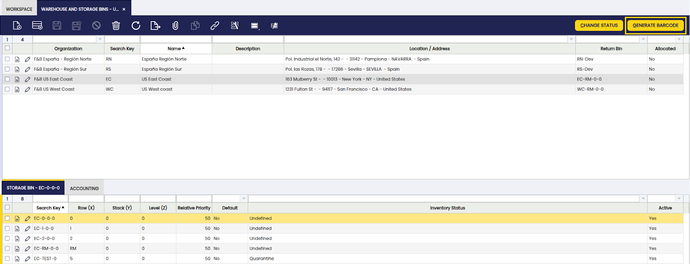

---
tags:
    - Warehouse Management
    - Advanced
    - Inventory
    - Stock
    - Etendo Mobile
---

# Advanced Warehouse Management
:octicons-package-16: Javapackage: `com.etendoerp.advanced.warehouse.management`

## Overview

The **Advanced Warehouse Management** module extends the standard capabilities of Etendo to offer comprehensive, flexible, and automated inventory management, adding integration with mobile devices. Every action performed from the Etendo Mobile is automatically synchronized with Etendo, ensuring complete traceability and consistent updates in the corresponding system windows.

This module allows the user to:

- Manage inventory in multiple predefined and customized statuses.
- Make stock adjustments and physical inventories from mobile devices.
- Automate relocations and statuses with movement rules.
- Integrate traceability using barcodes, which can be scanned from the mobile app.
- Extend and optimize the manual picking and packing process, incorporating the possibility of executing them from Etendo Mobile.

## Initial Setup

To start using this module correctly, the following installation and configuration steps must be completed:

- [x] Install the Warehouse Extensions Bundle.
- [x] Install the Etendo Mobile app.
- [x] Assign the mobile user role to the Warehouse SubApp.
- [x] Load the GS1 Barcode Configs barcode configuration DataSet.
- [x] Configure key parameters in Advanced Warehouse Configuration.
- [x] The necessary task types for picking and packing must be created.
- [x] The picking generation option should be defined at Sales order level.

**Steps to follow:**

!!! info
    To be able to include this functionality, the Advanced Warehouse Management module of the Warehouse Extensions Bundle must be installed. To do that, follow the instructions from the marketplace: [Warehouse Extensions Bundle](https://marketplace.etendo.cloud/#/product-details?module=EFDA39668E2E4DF2824FFF0A905E6A95){target="\_blank"}. For more information about the available versions, core compatibility and new features, visit [Warehouse Extensions - Release notes](../../../../whats-new/release-notes/etendo-classic/bundles/warehouse-extensions/release-notes.md).

1. Install the  Etendo Mobile on a device. Follow the instructions in [Getting Started - Etendo Mobile](../../../../etendo-mobile/getting-started.md)

2. Associate the Advanced Warehouse SubApp with the user's role so that they have access from Etendo Mobile.

    To allow access to the warehouse and inventory management subapp in Etendo Mobile, you need to configure the corresponding roles. Follow the steps described in [Configure Roles and Dynamic SubApps](../../../../etendo-mobile/getting-started.md#configure-roles-and-dynamic-subapps) to assign the subapp to the desired role.

    !!!Info
        This configuration ensures that only users with the appropriate role can access warehouse features from Etendo Mobile.

3. Loading the GS1 Barcode Configs DataSet from the `Enterprise Module Management` window is required.

4. **Advanced Warehouse Configuration**

    `Application` > `Warehouse Management` > `Setup` > `Advanced Warehouse Configuration`

    Before using the module, in the `Advanced Warehouse Configuration` window, you must configure the key variables that define how inventory operations are managed for each organization.

    

    

    Fields to note:

    - **Organization**: allows you to manage which organization will apply the configuration.

    - **Warehouse**: is a non-mandatory field that can be used to apply the configuration to a specific warehouse or to all warehouses in the organization.

    - **Active**: is checked or unchecked to enable or disable the configuration.

    **Barcode Configuration section**

    - **Barcode algorithm**: A barcode algorithm that allows interpretation according to any of the standards defined by international organizations. The options to select are:

        - [EAN 128]()

        - SimpleBarcode

    - **Ai configuration**: A set of application identifiers (AIs) defined by GS1 standards that are used in barcodes such as GS1-128 to distinguish different types of information. Each AI specifies the type of data that follows it, such as product identifiers (GTINs), lot numbers, expiration dates, or quantities. AIs can be of fixed or variable lengths and are critical to correctly interpreting and processing barcode data. It is configured by default since it is included in the dataset.

    - **Search Related Barcode**: checkbox, which allows you to search for the product by more than one barcode.

    !!!Important
        It is mandatory to create a configuration for the organization you are working with. 

    These configurations ensure that inventory adjustments, relocations, and barcode operations follow the logic defined by the organization.

5. **Tasks**

    - The **Task module** must be installed and the necessary **task types** for picking and packing created in the **Task Type** window. To do this, logged in as System Administrator in Etendo, verify that the following task types exist:

        - Warehouse Picking

        - Warehouse Packing

        - Warehouse Picking & Packing

    - **User Algorithm**: Each Task Type will allow selecting the warehouse operator assignment algorithm.

    - **Picking Generation**: In the Advanced Warehouse Management section of the Sales Order window, you will find the Picking Generation field, where you can define if the Picking List generation will be:

        - Automatic (default value)
        - Manual

    - **System Preferences**:

        - `IsTaskInstalled`: This preference must be set to "Y" (Yes) to enable the task module and allow automatic generation of picking tasks when creating the Picking List. If set to "N" (No), no tasks will be automatically generated and the assignment option will not be available when creating the picking.

        - `fromDateCompleted`: Defines the number of days backward from the current date to display tasks with Completed status in Etendo Mobile. For example, a value of 1 will show the tasks completed the previous day; a value of 2 will also include those from two days ago, and so on.

## Master Data Configuration

### Creating Statuses from Etendo

`Application` > `Warehouse Management` > `Setup` > `Inventory Status`

Inventory statuses allow the user to classify and manage stock units according to their condition or operational availability. The system includes some predefined statuses (such as *Blocked*, *Damaged*, *In Quality Control*, etc.), but it is possible to create new custom statuses according to your needs.

!!!info
    For more information on how to setup inventory statuses, visit [Inventory Status](../../../../../developer-guide/etendo-classic/concepts/inventory-status.md.).

The new status will be available in Etendo Mobile to be assigned to new or existing locators using the **Adjust** or **Relocate** options. In the latter case, the rules defined in the `Movement Rules Configuration` window, described below, are used.

### Configuring Inventory Movement Rules in Etendo

`Application` > `Warehouse Management` > `Setup` > `Movement Rules Configuration`

Movement rules allow you to automate the relocation or status change of inventory based on the action being performed. The purpose of this functionality is to automate inventory movements when they change status, exclude certain locations from operations such as picking or reservations due to their status, avoid errors in product handling, manage special products (*Damaged*, *Blocked*, etc.), and automatically handle virtual locations when there is no defined destination.

A virtual storage bin is a location automatically generated by the system to correctly maintain inventory, even when no specific location has been defined for the status to which it is being moved. 

For example: If the *Available* status does not have an associated storage bin, and a user marks a product as *Damaged*, then the system creates a virtual location in which to deposit the affected inventory. This virtual location inherits the properties of the storage bin where the product was located and is associated exclusively with the new status (e.g., *Available*).

This allows you to maintain inventory traceability and consistency, even if the team has not yet defined all physical locations. It also streamlines operations by avoiding errors or blockages when working with exceptional statuses.

To define the movement rules mentioned above, you must enter the **Movement Rules Configuration** window in Etendo.

There you can select an **Organization**, define whether or not it is activated with the **Active** checkbox, which is selected by default. Select a source storage bin in the **From Locator** field and a target storage bin in the **To Locator** field, plus an inventory status in the **To State** field.

The application of these rules can be seen from two features of Etendo Mobile:

- From the **Relocate** option, once you have selected the location defined in a rule, this will move the inventory to the new location and, according to the configured rule, change the inventory status.

- From the **Adjust** option, when you select the new status, this will update the status and, depending on the configured rule, move the inventory to the defined location.

This creates a new record indicating:

- **From Locator**: Source location.

- **To Locator**: Destination location.

- **To State**: State to which the inventory will be transferred.

!!!Note
    If the **To State** field is filled in first, the **To Locator** field will be limited to the Storage Bins that have that state assigned.

!!!Info
    Actions performed using movement rules impact both Etendo Mobile and Etendo's Stock Report, reflecting the location.

### Barcode

Barcode functionality is key for logistic operations, storage bins and products with generated codes will be available to be scanned and managed both from Etendo Mobile and from Etendo, but it requires a previous configuration in Etendo.

- The GS1 Barcode Configs dataset must be loaded.
- From the **Advanced Warehouse Configuration** window, you can define which barcode will be used.

It is possible to generate these unique codes for storage bins in the **Warehouse and Storage Bins** and **Product** windows:

=== "From the **Warehouse and Storage Bins** window"

    1. Select the warehouse.

    2. Select the storage bin.

    3. Click on Generate Barcode and confirm with Done.

        

    4. The generated code is displayed in the Advanced Warehouse Management section of the storage bin.

        

    5. It can also be loaded manually or modified.

=== "From the **Product** window"

    1. Select the product.

    2. Click on Generate Barcode and confirm with Done.

        

    3. The generated code is displayed in the Advanced Warehouse Management section of the product.
        
        

    4. It can also be loaded manually or modified.

    In addition, in the **Product** window, there is a tab called Barcode, where the various barcodes associated with the product, such as supplier codes, are listed. These codes are loaded manually. In order for the system to consider whether or not to search for the product by one of these codes, in the Advanced Warehouse Configuration window there is a Search Related Barcode checkbox. If enabled, when scanning a product from Etendo Mobile, the system will search for matches on all codes listed in the Barcode tab in addition to the header code. If disabled, only the code listed in the product header will be searched for a match.

## Using Etendo Mobile

When logging in to Etendo Mobile, the warehouse operator will be presented with the applications and menus available according to his role.

The flow of inventory management and statuses, involves the functionalities from Etendo Mobile of:

- Physical inventory

- Change of status

- Relocation

!!!Important 
    These actions are possible through the use of the [movement rules](#configuring-inventory-movement-rules-in-etendo) functionality and the creation/use of [custom statuses](#creating-statuses-from-etendo) in Etendo, explained above.

### Physical Inventory and Change of Status

!!!Info
    For more information about how to use this functionality in Etendo, visit [Physical Inventory](../../../basic-features/warehouse-management/transactions.md#physical-inventory).

The Physical Inventory functionality from Etendo Mobile can be done with the following steps:

1. Enter the **Inventory Management** menu.

2. Search and select the product from the list or by the search engine. It is possible to unselect each selected product with the button .

3. When selecting a product, the action buttons are enabled. Click on **Adjust**.

4. Enter the quantity counted in the **Quantity Count** field.

5. Confirm by pressing **Process**.

Once the adjustment has been processed, the result is reflected in real time in the same product list in Etendo Mobile, showing the updated quantity. Likewise, this information will also be seen in Etendo through the Stock Report, ensuring synchronization between both environments.

The **To Status** field, present in this screen, allows you to change the status of the selected inventory. Thus, by adding one more step, the status can be changed:

1. Enter the **Inventory Management** menu of Etendo Mobile.

2. Search and select the product from the list or by the search engine. 

3. Press the **Adjust** button.

4. Enter the quantity to change the status in the **Quantity Count** field.

5. Select the status from the **To Status** field. 

6. Confirm by pressing **Process**.

Thus, the **Adjust** button allows two functions, physical inventory and status change.

### Inventory Relocation

!!!Info
    For more information about how to use this functionality in Etendo, visit [Goods Movement](../../../basic-features/warehouse-management/transactions.md#goods-movement).

The **Relocate** function allows you to relocate inventory by following the steps:

1. Enter the **Inventory Management** menu of Etendo Mobile.

2. Search and select the product from the list or by the search engine.

3. Press the **Relocate** button.

4. Enter the quantity to move in the **Quantity to Relocate** field.

5. Select the destination location in the **To Locator** field.

6. Confirm with **Process**.

The result of this process is reflected both in Etendo Mobile, where the inventory location is updated, and in the Etendo Stock Report, ensuring traceability and visibility of the relocation in both platforms.

### Picking

!!!Info
    For more information about how to use this functionality in Etendo, visit [Picking](../../../optional-features/bundles/warehouse-extensions/picking.md).

The picking process allows the operator to pick the products required for an order efficiently using the mobile application. The complete process flow is detailed below. 

#### Process Start

The process starts in Etendo when a [Picking List is created](../../../optional-features/bundles/warehouse-extensions/picking.md#picking-list-generation) from the sales order, provided that the Task Type Warehouse Picking or Warehouse Picking & Packing is active and a Warehouse Picking task is created.

#### Access to Picking Tasks

When accessing Etendo Mobile and selecting the Picking menu, the Picking main screen with the title Tasks (N) is displayed, where N represents the number of tasks for each status. By default, the tasks in Pending status are displayed.

This screen contains:

- Title with the type of task (Picking).

- Refresh button.

- Back button.

- A search field to filter tasks.

- Quick filters that limit between Pending, In Process or Completed tasks. By default, it shows the Pending filter selected and, in the case of tasks in Completed status, there is a preference where it is defined from which day it will bring completed tasks.

- A list of cards, where each card represents a picking task and includes the following information:

    - Picking List as title: The document reference is shown.

    - Status: the options are
        - Pending
        - In Process
        - Completed

    - Task Type: Warehouse Picking

    - Sales Order: Associated Sales Order/s

VA

There is a Preference to define the days to show tasks in Completed status: `fromDateCompleted`. This preference allows you to define the number of days backwards,from the current date, to be used as a criterion for displaying tasks in Completed status. To configure it, a numeric value must be set in the Value field of the preference, indicating how many days prior to the current day should be included in the display. For example, if the value is 7, the system will show only the tasks completed in the last 7 days.

#### Starting a Task

The warehouse operator must select a card to access the corresponding task. To get to the desired task, he can scroll or enter key data in the search engine.

Once the task is selected, a window opens with the list of products to pick.
This window has the button to start picking, information on the number of products scanned or loaded, the reference picking list number and the list of products to be scanned.
To start the process, click on the "Start Picking" button located at the top, once this is done, the task goes to In Progress status.

SLIDE (3 VAs)

#### Product Picking

Once picking is started, a new window opens with the following items:

- Scan Barcode: activates the camera of the mobile device.

- Scan or type barcode: allows to enter the barcode manually.

- Quantity with + and - buttons: allows manual loading of the quantity to be scanned.

- 0/x Scanned Products: indicates how many products were scanned completely or partially. Where x is the quantity of products to be scanned or loaded.

- List of products (N): list of cards with product information, where (N) is the quantity of products. 

    - Product

    - Status

    - Barcode

    - Locator

    - Movement Quantity: total quantity to be collected

    - Counted Quantity with buttons + and - : that allow to add or subtract one by one the quantity manually.

#### Picking Methods

The system allows flexibility in the mode of operation:

1. Scan the product the requested number of times (ex: 10 scans for 10 units).

2. Manually load "10" in the quantity field and scan once.

3. Enter both code and quantity manually.

4. Manually enter only the quantity in the Quantity field within a product card, using the + and - buttons or by entering the number from the keypad.

When scanning a valid product, the Barcode field is automatically filled in, the associated card is displayed and the value 1 is incremented in the product, if the quantity was not previously changed.

If a quantity other than the default quantity, e.g. 5, was previously entered in the Quantity field, and then the product is scanned, those 5 units will be added directly to the product card.

VA

#### Error Scenarios

If an incorrect code is scanned (does not match any product in the task), the barcode field is highlighted in red, shows a cross and does not add quantity to any product.

If an attempt is made to enter a quantity greater than required, the system will charge the maximum defined in the product card. Once the quantity is completed and the product code is re-scanned or reloaded, the system does not add quantity to the product.

If the quantity is manually loaded into the product card, the system allows loading the maximum quantity requested.

VA

#### Finalizing Picking

If at least 1 unit of any product is registered, the **End Picking** button is enabled. This allows partial picking, i.e. picking only a part of the requested quantity.

Once part or all of the products have been picked, the **Finish Picking** button is enabled. A confirmation message is displayed to confirm that picking has been completed.

**Result**

- A confirmation message is displayed: *Picking completed successfully*.

- The task changes to **Completed** status.

- In case of partial picking, a task is not created for the outstanding quantity.

SLIDE 2 VAs

### Packing

!!!Info
    For more information about how to use this functionality in Etendo, visit [Packing](../../../optional-features/bundles/warehouse-extensions/packing.md).

The packing process allows the operator to pack the products efficiently using Etendo Mobile. The complete process flow is detailed below.

#### Process Start

Packing tasks are linked to a Packing record and the generation process is triggered after the completion of a picking task or from the **Packing** window of Etendo by adding at least one sales order to a new record.

#### Access to Packing Tasks

When accessing Etendo Mobile and selecting the **Packing** menu, the packing main screen with the title Tasks (N) is displayed, where N represents the number of available tasks. This screen contains:

- Title with the type of task (Packing).

- Refresh button.

- Back button.

- A search field to filter tasks.

- Quick filters that limit between Pending, In Process or Completed tasks. By default it shows the Pending filter selected and, in the case of tasks in Completed status, there is a preference where it is defined from which day it will bring completed tasks.

- A list of cards, where each card represents a picking task and includes the following information:

    - Picking List as title: The document reference is shown.

    - Status: the options are:
        - Pending
        - In Process
        - Completed

    - Task Type: Warehouse Picking

    - Customer / Business Partner

    - Goods Shipment: Associated goods shipment/s

    VA

The operator must select a card to access the corresponding task. To get to the desired task he can either scroll or enter key data in the search engine.

When selecting a task, a screen opens with the picking list number and the **Start Packing** button.

VA

#### Product Packaging

When pressing **Start Packing**, the status of the task changes to *In Progress* in both Etendo Mobile and Etendo. The window has the following elements:

- **Scan Barcode** button to activate the device camera.

- **Type Barcode** field for manual entry.

- **Select Box** field that displays the boxes created.

- **Quantity** field that acts as a multiplier to load the quantity when scanning the product.

- **+ Add Box** button that allows you to add boxes.

- A list of product cards, for the Products option, each showing:

    - Product name

    - Status

    - Barcode

    - Quantity

    - Packed Quantity

- A list of boxes, for the option boxes, showing:

    - Box name (or number)

    - Products and their quantities

The view selectors by Product or by Box allow:

- In the **Products** view, when entering a product card, it shows how that product was distributed in the different boxes, allowing you to browse card by card to review the quantities assigned per box.

- In the **Boxes** view, when entering a box, the detailed contents are displayed with the possibility of browsing box by box to check which products are contained in each box.

In both views, it is possible to modify the quantities loaded and add boxes if necessary. However, in order to be able to assign content to the added boxes, one of the following conditions must be met: 

- the total load of products has not yet been completed, or 
- previously assigned quantities are modified (decreased) to allow their relocation to the new box.

VA

#### Packing Execution

- The user selects or creates a box and starts loading products by scanning or manually entering data.

- Each packed product is registered under a specific box.

- You can switch between boxes to distribute products as needed.

VA

**Loading options**:

The system allows flexibility in mode of operation:

- Scan the product the exact number of times (ex: 10 scans for 10 units).

- Scan once and load "10" manually in the Quantity field.

- Enter both code and quantity manually.

- Enter the quantity manually from the Product view or from the Boxes view.

#### Usage Scenarios

**Successful Scenario**

- When the product is successfully scanned, its code and the selected quantity are automatically loaded.

- At the end of the upload, the **Finish Packing** button is pressed to finalize the process. 

- A success message is displayed.

**Error Scenarios**

- If an incorrect code is scanned (does not match any product in the task), a message is displayed indicating that the product is invalid.

- If an attempt is made to enter more than the required quantity, an error message is also displayed.

#### Packing Completion

Once the products have been packed: 

- The system displays a summary per box with the products included.

- The message *Packing completed successfully* is displayed.

- Until confirmed, the contents of the boxes can be edited.

- At the end, you can choose to calculate the weight of the boxes.

SLIDE 2 VAs

### All Tasks

?

DIAGRAM?