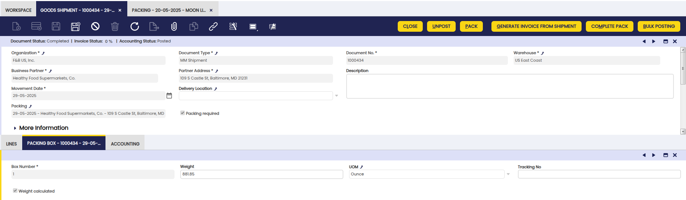
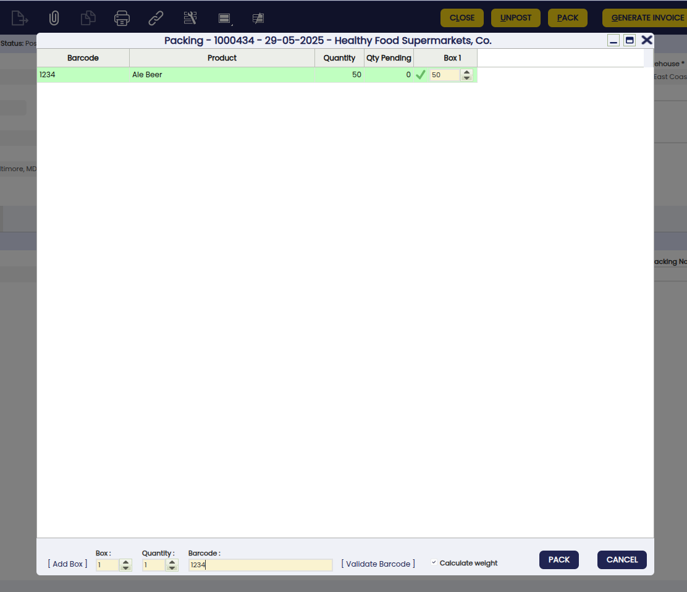
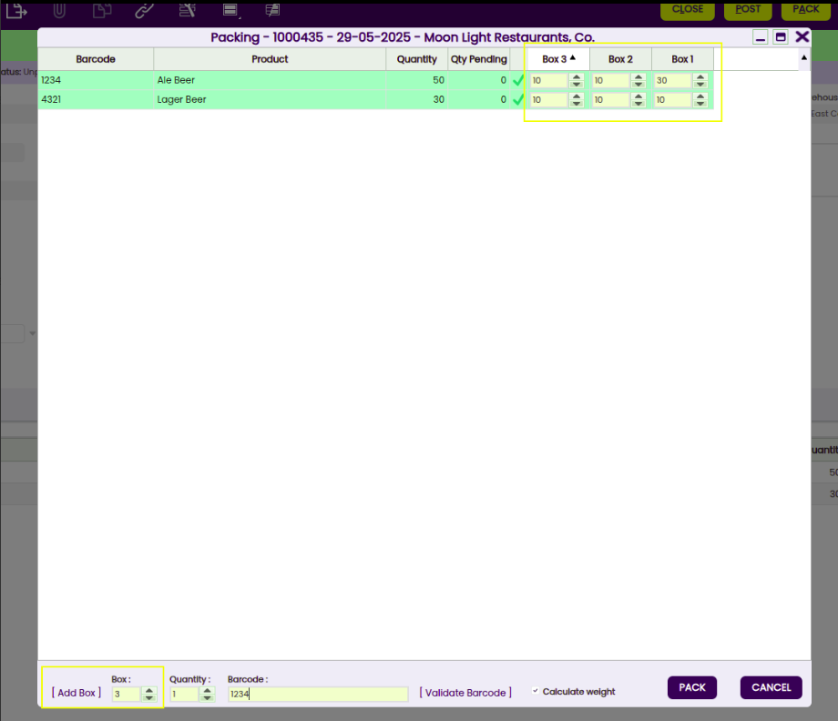
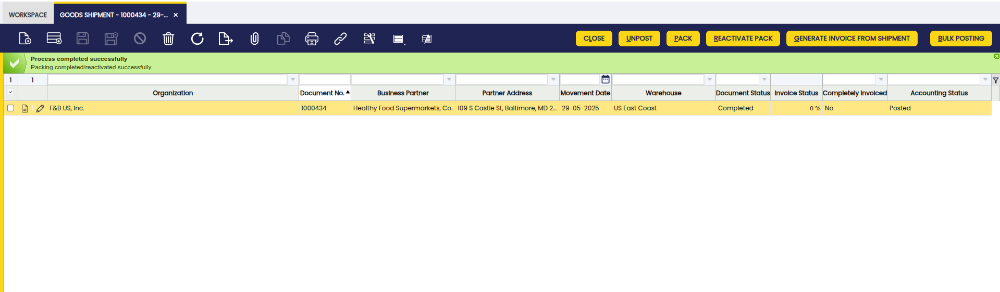
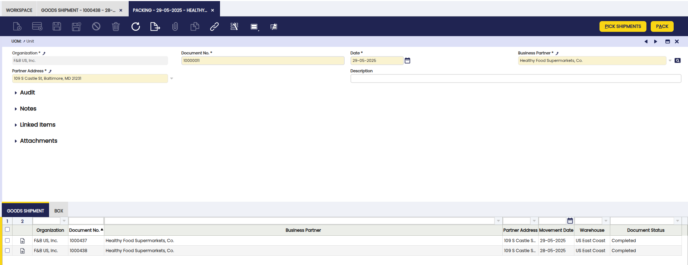

# Packing

:octicons-package-16: Javapackage: `org.openbravo.warehouse.packing`

## Overview

This section describes the Etendo Packing module included in the Warehouse Extensions bundle.

!!! info
    To be able to include this functionality, the Warehouse Extensions Bundle must be installed. To do that, follow the instructions from the marketplace: [_Warehouse Extensions Bundle_](https://marketplace.etendo.cloud/?#/product-details?module=BAE67A5B5BC4496D9B1CA002BBCDC80E){target="_blank"}.  For more information about the available versions, core compatibility and new features, visit [Warehouse Extensions - Release notes](../../../../../whats-new/release-notes/etendo-classic/bundles/warehouse-extensions/release-notes.md).

This module streamlines and enhances the management of **packing operations** within the warehouse. Once a goods shipment has been processed, the packing process begins. Packing is carried out based on each individual goods shipment document. For every product, the warehouse worker determines the appropriate handling unit (box) in which to pack the item. Only products classified as items are eligible for packing.

## Packing window

The packing process can be initiated from the **Goods Shipment** window and/or from the **Packing** window. From either window, the packing procedure will be the same as well as the information about packing shown through the Packing Box tab and Content tab which are displayed in both windows.

If the process is initiated from the Goods Shipment window, it is possible to just do the packing for **one specific shipment**. When doing the packing through the Packing window, it is possible to select **more than one shipment to pack**, since several documents are grouped to be packed all at once or individually. 

When the process is initiated from the Goods Shipment window, the document must have a status of **Completed**, and the **Packing Required** field must be selected. Once these conditions are met, the **Pack** button becomes available, allowing the user to proceed with packing the products.

!!! info
    Whether the process is started from one the Goods Shipment or the Packing window, one record is created in the **Packing window**. So, this is a centralized window where it is possible to check all packs done and complete the packing process. 

### Tabs

The **Packing Box** tab from the Goods Shipment and from the Packing window is an **informative** tab which shows the newly packing boxes with the following:

- **Box Number**: the box number of the Shipment
- **Weight**: indicates the weight of the box
- **UOM**: the UOM of the weight of the box
- **Tracking No**: number to track the shipment

In the Packing Box tab, the **Content** tab is a child tab where the **content of the box** is shown.

- **Product**: identifies an item which is either purchased or sold in this organization.
- **Quantity**: indicates the quantity of product in the box
- **UOM**: the UOM defines a unique non monetary unit of measure

### Buttons

- **Pack**: if the user starts the process from the Goods Shipment window, this button becomes available once the document is in **Completed** status and the **Packing Required** field is checked. If the process is innitiated from the Packing window, this button is visible allowing the user to proceed with packing the products.

When pressing the Pack button:

A pop-up is opened showing all the products with their quantities. The user needs to **type the quantity** for each product in every box. There are three different ways of entering the quantity:

- Using a **barcode reader scanner**: If a product with a barcode exists, it updates the quantity in the corresponding box. Using the barcode reader scanner will be useful in case of packing many products. 
- Manually typing the **quantity in the box**: Typing manually is useful when only a few products are to be packaged, when there are many products it is advisable to use the barcode reader. 
- Typing the **barcode number** and pressing **Validate Barcode**. If a product with that barcode exists, it updates the quantities in the corresponding box.

!!! note
    When the sum of the quantities of all boxes is the same as the Quantity of the product, then it is marked as validated (green color). Packing will be possible once all the products are validated. So, when this process is completed by clicking the Pack button from the pop-up, no further actions are allowed.

- **Add Box**: New boxes can be added by pressing the Add Box.

!!! info
    After adding the goods shipment and the packing action has been performed if the user removes any of the goods shipments from being packed then, all boxes are deleted and the packing must start again. 

- **Calculate Weight**: Calculate weight by default. The flag **Calculate weight** allows calculating (or not) the weight for each of the boxes. This is configurable and the flag can be marked by default or not by using a preference. To do so:

    - Go to [Preference](../../../basic-features/general-setup/application.md#preference) window and select the property Calculate Weight packing. 
    - Value = Y

!!!note
    Out of the box there is no preference defined so the flag is not marked. 

!!!info
    In case there is something missing in the configuration the packing process goes ahead but a warning is shown telling the weight could not be calculated properly. 

!!! info
    If the above message is shown, the UOM must be configured in both the OrganizatiOn and in each product. Even if each product has a UOM configured, when packing it will take the UOM defined in the Organization and the corresponding conversions will be made if necessary.

When this happens, it is still possible to calculate the weight once the setup is correctly done. To do so, press the Pack button again and click Pack. The system will calculate the weight for each of the boxes. 

**Configuration**

In Etendo, it is possible to calculate the weight of the packing, do this by checking the **calculate weight** box in the pop-up window. Prior to this, some configurations are needed in order to calculate the weight for each box:

- **Product window**: Here it is possible to define the weight and the unit of measure for the product. 
    - Fields:
        - Weight
        - UOM Packing: It only shows uoms that are defined as Is weight

- **Unit of measure window**: This module adds a new field **Is weight**. Here it is possible to define the conversion between uoms, that is, between the uom packing of the product and the uom packing of the box.

- **Organization window**: This module adds a new field UOM Packing. This uom is the default one for every box. This is needed to make the conversion between the UOM Packing of the Product and the UOM Packing of the box. 

Let's see some examples of how the weight is calculated:

- Example 1
    - Product A:
        - Unit of measure: Unit
        - Weight: 1.5
        - Unit of measure packing: Kg
        - Unit of measure boxes: Kg
If the box contains 5 units of that product then the calculated weight for the box will be: 7.5 Kg

- Example 2
    - Product B
        - Unit of measure: Unit
        - Weight : 850
        - Unit of measure packing: gr
        - Unit of measure boxes: Kg
        - Conversion rate: 1/1000
If the box contains 20 units of that product then the calculated weight for the box will be: 17 Kg

- **Complete Pack**: Once all boxes and their content have been created, press the button Complete Pack. The information of the boxes such as the weight, UOM and Tracking No. cannot be edited. This button **completes** all boxes at once. This button is present in both, the Goods Shipment and the Packing window. 

- **Reactivate Pack**: Once everything has been completed the Reactivate Pack button allows the user to **reactivate** the packing and **edit** whatever information is needed. This button is present in both, the Goods Shipment and the Packing window. 

If the user starts the process from the Packing window, it will be possible to select **more than one shipment to pack**. Remember that the packing process is the same as explained above, except that from this window, the **Pick Shipments** button allows to do the following: 

- **Pick Shipments**: This button  allows selecting **all the available goods shipments** that need to be packed. The criteria to show which goods shipments can be selected is the following:

      - Goods shipments that belong to that business partner and that address.The system des not select goods shipment that belong to the same business partner but with a different address. 

      - Goods shipments that are marked as Packing Required.

      - Goods shipments that have not been packed.

After selecting the desired goods shipments, the process continues from the Pack button as mentioned above.

