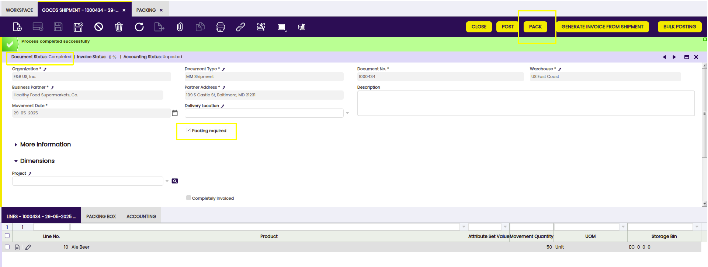

# Packing

:octicons-package-16: Javapackage: `org.openbravo.warehouse.packing`

## Overview

This section describes the Etendo Packing module included in the Warehouse Extensions bundle.

!!! info
    To be able to include this functionality, the Warehouse Extensions Bundle must be installed. To do that, follow the instructions from the marketplace: [_Warehouse Extensions Bundle_](https://marketplace.etendo.cloud/?#/product-details?module=BAE67A5B5BC4496D9B1CA002BBCDC80E){target="_blank"}.  For more information about the available versions, core compatibility and new features, visit [Warehouse Extensions - Release notes](../../../../../whats-new/release-notes/etendo-classic/bundles/warehouse-extensions/release-notes.md).

This module streamlines and enhances the management of **packing operations** within the warehouse. Once a goods shipment has been processed, the packing process begins. Packing is carried out based on each individual goods shipment document. For every product, the warehouse worker determines the appropriate handling unit (box) in which to pack the item. Only products classified as items are eligible for packing.

## Initial Configuration

In Etendo, it is possible to calculate the **weight of the packing**. To do this, some prior configurations from other windows are needed in order to calculate the weight for each box:

- [**Product window**](../../../basic-features/master-data-management/master-data.md#product): Here it is possible to define the weight and the unit of measure (UoM) for the product. 
    - Fields to Note:
        - Weight
        - UOM Packing: It only shows units of measures that are defined as `Is weight`

- [**Unit of measure window**](../../../basic-features/master-data-management/product-setup.md#unit-of-measure): This module adds a new field **Is weight**. Here it is possible to define the conversion between UoM, that is, between the UoM packing of the product and the UoM packing of the box.

- [**Organization window**](../../../basic-features/general-setup/enterprise-model.md#organization): This module adds a new field UOM Packing. This UoM is the default one for every box. This is needed to make the conversion between the UOM Packing of the Product and the UOM Packing of the box. 

- Once the user is managing the packing of the products in the pop-up window which will be explained in the [Pack Button](#buttons) section, the **Calculate weight** checkbox allows calculating (or not) the weight for each of the boxes. This is configurable and the flag can be marked by default or not by using a preference. 

    To do so: 

    1. Go to [Preference](../../../basic-features/general-setup/application.md#preference) window.
    2. Select the Property `Calculate Weight Packing`. 
    3. Set the value `Y`

!!!warning
    In case there is something missing in the configuration the packing process goes ahead but a warning is shown telling the weight could not be calculated properly. 
    
    

    If the above message is shown, the UOM must be configured in both the Organization and in each product. Even if each product has a UOM configured, when packing it will take the UOM defined in the Organization and the corresponding conversions will be made if necessary.

## Packing Window

:material-menu: `Application` > `Warehouse Management` > `Transactions` > `Packing`

The packing process can be initiated from the **Packing** window and/or from the [Goods Shipment](../../../basic-features/sales-management/transactions.md#goods-shipment) window. From either window, the packing procedure will be the same as well as the information about packing shown through the `Packing Box` tab and Content tab which are displayed in both windows.

!!! info
    If the process is initiated from the Goods Shipment window, it is possible to just do the packing for **one specific shipment**. When doing the packing through the Packing window, it is possible to select **more than one shipment to pack**, since several documents are grouped to be packed all at once or individually. 

The system runs automatic background processes that varies depending on the configuration. In certain situations, some of these processes can fail without the user noticing immediately.

In order to provide greater visibility, the system displays a **warning message** at different stages of the process, such as when creating a Pack, completing it, or reactivating it that includes a link to the Task window. From there, the user can check the details of each process executed and review the corresponding logs, ensuring better control over the correct completion of operations.

- For a **Packing tasks**:

    - Process Packing
    - Process Packing Header
    - Complete Packing from Shipment
    - Complete Packing from Packing

### Header

Fields to note: 

- **Organization**: an organization is a unit of your client or legal entity.
- **Document No**: packing identification number is generated automatically.
- **Date**: the packing creation date. 
- **Business Partner**: the client to whom the packing is being made will be selected.
- **Partner Address**: the Partner address indicates the location of a Business Partner.
- **Description**: an optional description limited to 255 characters.

!!! info
    In case the process is initiated from the Goods Shipment window, the document must have a status of **Completed**, and the **Packing Required** field must be selected. Once these conditions are met, the **Pack** button becomes available, allowing the user to proceed with packing the products.

    

    Whether the process is started from one the Goods Shipment or the Packing window, one record is created in the **Packing window**. So, this is a centralized window where it is possible to check all packs done and complete the packing process. 

### Packing Box Tab

The **Packing Box** tab from the Goods Shipment and from the Packing window is an **informative** tab which shows the newly packing boxes.

Fields to note:

- **Box Number**: the box number of the Shipment
- **Weight**: indicates the weight of the box
- **UOM**: the UOM of the weight of the box
- **Tracking No**: number to track the shipment
- **Weight Calculated**: Status that determines whether the weight has already been calculated or not.

### Content Subtab
In the Packing Box tab, the **Content** tab is a child tab where the **content of the box** is shown.

Fields to note:

- **Product**: identifies an item which is either purchased or sold in this organization.
- **Quantity**: indicates the quantity of product in the box
- **UOM**: the UOM defines a unique non monetary unit of measure

### Buttons

- **Pick Shipments**
    
    This button is **only shown** in the Packing window since it allows selecting **all the available goods shipments** that need to be packed.

    

    The criteria to show which goods shipments can be selected is the following:

    - Goods shipments that belong to the business partner defined in the header and in the same address.
    - Goods shipments that are marked as Packing Required.
    - Goods shipments that have not been packed.

    After selecting the desired goods shipments, the process continues from the Pack button

- **Pack**

    !!! info
        
        - If the user starts the process from the **Goods Shipment** window, this button becomes available once the document is in **Completed** status and the **Packing Required** field is checked.
        - If the process is initiated from the **Packing** window, this button is visible once the Goods Shipment is created and under Completed status allowing the user to proceed with packing the products.

    When pressing the Pack button:

    

    A pop-up is opened showing all the products with their quantities. 
    
    1. The user needs to **type the quantity** for each product in every box.
    
        There are three different ways of entering the quantity:

        - Using a **barcode reader scanner**: If a product with a barcode exists, it updates the quantity in the corresponding box. Using the barcode reader scanner will be useful in case of packing many products. 
        - Manually typing the **quantity in the box**: Typing manually is useful when only a few products are to be packaged, when there are many products it is advisable to use the barcode reader. 
        - Typing the **barcode number** and pressing **Validate Barcode**. If a product with that barcode exists, it updates the quantities in the corresponding box.

        !!! note
            When the sum of the quantities of all boxes is the same as the Quantity of the product, then it is marked as validated (green color). Packing will be possible once all the products are validated.

    2. If necessary, boxes can be added with the **Add Box** button.

        

        !!! info
            After adding the goods shipment, and the packing action has been performed if the user removes any of the goods shipments from being packed then, all boxes are deleted and the packing must start again. 

    3. The flag **Calculate weight** allows calculating (or not) the weight for each of the boxes. This is configurable and the flag can be marked by default or not by using the previously configured preference.

    4. Once all the products have been validated in their corresponding boxes, the process is completed by clicking on the **Pack** button.

- **Complete Pack**

    Once all boxes and their content have been created, press the button Complete Pack. The information of the boxes such as the weight, UOM and Tracking No. cannot be edited. This button **completes** all boxes at once. This button is present in both, the **Goods Shipment** and the **Packing** window. 

- **Reactivate Pack**
    
    Once everything has been completed the Reactivate Pack button allows the user to **reactivate** the packing and **edit** whatever information is needed. This button also is present in both, the **Goods Shipment** and the **Packing** window. 

    

---

This work is a derivative of [Warehouse Management](http://wiki.openbravo.com/wiki/Warehouse_Management){target="\_blank"} by [Openbravo Wiki](http://wiki.openbravo.com/wiki/Welcome_to_Openbravo){target="\_blank"}, used under [CC BY-SA 2.5 ES](https://creativecommons.org/licenses/by-sa/2.5/es/){target="\_blank"}. This work is licensed under [CC BY-SA 2.5](https://creativecommons.org/licenses/by-sa/2.5/){target="\_blank"} by [Etendo](https://etendo.software){target="\_blank"}.