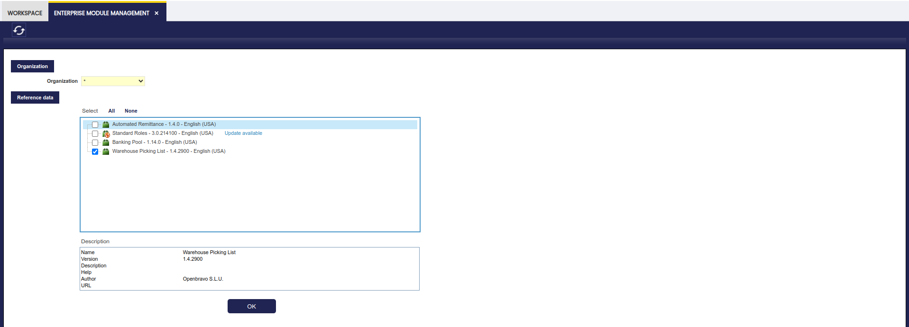
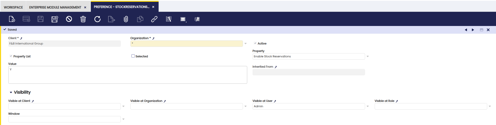
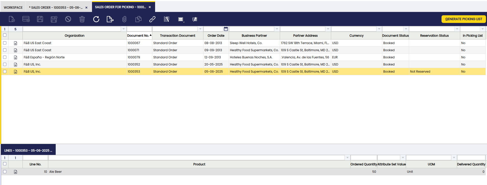

# Picking

:octicons-package-16: Javapackage: `org.openbravo.warehouse.pickinglist`

:octicons-package-16: Javapackage: `org.openbravo.warehouse.structure`

## Overview

This section describes the Etendo Picking module included in the Warehouse Extensions bundle.

!!! info
    To be able to include this functionality, the Warehouse Extensions Bundle must be installed. To do that, follow the instructions from the marketplace: [_Warehouse Extensions Bundle_](https://marketplace.etendo.cloud/?#/product-details?module=BAE67A5B5BC4496D9B1CA002BBCDC80E){target="_blank"}.  For more information about the available versions, core compatibility and new features, visit [Warehouse Extensions - Release notes](../../../../../whats-new/release-notes/etendo-classic/bundles/warehouse-extensions/release-notes.md).

This module implements and enhances the management of the **picking operations** within a warehouse. To manage and deliver the picking lists the module makes intensive use of 2 core features that must be enabled:

- [Stock reservations](../../../basic-features/warehouse-management/transactions.md#stock-reservation): When picking lists are created the products included in them are reserved. This means that no other picking list or any other process can use those products.

- [Document status project](): With this feature the user can easily know whether a sales order is pending to be delivered or not.

**Direct Picking List to Customer**: These picking lists generate the Goods Shipments from the locations where the items are stored. The Goods Shipments are created in Draft status when the Picking List is created. Picking List is completed once Goods Shipments are processed.

## Configuration

In order to generate a picking list, some configuration is needed.

- **Document type**: The Picking list document type must be defined for each organization.
The module provides a dataset with basic document types that can be applied. Go to [Enterprise module management](../../../basic-features/general-setup/enterprise-model.md#enterprise-module-management) and apply the **Warehouse Picking List dataset** for each organization using Picking Lists. Once it is applied, the document types are created.

The dataset adds two new document types, with their own Document Sequences which will apply the following on each organization:

**Picking List**: Used for **Direct Picking List to Customer** picking list type. Picking List using this document type creates the shipments from the picking location. When they are completed the Goods Shipment is completed.

- **Reservations Preference**

A preference needs to be configured in order to enable Stock Reservations feature.
As Client Admin, go to the [Preference window](../../../basic-features/general-setup/application.md#preference) and create a new one as shown below:

## Warehouse Picking List

**Picking Lists** can be generated by the **Generate Picking List button** available in the [Sales Order](../../../basic-features/sales-management/transactions.md#sales-order) window. Or they can be created manually from the **Warehouse Picking List** window.

In both cases the user has to select the Sales Orders to be included in the Picking List. The sales order needs to be Booked and pending to be shipped. This is, the delivery status must be below 100%.
The module adds a new flag **In Picking List** in the Sales Order Header. This is checked when one of the lines of the sales order is present in a Picking List that is not closed. Using this flag and the Delivery Status and Delivery Date fields, it is possible to filter the Sales Order window to identify the Sales Orders needed to be included in a Picking List.

!!!info
    The module does not support the creation of Picking List for the same Sales Order for multiple Warehouses. Since the Sales Order has already a Warehouse assigned in the header, the Picking List will be created against this Warehouse only.

The flow to verify and process a picking list is:

- The picking list is in draft status.
- The warehouse manager prints the document. The date printed field is updated.
- The warehouse worker picks the items.
- If there are issues (not enough stock, items in different locators, etc.) prior to validating the picking list the warehouse manager edits/updates the corresponding lines.
- The warehouse manager validates the document and processes it.

Document no: The document number is usually automatically generated by the system and determined by the document type of the document.

Status: There are different status: Completed, draft and cancelled.

Document type: The Document Type determines document sequence and processing rules.

Document date: The date when the document was created.

Description: A description is limited to 255 characters.

Date printed: Indicates the Date that a document was printed.

VA 

### Buttons

- **Generate Picking List** button from the Sales Order window supports multiple selection and is visible when all selected orders are **booked and they are not completely shipped**. 

When the button is clicked a new window is opened. The first field to be filled is the Picking List type. Based on the selected type additional fields need to be set.
When a Sales Order line is included in a Picking List it must have a related reservation. The stock reserved is the one used in the Picking List. The processes that generate the Picking Lists automatically create the reservations if the Sales Order Line does not have one.

When **Direct Picking List to Customer type** is selected the process generates a Good Shipment in **Draft status** for each selected Sales Order. The Picking Lists are generated also in Draft status using a Document Type that has the Use Outbound Location flag unchecked.

The generated Picking Lists can be grouped using the Grouping Criteria field on Generate Picking List process window. 

The available options are:

- **Not Group** (default option): A Picking List is generated for each Sales Order selected.

- **Group by Business partner**: The picking lists are grouped by Sales Order's Business Partner and Organization. One Picking List is created for each customer and organization.

- **Group by Organization**: The picking lists are grouped by Sales Order's Organization. One Picking List is created for each organization.

The default Grouping Criteria can be configured using a preference:

- Name of the preference: Group Picking List

- Values:

        - Not Group: NG
        - Group by Business partner: GBP
        - Group by Organization: GO

!!!info
    If there is no stock for at least one of the products a message is shown telling that a partial Picking List is created. Reservation, picking list and good shipment are created with the available stock.

!!!info
    If none of the products has stock, no picking list, no good shipment and no reservation is created.And an error message is shown.

- **Process**: The selected picking list and its associated good shipment are processed.

- **Cancel**: The associated goods shipment and the picking list header are deleted. Except when the lines are in a Goods Shipment that is processed. Those lines, its processed goods shipment and picking list header are not deleted. In that case, the status of the picking list is set as Canceled.

- **Validate**: When the warehouse worker has picked all the items, the manager can verify them using this process.
The button opens a window showing all the items, for each one the **Qty Verified** field has to be set . There are several ways to do it:

        - Using a bar-code reader scanner. If a product with that bar-code exists in the grid it increases the quantity by 1 unit.

        - Manually changing the quantity in the line.

        - Typing the bar-code and pressing Validate Barcode. If a product with that bar-code exists, it increases the Qty Verified by the quantity set in the Quantity field.

!!!note
    When the Qty Verified is the Quantity, the Qty Pending is zero and the line is marked as verified (green color). When all the lines are verified, the picking list can be processed. It also processes the related Good Shipments.

- **Edit Lines**: A window is opened in order to be able to update the movement quantity.

Lines can **only be edited** by pressing the Edit Lines button. There it is possible to select different storage bins and modify the quantity that is going to move from each of the storage bins. When updating the movement quantity there are some conditions to fulfill:

        - The sum of Quantity cannot be higher than ordered quantity.

        - The Quantity cannot be higher than Available Quantity in the storage bin.

        - Once the quantities are modified, the Done button needs to be pressed in order to save the changes and update the reservation quantities of each storage bin.

## Sales Order for Picking 

The Sales Order for Picking window allows **filtering from all the sales orders** that are in the system which are ready for picking.

The sales orders must be:

- Completed

- Have the box Exclude from Picking List unchecked

When the sales orders are created, the Reservation Status is Not  Reserved. 

!!!info
    Once the picking process is complete, the user may continue with the packing process. 
    
    For more information visit: [packing](../../bundles/warehouse-extensions/packing.md)

