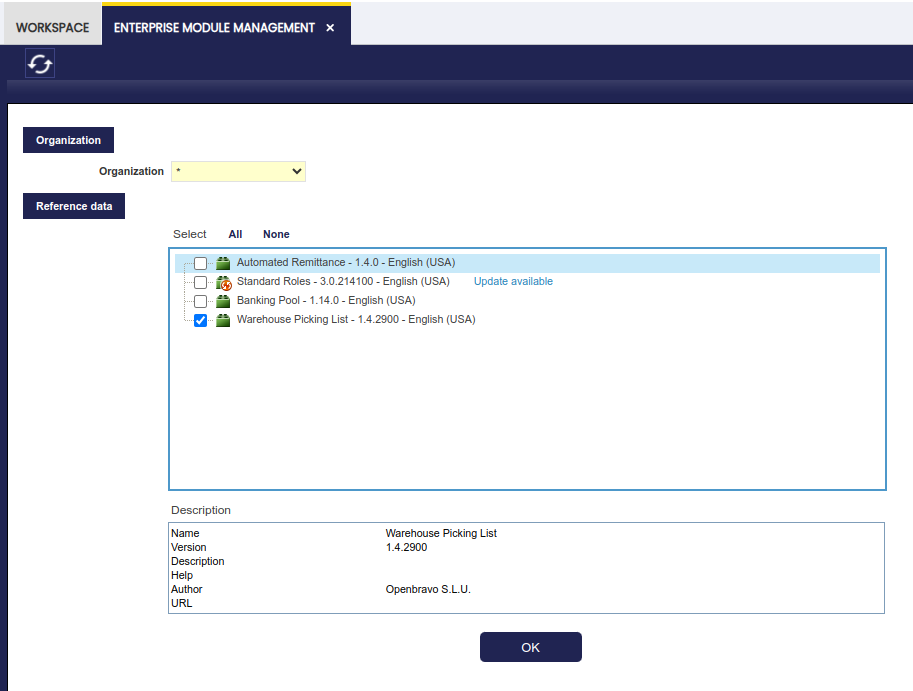

# Picking List

:octicons-package-16: Javapackage: `org.openbravo.warehouse.pickinglist`

:octicons-package-16: Javapackage: `org.openbravo.warehouse.structure`

## Overview

This section describes the Etendo Picking module included in the Warehouse Extensions bundle.

!!! info
    To be able to include this functionality, the Warehouse Extensions Bundle must be installed. To do that, follow the instructions from the marketplace: [_Warehouse Extensions Bundle_](https://marketplace.etendo.cloud/?#/product-details?module=BAE67A5B5BC4496D9B1CA002BBCDC80E){target="_blank"}.  For more information about the available versions, core compatibility and new features, visit [Warehouse Extensions - Release notes](../../../../../whats-new/release-notes/etendo-classic/bundles/warehouse-extensions/release-notes.md).

This module implements and enhances the management of the **picking operations** within a warehouse. To manage and deliver the picking lists the module makes intensive use of 2 core features that must be enabled:

- [Stock reservations](../../../basic-features/warehouse-management/transactions.md#stock-reservation): When picking lists are created the products included in them are reserved. This means that no other picking list or any other process can use those products.

- Document Status Project: With this feature the user can easily know whether a sales order is pending to be delivered or not.

In Etendo there are 2 types of picking lists available: 

- **Outbound Picking** is a process within warehouse management that involves the preparation and movement of products from their storage bins in the warehouse to a **specific outbound location** for subsequent packaging and shipment to the customer.

- **Direct Picking List to Customer** is a process where products are shipped without going through an **intermediate outbound bin**.

## Initial Configuration

In order to generate picking lists, some configuration is needed:

- **Document type**: The Picking list document type must be defined for each organization. The module provides a dataset with basic document types that can be applied. Go to [Enterprise Module Management](../../../basic-features/general-setup/enterprise-model/enterprise-module-management.md) and apply the **Warehouse Picking List dataset** for each organization using Picking Lists. Once it is applied, the document types are created.

    

    The dataset adds three new document types, with their own Document Sequences which will apply the following on each organization:

    

    1. **Picking List**: Used for **Direct Picking List to Customer** picking list type. By using this document type the system creates the shipments from the picking location. When they are completed the Goods Shipment is completed.

    2. **Picking List outbound**: Used for **Outbound Picking List**, therefore the **Use Outbound location** flag is set as **Yes** by default. This means that a Goods Movement needs to be created to move the goods from goods' storage bin to outbound storage bin. In this case, a storage bin of the warehouse needs to be defined as **Outbound**.

        - Generate Shipment on PL Completion flag: if checked Etendo generates Goods Shipments if the Picking List is completed. A Goods Shipment document type needs to be selected in the field **Shipment for Picking**.

    3. **Grouping Pick List**: When using Outbound location and the **Is Grouping Picking List** flag checked. This document type is used when grouping different picking list in one list.

    !!! note
        These document types can be modified or new ones created manually. For example, if it is not desired to generate the Goods Shipment when they are completed or to modify the document sequences format.

- **Warehouse Outbound Location**: When using Outbound Picking List, it is needed to configure the **outbound locations on each warehouse** that ships goods to customers. In **Warehouse and Storage Bins** window, select the warehouse and in the Storage Bin tab, create or select the storage bin that represents the outbound location of that warehouse. Fill the type field selecting Outbound.

    

- **Picking List Auto Close Preference**: When using Outbound Picking List, in order to set automatically Picking List status from All Confirmed to Closed, a preference `Picking List Auto Close` with default value N is available. Users could enable this preference to automatically close picking when all lines are confirmed.

- **Reservations Preference**: A preference needs to be configured in order to enable Stock Reservations feature.

    As Client Admin, go to the [Preference window](../../../basic-features/general-setup/application.md#preference) and create a new one as shown below:

    

## Picking List Generation

**Picking Lists** can be generated by the **Generate Picking List button** available in the [Sales Order](../../../basic-features/sales-management/transactions.md#sales-order) window and/ or created manually from the **Warehouse Picking List** window. In both cases the user has to select the Sales Orders to be included in the Picking List. The sales order needs to be **Booked and pending to be shipped**, that is, the delivery status must be below 100%.

The system runs automatic background processes that varies depending on the configuration. In certain situations, some of these processes can fail without the user noticing immediately.

In order to provide greater visibility, the system displays a **warning message** at different stages of the process, that includes a link to the Task window. From there, the user can check the details of each process executed and review the corresponding logs, ensuring better control over the correct completion of operations.

The processes that must be verified are as follows:

- For a **Picking tasks with active Packing task creation**:

    - Create Shipment
    - Create Picking List
    - Process Picking List
    - Create Packing Task

- For a **Picking tasks without creating a Packing task**:

    - Create Picking List
    - Create Shipment
    - Process Picking List

Example of logs without errors

Example of logs with errors

=== ":material-playlist-check: From the Sales Order window"

    ### From the Sales Order window
    :material-menu: `Application` > `Sales Management` > `Transactions` > `Sales Order`

    From the [Sales Order](../../../basic-features/sales-management/transactions.md#sales-order) window, the Generate Picking List button supports multiple selection and is visible when all selected orders are booked  and not completely shipped. Using this process **both types of Picking Lists can be created**: Direct Picking Lists and Outbound Picking Lists.

    When installing this module, in the Sales Order Header a flag **Pending Picking List** is added. This is checked when one of the lines of the sales order is present in a Picking List that is not closed. Using this flag and the Delivery Status and Delivery Date fields, it is possible to filter the Sales Order window to identify the Sales Orders needed to be included in a Picking List.

    The Sales Order Header also includes the flag **Exclude from Picking List**. If this flag is set to Yes, the Generate Picking List button will not be displayed for that order.

    !!!info
        The module does not support the creation of Picking Lists for the same Sales Order for **multiple warehouses**. Since the Sales Order has already a Warehouse assigned in the header, the Picking List will be created against this Warehouse only.

    !!!note
        When a Sales Order line is included in a Picking List it must have a related reservation. The stock reserved is the used in the Picking List. The processes that generate the Picking Lists automatically create the reservations if the Sales Order Line does not have one.

    #### Buttons

    - **Generate Picking List**

        Allows generate the selection document for the picking process. This document contains the sales order information and serves as the basis for organizing the preparation of the goods.

        The generation of this document is a key step in the logistics workflow, as it brings together in one place all the information required to collect items from the warehouse. This allows the user to manage picking tasks in a more orderly manner and ensure that each order is processed correctly.
        
        When the button is clicked a pop-up window is opened. The first field to be filled is the Picking List type. Based on the selected type additional fields need to be set.

        

        ===  "**Direct Picking List to Customer**"
            
            It means that the products are picked **directly from the storage locations** (e.g. shelves or bins) and **prepared for shipment** to the customer without moving them to a specific intermediate location within the warehouse. When selected, the process generates a Goods Shipment in **Draft status** for each selected Sales Order. The Picking Lists are generated also in Draft status using a Document Type that has the Use Outbound Location flag unchecked.

            The generated Picking Lists can be grouped using the Grouping Criteria field on Generate Picking List process window. 

            The available options are:

            - **Not Group** (default option): A Picking List is generated for each Sales Order selected.

            - **Group by Business partner**: The picking lists are grouped by Sales Order's Business Partner and Organization. One Picking List is created for each customer and organization.

            - **Group by Organization**: The picking lists are grouped by Sales Order's Organization. One Picking List is created for each organization.
                
            ---

            The default Grouping Criteria can be configured using a preference:
            
            - Name of the preference: `Group Picking List`
            - Possible values:
                - Not Group: NG
                - Group by Business partner: GBP
                - Group by Organization: GO
            
            ---
        
            !!!warning
                If there is no stock for at least one of the products a message is shown telling that a partial Picking List is created. Reservation, picking list and goods shipment are created with the available stock.

            !!!warning
                If none of the products has stock, no picking list, no goods shipment and no reservation is created. And an error message is shown.

            When the picking list is generated from a Sales Order, a [Goods Shipment](../../../basic-features/sales-management/transactions.md#goods-shipment) is automatically created in **draft status**. Then, the warehouse agent picks the products from the locations indicated on the picking list.
            
            Once the products are verified to be correct (using the Validate button or a barcode reader)  from the **Warehouse Picking List** window, the picking list is processed, and the Goods Shipment is completed, meaning that the products are ready to leave the warehouse for the customer.

        === "**Outbound Picking List**"
            It means that the products are picked from the storage bins, but instead of taking them directly to the packing/shipping area, they are moved to a **predefined outbound storage bin** in the warehouse. From this location, the products are packed and shipped.

            !!! info
                When generating the outbound picking list from a sales order or manually, [Goods Movements](../../../basic-features/warehouse-management/transactions.md#goods-movement) are created in draft status to move the products from the storage locations to the outbound location.
                In this window, the Process Movement button ends the process.

            

            The warehouse agent picks the products and takes them to the designated issue location (e.g., a specific area of the warehouse for products ready for shipment).

=== ":material-playlist-plus: From Warehouse Picking List window"

    ### From Warehouse Picking List window
    :material-menu: `Application` > `warehouse Management` > `Transactions` > `Warehouse Picking List`

    From the **Warehouse Picking List** window, it is possible to only **create Outbound Picking Lists** but it is not possible to manually create **Direct Picking Lists**. The last mentioned type of list is generated from the Sales Order window and the process can be finished from the Warehouse Picking List window. 

    === "**Outbound Picking List**"
        
        #### Outbound Picking List

         
        
        ##### Header
        
        From the header, it is possible to create an Outbound Picking List: 
        
        Fields to note: 

        - **Organization**: an organization is a unit of your client or legal entity.
        - **Document No.**: picking identification number is generated automatically.
        - **Document Type**: it determines document sequence and processing rules.
        - **Outbound Storage Bin**: it is necessary to set up an outbound storage bin in each warehouse that ships. This bin is defined in the **Warehouse and Storage Bins** window by selecting a bin with the type **Outbound**.
        - **Document Date**: date when the Picking List is done and is expected to be completed.
        - **Description**: an optional description limited to 255 characters.
        - **Date printed**: indicates the Date that a document was printed. 
        - **User/contact**: the User identifies a unique user in the system. This could be an internal user or a business partner contact. 

        !!! info
            When an outbound picking list is generated, Goods Movements are created in draft status to move the products from the storage bins to the outbound bin.

        !!! info
            Products included in the outbound picking list are automatically reserved, ensuring that they cannot be used by other processes or picking lists.

        ##### Buttons

        - **Sales Order**
            The Sales Orders button opens a window with a grid containing all the Sales Orders pending to be delivered that **are not on an open Picking List**. 
            The sales orders that are shown are filtered by the warehouse of the outbound bin defined in the header of the picking list.
            It could happen that a sales order has items reserved in a warehouse **different than the warehouse defined in its header** (due to definition of "qty on hand" per organization and priorities). In that case the picking list will try to re-allocate items from that warehouse to the warehouse of the outbound bin. If there is no way to perform this action the system will throw an error.

            !!!note
                The system assumes that picking bins and the outbound bin must belong to the **same warehouse**. That's the reason why the system always try to reallocate items in the above scenario and also filters sales orders based on the warehouse of the outbound bin.

        - **Assign**
            This button assigns the selected picking list to the **warehouse agent** chosen in the pop-up window.

        - **Re Assign**
            This button allows the user to **change the worker assigned** to a Picking List by a new one. Only when the status of the document is Assigned.
        
        ##### Movement Line Tab

        The **Movement Line** tab is shown when **Outbound Picking lists** are included. This includes all the Goods Movements related to the Picking List. 

        

        Fields to note:

        - **Stock Reservation**: the reservation related to the movement, that links with the sales order line.
        - **Incidence Reason**: in case the line is in Incidence status can show a description of the incidence.
        - **Group Picking List** and **Warehouse Picking List**: in case a picking list is grouped shows the link to the original or the grouping picking list.

        ###### Buttons from the Movement Line Tab

        - **Edit Item**

            Edits the lines to change the attributes of the product to be picked. It is possible to select **different attributes and storage bins**. The total quantity must be equal or lower than the movement quantity of the related Stock Reservation. The process updates the reserved stock and the goods movements, deleting or creating new ones if necessary.

            

        - **Manage Incidence**

            In case there is a problem with the line an incidence can be raised. When the incidence is raised it is possible to set a description of the problem. When a line is in **Incidence status** the status of the document changes to **Incidence**. When the line is already in status Incidence and the incidence has been solved pressing the button again changes the status of the line to **Pending**. Then, the status of the document is also reset to the corresponding value depending on the status of all the lines.

            

        - **Confirm**: 
        
            This button sets the line in Confirmed status. It updates the picking list status:
            - If there is a line in Incidence status the status is kept in `Incidence`.
            - If all the lines are in Confirmed status, `All Confirmed` status is set.
            - In any other case `In Progress` is set.

        - **Reject** 
        
            This button sets the line in Pending status. This is necessary in case the warehouse agent wants to change anything of the line. To do so, it is necessary to click the Edit button: 
        
            It updates the picking list status:
            - If there is a line in Incidence status the status is kept in Incidence.
            - In any other case In Progress is set.

        - **Close**
        
            This button completes all the goods movements of the picking list that are in **confirmed status** and updates the status of the Picking List to **Done**. In case the picking list's document type has the Generate Shipment flag enabled the required goods shipments are created in Draft status.

            

    ===  "**Direct Picking List to Customer**"

        #### Direct Picking List to Customer
        Although the **Direct Picking List** is generated from the Sales Order window, a number of actions can be displayed and performed from this window:

        ##### Buttons

        - **Process**

            The Process button process the selected **Picking List** and its associated **Goods Shipment**. 

        - **Cancel**

            The associated Goods Shipment and the picking list header are deleted. **Except the lines is in a goods shipment that is processed**. Those lines, its processed goods shipment and picking list header are not deleted. In that case, the status of the picking list is set as Canceled.

        - **Validate**

            When the warehouse worker has picked all the items, the manager can verify them using this process.

            

            The button opens a window showing all the items, for each one it has to be set the Qty Verified field. There are several ways to do it:

            - Using a bar-code reader scanner. If a product with that bar-code exists in the grid it increases the quantity by 1 unit.
            - Manually changing the quantity in the line.
            - Typing the bar-code and pressing Validate Barcode. If a product with that bar-code exists, it increases the Qty Verified by the quantity set in the Quantity field.

            !!! info
                When the Qty Verified is the Quantity, the Qty Pending is zero and the line is marked as verified (green color). When all the lines are verified, the picking list can be processed. It also processes the related Good Shipments.

## Sales Order for Picking Windows

The Sales Order for Picking window allows **filtering from all the sales orders** that are in the system which are ready for picking.

The sales orders must be **Completed** and have the box **Exclude from Picking List** unchecked. 

When the sales orders are created, the Reservation Status is **Not Reserved**. 

!!!info
    Once the Picking process is complete, the user may continue with the Packing process. 
    
    For more information visit: [Packing](packing.md).

---

This work is a derivative of [Warehouse Management](http://wiki.openbravo.com/wiki/Warehouse_Management){target="\_blank"} by [Openbravo Wiki](http://wiki.openbravo.com/wiki/Welcome_to_Openbravo){target="\_blank"}, used under [CC BY-SA 2.5 ES](https://creativecommons.org/licenses/by-sa/2.5/es/){target="\_blank"}. This work is licensed under [CC BY-SA 2.5](https://creativecommons.org/licenses/by-sa/2.5/){target="\_blank"} by [Etendo](https://etendo.software){target="\_blank"}.