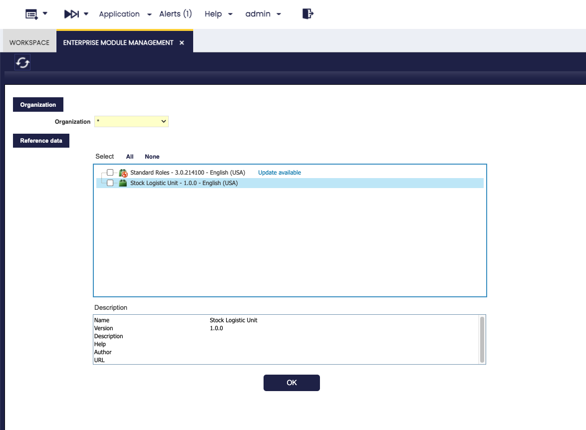

# Stock Logistic Unit
:octicons-package-16: Javapackage: `com.etendoerp.stock.logisticunit`

## Overview

!!! info
    To be able to include this functionality, the Warehouse Extensions Bundle must be installed. To do that, follow the instructions from the marketplace: [_Warehouse Extensions Bundle_](https://marketplace.etendo.cloud/?#/product-details?module=BAE67A5B5BC4496D9B1CA002BBCDC80E){target="_blank"}.  For more information about the available versions, core compatibility and new features, visit [Warehouse Extensions - Release notes](../../../../../whats-new/release-notes/etendo-classic/bundles/warehouse-extensions/release-notes.md).

The **Stock Logistic Unit** module extends Etendo's standard functionality to manage logistics units within inventory, receiving, and stock reservation processes. Specifically, this module adds the [units of measure](../../../basic-features/master-data-management/product-setup.md#unit-of-measure) and the [reference inventory types](../../../basic-features/warehouse-management/setup.md#referenced-inventory-type) **Box** and **Pallet**.

Its objective is to integrate **Alternative Units of Measure (AUOM)** with the **Referenced Inventory (RI)** model, so that logistics units are recognized, recorded, and managed as traceable entities in all warehouse operations.

Also, incorporates **advanced stock reservation logic** that prioritizes complete logistics units over individual units. This means that when processing a sales order with automatic quantity reservation in AUOM, the system prioritizes this condition and only completes the reservation with individual units if the required quantity is not reached. This priority rule ensures more efficient stock management and ensures that operations respect the original condition of the sale by AUOM, while maintaining traceability at the logistics unit level. Enable the Enable UOM Management preference to view and manage alternative UOMs.

In summary:

- Adds the UOM **Box** and **Pallet** unit of measure. These are available in the system to configure product AUOMs. 
- Aggregates the referenced inventory types **Box** and **Pallet** with their corresponding sequences.
- Each AUOM should be linked to a **referenced inventory type**, through the *Logistic Unit Type* field, ensuring that stock creation in **Referenced Inventory** windows, complies with the defined logistics unit.
- Introduce smart reservation rules that respect the logic of logistic units (e.g: Boxes), and units, reducing stock allocation errors. With this logic, when a sales order is automatically reserved, the system attempts to fulfill the quantity requested in the order with complete logistics units if possible, before resorting to individual units.

## Initial Setup

To start using this module correctly, the following installation and configuration steps must be completed:

- [x] Install the [_Warehouse Extensions Bundle_](https://marketplace.etendo.cloud/?#/product-details?module=BAE67A5B5BC4496D9B1CA002BBCDC80E){target="_blank"} bundle.
- [x] Install dataset **Stock Logistic Unit**.
- [x] Preferences setup.

### Install Stock Logistic Unit Dataset
:material-menu: `Application`>`General Setup` > `Enterprise Model` > `Enterprise Module Management`

Open the **Enterprise Module Management** window and install the **Stock Logistic Unit** reference data included in the module; this will create the units of measure and the reference inventory types **Box** and **Pallet**. 

### Preference 
:material-menu: `Application` > `General Setup` > `Application` > `Preference`

By default, the module includes three preconfigured preferences. These can be disabled by creating a new preference with the value set to `N` if needed:

- **GenerateLogisticsUnitAutomatically**: Controls whether the system should automatically create Referenced Inventory records when completing a goods receipt. If enabled (`Y`), logistics units such as Boxes or Pallets are generated automatically, ensuring traceability from the moment items enter the warehouse.

- **Enable Stock Reservations**: Enables the stock reservation logic. When active, the system prioritizes fulfilling sales orders with complete logistics units (Boxes, Pallets) before using individual units. This ensures more efficient allocation and reduces stock errors.

- **Enable UOM Management**: Activates the management of Units of Measure (UOM). When enabled, users can assign Boxes or Pallets as units for products, configure conversions, and apply them across processes (sales, purchases, logistics). This preference is required to integrate Alternative Units of Measure with referenced inventory (Logistic Unit Type).

## Module Functionality

The **Stock Logistic** Unit module affects several standard Etendo windows, as it introduces new logistic units and their integration with referenced inventory and alternative units of measure.

### Unit of Measure

In the Unit of Measure window, the module adds the units of measure **Box** and **Pallets** to facilitate the management of logistics units within the system.
These UOM serve as the basis for configuring products with alternative units, while the user can create as many additional variants as needed based on the different box format used.

### References Inventory Type

In the Referenced Inventory Type window, the module adds the referenced inventory types **Box** and **Pallet**, each with its corresponding sequence. In this way, the referenced inventory retains traceability at the logistics unit level, ensuring consistency between the defined AUOMs and stock records. Reservations are updated using logic that allows alternative units of measurement to be taken into account.

### Product

### Alternate UOM

In the [Alternate UOM](../../../basic-features/master-data-management/master-data.md#alternate-uom-tab) tab of the **Product window**, enabling the **Enable UOM Management** preference allows users to assign *Box* or *Pallet* as **alternative units of measure**

!!! warning
    Only one level of logistic units is supported. For example, products can be managed in pallets or in boxes, but pallets containing boxes of products are not yet supported.

Users can define conversion rates and specify in which processes (sales, purchasing, logistics) these conversions apply. Based on this configuration, stock reservation rules automatically prioritize full pallets and boxes before using individual units, optimizing inventory management.

An additional feature introduced is greater granularity through the ability to select a **Logistic Unit Type**. For example, if the alternative unit is "Box," the system allows specifying whether it is a large, medium, or small box. This provides a higher level of control and accuracy in inventory management.

**Fields to note:**

- **Logistic Unit Type**: Dropdown linked to [Referenced Inventory Type](../../../basic-features/warehouse-management/setup.md#referenced-inventory-type), used when registering incoming and outgoing goods.

---
This work is licensed under :material-creative-commons: :fontawesome-brands-creative-commons-by: :fontawesome-brands-creative-commons-sa: [ CC BY-SA 2.5 ES](https://creativecommons.org/licenses/by-sa/2.5/es/){target="_blank"} by [Futit Services S.L.](https://etendo.software){target="_blank"}.