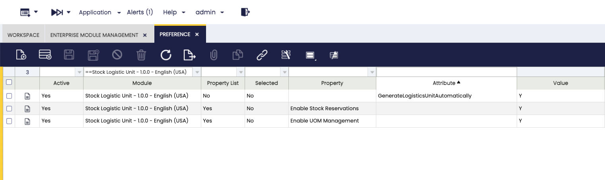

# Stock Logistic Unit
:octicons-package-16: Javapackage: `com.etendoerp.stock.logisticunit`

## Overview

!!! info
    To be able to include this functionality, the Warehouse Extensions Bundle must be installed. To do that, follow the instructions from the marketplace: [_Warehouse Extensions Bundle_](https://marketplace.etendo.cloud/?#/product-details?module=BAE67A5B5BC4496D9B1CA002BBCDC80E){target="_blank"}.  For more information about the available versions, core compatibility and new features, visit [Warehouse Extensions - Release notes](../../../../../whats-new/release-notes/etendo-classic/bundles/warehouse-extensions/release-notes.md).

The **Stock Logistic Unit** module extends Etendo's standard functionality to manage logistics units within inventory, receiving, and stock reservation processes. Specifically, this module adds the [units of measure](../../../basic-features/master-data-management/product-setup.md#unit-of-measure) and the [reference inventory types](../../../basic-features/warehouse-management/setup.md#referenced-inventory-type) **Box** and **Pallet**.

Its objective is to integrate **Alternative Units of Measure (AUOM)** with the **Referenced Inventory (RI)** model, so that logistics units are recognized, recorded, and managed as traceable entities in all warehouse operations.

Also, incorporates **advanced stock reservation logic** that prioritizes complete logistics units over individual units. This means that when processing a sales order with automatic quantity reservation in AUOM, the system prioritizes this condition and only completes the reservation with individual units if the required quantity is not reached. This priority rule ensures more efficient stock management and ensures that operations respect the original condition of the sale by AUOM, while maintaining traceability at the logistics unit level. Enable the Enable UOM Management preference to view and manage alternative UOMs.

In summary:

- Adds the UOM **Box** and **Pallet** unit of measure. These are available in the system to configure product AUOMs. 
- Aggregates the referenced inventory types **Box** and **Pallet** with their corresponding sequences.
- Each AUOM should be linked to a **referenced inventory type**, through the *Logistic Unit Type* field, ensuring that stock creation in **Referenced Inventory** windows, complies with the defined logistics unit.
- Introduce smart reservation rules that respect the logic of logistic units (e.g: Boxes), and units, reducing stock allocation errors. With this logic, when a sales order is automatically reserved, the system attempts to fulfill the quantity requested in the order with complete logistics units if possible, before resorting to individual units.

## Initial Setup

To start using this module correctly, the following installation and configuration steps must be completed:

- [x] Install the [_Warehouse Extensions Bundle_](https://marketplace.etendo.cloud/?#/product-details?module=BAE67A5B5BC4496D9B1CA002BBCDC80E){target="_blank"} bundle.
- [x] Install dataset **Stock Logistic Unit**.
- [x] Preferences setup.

### Install Stock Logistic Unit Dataset
:material-menu: `Application`>`General Setup` > `Enterprise Model` > `Enterprise Module Management`

Open the **Enterprise Module Management** window and install the **Stock Logistic Unit** reference data included in the module; this will create the units of measure and the reference inventory types **Box** and **Pallet**. 

### Preference 

:material-menu: `Application` > `General Setup` > `Application` > `Preference`

By default, the module includes three preconfigured preferences. These can be disabled by creating a new preference with the value set to `N` if needed:

- **GenerateLogisticsUnitAutomatically**: Controls whether the system should automatically create Referenced Inventory records when completing a goods receipt. If enabled (`Y`), logistics units such as Boxes or Pallets are generated automatically, ensuring traceability from the moment items enter the warehouse.

- **Enable Stock Reservations**: Enables the stock reservation logic. When active, the system prioritizes fulfilling sales orders with complete logistics units (Boxes, Pallets) before using individual units. This ensures more efficient allocation and reduces stock errors.

- **Enable UOM Management**: Activates the management of Units of Measure (UOM). When enabled, users can assign Boxes or Pallets as units for products, configure conversions, and apply them across processes (sales, purchases, logistics). This preference is required to integrate Alternative Units of Measure with referenced inventory (Logistic Unit Type).

### Unit of Measure

:material-menu: `Application` > `Master Data Management` > `Product Setup` > `Unit of Measure`

In the Unit of Measure window, the module adds the units of measure **Box** and **Pallets** to facilitate the management of logistics units within the system.
These UOM serve as the basis for configuring products with alternative units, while the user can create as many additional variants as needed based on the different box format used.

### Referenced Inventory Type

:material-menu: `Application` > `Warehouse Management` > `Setup` > `Referenced Inventory Type`

In the Referenced Inventory Type window, the module adds the referenced inventory types **Box** and **Pallet**, each with its corresponding sequence. In this way, the referenced inventory retains traceability at the logistics unit level, ensuring consistency between the defined AUOMs and stock records. Reservations are updated using logic that allows alternative units of measurement to be taken into account.

### Product - Alternate UOM

:material-menu: `Application` > `Master Data Management` > `Product`

In the [Alternate UOM](../../../basic-features/master-data-management/master-data.md#alternate-uom-tab) tab of the **Product window**, enabling the **Enable UOM Management** preference allows users to assign *Box* or *Pallet* as **alternative units of measure**

!!! warning
    Only one level of logistic units is supported. For example, products can be managed in pallets or in boxes, but pallets containing boxes of products are not yet supported.

Users can define conversion rates and specify in which processes (sales, purchasing, logistics) these conversions apply. Based on this configuration, stock reservation rules automatically prioritize full pallets and boxes before using individual units, optimizing inventory management.

An additional feature introduced is greater granularity through the ability to select a **Logistic Unit Type**. For example, if the alternative unit is *Box*, the system allows specifying whether it is a large, medium, or small box. This provides a higher level of control and accuracy in inventory management.

**Fields to note:**

- **Logistic Unit Type**: Dropdown linked to [Referenced Inventory Type](../../../basic-features/warehouse-management/setup.md#referenced-inventory-type), used when registering incoming and outgoing goods.

### Product - Stock By Logistic Unit

:material-menu: `Application` > `Master Data Management` > `Product`

It allows viewing stock by logistics units (referenced inventory) in a clearer and more organized way. Users can apply filters by product, location, or type of logistics unit, providing them with a simplified and focused view of stock. For example, it is possible to filter by a specific location and a specific type of logistics unit to see how many logistics units there are and what products they contain. In addition, from this tab, users can navigate directly to the Logistics Unit (Referenced Inventory) window, accessing the full details of its contents.

Fields to note:

- Logistic Unit: this field shows the Reference Inventory plus the type of Reference Inventory.
- Logistic Unit Type: this field shows the type of Reference Inventory.
- Storage Bin: space where the product is located.
- Quantity in Hand: Available quantity.
- Reserved Qty: Reserved quantity.

## Workflow

The Stock Logistic Units module intervenes across the board in the processes of receiving, reserving, selling, and delivering products, providing comprehensive management based on alternative units of measure (AUOMs) and inventory references (IRs).
Its functionality is enhanced when used in conjunction with other components of the Warehouse Extension Bundle.

### Receipt (Goods Receipt)

The Receiving flow begins in the Goods Receipt window, where product entries are recorded. When entering goods that use alternative units (such as **Boxes** or **Pallets**), the Stock Logistic Units module identifies these conditions thanks to its integration with AUOMs and the Referenced Inventory types it defines.

When the receipt document is completed, using the *Bulk Completion* button, the system **automatically generates the referenced inventory** (RI) records associated with those logistics units.

!!! info
    To use **automatic RI** creation, you must have the **Bulk Completion** module. For details, see [Bulk Completion](../../../../../user-guide/etendo-classic/optional-features/bundles/essentials-extensions/bulk-completion.md)

The boxes received can be seen in the stock.

In this way, the stock received is not interpreted as individual units, but as a traceable logistical entity (a box or a pallet), ensuring consistency between physical quantities and the system inventory, laying the foundations for subsequent processes—such as reservations, sales, or deliveries—to always respect the logistical structure in which the product was originally registered.

### Referenced Inventory

Installing this module the **Referenced Inventory** allows creating nested logistics units, meaning that a referenced inventory (e.g., a pallet) can contain other referenced inventories (e.g., boxes). 

This improvement allows creating hierarchical logistics structures, such as *boxes within pallets*, while maintaining full compatibility with standard **Box** and **Unbox** processes. This way, when you perform the *Unbox* action on a pallet, you obtain the boxes it contains. In turn, you can perform the *Unbox* action on those boxes to obtain the individual units included in each one.

!!! important
    Restrictions for handling pallets and boxes: 

    - Pallets can contain boxes and basic units.
    - Pallets cannot contain pallets.
    - Boxes can contain boxes and basic units.
    - Each Logistics Unit can only be in one grouping at a time.
    - Boxes cannot be moved between pallets. Once a box is on a pallet, it must remain there until an Unbox is performed to release it.
    - The Unbox process applies the Storage Bin assigned to that grouping for the products it contains, replacing the original location.

The user accesses the **Referenced Inventory** window and creates a new record by selecting the **Pallet** type. Once created, the pallet is available as a container logistics unit.

Then, using the *Box* button, the user can select one or more existing boxes (of the BOX type) through the stock selector or basic units of one or more products. The system will **only display those boxes and units** that are not assigned to another grouping. Upon confirmation, the selection is linked to the pallet and its information is automatically updated.

At any time, the user can consult the Content tab of the pallet to see the boxes it contains or use the *Unbox* button to release them, returning them to their original state.

<figure markdown="span">
    
    <figcaption>Example: Box containing *Boxes* and *Basic Units*</figcaption>
</figure>

<figure markdown="span">
    
    <figcaption>Example: Pallets containing *Boxes* and *Basic Units*</figcaption>
</figure>

!!! example
    A pallet with boxes of pineapple juice is received. The receipt is made from the Goods Receipt window.
    Once the receipt is complete, the user must manually enter the **Referenced Inventory** window to create a **box** for each **box** received.
    Then, a new **Pallet-type** Referenced Inventory must be created and the previously created boxes must be associated with it.
    In this way, the product stock shows a Pallet whose contents are composed of boxes, rather than individual units of the product.

### Sales

The sales flow is combined with stock reservation logic, ensuring that logistics units remain consistent and traceable throughout the entire process.

In the Sales Order, the user can select the product and define the alternative unit (AUOM) in which they wish to make the sale, such as a **box** or a **pallet**. This is where the **module's reservation logic** comes into play.

Smart reservation rules **prioritize the unit defined in the sales order** and, in the case of logistics units, the system will first attempt to allocate complete alternative units (boxes or pallets) before resorting to individual units, optimizing stock usage and maintaining the traceability of each logistics unit.

When an automatic reservation is generated from the sales order, the system compares the product, the AUOM, and the quantity requested, selecting the referenced units that best meet the demand.

This logic ensures that, if the sale was made by an alternative unit, the reservation process maintains that condition and respects the original composition of the product.

As a result, the sale is managed and executed in the defined alternative unit of measure, automatically transferring to subsequent logistics processes such as delivery, packaging, and other warehouse operations.

The traceability of Alternate UOMs and Referenced Inventories is maintained at all stages of inventory management, ensuring that the logistics units used remain correctly identified from the sale until the product leaves the warehouse.

---
This work is licensed under :material-creative-commons: :fontawesome-brands-creative-commons-by: :fontawesome-brands-creative-commons-sa: [ CC BY-SA 2.5 ES](https://creativecommons.org/licenses/by-sa/2.5/es/){target="_blank"} by [Futit Services S.L.](https://etendo.software){target="_blank"}.