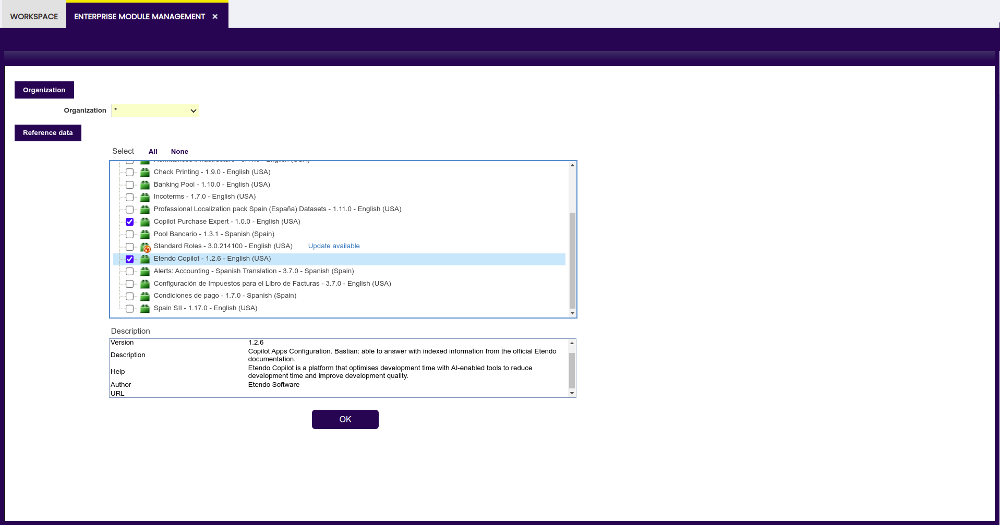

---
tags:
    - Copilot
    - IA
    - Bastian
    - Documentation
    - Etendo
---

# Bastian

:octicons-package-16: Javapackage: com.etendoerp.copilot

!!! info
    To be able to include this functionality, the Copilot Extensions Bundle must be installed. To do that, follow the instructions from the marketplace: [Copilot Extensions Bundle](https://marketplace.etendo.cloud/#/product-details?module=82C5DA1B57884611ABA8F025619D4C05){target="\_blank"}. 

## Overview

This **Copilot App** is able to answer questions with indexed information from the official Etendo documentation.

This chatbot is designed to provide quick and accurate answers about Etendo. Thanks to its advanced algorithms and natural language processing capabilities, it is equipped to understand your needs and provide you with insightful, relevant, and engaging interactions.

## Setup

Etendo provides dataset options to install predetermined assistants. In case of installing Etendo Copilot, Bastian dataset is available to answer your questions about Etendo documentation.

## Interaction with Bastian

To start a conversation with Bastian, just follow these steps:

1. Start with a Question or Statement: Think of a topic or query you would like to discuss with Bastian. For example, you can start by asking "How to create a callout?" or make a statement such as "I need to set up the Etendo database".

2. Type your Message: Locate the text box, click on it and type your question or statement. Then, click “enter”.

3. Participate in Bastian's Response: After you submit your question or statement, Bastian will process it and provide you with a typed response. If you have follow-up questions or wish to go deeper into the topic, feel free to continue the conversation by typing your next message and pressing Enter.

!!!warning "Important" 
    In order to obtain more accurate answers when using Bastian, remember to:

    - Give as much context to the question/sentence as possible
    - Use Etendo specific vocabulary, that is, use the terms typically used in Etendo and not synonyms, for example.