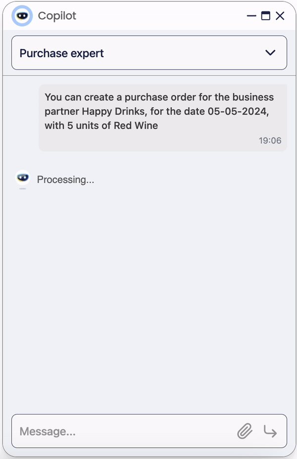

---
tags:
    - Copilot
    - IA
    - OpenAPI
    - Swagger
    - API
    - Purchase
    - Assistant
---

# Copilot Purchase Expert

:octicons-package-16: Javapackage: com.etendoerp.copilot.openapi

:octicons-package-16: Javapackage: com.etendoerp.copilot.openapi.purchase

!!! info
    To be able to include this functionality, the Copilot Extensions Bundle must be installed. To do that, follow the instructions from the marketplace: [Copilot Extensions Bundle](https://marketplace.etendo.cloud/#/product-details?module=82C5DA1B57884611ABA8F025619D4C05){target="\_blank"}. 

## Overview

By using certain tools and a prompt that gives the Assistant appropriate context, it is possible to make an assistant able to perform a certain task in an efficient way.

For this particular case, we have configured an assistant with the functional methodology of creating purchase orders, and we have equipped it with 3 tools:

- **OCR Tool**: This tool is capable of reading images and PDF and returning a JSON object with the extracted information.

- **Etendo API Tool**: This tool explains to the assistant how to interact with the Etendo API, and what are the available endpoints and their descriptions.

- **API Call Tool**: This tool allows Copilot to make a call to an API, and read and write data in Etendo. This tool will be responsible for calling the API endpoint, and will return the response.

## Setup

 - In the module `com.etendoerp.copilot.openapi.purchase` there is a dataset with the basic configuration of the **Copilot Purchase Expert**. It can be imported in the `Application`>`General Setup` > `Enterpice Model` > `Enterprise module management` window. 
 
 - After importing the configuration, it is necessary to configure the OpenAI model for the imported **Copilot App** and click [Sync OpenAI Assistant](../setup.md#sync-open-ai-assistant-button) button to create the corresponding assistant.
 
 - Finally, give access to the role and configure the permissions in [Role](../setup.md#role-window) Window.

!!! warning
    In the last paragraph of the prompt, the link `http://localhost:8080/etendo/?tabId=294&recordId={ORDER_HEADER_ID}` is a link for localhost, it is necessary to replace it with the real link of the Etendo system.

!!! info
    For more information about how to import the dataset (referencedata) and configure the assistant, see [How to Setup Assistants](../setup.md#how-to-set-up-assistants) page.

## Functionality

To create purchase orders with the Copilot Purchase Expert, the user has two options:

{align=right  width="250" }

1. Attaching an image or `PDF` file to the assistant:
   
    To do this, select the file, attach it and ask the assistant to create the corresponding purchase order. The assistant uses the OCR tool to get the necessary information from the file.

2. Through a conversation with the assistant:

    When interacting with the assistant, you may be asked to insert a purchase order to a Business Partner, indicating the date and other general data, the items and their quantities. The assistant will then search and read the info needed to create the purchase order. 

After that, the assistant will return the link to the purchase order created in Etendo.

!!! Info "Technical Details for Developers"
    More information about how to integrate Copilot with other APIs can be found in the [OpenAPI interaction with Copilot](../../../developer-guide/etendo-copilot/available-tools/openapi-tool.md) page.