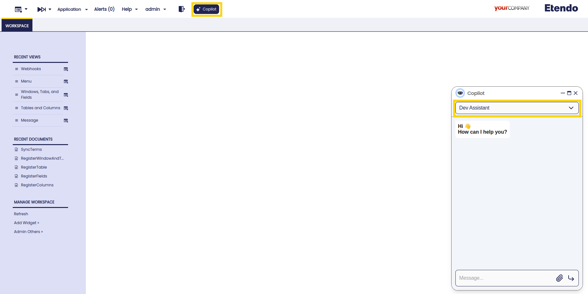
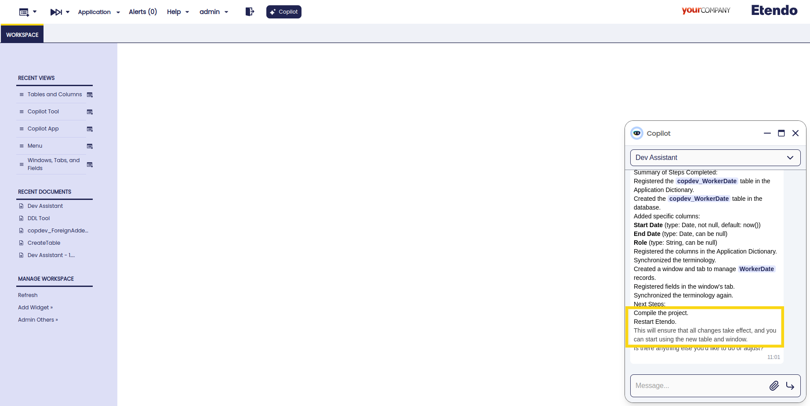
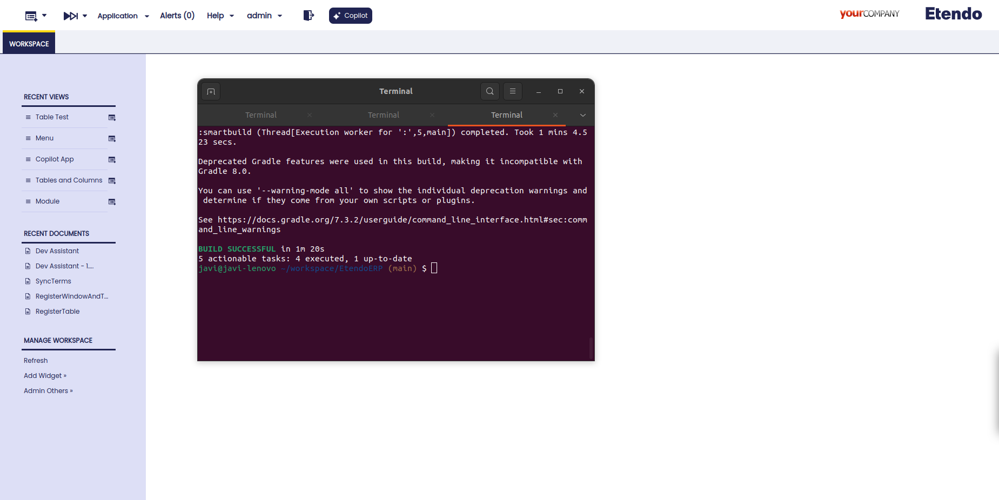
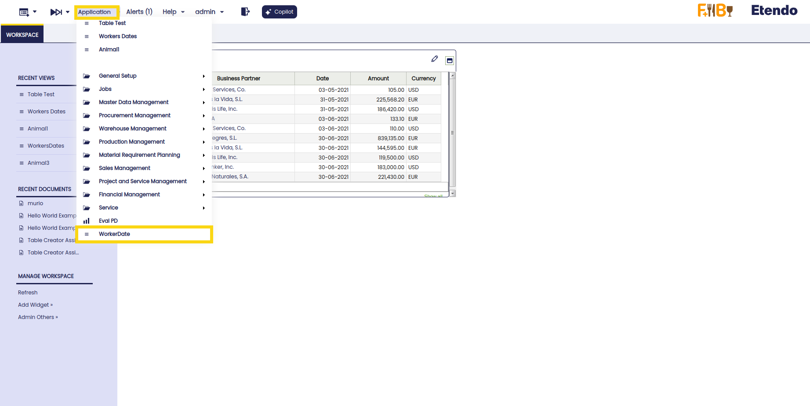
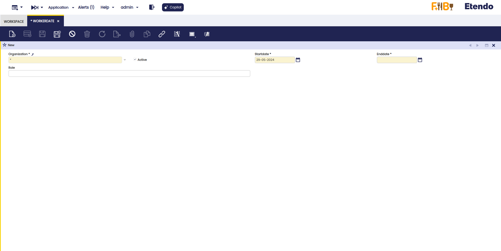

---
tags:
    - Copilot
    - IA
    - Windows, tabs and fields
    - Create Table
    - Add column
---

# Dev Assistant


## Overview

This assistant is designed to help developers and speed up the process of creating windows, tabs, fields, system elements, menu entries, etc.  As well as tables and columns in the database.
It is possible to give an input with all the necessary information, or the assistant will go step by step, asking for more information. Also, depending on the context, the assistant can make suggestions that the developer must confirm.

## Components

The Dev Assistant is composed of the following components:

- [**DDL Tool**](http://docs.etendo.software/developer-guide/etendo-copilot/available-tools/ddltool.md){target="_blank}: This tool allows to regsitering and creating tables on Etendo and on the database using queries generated with the parameters given on the tool. The query is adjusted for the user needs, for example, if the user wants to add a column with a default value, the tool can receive a value or not if the element should not has a default value.

- Multiples Webhooks: These webhooks are used to run the java files that create or modify the fields on the Etendo Classic and execute process or queries. These webhooks are: `RegisterTable`, `CreateTable`, `RegisterFields`, `RegisterWindowAndTab`, `RegisterColumns`, `ElementsHandler`, `SyncTerms`.


## Functionality

To use this tool, it is necessary to log in as System Administrator role.

1. Ask the **Dev Assistant** for a window to add in the system and  the module database prefix where the table will be exported. The assistant will then register in the system the table and create it in database, including the mandatory columns. At this stage the assistant checks if the module is in development. If is not, the assistant prompts the user for a correct prefix from a module in development. Additionaly, the assistant checks if the table name is already in use; if it is, asks the user to provide a new name.

2. The assistant will ask to the user for information to add, like columns, data types, help and description, etc.

3. The user must confirm the steps or set up a modification about the given information.

4. Recompile and restart Tomcat to a successful application of changes.

5. The window can be viewed with the user role.


## Usage Example 



**User**: "I want to create a window "Workers dates" that contains information about employees' work dates, use the prefix 'copdev'."

**Copilot**: "Let's start by registering the table for "Workers Dates".
Please provide the following for better definition:
Table name in singular (e.g., WorkerDate, EmploymentDate, etc.).
A valid prefix, which is 'copdev' in your case.
Any specific data columns (except default columns) you want in the table initially.
Optionally, if you have a specific class name in mind for this table, please provide it.
Based on the provided prefix 'copdev' and the idea of the table, I'm suggesting the table name as WorkerDate. Let's proceed if the suggested name is acceptable to you?"

**User**: "Proceed and add some useful columns."

**Copilot**: "The table copdev_WorkerDate has been successfully created and registered in the system. Specific columns for Start Date, End Date, and Role have also been added to the table. Additionally, a window titled "Workers dates" has been created to manage this table's data. The necessary fields in the window's tab have been registered and synchronized as well.
Summary of Steps Completed:
Registered the copdev_WorkerDate table in the Application Dictionary.
Created the copdev_WorkerDate table in the database.
Added specific columns:
Start Date (type: Date, not null, default: now())
End Date (type: Date, can be null)
Role (type: String, can be null)
Registered the columns in the Application Dictionary.
Synchronized the terminology.
Created a window and tab to manage WorkerDate records.
Registered fields in the window's tab.
Synchronized the terminology again.
Next Steps:
Compile the project.
Restart Etendo.
This will ensure that all changes take effect, and you can start using the new table and window.
Is there anything else you'd like to do or adjust?"


## Results

**With the task complete, it is necessary recompile with a smartbuild and restart Tomcat**



    ```title="Terminal"
    ./gradlew smartbuild --info
    ```



**Window in the system**



