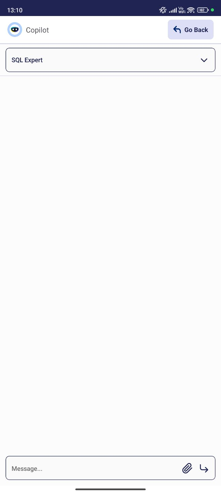

# Copilot Extensions

:octicons-package-16: Javapackage: `com.etendoerp.copilot.extensions`

:material-store: Etendo Marketplace:  [Copilot Extensions Bundle](https://marketplace.etendo.cloud/#/product-details?module=82C5DA1B57884611ABA8F025619D4C05){target="_blank"}

## Overview

The Copilot Extensions Bundle includes functionalities that help you streamline your daily tasks using artificial intelligence.

## Default Assistants

The apps described below belong to preconfigured reference data included in the corresponding modules.

- **Bastian**

    :octicons-package-16: Javapackage: `com.etendoerp.copilot`

    This **Assistant** is able to answer questions with indexed information from the official Etendo documentation.

- **Purchase Expert**

    :octicons-package-16: Javapackage: `com.etendoerp.copilot.openapi.purchase`

    This assistant is capable of performing operations related to loading purchase orders by chat interaction or through images or `PDF` files.

    !!! info
        For more information, visit [Purchase Expert user guide](../../../user-guide/etendo-copilot/bundles/copilot-purchase-expert.md).

- **SQL Expert**

    :octicons-package-16: Javapackage: `com.etendoerp.copilot.dbquerytool`

    This assistant is capable of help users read information from the database. It allows users to ask questions in natural language and get the SQL query that retrieves the information they need.

    !!! info
        For more information, visit [SQL Expert user guide](../../../user-guide/etendo-copilot/bundles/sql-expert.md).

## Etendo Copilot SubApp

:octicons-package-16: Javapackage: `com.etendoerp.subapp.copilot`

### Overview 

The **Etendo Copilot Subapp** is designed to integrate seamlessly with the existing features of Etendo Copilot, extending its functionality to mobile and tablet devices. This subapplication allows users to interact with AI-driven copilot assistants directly from their mobile devices, enhancing productivity and accessibility on the go.

The Etendo Copilot Subapp offers key features such as the ability to **attach files, interact with Copilot assistants, and access specific windows** based on the user’s role. The assistants dynamically appear according to the user’s assigned role, ensuring a personalized experience tailored to their responsibilities within the system.

With compatibility for both mobile phones and tablets, this subapplication ensures flexibility in how users can access and leverage the Copilot assistants, facilitating smoother workflows across different devices.

**Copilot SubApp mobile mode**

{ width="300" }

**Copilot SubApp tablet mode**

## Modules

### Copilot OCR Tool

:octicons-package-16: Javapackage: `com.etendoerp.copilot.ocrtool`

This module implements the Optical Character Recognition (OCR) tool, capable of reading images and PDF and returning a JSON object with the extracted information.
 
!!! info
    For more information, visit [Copilot OCR Tool developer guide](../../../developer-guide/etendo-copilot/available-tools/ocr-tool.md).

### Copilot OpenAPI Tool

:octicons-package-16: Javapackage: `com.etendoerp.copilot.openapi`

This Etendo Copilot tool allows interacting with APIs taking the platform to another level.

!!! info
    For more information, visit [Copilot OpenAPI Tool developer guide](../../../developer-guide/etendo-copilot/available-tools/openapi-tool.md).

### Copilot Purchase Expert

:octicons-package-16: Javapackage: `com.etendoerp.copilot.openapi.purchase`

This module includes an assistant capable of performing operations related to the purchasing module, such as loading purchase orders. 
!!! info
    For more information, visit [Copilot Purchase Expert user guide](../../../user-guide/etendo-copilot/bundles/copilot-purchase-expert.md).

### Database Query Tool

:octicons-package-16: Javapackage: `com.etendoerp.copilot.dbquerytool`

This tool allows the user to connect to an SQL Database and generate and/or execute SQL Queries from a natural language input.

!!! info
    For more information, visit [Database Query Tool developer guide](../../../developer-guide/etendo-copilot/available-tools/database-query-tool.md).

## Dev Assistant

:octicons-package-16: Javapackage: `com.etendoerp.copilot.devassistant`

The **Dev Assistant** is designed to develop other assistants to facilitate processes of creating windows, tabs, fields, background processes, Event Handlers, Jasper reports and much more.

!!!info
    For more information, visit: [Dev Assistant developer guide](../../../developer-guide/etendo-copilot/bundles/dev-assistant.md).

### Etendo Copilot

:octicons-package-16: Javapackage: `com.etendoerp.copilot`

Etendo Copilot is a platform that optimises development time with AI-enabled tools to reduce development time and improve development quality.

!!! info
    For more information, visit [Etendo Copilot user guide](../../../user-guide/etendo-copilot/setup.md).

### XML Translation Tool

:octicons-package-16: Javapackage: `com.etendoerp.copilot.xmltranslationtool`

<iframe width="560" height="315" src="https://www.youtube.com/embed/vu-eQDqZpKY?si=mhon0plDzHaRwUxq" title="YouTube video player" frameborder="0" allow="accelerometer; autoplay; clipboard-write; encrypted-media; gyroscope; picture-in-picture; web-share" referrerpolicy="strict-origin-when-cross-origin" allowfullscreen></iframe>

This tool allows the user to translate the content of an XML file from one language to another, as specified within the XML.

!!! info
    For more information, visit [XML Translation Tool developer guide](../../../developer-guide/etendo-copilot/available-tools/xml-translation-tool.md).

