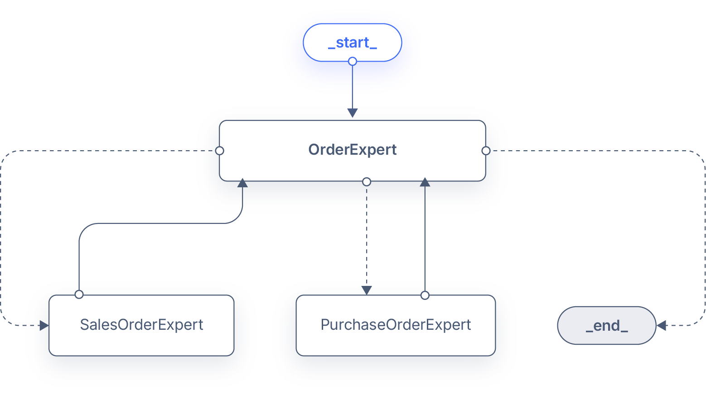
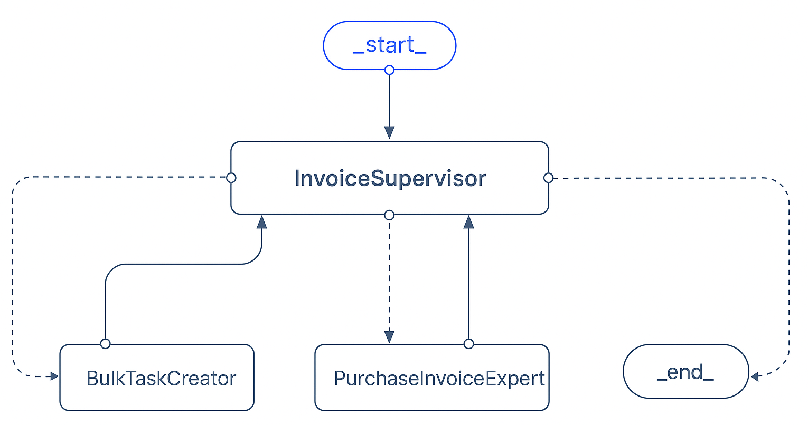

!!! warning
    Currently, we are migrating the terminology from *Assistant* to *Agent*. This change will be reflected in the documentation soon. Where you see *Assistant*, consider it as *Agent* and vice versa.

# Copilot Extensions Bundle

:octicons-package-16: Javapackage: `com.etendoerp.copilot.extensions`

:material-store: Etendo Marketplace:  [Copilot Extensions Bundle](https://marketplace.etendo.cloud/#/product-details?module=82C5DA1B57884611ABA8F025619D4C05){target="_blank"}

## Overview

The Copilot Extensions Bundle includes functionalities that help you streamline your daily tasks using artificial intelligence.

## Modules

### Etendo Copilot

:octicons-package-16: Javapackage: `com.etendoerp.copilot`

Etendo Copilot is a platform that optimizes development time with AI-enabled tools to reduce development time and improve development quality. Additionally, it allows the creation of agents to automate processes or even work with specialized knowledge bases.
As the core module of the Copilot Extensions Bundle, **Etendo Copilot** contains a set of windows where you can create, manage, and interact with AI-driven Agents.

!!! info
    For more information, visit [Etendo Copilot - User Guide](../../../user-guide/etendo-copilot/setup-and-usage.md).

The module includes the following agents:

- **Bastian**: This module includes **Bastian**, an agent equipped with the Etendo Documentation indexed as a knowledge base. Bastian enables users to search for information within the documentation using natural language queries, providing quick and accurate answers to their questions.

### Etendo Copilot Agents

:octicons-package-16: Javapackage: `com.etendoerp.copilot.agents`

The **Copilot Agents** module  is a collection of agents that can be used to do basic tasks with interacting with Etendo Classic, but the main purpose is to be used as a base (or template) to create new agents. By taking advantage of the cloning functionality in the assistants and Knowledge base, they can be replicated and customized agents can be created very easily.

The module includes the following agents:

- **Zip Reader**: This agent reads a zip file and returns the paths of the files inside the zip. Its useful to add to a supervisor agent to chain the unzip and
- **Client Initialization Supervisor**: This is a supervisor agent that delegates and orchestrates initialization tasks for the client (creation of initial business partners, products, etc.).
    
    This supervisor has the following agents:

    - **Business Partner Generator**: This agent creates business partners.
    - **Product Generator**: This agent creates products.
    - **Physical Inventory Generator**: This agent creates physical inventories to add stock to the products.
    - **Bulk task creator**: This agent creates bulk tasks based on a zip file or a CSV/XLSX file. This agent allows to create tasks in bulk to load big amounts of data in the other agents. For example, it can be used to create a big amount of business partners, products from a CSV file, etc.

- **Order Expert**: This agent is a supervisor agent that delegates and orchestrates the creation of purchase and sales orders. 
    

    This supervisor has the following agents:

    - **Purchase Order Expert**: This agent creates purchase orders.
    - **Sales Order Expert**: This agent creates sales orders.

!!! info
    This sub-agents presented can be used individually if needed.

- **Invoice Supervisor**: The Invoice Supervisor is an orchestration agent responsible for managing the creation of purchase invoices in Etendo. This supervisor decides how to route incoming data (ZIP files, individual files, or user input) to the appropriate agents. 
    

    🧠 Responsibilities

    - Manage the creation of individual or bulk purchase invoices.

    - Extract and validate invoice data.

    - Delegate task creation for batch processing.

    This supervisor has the following agents:

    - **Bulk Task Creator**: Bulk task creator for iterating over ZIP or Excel/CSV files, used when receiving a ZIP file with multiple invoices.
    - **Purchase Invoice Expert**: Agent expert in managing purchase invoices for Etendo. It manages the entire invoice creation process, extracts and validates the invoice header and lines. Finally, it invokes APIs to insert data and provides final validation.

### Etendo Copilot Toolpack

:octicons-package-16: Javapackage: `com.etendoerp.copilot.toolpack`

The **Etendo Copilot Toolpack** is a collection of tools that help to **developers** to add functionalities to agents, such request to an API, send an email, read a file, write a file, and more.

!!! info 
    For more information, visit the [Toolpack - Developer Guide](../../../developer-guide/etendo-copilot/bundles/overview.md#etendo-copilot-toolpack), where you will find a detailed list of the available tools, instructions on how to use them, and a guide for developing new tools.

Additionally, the Toolpack includes the following agents:

- [SQL Expert](sql-expert.md): This agent is designed to help users read information from the database. It allows users to ask questions in natural language and get the SQL query that retrieves the information they need. In order to preserve the security of the database, the query is pre-processed with filters to only retrieve data accessible by the user.    

### Etendo Copilot Subapp

:octicons-package-16: Javapackage: `com.etendoerp.subapp.copilot`

The **Etendo Copilot Subapp** is designed to integrate seamlessly with the existing features of Etendo Copilot, extending its functionality to mobile and tablet devices. This subapplication allows users to interact with AI-driven copilot agents directly from their mobile devices, enhancing productivity and accessibility on the go.

The Etendo Copilot Subapp offers key features such as the ability to **attach files, interact with Copilot agents, and access specific data** based on the user’s role. The assistants dynamically appear according to the user’s assigned role, ensuring a personalized experience tailored to their responsibilities within the system.

With compatibility for both mobile phones and tablets, this subapplication ensures flexibility in how users can access and leverage the Copilot agents, facilitating smoother workflows across different devices.

!!! info
    For more information about sub-application configurations, visit [Configure Roles and Dynamic Subapps](../../etendo-mobile/getting-started.md#configure-roles-and-dynamic-subapps).

{ width="500" }
{ width="170" }

### Dev Assistant

:octicons-package-16: Javapackage: `com.etendoerp.copilot.devassistant`

The **Dev Assistant** is a set of assistants that helps to perform tasks related to development in Etendo Classic, like creating a new window, creating a new module, creating processes, etc.

!!!info
    For more information, visit: [Dev Assistant](../../../developer-guide/etendo-copilot/bundles/dev-assistant.md) developer guide.
