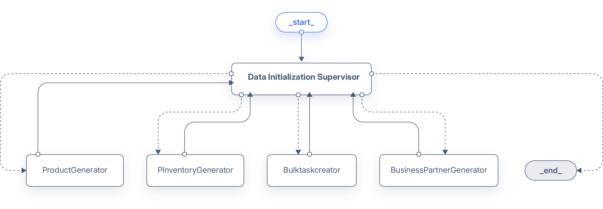

!!! warning
    Currently, we are migrating the terminology from *Assistant* to *Agent*. This change will be reflected in the documentation soon. Where you see *Assistant*, consider it as *Agent* and vice versa.

# Copilot Extensions Bundle

:octicons-package-16: Javapackage: `com.etendoerp.copilot.extensions`

:material-store: Etendo Marketplace:  [Copilot Extensions Bundle](https://marketplace.etendo.cloud/#/product-details?module=82C5DA1B57884611ABA8F025619D4C05){target="_blank"}

## Overview

The Copilot Extensions Bundle includes functionalities that help you streamline your daily tasks using artificial intelligence.

## Modules

### Etendo Copilot

:octicons-package-16: Javapackage: `com.etendoerp.copilot`

Etendo Copilot is a platform that optimises development time with AI-enabled tools to reduce development time and improve development quality.

#### Content
As the core module of the Copilot Extensions Bundle, **Etendo Copilot** contains a set of windows where you can create, manage, and interact with AI-driven Agents. By default, the module includes "Bastian" that is an agent with the Etendo Wiki indexed as a knowledge base. This agent can be used to search for information in the Etendo Wiki.

!!! info
    For more information, visit [Etendo Copilot user guide](../../../user-guide/etendo-copilot/setup-and-usage.md).

### Etendo Copilot Subapp

:octicons-package-16: Javapackage: `com.etendoerp.subapp.copilot`

The **Etendo Copilot Subapp** is designed to integrate seamlessly with the existing features of Etendo Copilot, extending its functionality to mobile and tablet devices. This subapplication allows users to interact with AI-driven copilot assistants directly from their mobile devices, enhancing productivity and accessibility on the go.

The Etendo Copilot Subapp offers key features such as the ability to **attach files, interact with Copilot assistants, and access specific data** based on the user’s role. The assistants dynamically appear according to the user’s assigned role, ensuring a personalized experience tailored to their responsibilities within the system.

With compatibility for both mobile phones and tablets, this subapplication ensures flexibility in how users can access and leverage the Copilot assistants, facilitating smoother workflows across different devices.

!!! info
    For more information about sub-application configurations, visit [Dynamic App - Role Configuration](../../etendo-mobile/getting-started.md#dynamic-app-role-configuration).

{ width="500" }
{ width="170" }

## Etendo Copilot Toolpack

:octicons-package-16: Javapackage: `com.etendoerp.copilot.toolpack`

The **Etendo Copilot Toolpack** is a collection of tools that help to developers to add functionalities to agents, such request to an API, send an email, read a file, write a file, and more.

### Content
The Toolpack includes the following tools:

- **API Call Tool**: This tool allows you to make a call to an API and get the response.
- **Attach File Tool**: This tool allows you to attach a file to an Etendo Classic record.
- **Audio Tool**: This tool allows you to convert an audio given to text.
- **Code Bar Tool**: This tool allows you to read a barcode from an image.
- **Docker Tool**: This tool allows you to run code in an isolated environment.
- **File Management tools**: These tools allow you to manage files in the Copilot internal file system.
    - **File Tool**: This tool allows you to copy a file.
    - **File Download Tool**: This tool allows you to download a file.
    - **Read File Tool**: This tool allows you to read a file.
    - **Write File Tool**: This tool allows you to write a file.
    - **XLS/CSV Reader Tool**: This tool allows you to read an XLS or CSV file.
    - **Uncompress Tool**: This tool allows you to uncompress various types of compressed files like zip, rar, etc.
- **OCR Tool**: This tool allows you to extract text from an image or PDF.
- **PDF to Image Tool**: This tool allows you to convert a PDF to images.
- **Send Email Tool**: This tool allows you to send an email.
- **Task Creator Tool**: This tool allows you to create bulk tasks based on a zip file or a CSV/XLSX file.
- **Tavily Tool**: This tool allows you to search in web.

Additionally, the Toolpack includes the following agents:
- **SQL Expert**: This agent is designed to help users read information from the database. It allows users to ask questions in natural language and get the SQL query that retrieves the information they need. In order to preserve the security of the database, the query is pre-processed with filters to only retrieve data accessible by the user. More information about this agent can be found in the [SQL Expert](sql-expert.md) page.

## Etendo Copilot Agents

:octicons-package-16: Javapackage: `com.etendoerp.copilot.agents`

The module "Copilot Agents" is a collection of agents that can be used to do basic tasks with interacting with Etendo Classic, but the main purpose is to be used as a base (or template) to create new agents. By taking advantage of the cloning functionality in the assistants and Knowledge base, they can be replicated and customized agents can be created very easily.
### Content
The module includes the following agents:

- **Zip Reader**: This agent reads a zip file and returns the paths of the files inside the zip. Its usefull to add to a supervisor agent to chain the unzip and
- **Client Initialization Supervisor**: This is a supervisor agent that delegates and orchestrates initialization tasks for the client (creation of initial business partners, products, etc.).
    
    This supervisor has the following agents:

    - **Business Partner Generator**: This agent creates business partners.
    - **Product Generator**: This agent creates products.
    - **Physical Inventory Generator**: This agent creates physical inventories to add stock to the products.
    - **Bulk task creator**: This agent creates bulk tasks based on a zip file or a CSV/XLSX file. This agent allows to create tasks in bulk to load big amounts of data in the other agents. For example, it can be used to create a big amount of business partners, products from a CSV file, etc.

- **Order Expert**: This agent is a supervisor agent that delegates and orchestrates the creation of purchase and sales orders. 
    

    This supervisor has the following agents:

    - **Purchase Order Expert**: This agent creates purchase orders.
    - **Sales Order Expert**: This agent creates sales orders.

## Dev Assistant

:octicons-package-16: Javapackage: `com.etendoerp.copilot.devassistant`

The **Dev Assistant** is a set of assistants that helps to perform tasks related to development in Etendo Classic, like creating a new window, creating a new module, creating processes, etc.

!!!info
    For more information, visit: [Dev Assistant](../../../developer-guide/etendo-copilot/bundles/dev-assistant.md) developer guide.
