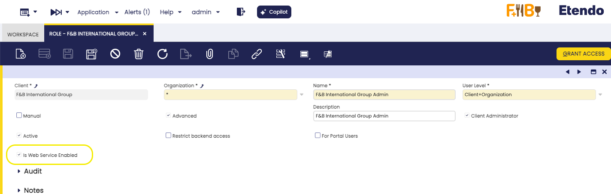
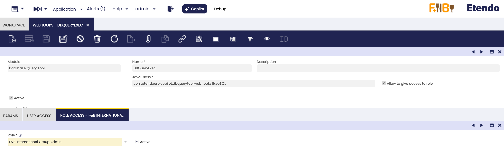
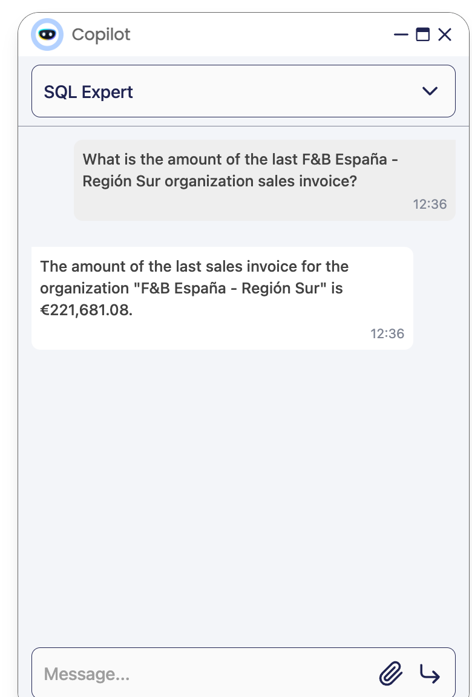
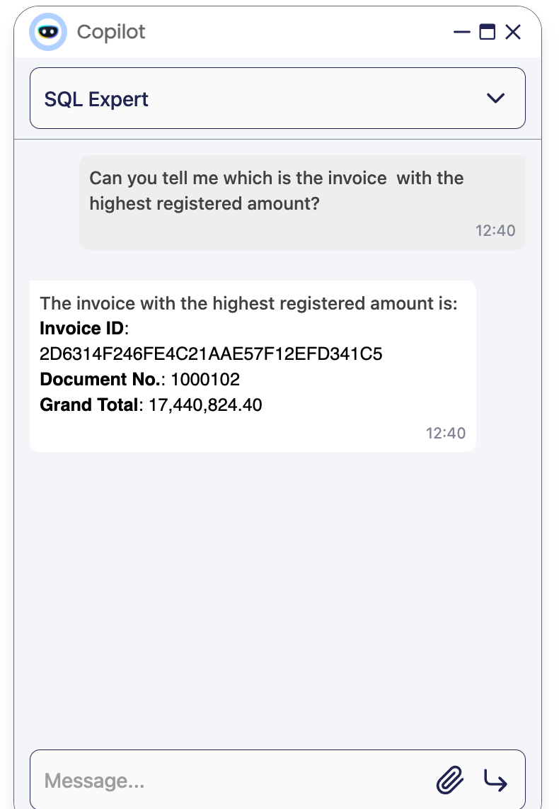
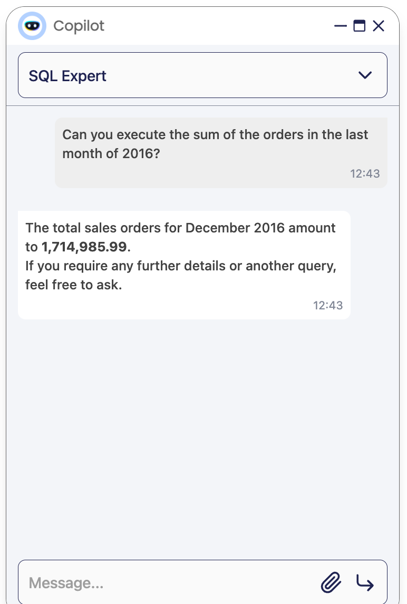
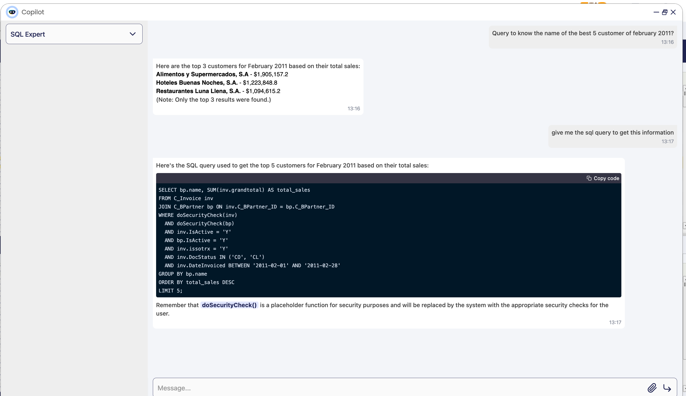
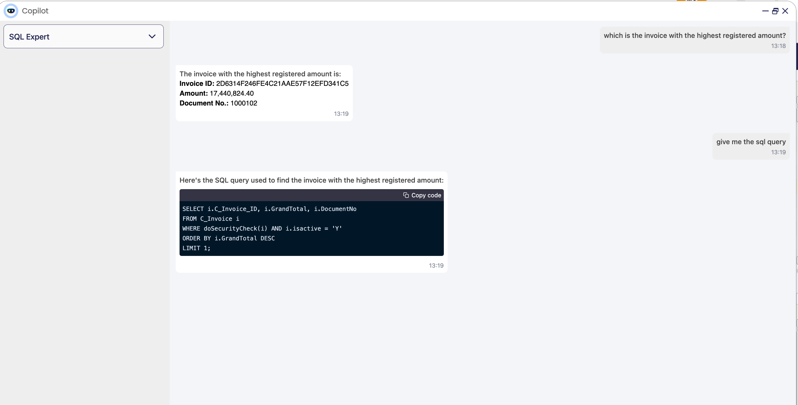

---
tags:
    - Copilot
    - SQL Queries
    - Database Access
    - Query Automation
    - Agent Features
---

# SQL Expert

:octicons-package-16: Javapackage: `com.etendoerp.copilot.toolpack`

## Overview

This Agent is designed to help users read information from the database. It allows users to ask questions in natural language and get the SQL query that retrieves the information they need. Use a webhook to get the necessary information to generate the SQL query. The user can ask questions about the database, and the Agent will determine whether to return a SQL query or execute the query and return the obtained result.

## Components

The SQL Expert Agent is composed of the following components:

- [API Call Tool](../available-tools/openapi-tool.md)

- **DBQueryExec - Webhook**: This Webhook allows the Agent to execute SQL queries in the database. The agent call the Webhook to execute the query in the database and returns the result to the Agent. This is a secure way to execute SQL queries in the database, as Etendo handles the security of the database connection and query execution.


## Agent Setup 

1. This module is included in the Copilot Extensions Bundle

    !!! info
        To be able to include this agent, the Copilot Extensions Bundle must be installed. To do that, follow the instructions from the marketplace: [Copilot Extensions Bundle](https://marketplace.etendo.cloud/#/product-details?module=82C5DA1B57884611ABA8F025619D4C05){target="_blank"}. For more information about the available versions, core compatibility and new features, visit [Copilot Extensions - Release notes](../../../whats-new/release-notes/etendo-copilot/bundles/release-notes.md).


2. Check the necessary `ETENDO_HOST` variable in the `gradle.properties` file.
    
    ```groovy title="gradle.properties"
    ETENDO_HOST=http://localhost:8080/etendo
    ```

    !!! warning
        Replace http://localhost:8080/etendo with the real url of the Etendo system.


3.  A new agent named **SQL Expert** has been created in the `Application` > `Service` > `Copilot` > `Agent` window.

4. Run **Sync Agent** process, loged as System Administrator role.

5. Restart Docker image using `./gradlew resources.up` tasks.

6. Configure access to the agent from the [Agent Access](../../etendo-copilot/setup-and-usage.md#assistant-access-window) window.

7. You can use the **SQL Expert** agent as a **System Administrator**

    !!!warning 
        In case of using this agent with other roles: 
        
        1. It must be verified that the role has webhooks execution enabled: 
            
        
        2. Access must be given to the corresponding role in the  [WebHooks](../../../developer-guide/etendo-classic/bundles/platform/etendo-webhooks.md#assign-allowed-roles) window, in the **Role** tab, for the WebHook **DBQueryExec**.  This webhook is automatically added when the module is installed.
            


## Examples

### Examples of questions for information retrieval

1. 
    <figure markdown>
    {align=right width=300}
    <br><br>
    **What is the amount of the last F&B España - Región Sur organization sales invoice?**
    </figure>

2.  

    <figure markdown>
    {align=left width=300}
    <br><br>
    **Can you tell me which is the invoice  with the highest registered amount?**
    </figure>
 
3.
    <figure markdown>
    {align=right width=300}
    <br><br>
    **Can you execute the sum of the orders in the last month of 2016?**
    </figure>

### Examples of SQL query generation

1. 
    <figure markdown>
    { align=right width=300 }
    <br>
    **Can you execute the sum of the orders in the last month?**
    </figure>

2.  <figure markdown>
    { align=right }
    <br>
    **Query to know the name of the best 5 customer of junuary 2011?**
    </figure>
    
3.  <figure markdown>
    { align=right }
    <br>
    **Query to obtain which is the invoice with the highest registered amount?**
    </figure> 

---
This work is licensed under :material-creative-commons: :fontawesome-brands-creative-commons-by: :fontawesome-brands-creative-commons-sa: [ CC BY-SA 2.5 ES](https://creativecommons.org/licenses/by-sa/2.5/es/){target="_blank"} by [Futit Services S.L.](https://etendo.software){target="_blank"}.