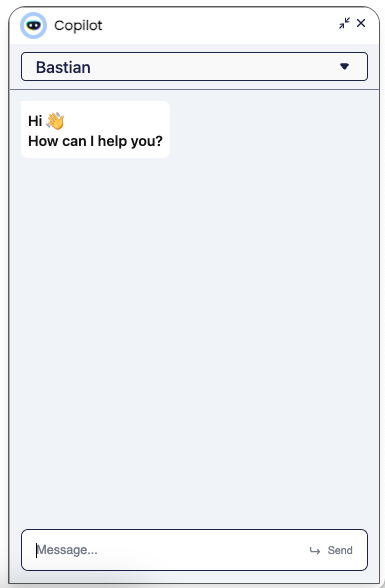
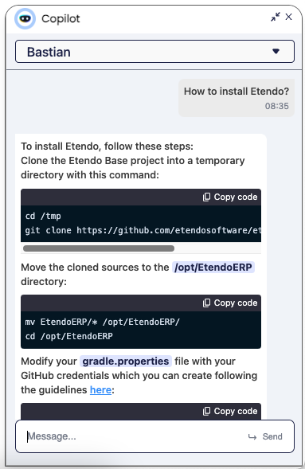

# Etendo Copilot: Integrated Assistant

## Overview

Etendo Copilot is a powerful tool integrated into the Etendo Classic interface, providing an efficient way to interact with virtual assistants and access specific tools. This is an innovative project designed to streamline your processes by harnessing the power of Artificial Intelligence. This page will guide you through the key features of Etendo Copilot.

!!! info
    To install Etendo copilot, you can read the [Copilot Instalation](../../developer-guide/etendo-copilot/installation.md) guide in the developer's guide section.

## What is Etendo Copilot?

{align=right  width="300"}

At its core, Etendo Copilot is a groundbreaking initiative that redefines how developers and users interact with tools and information. It revolves around a central component, the *Agent* which acts as the mastermind behind task delegation. This Agent has secondary modules referred to as *Tools*. The seamless communication between these components is facilitated via a RESTful API, ensuring a stateless and scalable interaction model.

## Agent

The Agent serves as your virtual assistant, making on-the-fly decisions about which Tool is best suited to respond to a particular query. This intelligent decision-making ensures that you receive the most accurate and efficient assistance.

## Tools

Each tool represents a separate independent project, designed to excel at specific tasks. Whether it is code translation, text analysis, or data manipulation, our collection of tools work in harmony to deliver unparalleled support.

##  Key Features

{align=right  width="300" }

- **Effortless Integration**: Etendo Copilot seamlessly integrates into your environment, adding an extra layer of intelligence to your workflow.

- **On-Demand Assistance**: Send your queries to Etendo Copilot, and the Agent will guide you towards the most suitable Tool for the job.

- **Diverse Expertise**: Our ever-growing selection of Tools covers a wide range of domains, ensuring you always have the right solution.

- **Open AI Assistants**: Copilot is integrated with the Assistants technology developed by Open AI, allowing you to set up your assistants, trained with your own knowledge base, able to generate and interpret new code, and use the specific tools already distributed by Etendo or new ones.  

## Copilot Chat

In the Etendo Classic navigation bar, you'll find a Copilot icon that leads you to the chat pop-up.

Here, you can select a Copilot App and engage in a conversation with it. Copilot facilitates communication with both `Langchain Agent` and `Open AI Assistant` types.