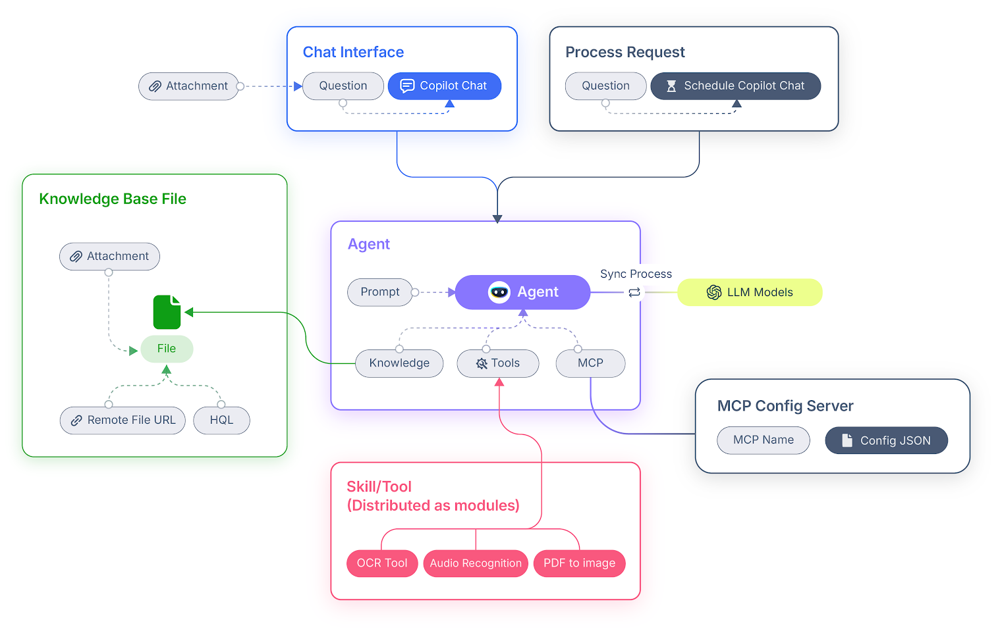
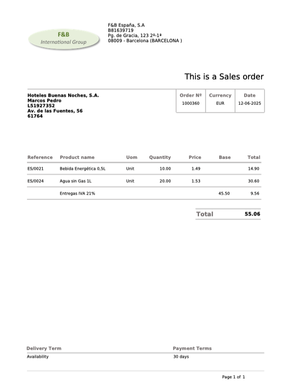
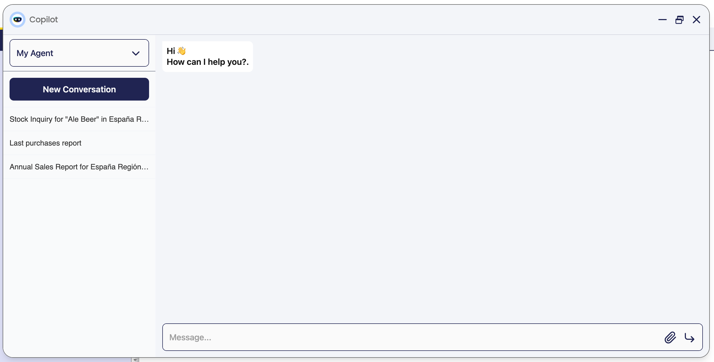

# User Guide - Etendo Copilot - Getting Started

## Overview

Etendo Copilot is a powerful tool integrated into the Etendo Classic interface, or accessible via API, that provides an efficient way to interact with agents and use tools developed to solve specific problems. It is an innovative project designed to streamline your processes by harnessing the power of Artificial Intelligence. This page will guide you through the main features of Etendo Copilot.

!!! info
    To install Etendo copilot, you can read the [Copilot Installation](../../developer-guide/etendo-copilot/installation.md) guide in the developer's guide section.

!!! note
    Remember that, to use this functionality, it is necessary to configure an API Key. For this, you can use one of your own, or you can contact the Etendo support team to purchase one.

{align=right  width="300"}

## What is Etendo Copilot?

At its core, Etendo Copilot is a groundbreaking initiative that redefines how developers and users interact with tools and information. It revolves around a central component, the *Agent* which acts as the mastermind behind task delegation. This Agent has secondary modules referred to as *Tools*. The seamless communication between these components is facilitated via a RESTful API, ensuring a stateless and scalable interaction model.

  

### Key Features

- **Effortless Integration**: Etendo Copilot seamlessly integrates into your environment, adding an extra layer of intelligence to your workflow.
- **On-Demand Assistance**: Send your queries to Etendo Copilot, and the Agent will guide you towards the most suitable Tool for the job.
- **Diverse Expertise**: Our ever-growing selection of Tools covers a wide range of domains, ensuring you always have the right solution.
- **LangGraph Agent**: This kind of agent works as a manager of other agents and allows you to create work teams.
- **Multi-Model Assistant**: These agents can perform specific tasks in natural language and provide contextualized responses, enabling the implementation of multiple AI models, the use of a proprietary vector database and internal memory management. This type of agent can be used with multi-vendor models such as *Anthropic*, *Gemini* or *OpenAI* models, among others.
- **Attach Files**: Etendo Copilot allows users to attach one or multiple files in the conversation.
- **Context Sharing**: Etendo Copilot can automatically capture and share the context of your current Etendo Classic session, such as selected records or active windows. This eliminates the need to manually input information, streamlining workflows and improving efficiency.

## Assistant (Agent)

Agents are intelligent entities that make real-time decisions about which Tool is best suited to answer a specific query. This ensures you always receive the most accurate and efficient assistance.

<figure markdown="span">
  
  <figcaption>Multi-Model Assistant Diagram</figcaption>
</figure>

Each agent is configured with a set of instructions called a **Prompt**, a knowledge base (referred to in Etendo as **KnowledgeBase File**), and a collection of **Skills or Tools**.

- When you ask a question, the agent evaluates your request and selects the most appropriate knowledge base or tool to provide a relevant answer.
- In addition, LangGraph type agents act as **managers**, able to delegate queries to other specialized agents and coordinate responses among them. This allows for assertive and collaborative answers. 
- There are also **Multi-Model Assistants**, which can handle specific tasks or workflows using multiple AI models.

Agents can be organized into modules or created directly within your Etendo environments, offering flexibility in how you structure your AI-powered workflows.

!!! info 
    For more information, visit the [Agent](../etendo-copilot/setup-and-usage.md#agent-window) window documentation.

### Skill/Tool

Each tool represents a dedicated and self-contained project, designed to excel at specialized tasks. Whether it involves translation, text analysis, or data manipulation, the diverse suite of tools operates in seamless coordination.  

!!! info 
    For an overview of the available tools and their technical details, please refer to the [Copilot Tools](../../developer-guide/etendo-copilot/available-tools/api-call-tool.md) in the Developer Guide section.

### Knowledge Base

In many cases, we need the agent to have specific information that the model does not have by default, so we generate a Knowledge Base. This will allow us to **train** our agent with specific information.

!!! info 
    For more information visit the [Knowledge Base File](../etendo-copilot/setup-and-usage.md#knowledge-base-file-window) window documentation.

## Copilot Interface

### Navigation Bar

In the main Etendo Classic navigation bar, you'll find a Copilot icon that leads you to the chat pop-up.

Here, you can select an agent and engage in a conversation with it. Copilot facilitates communication with `Langchain Agent` or `Multi-Model Assistant` types.
!!!note
    By default, Copilot will open the last agent previously used.

### Toolbar

In any Etendo Classic window, click the Copilot button in the toolbar to open the chat. Copilot will automatically receive the context of your current tab or selected records, so you don't need to enter details manually.

**Context awareness**

Etendo Copilot can take advantage of the context of the currently active window or record in Etendo Classic. Clicking the toolbar button updates the current context automatically.

- **Form Context**: If you have a form open (for example, a sales order or a customer record), Copilot retrieves the key fields and any unsaved edits, offering you real-time suggestions or validations.
- **Grid context**: When a row is selected in a grid, Copilot captures the details of those specific records, sending Copilot all relevant information so you can receive relevant AI-based recommendations.
- **Tab and window context**: In multi-tabbed environments, context must be sent to Copilot each time you switch from one view to another (e.g., from Orders to Products).

### Attach Files

{align=left  width="400"}

Etendo Copilot allows users to attach one or more files for agents to process. This feature supports various file formats, such as `.pdf`, `.csv`, `.jpg`, and more, enabling flexibility in use cases. However, the ability to interpret and process these files depends on the specific agent configuration, the defined tools, and the underlying model used.

This functionality ensures that users can seamlessly incorporate external data into their workflows, whether it involves parsing documents, analyzing spreadsheets, or processing images. Agents and tools can be tailored to address specific requirements based on the type of attached files, providing contextualized and intelligent responses.

For example, you can attach a purchase order in PDF format and ask the agent to create the purchase order in Etendo. As shown, the agent generates the order while respecting the Business Partner, dates, products, and amounts.  

### Visualization Mode

#### Conversation Management

Etendo Copilot provides intuitive conversation management features to help you organize and navigate your interactions:

**Conversation Selector**

In the left sidebar of the Copilot interface, you'll find a conversation selector that displays all your previous conversations. This allows you to:
- Quickly switch between different conversation topics
- Review previous interactions with agents
- Maintain context across multiple sessions

**New Conversation Button**

The "New Conversation" button enables you to start fresh conversations whenever needed. This is particularly useful when you want to:
- Begin a new topic or task
- Clear the current context
- Start working with a different agent or approach

**Automatic Title Generation**

Etendo Copilot automatically generates meaningful titles for your conversations to help you identify and organize them efficiently. Titles are generated:
- When switching between conversations
- When creating a new conversation and moving to it
- After a sufficient number of messages have been exchanged to provide enough context for a relevant title

This automatic titling system ensures that each conversation is easily identifiable, making it simple to return to specific topics or discussions later.

#### Display Modes

<figure markdown>
{align=right width=300}
  
**Pop-up**  
By default, Copilot operates as a pop-up window, providing convenient access as an integrated agent in any active window.
</figure>

<figure markdown>
**Full Screen**  
Use full screen mode for a more comfortable experience during long conversations when viewing Etendo Classic is not necessary.

</figure>

<figure markdown>
{align=right width=200}  
**Minimized**  
Copilot's interface can also be minimized. In this case, a Copilot bubble will be active at the bottom right of the screen.
</figure>