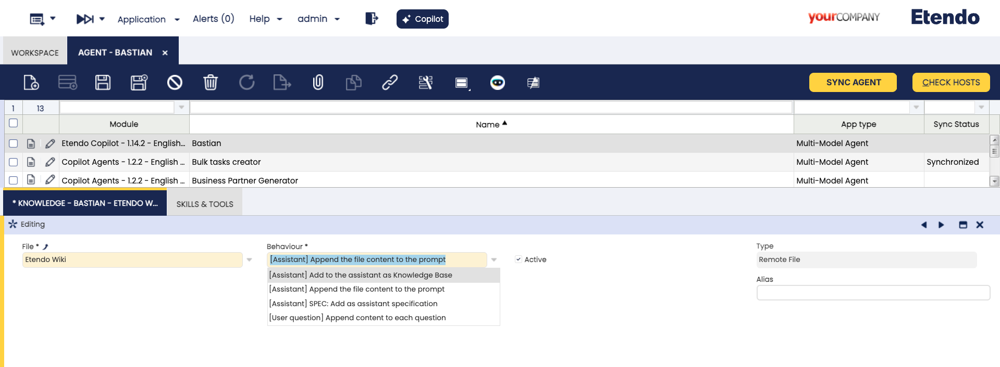
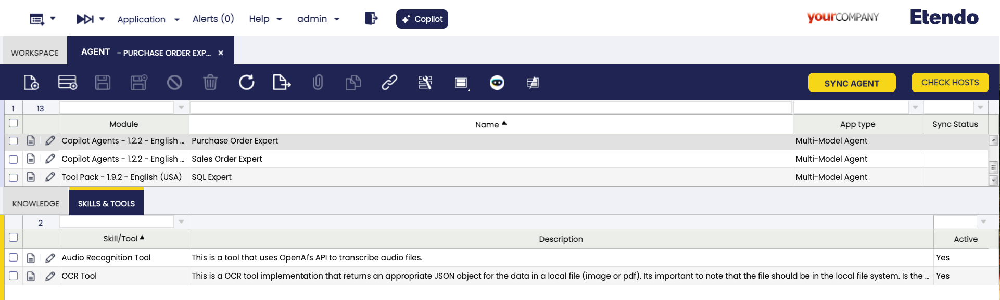

# Copilot Setup and Usage

## Initial Configuration

In order to use Copilot, the user must access the Etendo Classic under the role *System Administrator* and generate a token in `Client`>`Secure Web Service Configuration`, clicking **generate key**.

## How to Set up Assistants

In this case, Etendo Copilot has two alternatives:

1. *Dataset installation*: Etendo provides dataset options to install predetermined assistants. In case of installing Etendo Copilot, for example, **Etendo Copilot** dataset is available, which includes Bastian assistant to answer your questions about Etendo documentation.

    

    !!!info
        To check the list of available assistants, visit [Default Assistants](../../user-guide/etendo-copilot/bundles/overview.md#default-assistants).

    Once the reference data is applied, it is necessary to go to the **Assistant Window**, select the corresponding Assistant and click [Sync Assistant](#sync-assistant-button).

2. *Create your own Assistant*: Use the Assistant window to set up a new assistant with all the specific necessary characteristics.

## Assistant Window

:material-menu: `Application` > `Service` > `Copilot` > `Assistant`

The Assistant window allows you to define and configure assistants:

- **Name**: Assistant name
- **Description**: Assistant description
- **App Type**: Langchain Agent, Open AI Assistant or Langgraph

    **Open AI Assistant**

    These assistants leverage OpenAI technology to provide assistance with a variety of tasks, from natural language processing to complex calculations. The assistants are able to train themselves with their own knowledge base and customized instructions.

    **Langchain Agent**

    These assistants can perform specific tasks in natural language and provide contextualized responses, enabling the implementation of multiple AI models, the use of a proprietary vector database and internal memory management. As well as the use of tools developed to solve specific problems. Some examples of these tools are XML Translation Tool, DB Query Tool, etc. The difference between Langchain and Open AI is that Langchain can save the information locally and it is a multiprovider agent.

    **LangGraph**

    This option works as a manager of other assistants and allows to select team members. As a library, LangGraph typically works as a software tool designed to help developers and researchers work with linguistic data in a structured, graph-based format. The default maximum amount of interactions between the manager and the assistants is 50, though a different amount can be configured.

=== "Open AI Assistant"

    In case of defining an **Open AI Assistant** type app, the following fields will be enabled: 

    - **Prompt**: Specific instructions of the assistant. These instructions can be written in English or Spanish. 
    - **Description**: The description of the assistant so that the manager can choose the appropriate assistant for each case.
    - **Model**: Dropdown with the Open AI models available. If none of the options are selected, the model defined by default for the Etendo Copilot module in the [preference](../../user-guide/etendo-classic/basic-features/general-setup/application.md#preference) window is to be used.
    - **Retrieval**: If this checkbox is selected, the assistant can retrieve information from the app source. 
    - **Open AI Assistant ID**: Read-only field in which the ID of the assistant once created is displayed.
    - **Code interpreter**: Code Interpreter enables the assistant to write and run code. This tool can process files with diverse data and formatting, and generate files such as graphs.
    - **Open AI Vectordb ID**: Read-only field in which the ID of the vector database is displayed.
    - **Temperature**: This controls randomness, lowering results in less random completions. As the temperature approaches zero, the model will become deterministic and repetitive.

=== "Langchain Agent"

    In case of defining an **Langchain Agent** type app, the following fields will be enabled: 

    - **Prompt**: Specific instructions of the assistant. These instructions can be written in English or Spanish.
    - **Description**: The description of the assistant so that the manager can choose the appropriate assistant for each case. 
    - **Provider**: Model provider information.
    - **Model**: Dropdown with the models available according to the selected provider.
    - **Temperature**: This controls randomness, lowering results in less random completions. As the temperature approaches zero, the model will become deterministic and repetitive.

=== "LangGraph"

    In case of defining an **LangGraph** type app, the following fields will be enabled: 

    - **Prompt**: Specific instructions of the assistant. These instructions can be written in English or Spanish. 
    - **Description**: The description of the assistant so that the manager can choose the appropriate assistant for each case.
    - **Graph Preview**: It shows the tree of assistants under a certain manager.
    - **Provider**: Model provider information.
    - **Model**: Dropdown with the models available according to the selected provider.
    - **Temperature**: This controls randomness, lowering results in less random completions. As the temperature approaches zero, the model will become deterministic and repetitive.

        !!!info
            If this option is chosen, the **Refresh Preview** button is shown, allowing the user to refresh the Graph Preview when changes to the team members are introduced.

!!!info
    The **Prompt** field can have the following dynamic variables: @ETENDO_HOST@, @ETENDO_HOST_DOCKER@ and @source.path@
    These variables will be replaced with the values defined in the properties.
If the App types Open AI Assistant or Langchain Agent are chosen, the tabs shows are [Knowledge](#knowledge-tab) and [Skill and Tools](#skills-and-tools-tab). If the LangGraph option is chosen, the [Team Members tab](#team-members-tab) is shown.

### Sync Assistant Button

This process takes care of updating or creating a new assistant, in case it does not exist. In addition to creating the assistant based on the configurations, it initially gets or updates the list of models, and finally gets and/or uploads the files used as knowledge base.

### Knowledge Tab

In this tab, you can define the files that will be used by the assistant as knowledge base, in prompts or questions. 

!!!warning "File Limitation for Code Interpreter"
    If an assistant has the Code Interpreter check enabled, a maximum of 20 files is supported. Although it is possible to include more files in the knowledge base, exceeding this limit means that some files must be excluded. To do this, use the **Exclude from Code Interpreter** option on the files that you do not want to be processed by the Code Interpreter.

!!!info
    When configuring files for Langchain agent assistants, remember the supported formats are `.zip`, `.txt`, `.pdf` and `.md`. For `.zip` files, note that these are the only formats that the wizard will read: `.txt`, `.pdf`, `.md`, `.py`, `.java` and `.js`.

!!!info
    To load new files, you must do it from the [Knowledge Base File](#knowledge-base-file).

Fields to note:

- **File**: The file selected as knowledge base.
- **Behaviour**: The way in which the assistant will use the file. It has three available options:
    - Add to the assistant as knowledge base: before using this option, it is necessary to synchronize the assistant with the [Sync Assistant](#sync-assistant-button). This behaviour is possible only with **Retrieval** checked.
    - Append the file content to the prompt: In this option, Etendo fails if the file is too large and exceeds the token limit allowed by the assistant. Then, this option is suitable for small files only. The file must be in text format.
    - Add content to each question: In this case, the same restrictions from the previous option apply. 
- **Type**: read-only field showing the type of file selected in the [Knowledge Base File window](#knowledge-base-file-window).
- **Active**: checkbox to activate the knowledge base file.
- **Exclude from Code Interpreter**: Checkbox to exclude files from being processed by the Code Interpreter during synchronization. This checkbox is only editable if the assistant has the Code Interpreter option enabled.
- **Exclude from Retrieval**: Checkbox to exclude files from being considered in the Retrieval process during synchronization.This checkbox is only editable if the assistant has the Retrieval option enabled.
- **OpenAI File ID** Read-only field with Open AI file ID, if applicable.
- **Alias** In case you select behaviour,  `Append the file content to the prompt`, by default it adds the file content to the end of the prompt, the alias can be used to replace the file content inside the prompt, using the wildcard @<alias>@, with the alias you define in this field. 

### Skills and Tools Tab

In this tab, you can define the tools to be used by the assistant.

Fields to note:

- **Copilot Tool**: The user can select any of the options available in this field, as many as necessary but one at the time.
- **Description**: Read-only field. It shows the description of the tool, used by the assistant to choose the appropriate tool for each case.

!!!info
    To enter new tools, you must do it from the [Skill/Tool window](#skilltool-window).

### Team Members Tab

In this tab, only present if the LangGraph App type is selected, the LangGraph's assistants are defined. Remember that LangGraph works as a manager of other assistants.

Fields to note:

- **Member**: The user can select one or more assistants for the manager. 

    !!! warning
        Remember that you can only select assistants to which you have defined access in the [Assistant Access window](#assistant-access-window).

- **Description**:  Read-only field. It shows the description of the assistant, used by the manager to choose the appropriate assistant for each case.

    !!! warning
        Remember that it is not possible to select an assistant without a description.

## Knowledge Base File Window

:material-menu: `Application`>`Service`>`Copilot`>`Knowledge Base File`

In the Knowledge Base File window, you can define the files with which the assistants can interact.

- **Name**: File Name.
- **Description**: File description.
- **Type**:
    - **Attached File** 
    This allows you to upload files directly into Copilot for later use during interactions with the assistants.
    - **HQL Query**
    This allows using an HQL query result as a file for knowledge base file.
    - **Remote File** 
    You can provide a public URL from which Copilot will retrieve the file when needed. This makes it easy to access text documents and external text resources.
    - **Code Index** 
    Only available as System Administrator, as access to the source code is required.This type allows assistants to access and consult indexed code files. It enables options related to file path configuration which can be defined in the File Path tab.
- **Open AI File ID**: Read-only field showing the Open AI ID of the file once it is created.
- **Last Synchronization**: Read-only field displaying the date of the last update with OpenAI.
- **File name**: Name of the remote file in case you want to modify it. This name must include the file format. For example, `example.pdf`.
- **URL**: Source file URL. Only shown if the **Remote file** option is chosen in the Type field.
- **HQL**: Only shown if the **HQL Query** option is chosen in the Type field.

### File Path Tab 

!!! warning 
    Only available as System Administrator, as access to the source code is required.

The **File Path Tab** appears when **Code Index** is selected as the file type. 

**Path File**: Specify the path where the code files you need the assistant to read are located. 

!!!info
    It is also possible to use other variables such as `@source.path@:` so that the system automatically replaces it with the path where EtendoERP is installed. 
    Besides, wildcards like `*` can be used to access all files of the same type in a directory (e.g., `test/*.java` will access all Java files in the `test` folder), and this one `**`, to include subdirectories (e.g., `test/**/*.java` will access all Java files within `test` and its subdirectories).

!!!note
    If Etendo Classic is a JAR instance, the source code is located in the following path: `@source.path@/build/etendo/`.

## Skill/Tool Window

:material-menu: `Application`>`Service`>`Copilot`>`Skill/Tool`

In this window , the user can find available tools, distributed in the Copilot bundle, to be used in Copilot assistants.

Some tools require to communicate with Etendo through WebHooks. Their configuration can be found in the Webhooks tab.

!!!info
    In case you want to define new tools, visit [How to Create Copilot Tools](../../developer-guide/etendo-copilot/how-to-create-copilot-tools.md).

## Assistant Access Window

:material-menu: `Application`>`Service`>`Copilot`>`Assistant Access`

In this window, it is possible to configure access roles for each Assistant. This means you can control who has permission to interact with each assistant. This feature is useful for ensuring that users only have access to functions relevant to their responsibilities. This possibility depends on the role level you have.

!!!info
    This configuration is also possible from the Role window.

!!!note
    In case of deleting an assistant, the related assistant access records are also deleted.

## Process Request Window

:material-menu: `Application`>`General Setup`>`Process Scheduling`>`Process Request`

In this window, the user can schedule Etendo Copilot background processes by selecting the Assistants Schedule option in the Process field and using all the provided options such as timing, start date, frequency, etc.

!!!info
    For more information, visit [Process Request](../../user-guide/etendo-classic/basic-features/general-setup/process-scheduling.md#process-request).

### Assistant Tab 

!!! Info
    This tab is only visible when an **Assistants Schedule** process is selected.

In this tab, the process to be scheduled can be configured. 

Fields to note:

- **Name**: Name description.
- **Assistant**: Corresponding assistant for the process.
- **Prompt**: Instruction for the process.
- **Active**: Checkbox to select if this tool is active or not.

## Conversations Window

:material-menu: `Application`>`Service`>`Copilot`>`Conversations`

In this window, the user can find and access all interactions had with Copilot. These records show specific information about these conversations, such as user, creation date and assistant.

Fields to note:

- **User/Contact**: The user that interacted with Copilot
- **ExternalID**: External provider conversation ID
- **Creation Date**: The date of the conversation
- **Visible**: Checkbox to mark to make the record visible
- **Last Message**: Date of the last message of the conversation
- **Assistant**: Assistant selected to interact

### Messages Tab

In this tab, the different messages included in each specific conversation are shown.

Fields to note:

- **Message**: Exact message used in the conversation
- **Time**: Time of the message
- **Creation Date**: Date of the message
