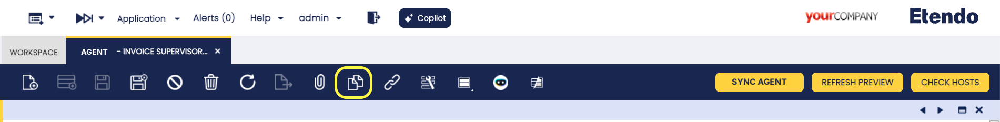
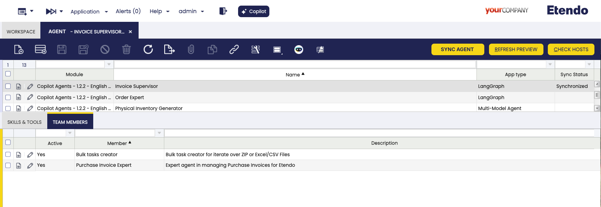
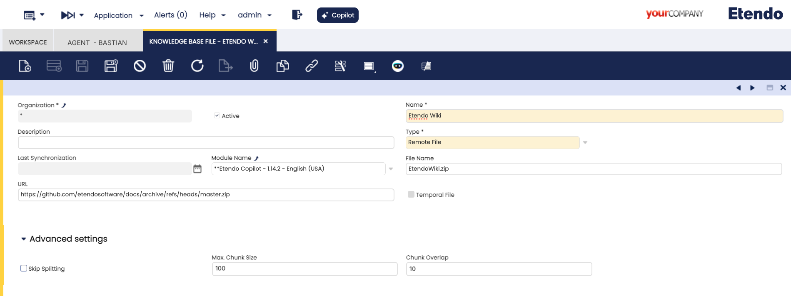
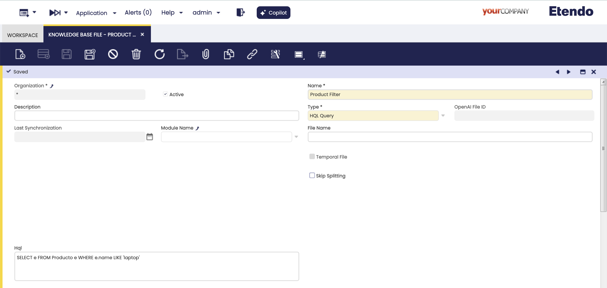

!!! warning
    Currently, we are migrating the terminology from *Assistant* to *Agent*. This change will be reflected in the documentation soon. Where you see *Assistant*, consider it as *Agent* and vice versa.

# Copilot Setup and Usage

## Initial Configuration
:material-menu: `Application` > `General Setup` > `Client` > `Client` 

In order to use Copilot, the user must access the Etendo Classic under the role *System Administrator* and generate a token in `Client`>`Secure Web Service Configuration`, clicking **generate key**.

## How to Set up Assistants

With Etendo Copilot, it is possible to:
1. *Create your own Assistant*: Use the Assistant window to set up a new assistant with all the specific necessary characteristics.

2. *Install a module with a pre-configured assistant*: Some modules come with pre-configured assistants, which can be used as is or modified to suit your needs.

## Assistant Window

:material-menu: `Application` > `Service` > `Copilot` > `Assistant`

The Assistant window allows you to define and configure assistants:

- **Name**: Assistant name
- **Description**: Assistant description
- **Prompt**: Specific instructions of the assistant. These instructions can be written in English or Spanish.
- **Description**: The description of the assistant so that the manager can choose the appropriate assistant for each case. 
 - **Model**: Dropdown with the models available,from the [AI Models](#ai-models-window) window.
 - **Temperature**: This controls randomness, lowering results in less random completions. As the temperature approaches zero, the model will become deterministic and repetitive.

- **App Type**:

    - **Multi-Model Agent**
        This type of assistant can use multiple models of different providers, such as OpenAI, Anthropic, etc. 
        This is the most recommended option to define a simple agent. The Agents can have a knowledge base filled with files, and can use tools to do specific tasks. The agent will strategically use the tools and knowledge base to provide the best possible response.

    -  **LangGraph**

        This option works as a manager of other assistants and allows to select team members. As a library, LangGraph typically works as a software tool designed to help developers and researchers work with linguistic data in a structured, graph-based format. The default maximum amount of interactions between the manager and the assistants is 50, though a different amount can be configured.

    - **Open AI Assistant (Deprecated)**

        These assistants leverage OpenAI technology to provide assistance with a variety of tasks, from natural language processing to complex calculations. The assistants are able to train themselves with their own knowledge base and customized instructions. Currently is deprecated, but still available for use for compatibility reasons. Its recommended to migrate to the Multi-Model Agent type.

    - **Langchain Agent (Deprecated)**

        This type of assistant is very similar to the Multi-Model Agent, but its based on a older implementation of Langchain. Currently is deprecated, but still available for use for compatibility reasons. Its recommended to migrate to the Multi-Model Agent type.

=== "Multi-Model Agent"

    In case of defining an **Multi-Model Agent** type app, the following fields will be enabled: 

=== "LangGraph"

    In case of defining an **LangGraph** type app, the following fields will be enabled: 
    - **Graph Preview**: It shows the tree of assistants under a certain manager.

=== "Open AI Assistant (Deprecated)"

    In case of defining an **Open AI Assistant** type app, the following fields will be enabled: 

    - **Retrieval**: If this checkbox is selected, the assistant can retrieve information from the app source. 
    - **Open AI Assistant ID**: Read-only field in which the ID of the assistant once created is displayed.
    - **Code interpreter**: Code Interpreter enables the assistant to write and run code. This tool can process files with diverse data and formatting, and generate files such as graphs.
    - **Open AI Vectordb ID**: Read-only field in which the ID of the vector database is displayed.

!!!info
    The **Prompt** field can have the following dynamic variables: @ETENDO_HOST@, @ETENDO_HOST_DOCKER@ and @source.path@
    These variables will be replaced with the values defined in the properties.
If the App types Open AI Assistant or Langchain Agent are chosen, the tabs shows are [Knowledge](#knowledge-tab) and [Skill and Tools](#skills-and-tools-tab). If the LangGraph option is chosen, the [Team Members tab](#team-members-tab) is shown.

### Capabilities
The capabilities of an agent are:
- **Text Generation**: The agent can answer questions or retrieve results from his knowledge base from the LLM model(general knowledge).Those models are able to generate text based on the input prompt, so if we specify in the prompt "Answer with the result of the operation sent" and the user sends "2+2", the agent will respond with "4".
- **Retrieval**: The agent can be configured with a custom knowledge base, which can be used to retrieve information. Its usefull when there is documentation or information that the agent can use to answer questions.
- **Tools**: The agent can use tools to perform specific tasks. The tools are defined in the [Skill/Tool window](#skilltool-window).
- **Receive atta
- **Read images**: The newest models can receive images as input, and work directly with them. This feature is only available for the Multi-Model Agent type.

### Buttons

- **Sync Assistant**: This process takes care of updating or creating a new assistant, in case it does not exist. In addition to creating the assistant based on the configurations, it initially gets or updates the list of models, and finally gets and/or uploads the files used as knowledge base.

- **Refresh Preview**: Show only when agent type is **Langraph**, allowing the user to refresh the Graph Preview when changes to the team members are introduced.

- **Check hosts**: This button check the configuration of Etendo Classic and Copilot, to ensure that de comunication between them is correct. In case of any error, a message will be shown.

- **Clone**: The navbar clone button allows the cloning of agents, making a copy of both all header fields and related records in the tabs. When a assistant is cloned in, the name `Copy of` is added. 

    

### Knowledge Tab

In this tab, you can setup the files that will be used by the assistant as knowledge base, in prompts or questions.

!!!info
    To load new files, you must do it from the [Knowledge base file](#knowledge-base-file) window, first you define the files and then from this tab you configure how the file will be used.

!!!warning "File Limitation for Code Interpreter"
    If an assistant has the Code Interpreter check enabled, a maximum of 20 files is supported. Although it is possible to include more files in the knowledge base, exceeding this limit means that some files must be excluded. To do this, use the **Exclude from Code Interpreter** option on the files that you do not want to be processed by the Code Interpreter.

!!!info
    When configuring files for Langchain agent assistants, remember the supported formats are `.zip`, `.txt`, `.pdf` and `.md`. For `.zip` files, note that these are the only formats that the wizard will read: `.txt`, `.pdf`, `.md`, `.py`, `.java` and `.js`.

Fields to note:

- **File**: The file selected as knowledge base.
- **Behaviour**: The way in which the assistant will use the file. It has three available options:
    - Add to the assistant as knowledge base: before using this option, it is necessary to synchronize the assistant with the [Sync Assistant](#sync-assistant-button). This behaviour is possible only with **Retrieval** checked.
    - Append the file content to the prompt: In this option, Etendo fails if the file is too large and exceeds the token limit allowed by the assistant. Then, this option is suitable for small files only. The file must be in text format.
    - Add content to each question: In this case, the same restrictions from the previous option apply. 
- **Type**: read-only field showing the type of file selected in the [Knowledge Base File window](#knowledge-base-file-window).
- **Active**: checkbox to activate the knowledge base file.
- **Exclude from Code Interpreter**: Checkbox to exclude files from being processed by the Code Interpreter during synchronization. This checkbox is only editable if the assistant has the Code Interpreter option enabled.
- **Exclude from Retrieval**: Checkbox to exclude files from being considered in the Retrieval process during synchronization.This checkbox is only editable if the assistant has the Retrieval option enabled.
- **OpenAI File ID** Read-only field with Open AI file ID, if applicable.
- **Alias** In case you select behaviour,  `Append the file content to the prompt`, by default it adds the file content to the end of the prompt, the alias can be used to replace the file content inside the prompt, using the wildcard @<alias>@, with the alias you define in this field. 

### Skills and Tools Tab

In this tab, you can define the tools to be used by the assistant.

Fields to note:

- **Copilot Tool**: The user can select any of the options available in this field, as many as necessary but one at the time.
- **Description**: Read-only field. It shows the description of the tool, used by the assistant to choose the appropriate tool for each case.

!!!info
    To enter new tools, you must do it from the [Skill/Tool window](#skilltool-window).

### Team Members Tab

In this tab, only present if the LangGraph App type is selected, the LangGraph's assistants are defined. Remember that LangGraph works as a manager of other assistants.

Fields to note:

- **Member**: The user can select one or more assistants for the manager. 

    !!! warning
        Remember that you can only select assistants to which you have defined access in the [Assistant Access window](#assistant-access-window).

- **Description**:  Read-only field. It shows the description of the assistant, used by the manager to choose the appropriate assistant for each case.

    !!! warning
        Remember that it is not possible to select an assistant without a description.

## Knowledge Base File Window

:material-menu: `Application`>`Service`>`Copilot`>`Knowledge Base File`

In the Knowledge Base File window, you can define the files with which the assistants can interact.

- **Name**: File Name.
- **Description**: File description.
- **Open AI File ID**: Read-only field showing the Open AI ID of the file once it is created.
- **Last Synchronization**: Read-only field displaying the date of the last update with OpenAI.
- **Skip Splitting**: Checking this box allows you to tell Copilot not to split the file into parts when indexing it. This is necessary when the entire contents of the file are needed when reading the file, while maintaining the context of the entire file.
- **File name**: Name of the saved file, it must always include the file format. For example, `example.pdf`.

- Optional fields by file **Type**:

    === "Attached File"

        This type allows you to upload files directly into Copilot for later use during interactions with the assistants.
        
    
    === "Code Index"

        Only available as `System Administrator` role, as access to the source code is required. This type allows the agents to access, query and generate a zip with code files that will be indexed to the knowledge base. It allows the configuration of paths and regular expressions to filter files, which are defined in the File Path tab.

        ### File Path Tab
        
        This tab is Only available as `System Administrator` role , as access to the source code is required.
        
        

        Fields to note:

        - **Path File**: Specify the path where the code files you need the assistant to read are located. 

        !!!info
            It is also possible to use other variables such as `@source.path@:` so that the system automatically replaces it with the path where EtendoERP is installed. Besides, wildcards like `*` can be used to access all files of the same type in a directory (e.g., `test/*.java` will access all Java files in the `test` folder), and this one `**`, to include subdirectories (e.g., `test/**/*.java` will access all Java files within `test` and its subdirectories).
        
        !!!warning
            As access to the source code is required, both modules and Etendo Classic must be installed in source format.     

    === "HQL Query"

        This type allows using an HQL query result as a file for knowledge base file.

        Fields to note:

        - **HQL**: Only shown if the **HQL Query** option is chosen in the Type field.

        

    === "OpenAPI Flow Specification"

        This type of files, allows to obtain the JSON of the specification of an OpenAPI REST generated from Flows and Request from Etendo, for more technical information you can consult [How to document an endpoint with OpenAPI](../../developer-guide/etendo-classic/how-to-guides/how-to-document-an-endpoint-with-openapi.md).

        Fields to note:

        - **OpenAPI Flow**  Only show if the **OpenAPI Flow Specification** is chosen in the Type field.  OpenAPI Flow selector, grouping enpoints common to a specific functionality.

        
    
    === "Remote File"
        
        You can provide a public URL from which Copilot will retrieve the file when needed. This makes it easy to access text documents and external text resources.

        Fields to note:

        - **URL**: Source file URL.
        - **File name**: Mandatory name of the saved file, it must always include the file format.

        

    
    === "Text"

        This allows you to write the content of the file directly in the text area. This option is useful for small texts that must be versioned in the system.

        Fields to note:

        - **Text**: Text content of the file.

        

### Buttons

- **Clone**

    The navbar clone button allows the cloning of files, making a copy of both all header fields and related records in the tabs. When a file is cloned in, the name `Copy of` is added. 

     

## Skill/Tool Window

:material-menu: `Application`>`Service`>`Copilot`>`Skill/Tool`

In this window , the user can find [available tools](../../developer-guide/etendo-copilot/available-tools/overview.md), distributed in the Copilot bundle, to be used in Copilot assistants.

Some tools require to communicate with Etendo through WebHooks. Their configuration can be found in the Webhooks tab.

!!!info
    In case you want to define new tools, visit [How to Create Copilot Tools](../../developer-guide/etendo-copilot/how-to-create-copilot-tools.md).

## Assistant Access Window

:material-menu: `Application`>`Service`>`Copilot`>`Assistant Access`

In this window, it is possible to configure access roles for each Assistant. This means you can control who has permission to interact with each assistant. This feature is useful for ensuring that users only have access to functions relevant to their responsibilities. This possibility depends on the role level you have.

!!!info
    This configuration is also possible from the Role window.

!!!note
    In case of deleting an assistant, the related assistant access records are also deleted.

## Process Request Window

:material-menu: `Application`>`General Setup`>`Process Scheduling`>`Process Request`

In this window, the user can schedule Etendo Copilot background processes by selecting the Assistants Schedule option in the Process field and using all the provided options such as timing, start date, frequency, etc.

!!!info
    For more information, visit [Process Request](../../user-guide/etendo-classic/basic-features/general-setup/process-scheduling.md#process-request).

### Assistant Tab 

!!! Info
    This tab is only visible when an **Assistants Schedule** process is selected.

In this tab, the process to be scheduled can be configured. 

Fields to note:

- **Name**: Name description.
- **Assistant**: Corresponding assistant for the process.
- **Prompt**: Instruction for the process.
- **Active**: Checkbox to select if this tool is active or not.

## Conversations Window

:material-menu: `Application`>`Service`>`Copilot`>`Conversations`

In this window, the user can find and access all interactions had with Copilot. These records show specific information about these conversations, such as user, creation date and assistant.

Fields to note:

- **User/Contact**: The user that interacted with Copilot
- **ExternalID**: External provider conversation ID
- **Creation Date**: The date of the conversation
- **Visible**: Checkbox to mark to make the record visible
- **Last Message**: Date of the last message of the conversation
- **Assistant**: Assistant selected to interact

### Messages Tab

In this tab, the different messages included in each specific conversation are shown.

Fields to note:

- **Message**: Exact message used in the conversation
- **Time**: Time of the message
- **Creation Date**: Date of the message

## AI Models Window

:material-menu: `Application`>`Service`>`Copilot`>`AI Models`

In this window, the user can find and add AI models to be used by the assistants, Available in the drop-down list of models

!!!info 
    - Automatically, the window will be populated with the Etendo default distributed models, after the first assistant synchronization.
    - Also diffrent models and providers must be entered manually.

Fields to note:

- **Code**: The code name of the model. It must be in lowercase.
- **Name**: The human-readable name of the model.
- **Provider**: The provider of the model. It must be in lowercase.
- **Max Tokens**: The maximum number of tokens that can be generated by the model. This is a field required in some models, that can be used to limit or expand the model's capabilities, depending of the nature of the model.
- **Default**: Read-only field, to identify the default model to use, this configuration is distributed and updated by Etendo.
- **Default Override**: If this field is checked, the selected model will have priority over the others. Only one record can have this check selected.
- **Etendo Maintenance** Read-only field, to identify the models that are distributed by Etendo.

### Buttons

**Sync Models** This process allows to synchronize the models distributed by Etendo on demand.

