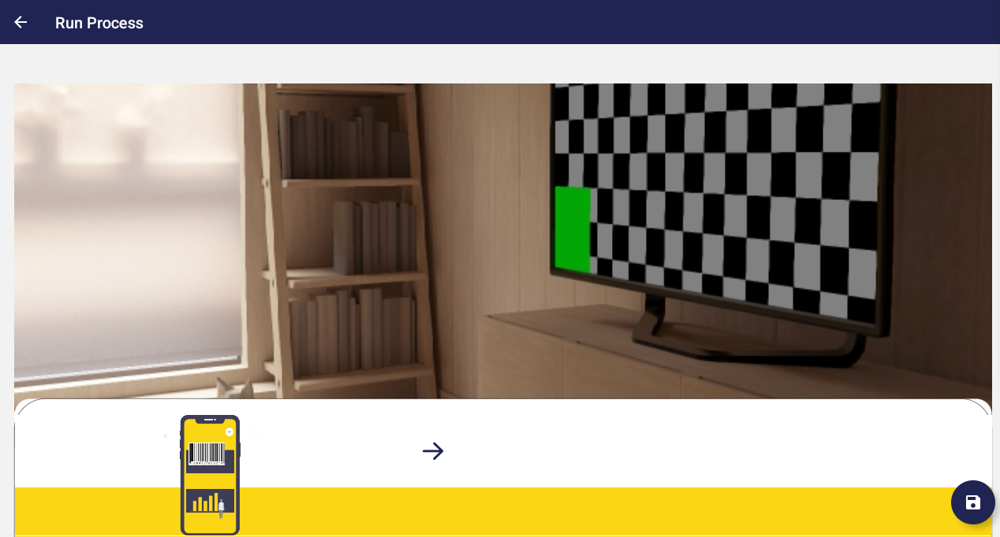
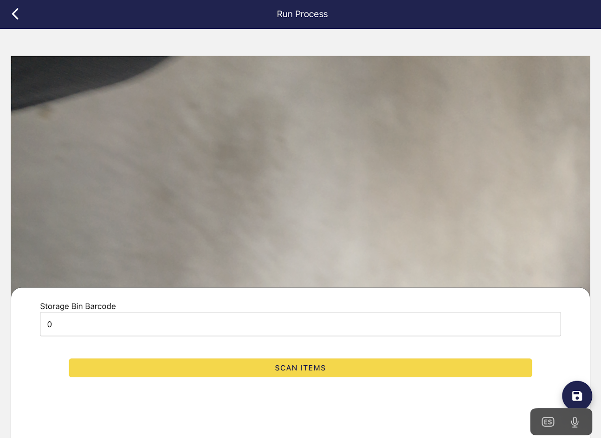
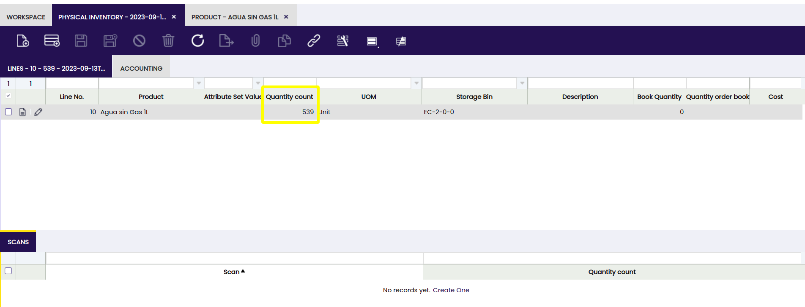

---
tags:
 - Etendo Classic
 - Mobile Extension
 - Record Management
 - Inventory Scanning
 - User Navigation
---

# Etendo Classic Subapp
:octicons-package-16: Javapackage: `com.etendoerp.subapp.classic`   

## Overview 

The **Etendo Classic Sub-app** Provides users with an efficient way to access key system window information based on user roles, guaranteeing read access. While editing records is allowed, it is recommended to perform data creation and management primarily in Etendo Classic.

The Etendo Classic Sub-application allows users to access and manage their client’s information directly from Etendo Mobile, providing a quick and efficient way to **view data** and make simple edits. In addition, thanks to features such as **scanning**, users can see a demonstration of inventory management by scanning products during physical inventory.

!!! info
    - To be able to include the sub-application, the Mobile Extensions Bundle must be installed. To do that, follow the instructions from the marketplace: [Mobile Extensions Bundle](https://marketplace.etendo.cloud/#/product-details?module=55A7EF64F7FA43449B249DA7F8E14589){target="_blank"}.  
    For more information about the versions available, core compatibility and new features visit [Mobile Extensions - Release Notes](../../../../whats-new/release-notes/etendo-mobile/bundles/mobile-extensions/release-notes.md).

## Initial Setup

### Show Windows in Mobile
:material-menu: `Application` > `General Setup` > `Security` > `Role`

By default, no window will be displayed in the subapp, to allow Etendo windows to be visible: 

1. The user must enter to Etendo Classic under the **Administrator** role.
2. Select the Role that will give you access to display windows in the sub-application.
3. In `Role`>`Window Access` tab filter the windows and check the **Show in mobile** flag in the required windows to be shown in the app.

### Editing Identifiers in Cards and Filters 
:material-menu: `Application` > `Application Dictionary` > `Windows, Tabs and Fields`

{ align=right width="300" }

When you open a window, you will notice that the records are displayed in cards with certain information that is configurable. More information about cards in the [User Interface - Cards and Form View](#cards-and-form-view) section.
By default a title identifier and optionally secondary fields are displayed. 

To edit this information, can be done fom Etendo Classic by configurations. 

!!!warning
    We recommend that this configuration be done by a developer or someone with technical knowledge. 

1. Log in as `System Administrator`.
2. Go to `Windows, tabs and fields` window.
3. Filter the window that you want to modify, and select the main tab, it can have the same name of the window or be called `header`.
4. In the `Mobile Configuration` tab, you will find a **Default Configuration** record, you must delete it and create a new configuration to be exported in a new module under development.
5. Create a line for each field that you want to show as identifier in the cards, you must take into account that the first record created will be the title and the other fields will be subtitles and the order is respected according to the creation date.
6. You must take into account that the searches can filter by each of these fields defined as identifiers, only exact or equal search is allowed, you can also add a maximum of 5 identifiers.

For example, by default the `Sales Order` window displays the identifiers `Document No` as title, `Order Date` and `Total Gross Amount` as subtitle. 

In this case we will create a custom view, with `Sales Order - Custom View` name  and it will be exported in a new module called `Mobile Customizations`. 

Add 5 lines, the first one as title will be `Business Partner`, then  `Currency`, `Document Status`, `Total Gross Amount`, `Payment Method` and `Order Date` as subtitles.

!!!warning 
    Remember that the order of the identifiers depends on the creation date, and that a maximum of 5 identifiers can be displayed.

 
 

## User Interface

### Navigation Menu

When ingress to **Etendo Classic** Subapp, in the home, the user can find a menu option from which they can:

- In the top section of the menu the user picture will be shown.
- Access to different windows allowed according to their role.
- Go back, Option to go back to Etendo Mobile.

### Cards and Form View

{ align=right width="180" }

- The user, according to the role, will have access to certain windows, and they are configurable as can be seen in [Show Windows in Mobile](#show-windows-in-mobile) section.   
Some of the most common windows are:  Product, Business Partner, Sales Invoice, Sales Order, Purchase Invoice, Purchase Order, among others.    

- Each window will display its content by dividing the records into cards, which will contain a preview of the main data of those records. These data are configured by default and customization will be necessary in case the user wants to add more fields or delete any of them, taking into account that only a maximum of 5 fields can be displayed. For more information visit, [Editing Identifiers in Cards and Filters](#editing-identifiers-in-cards-and-filters)    

{ align=left width="180" }

- The same field, present in the preview, will be the criteria by which to filter if the user wants to search for a record. Considering the Sales Invoice window as an example, the preview of each record provides information regarding the document number and the invoice date.    

- Records can be searched by inserting a value or keyword in the top **Search** bar. Each window will have certain filters available by field which will match those fields configured by default to be displayed in the preview of each record. In case the user needs to add more filters or to remove some of them, customization will be required.      

{align=right width="180" }

- By clicking any of those boxes, detailed information about the records will be displayed and can be edited. The fields will be displayed one below the other. Those with this symbol  “(\*)” in their title are mandatory and those with a pencil icon are editable.         
    
{ align=left  width="180" }

- To create a new record, the user must click the icon with the symbol “+” and complete the desired fields. Those with the symbol (\*) are mandatory. To edit a field, the user must click the pencil icon. If the field is a list field, click the search icon to display possible options. After selecting the correct data, press the button “Done”.        

{ align=right  width="180" }

- If the field is a date type, when selecting the search icon a calendar to select the desired date will be displayed. Free text fields are edited by selecting the field and entering the desired value.  
- Once the user has entered the required data, click the save icon. It is important to consider that the document will always remain in **Draft** status and can only be completed through the Etendo Classic.     

{ align=left width="180" }

- To delete a record, press it and drag it to the left or hold it, select all the desired records and then the delete icon. Each time a record is deleted in the App, the same record will be deleted in the Etendo Classic as well.           

### Folders Button

{ align=right  width="180" }

- By selecting the Folders button, the user can access the different tabs of the window with information about the records being browsed.
- When entering any of the tabs, the view will be the same as in the parent window, e.i., the records will be displayed in small boxes and, when entering these, the fields will be displayed one below the other.  

{  align=left width="180" }

- To navigate in different levels, the user can resort to the system buttons (Android) or the arrow in the upper left corner or gesture (both systems).
- In addition, the **path or breadcrumbs** of which records and tabs are being navigated can be displayed at the top of the screen.      

### Actions button

Through this button, the user can access the list of available processes corresponding to the window being browsed and execute them.

## Mobile App Scanning Helpers

:octicons-package-16: Javapackage: `com.smf.mobile.scan`

### Overview

The **Mobile App Scanning Helpers** allows to use the camera to scan codes in [Etendo Mobile](../../../../user-guide/etendo-mobile/getting-started.md) App.

### Usage Examples

 The module has the Inventory Scan process by default, which is responsible for scanning this code from a mobile and thus, change values of the Physical Inventory lines.

 Now, an example will be shown from the Etendo Mobile application:

 When entering the Physical inventory window and select a record, it will be possible to see the **Actions** button.

 

In this button, it is possible to see the process it incorporates, called Inventory Scan.

 

 When pressing this action, it performs the scanning functions to be able to modify values of the physical inventory item that has been selected.
 
  

When the arrow to continue is selected, the code of the storage bin in which the product is located must be entered manually or scanned.

  

 After selecting the storage bin, the product to be modified must be scanned or selected.

  

 Finally, enter the amount needed to add of that product, press Done and Save.

  

 In the meantime, in Etendo Classic a line will be added in the **Scan** tab of the physical inventory line, about the scan and the amount that has been set.

  

In the physical inventory header, by selecting a scan line, the Process Inventory Count can be run. This takes care of adding to the stock the quantity that has been set on the scanned product.

  

And here, the quantities will be observed before the process:

  

 And after:

  

It will also be noticed that the Product's Stock has been updated in the indicated storage bin with the quantity of the product:

  

---
This work is licensed under :material-creative-commons: :fontawesome-brands-creative-commons-by: :fontawesome-brands-creative-commons-sa: [ CC BY-SA 2.5 ES](https://creativecommons.org/licenses/by-sa/2.5/es/){target="_blank"} by [Futit Services S.L](https://etendo.software){target="_blank"}.