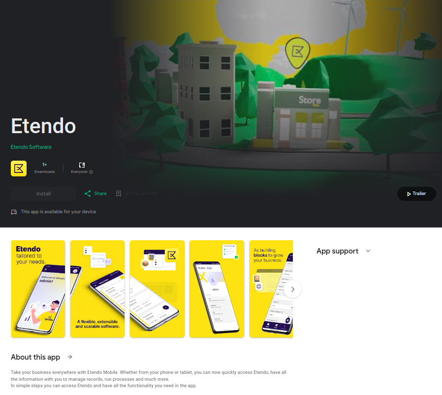
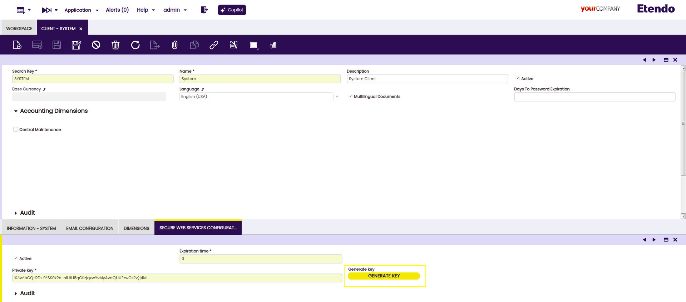
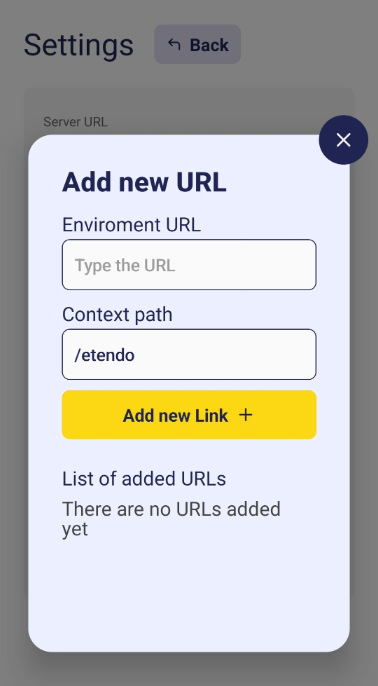

---
tags:
    - Etendo Mobile
    - Mobile Apps
    - Dynamic Sub-apps
    - Configuration
    - App Integration
---

# Etendo Mobile

## Overview

Etendo Mobile is a **mobile app** in which the user can access to sub-applications via mobile devices in a fast and practical way. By enabling seamless integration between Etendo Classic and mobile sub-applications, Etendo Mobile allows users to log in to Etendo Classic and configure **dynamic applications** tailored to specific user roles, enhancing productivity and efficiency.

!!!info
    To be able to access to the sub-applications, the Platform Extensions Bundle must be installed. To do that, follow the instructions from the marketplace: [_Platform Extensions Bundle_](https://marketplace.etendo.cloud/#/product-details?module=5AE4A287F2584210876230321FBEE614){target="_blank"}. For more information about the available versions, core compatibility and new features, visit [Platform Extensions - Release notes](https://docs.etendo.software/whats-new/release-notes/etendo-classic/bundles/platform-extensions/release-notes/).

Etendo Mobile is available in both Play and App Store:

=== ":simple-homeassistantcommunitystore: Play store"

    The app is available in Play Store and the download site can be accessed through [_Download the App here._](https://play.google.com/store/apps/details?id=com.smf.mobile.etendo_app_loader){target=_blank}

    

=== ":simple-appstore: App Store "

    The app is available in App Store and the download site can be accessed through [_Download the App here._](https://apps.apple.com/us/app/etendo/id6451114033){target=_blank}

    
    

## Initial Configuration

In order to use the app, the user must access Etendo Classic in `Client`>`Secure Web Service Configuration` since the app uses Secure Web Services to authentizate itself. So, as System Administrator role, generate a token by clicking on the **generate key** button, this token is used to start the session in the app.

## Server URL

{ width="250" align="right" }

Once the app is downloaded, the first step will be setting up the **Etendo server URL**.

For this, the gear icon shown in the welcome window allows the user to enter the configuration window. In Settings, click the Add new Link button, enter the URL and click **Add new Link** again.

!!!info
    In the Add new link field, it is possible to add other URLs to connect the app from different servers. It is also possible to modify or remove URLs.

## Log In
 

{ width="250" align="right" }

Once the server URL is configured, the user must log in entering **the user and the password** assigned by the system administrator.

!!!info
    The user will enter with their default **Role, Organization, Client and Warehouse** setup.

!!!note
    The user will remain logged in unless the session is ended through Log out option.  

!!!info
    Etendo Mobile offers the possibility to connect to a demo server to test the app. In this case, the **Demo Try** button must be pressed so the user can enter the app without credential requirements.

## Dynamic App Role Configuration

Etendo Mobile allows the creation and configuration of mobile sub-applications. In order to be able to configure the dynamic sub-applications, it is necessary to install the [Mobile Extensions](../etendo-mobile/bundles/mobile-extensions/mobile-extensions.md) bundle which contains all sub-apps distributed by Etendo. 

Once installed, go to the **Role window** in `General Setup> Security> Role` and create a configuration register in the **Dynamic Apps** tab for each sub-app to be configured. This action sets the access to the sub-applications according to the role.  

Fields to note:

- **App:** This dropdown displays the available applications based on the installed modules. Selecting an application grants access to that application for the role.
- **Version:** Assign the version of the application to be used in this role.
- **Active:** Select if this application is active or not.

