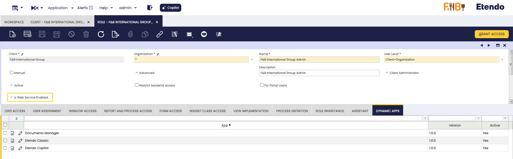
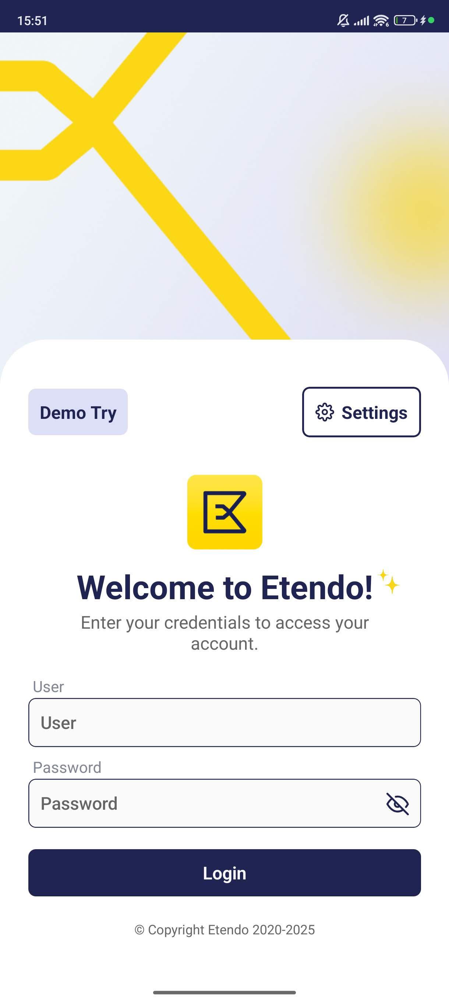

# User Guide - Getting Started - Etendo Mobile

## Overview

Etendo Mobile is a **mobile application** that allows users to quickly access different Etendo Classic servers and use sub-applications installed on each instance. You can either try the app immediately using the demo mode or perform a full manual configuration to connect to your own servers and sub-applications.

## Quick Start - Demo Try 

**Checklist**
 
- [x] Download Etendo App.
- [x] Use the **Demo Try** Button to Access Official Sub-Apps.

---

1. ### Download the Etendo App 

    Etendo Mobile is available on both Play Store and App Store:

    === ":simple-homeassistantcommunitystore: Play store"

        The app is available in Play Store. Download it here: [_Download the App here._](https://play.google.com/store/apps/details?id=com.smf.mobile.etendo_app_loader){target=_blank}

        
        

    === ":simple-appstore: App Store "

        The app is available in App Store. Download it here: [_Download the App here._](https://apps.apple.com/us/app/etendo/id6451114033){target=_blank}

        

2. ### Demo Try Mode

    Once the app is installed, open it and press the **Demo Try** button to enter the app without needing any credentials. This allows you to explore and test the official sub-applications installed in [https://demo.etendo.cloud](https://demo.etendo.cloud) server immediately.

    !!! info
        The demo mode provides access to pre-configured sub-applications for testing purposes.

    

## Client Environment Setup

**Checklist**

- [x] Etendo Classic: Install Required Sub-Applications (developer).
- [x] Etendo Classic: Configure Dynamic Sub-Applications to the corresponding role.
- [x] Etendo Mobile: Configure Server URL.
- [x] Etendo Mobile: Log In and Use the Apps.
---
1. ### Install Subapps in Etendo Classic

    !!! warning
        Some initial configuration steps and the installation of bundles containing the available sub-applications or the development of new sub-applications must be performed by a developer or system administrator. For more information see [Developer Guide - Getting Started - Etendo Mobile](../../developer-guide/etendo-mobile/getting-started.md)

    **Available Sub-Apps to Install**

    You can find the sub-applications distributed by Etendo, available for installation and their documentation below.

    - [Etendo Classic Subapp](./bundles/mobile-extensions/etendo-classic-subapp.md)
        
        Provides users with an efficient way to access the system's key window information, ensuring read-mode access, based on their role. 
    
    - [Documents Manager Subapp](./bundles/mobile-extensions/overview.md#documents-manager-subapp) 
    
        Is a sample sub-application implementation capable of receiving external files and rendering them within Etendo Mobile.

    - [Etendo Copilot Subapp](../etendo-copilot/bundles/overview.md#etendo-copilot-subapp)
    
        Designed to integrate seamlessly with the existing features of Etendo Copilot, extending its functionality to mobile and tablet devices.

    - [Advanced Warehouse Management Subapp](../etendo-classic/optional-features/bundles/warehouse-extensions/advanced-warehouse-management.md)
    
        Extends Etendo’s standard warehouse capabilities by enabling efficient, automated, and mobile-driven inventory management. It allows users to manage stock, perform adjustments, execute picking and packing, and ensure real-time synchronization and traceability through barcode scanning, all from Etendo Mobile.

    !!!info
        To configure dynamic sub-applications, you must install the corresponding bundle: 
        
        - [Mobile Extensions Bundle](https://marketplace.etendo.cloud/#/product-details?module=55A7EF64F7FA43449B249DA7F8E14589){target="\_blank"}
        - [Copilot Extensions Bundle](https://marketplace.etendo.cloud/#/product-details?module=82C5DA1B57884611ABA8F025619D4C05){target="\_blank"}
        - [Warehouse Extensions Bundle](https://marketplace.etendo.cloud/#/product-details?module=EFDA39668E2E4DF2824FFF0A905E6A95){target="\_blank"}

2. ### Client Access Token
    :material-menu: `Application` > `General Setup` > `Client` > `Client`

    A one-time encryption token must be configured for authentication. This token is required for **Etendo Mobile** to start a session.

    1. Access Etendo Classic as a `System Administrator`.
    2. Navigate to `Client` > `Secure Web Service Configuration` tab.
    3. Click the **Generate Key** button to create a token. The expiration time is measured in minutes, if set to 0 the token does not expire.
    

    !!! info
        This token doesn’t require any action; it just needs to be generated for the authentication process to work properly.

3. ### Configure Roles and Dynamic Subapps
    :material-menu: `Application` > `General Setup` > `Security` > `Role`

    1. Open the **Role** window.
    2. Select the **Role** to be given access to sub-applications.
    3. Make sure that the `Is Web Service Enabled` check is selected.
    4. In the **Dynamic Apps** tab, create a configuration entry for each sub-application to assign access based on the role.
    5. Set the following fields:
        - **App:** Select the sub-application from the dropdown list.
        - **Version:** Assign the version to be used.
        - **Active:** Mark as active to enable access.

        !!! info
            Remember that the subapps must be installed beforehand.

        

4. ### Configure the Server URL in Etendo Mobile

    1. Open the Etendo  app.
    2. Click the gear icon on the welcome screen to open Settings.
    3. Click **Add new Link**, enter your Etendo Classic server URL, and click **Add new Link** again to save.

    

    !!!info
        You can add multiple server URLs, modify or remove them as needed.

5. ### Log In to the App

    { width="250" align="left" }

    1. Enter your user credentials assigned by your system administrator.
    2. The user will log in with their **default** Role, Organization, Client, and Warehouse settings.

    !!!note
        The user remains logged in until they choose to log out.
    
                        

## Etendo Mobile Features

### Share Files

{ width="250" align="right" }

Etendo Mobile supports **receiving files** from external applications to be used by sub-applications.

- The [Documents Manager Subapp](./bundles/mobile-extensions/overview.md#documents-manager-subapp) can receive and display external files within Etendo Mobile.
- The [Etendo Copilot Subapp](../etendo-copilot/bundles/overview.md#etendo-copilot-subapp) can receive any external file and process it through agents in one simple step.

!!!warning
    The file sharing feature enables files to be opened by any compatible sub-application via a selector.

!!!info
    For more technical details, see the [Create New Sub-application](../../developer-guide/etendo-mobile/tutorials/create-new-subapplication.md) guide.
