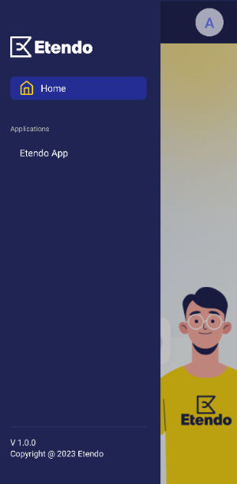

# User Interface

## Etendo Mobile

### Settings Screen

In the Setting screen window, the user is able to set the **language** to use in the app.

!!!note
    Remember that as soon as the app is downloaded, the server URL must be set. 

### Home Screen

After you have logged in, you will be redirected to Home.

Here, by selecting the profile image, it is possible to navigate to the **Settings** and **Profile** screens.

If the drawer is displayed, it is possible to navigate to Home and also to the sub applications previously loaded. 

!!! note
    To be able to include sub-applications, the Mobile Extensions Bundle must be installed. To do that, follow the instructions from the marketplace: [Mobile Extensions Bundle](https://marketplace.etendo.cloud/#/product-details?module=55A7EF64F7FA43449B249DA7F8E14589){target="\_blank"}.  
    For more information about the versions available, core compatibility and new features visit [Mobile Extensions Bundle - Release Notes](../../../whats-new/release-notes/etendo-mobile/bundles/mobile-extensions/release-notes.md).

### Profile Screen

In this section, the user can see the information of the logged in person: **Name, Role, Organization, Client and Warehouse**.

In case the user has a picture, it will be shown both in this window and in the top section of the navigation menu in Etendo. 

!!!note
    The role can only be modified from Etendo Classic, so each user will enter with their default role setup.