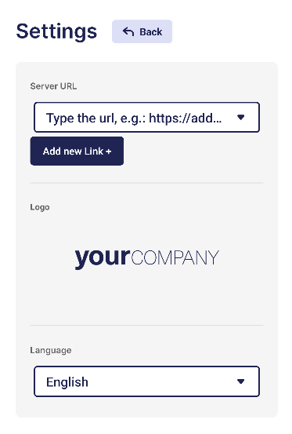
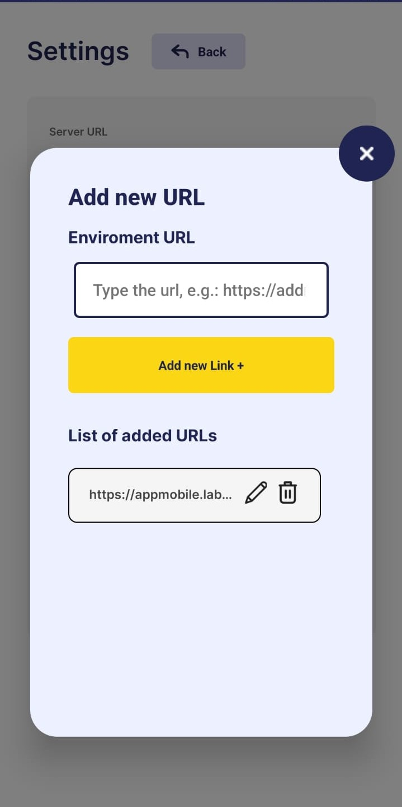
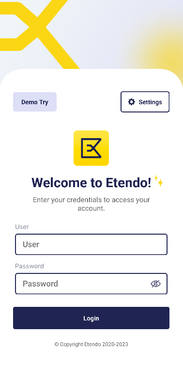
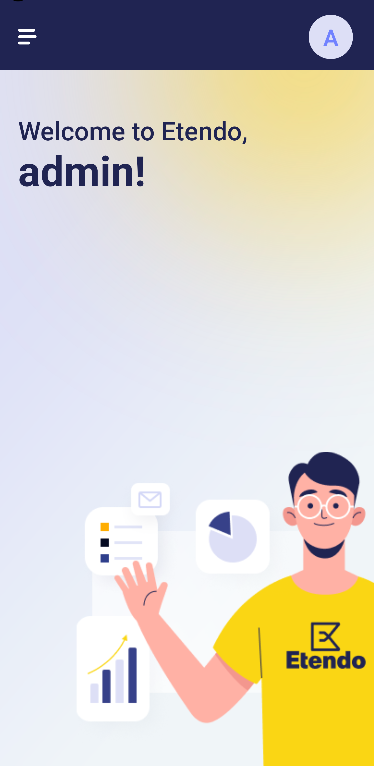
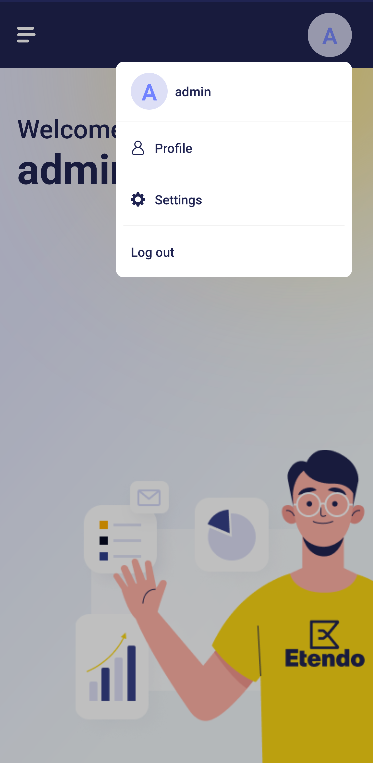
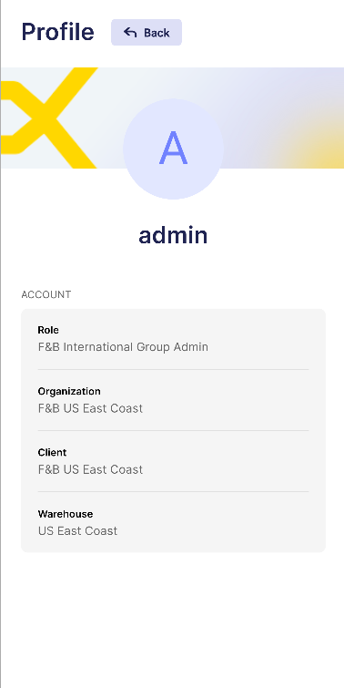

# User Interface

## Etendo Mobile

### Settings Screen

In the Setting screen window, the user is able to set the language to use in the app and/or, before logging in, the URL server. 

!!!note
    Remember that as soon as the app is downloaded, the server URL must be set. 

In the **Add new Link** button, enter the URL and click Add new Link again. Then, the URL will be shown in the List of added URLs.

{ width="300" }

In here, required URLs can be added, edited or removed.

{ width="300" }

### Login Screen

Once the server URL is configured, the user must log in entering the user and the password assigned by the system administrator.

The user will remain logged in, the system will require reentering the credentials only in case the session is ended (through the option Log out in the navigation menu) or the server URL is changed.

{ width="300" }

### Home Screen

After you have logged in, you will be redirected to Home.

{ width="300" }

Here, by selecting the profile image, you can navigate to the Settings and Profile screens.

{ width="300" }

If the drawer is displayed, you can navigate to Home and also to the sub applications you have loaded 

!!! note

    In this case shown the subapplication when acces whit "Demo try".  
    To be able to include this subapplication, the Classic Subapp Extensions Bundle must be installed. To do that, follow the instructions from the marketplace: [Classic Subapp Extensions Bundle](https://marketplace.etendo.cloud/#/product-details?module=55A7EF64F7FA43449B249DA7F8E14589).  
    For more information about the versions available, core compatibility and new features visit [Etendo Classic Subapp Extensions - Release Notes](../../../whats-new/release-notes/etendo-mobile/bundles/classic-subapp-extensions/release-notes.md) 

{ width="300" }

### Profile Screen
In this section, the user can see the information of the logged in person: Name, Role, Organization, Client and Warehouse.

In case the user has a picture, it will be shown both in this window and in the top section of the navigation menu (See Navigation menu). For now, this will be modifiable from the back office only.

{ width="300" }

As regards the role, it can only be modified from the app, so each user will enter with their default role (setup in the Etendo Classic).