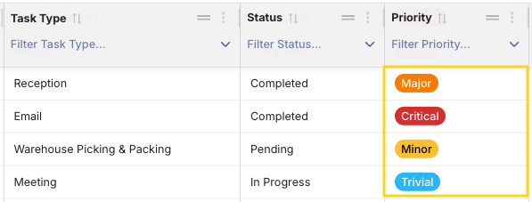
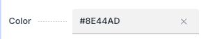
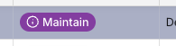

---
tags:
  - How to
  - Color System
  - UI

status: new
---

# How to Use the Color System in Workspace UI

## Overview

The color system lets you assign a visual color badge to records in a master window. Once a color is assigned, every grid in Workspace UI that references that window will automatically display a colored tag instead of plain text — making it easier to scan and identify records at a glance.

!!! info "Prerequisite"
    A developer must first configure the **Color** column in the data dictionary for the master window. If the color field is not visible in the form, contact your system administrator or follow the [developer guide](../../../developer-guide/etendo-classic/how-to-guides/how-to-configure-color-system.md).

---

## Step 1 — Open the Master Record

1. Log in to **Etendo Classic** with a role that has access to the master window.
2. Navigate to the master window configured with a color column.
3. Open an existing record or create a new one.

---

## Step 2 — Assign a Color

1. Locate the **Color** field in the form. It accepts a hexadecimal color code (e.g., `#8E44AD`).
2. Enter the desired hex color value directly, or use the color picker if available.
3. Click **Save**.

!!! tip
    The UI calculates a contrasting text color automatically, but choosing a mid-range color (not too light, not too dark) gives the best visual result.

---

## Step 3 — Verify the Color Badge in Workspace UI

1. Open **Workspace UI** (the Next.js frontend).
2. Navigate to the window that contains a foreign key column referencing the master window.
3. In the grid, locate the column that points to the master window.

The value now appears as a **colored badge** instead of plain text, reflecting the hex color you assigned.

---

## Changing or Removing a Color

- To **change** the color: open the master record, enter a new hex value, and save.
- To **remove** the color: clear the color field and save. The column will revert to plain text in all grids.

---
This work is licensed under :material-creative-commons: :fontawesome-brands-creative-commons-by: :fontawesome-brands-creative-commons-sa: [ CC BY-SA 2.5 ES](https://creativecommons.org/licenses/by-sa/2.5/es/){target="_blank"} by [Futit Services S.L](https://etendo.software){target="_blank"}.
