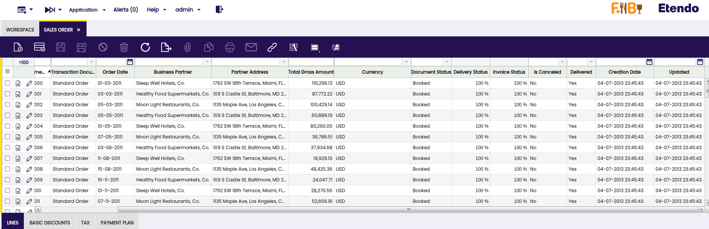

# User Interface Improvements

## Overview

This section details the user interface improvements available in the New UI.

## UI Improvements and Enhancements

### Regional Date Formatting

All dates displayed in the user interface now adapt automatically to the regional configuration settings of your browser. This provides a personalized and localized view of date information, making the interface more intuitive and easier to read for users across different regions.

!!! warning
    This regional formatting applies exclusively to the user interface display layer. The underlying data processing follows these rules:

- **Display/View:** Dates are formatted according to your browser's regional settings
- **Backend Operations:** Date values are processed and stored using the configuration specified in `gradle.properties`
- **Database Storage:** All date values are persisted in the database using the standard format defined in the application configuration
- **Data Editing/Saving:** When creating or modifying records, dates are internally converted to the configured format before being saved

This dual-layer approach ensures consistency in data storage while providing a user-friendly viewing experience tailored to each user's regional preferences.

**Benefits:**

- Dates automatically display in your preferred regional format without manual configuration.
- Improved readability and intuitive date interpretation for international teams.
- Consistent data integrity and standardized storage across the entire system.
- Seamless experience for users in different geographical locations.

**Example - Table with Regional Date Display:**

<figure markdown="span">
    { align=left }
    <figcaption>**Etendo Classic:** Dates in Etendo Classic display in the standard format configured in the system.
    </figcaption>
</figure>

**Example - New UI with Regional Configuration (en-US):**

<figure markdown="span">
    
    <figcaption>**Etendo Main UI:** In the Etendo Main UI the same table displays dates automatically formatted according to the browser's regional settings. In this example `en-US` (United States) is applied, so dates appear in `MM/DD/YYYY` format. Users in other regions will see their corresponding regional formats, providing a localized and intuitive experience.</figcaption>
</figure>

