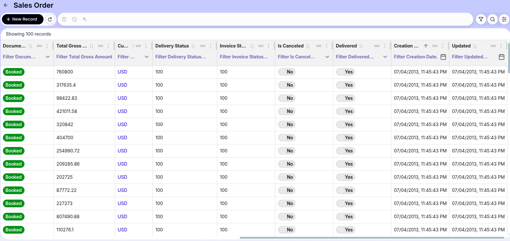
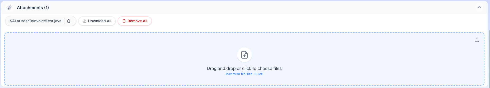
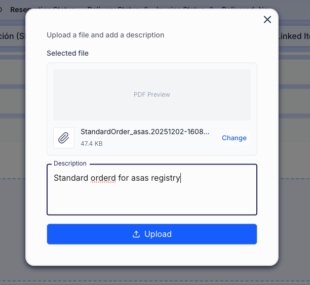
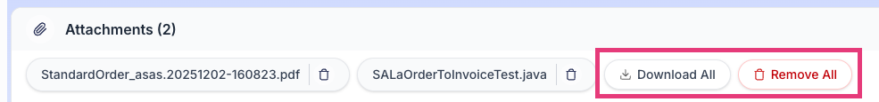

# User Interface Improvements

## Overview

This section details the user interface improvements available in the **Etendo New UI**.

## Etendo UI Improvements and Enhancements

### Regional Date Formatting

All dates displayed in the user interface now adapt automatically to the regional configuration settings of your browser. This provides a personalized and localized view of date information, making the interface more intuitive and easier to read for users across different regions.

!!! warning
    
    This regional formatting applies exclusively to the user interface display layer. The underlying data processing follows these rules:

    - **Display/View:** Dates are formatted according to your browser's regional settings
    - **Backend Operations:** Date values are processed and stored using the configuration specified in `gradle.properties`
    - **Dates automatically display in your preferred regional format** without manual configuration.

**Example Etendo Classic UI**

<figure markdown="span">
    
    <figcaption>**Etendo Classic UI :** Dates in Etendo Classic UI display in the standard format configured in the system.
    </figcaption>
</figure>

**Example Etendo UI with Regional Configuration (en-US):**

<figure markdown="span">
    
    <figcaption>**Etendo UI:** In the Etendo UI the same table displays dates automatically formatted. In this example `en-US` (United States) is applied, so dates appear in `MM/DD/YYYY` format. </figcaption>
</figure>

### Attachment Management

The **Etendo UI** introduces a completely redesigned attachment management system that provides a more agile, visual, and comprehensive way to handle file attachments, both from **form view** and directly from **grid records**.

#### Attachments Section in Form View

The attachments section has been redesigned to be more intuitive. Files are now displayed as tags or chips, allowing for quick identification.

**File Upload**

{align=right width=300}

There are two main ways to upload files within a record:

1. **Drag & Drop:** Drag one or multiple files directly from your computer to the dotted **Drop Zone** in the attachments section.

    !!! note
        When dropping the file, a confirmation modal will open where you can verify the selected file and add an optional description before uploading it.

2. **File Explorer:** Click on the upload zone (or upload icon) to open your operating system's file selector.

#### Preview and Quick Edit

{align=right width=300}

Clicking on any uploaded attachment name will open an advanced preview window.

**Features within the preview:**

- **Integrated Viewer:** View images and PDF documents directly without needing to download them.
- **Description Editing:** You can modify the file description *in place*. Click the **Pencil** icon, edit the text, and save changes with the **Check** icon, all without leaving the preview.
- **Individual Management:** Dedicated buttons to **Download** or **Delete** the file you are viewing.

#### Attachments Bulk Actions

To facilitate handling multiple files, global action buttons have been incorporated in the attachments section header:

- **Download All:** Generates and downloads a compressed file (`.zip`) containing all attachments associated with the record.
- **Delete All:** Allows you to delete all attachments from the record in a single step (requires security confirmation).

#### Quick Upload from Grid (Drag & Drop on Rows)

It is possible to attach files without needing to enter each record. From the main table/grid view:

---
This work is licensed under :material-creative-commons: :fontawesome-brands-creative-commons-by: :fontawesome-brands-creative-commons-sa: [ CC BY-SA 2.5 ES](https://creativecommons.org/licenses/by-sa/2.5/es/){target="_blank"} by [Futit Services S.L](https://etendo.software){target="_blank"}.

