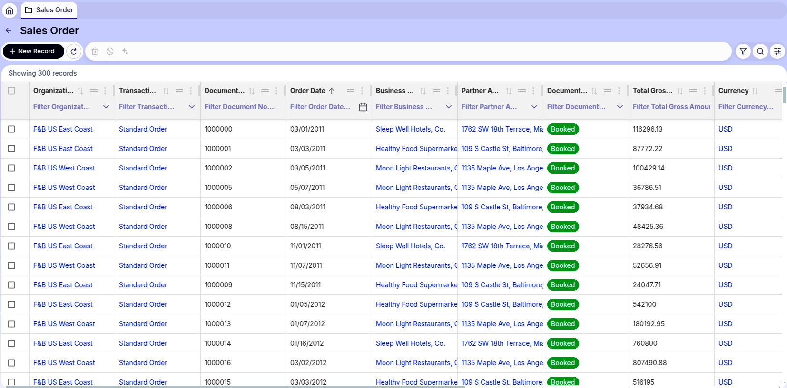

# User Interface Improvements

## Overview

This section details the user interface improvements available in the New UI.

### Improvements and Enhancements

#### Regional Date Formatting

**Description:**

All dates displayed in the user interface now adapt automatically to the regional configuration settings of your browser. This provides a personalized and localized view of date information, making the interface more intuitive and easier to read for users across different regions.

**Important:** This regional formatting applies exclusively to the user interface display layer. The underlying data processing follows these rules:

- **Display/View:** Dates are formatted according to your browser's regional settings
- **Backend Operations:** Date values are processed and stored using the configuration specified in `openbravo.properties`
- **Database Storage:** All date values are persisted in the database using the standard format defined in the application configuration
- **Data Editing/Saving:** When creating or modifying records, dates are internally converted to the configured format before being saved

This dual-layer approach ensures consistency in data storage while providing a user-friendly viewing experience tailored to each user's regional preferences.

**Benefits:**

- Dates automatically display in your preferred regional format without manual configuration
- Improved readability and intuitive date interpretation for international teams
- Consistent data integrity and standardized storage across the entire system
- Seamless experience for users in different geographical locations

**Example - Table with Regional Date Display:**

**Etendo Classic:**

As shown in the image above, dates in Etendo Classic display in the standard format configured in the system.

**New UI with Regional Configuration (en-US):**

In the New UI, the same table now displays dates automatically formatted according to your browser's regional settings. In this example, the en-US (United States) regional configuration is applied, showing dates in the MM/DD/YYYY format. Users in different regions will see dates formatted according to their respective regional preferences, providing a more localized and intuitive experience.
