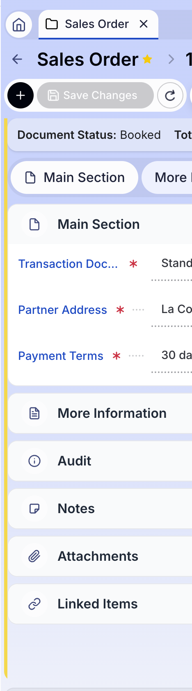

# User Interface Improvements

## Overview

This section details the user interface improvements available in the **Etendo New UI**.

## Etendo UI Improvements and Enhancements

### Regional Date Formatting

All dates displayed in the user interface now adapt automatically to the regional configuration settings of your browser. This provides a personalized and localized view of date information, making the interface more intuitive and easier to read for users across different regions.

!!! warning

    This regional formatting applies exclusively to the user interface display layer. The underlying data processing follows these rules:

    - **Display/View:** Dates are formatted according to your browser's regional settings
    - **Backend Operations:** Date values are processed and stored using the configuration specified in `gradle.properties`
    - **Dates automatically display in your preferred regional format** without manual configuration.

**Example Etendo Classic UI**

<figure markdown="span">
    
    <figcaption>Etendo Classic UI: Dates in Etendo Classic UI display in the standard format configured in the system.
    </figcaption>
</figure>

**Example Etendo UI with Regional Configuration (en-US):**

<figure markdown="span">
    
    <figcaption>Etendo UI: In the Etendo UI the same table displays dates automatically formatted. In this example `en-US` (United States) is applied, so dates appear in `MM/DD/YYYY` format. </figcaption>
</figure>

### Attachment Management

The **Etendo UI** introduces a completely redesigned attachment management system that provides a more agile, visual, and comprehensive way to handle file attachments, both from **form view** and directly from **grid records**.

#### Attachments Section in Form View

The attachments section has been redesigned to be more intuitive. Files are now displayed as tags or chips, allowing for quick identification.

**File Upload**

{align=right width=300}

There are two main ways to upload files within a record:

1. **Drag & Drop:** Drag one or multiple files directly from your computer to the dotted **Drop Zone** in the attachments section.

    !!! note
        When dropping the file, a confirmation modal will open where you can verify the selected file and add an optional description before uploading it.

2. **File Explorer:** Click on the upload zone (or upload icon) to open your operating system's file selector.

#### Preview and Quick Edit

{align=right width=300}

Clicking on any uploaded attachment name will open an advanced preview window.

**Features within the preview:**

- **Integrated Viewer:** View images and PDF documents directly without needing to download them.
- **Description Editing:** You can modify the file description _in place_. Click the **Pencil** icon, edit the text, and save changes with the **Check** icon, all without leaving the preview.
- **Individual Management:** Dedicated buttons to **Download** or **Delete** the file you are viewing.

#### Attachments Bulk Actions

To facilitate handling multiple files, global action buttons have been incorporated in the attachments section header:

- **Download All:** Generates and downloads a compressed file (`.zip`) containing all attachments associated with the record.
- **Delete All:** Allows you to delete all attachments from the record in a single step (requires security confirmation).

#### Quick Upload from Grid (Drag & Drop on Rows)

It is possible to attach files without needing to enter each record. From the main grid view:

### Advanced Filters

The **Advanced Filters** modal is a powerful filtering component that enables users to create complex, multi-condition filters directly from the grid interface. It provides an intuitive way to build sophisticated queries using logical operators and multiple filter groups.

!!! info "Key Features"
    - **Multiple Filter Types:** Support for string, number, date, boolean, and select-type fields.
    - **Logical Operators:** Combine conditions using AND/OR operators.
    - **Filter Groups:** Nest multiple conditions within groups for complex query logic.
    - **Dynamic Operators:** Available operators change based on the field type selected.
    - **Add/Remove Conditions:** Dynamically add or delete individual filter conditions.
    - **Add/Remove Groups:** Create nested filter groups to organize complex logic.
    - **Clear All:** Reset all filters to start fresh.
    - **Apply/Validation:** Only valid conditions (with column, operator, and value) are applied.

#### Supported Operators by Field Type

| Field Type | Supported Operators |
|-----------|---------------------|
| **String** | - `=` Equals  - `≠` Not equals Contains Not contains Starts with Ends with Is empty Is not empty |
| **Number** | `=` Equals `≠` Not equals `>` Greater than `<` Less than `≥` Greater or equal `≤` Less or equal |
| **Date** | `=` Equals `≠` Not equals Before After Today This week This month |
| **Boolean** | yes no |
| **Select (Dropdown)** | `=` Equals `≠` Not equals |

#### Using the Advanced Filters

1. **Click the Filter Icon** in the grid header to open the Advanced Filters modal.
2. **Select a Column** from the dropdown in the first filter row.
3. **Choose an Operator** appropriate for the field type.
4. **Enter or Select a Value** based on the operator type.
5. **Add More Conditions** by clicking *Add Condition* button.
6. **Create Filter Groups** for complex logic using *Add Group* button.
7. **Review Your Filters** - The status shows the number of active filters.
8. **Click Apply Filters** button to execute the query.
9. **Clear Filters** by clicking *Clear All* button to reset and start over.

#### Example Scenarios

<figure markdown="span">
    
    <figcaption>Example 1: Simple filter with one condition selecting a specific organization.</figcaption>
</figure>

<figure markdown="span">
    
    <figcaption>Example 2: Multiple conditions combined with AND logic to narrow down search results.</figcaption>
</figure>

<figure markdown="span">
    
    <figcaption>Example 3: Complex filter with a grouped condition. The main filter checks if Document Status is Booked, AND the group checks if Total Gross Amount is either greater than 10 AND less than 100.</figcaption>
</figure>

### Saved Views

From the toolbar of any grid or table, users can access the **Save View** menu to persist and manage custom grid configurations.

!!! info "Key Features"
    - **Save Current View:** Captures the complete grid state — applied filters, visible columns, column order, and sorting — under a custom name (max 100 characters). The configuration is persisted in the backend.
    - **Apply Saved Views:** Opening the menu displays all available views for the current tab. A single click instantly applies the entire saved configuration.
    - **Set as Default:** Any view can be marked as default using the star icon. The default view loads automatically every time the tab is opened. Only one default view per tab is allowed.
    - **Reset to Standard:** Restores the original grid state with no filters or custom configuration.
    - **Delete Views:** Hovering over a view reveals a delete button with a confirmation prompt.

### Configurable Dashboard with Widgets

The Home screen has been redesigned as a fully configurable dashboard where users can add, remove, and rearrange widgets.

#### Dashboard Management

- Responsive widget grid with **drag-and-drop** to reposition widgets.
- **Add Widget** button opens a dialog listing all available widget types.
- Each widget has a remove button (**X**), and some include an **Edit Parameters** option to customize their data.

#### Available Widget Types

| Widget | Description |
|--------|-------------|
| **KPI** | Displays a large numeric value with unit, label, and trend indicator (green for positive, red for negative). |
| **Calendar** | Calendar interface showing scheduled events. |
| **Process** | Information about processes and workflows. |
| **Query List** | Table with pagination, sortable columns, and click-through navigation to the related window. |
| **HTML** | Custom HTML content. |
| **URL** | External content embedded via iframe. |
| **Stock Alert** | Inventory alerts with status indicators. |
| **Notification** | Notifications and messages. |
| **Favorites** | Favorite windows displayed as clickable chips (see below). |
| **Recently Viewed** | Recently viewed documents. |
| **Recent Documents** | Recent document activity. |

#### Favorites Widget

A dedicated widget that displays all the user's favorite windows as compact, clickable chips.

- Clicking any chip opens that window in a new tab.
- The widget updates in real time when the user marks or unmarks favorites from any part of the UI (star icon in the sidebar).

- Displays a dash (**—**) as an empty state if no favorites are configured.

!!! note
    The Favorites widget concept does not exist in Etendo Classic. This is a feature exclusive to the Etendo UI.

### Email from Toolbar

An email sending modal accessible from the toolbar, allowing users to compose and send emails directly from the current record context.

#### Form Fields

| Field | Details |
|-------|---------|
| **To** (required) | Recipient address, pre-populated from the current record context. |
| **BCC** | Blind carbon copy. |
| **Reply-To** | Reply address. |
| **CC** | Carbon copy, available under **Show More Fields**. |
| **Subject** (required) | Email subject line. |
| **Body** | Text area with a reference panel showing available template tokens. |

#### Template Tokens

The body field provides a reference panel listing available tokens that are dynamically replaced when the email is sent:

`@cus_ref@`, `@our_ref@`, `@cus_nam@`, `@sal_nam@`, `@bp_nam@`, `@doc_date@`, `@doc_desc@`, `@doc_nextduedate@`, `@doc_lastduedate@`

#### Templates

A dropdown selector allows choosing pre-defined templates that auto-fill the body and other fields.

#### Attachments

The attachments section displays report files, record attachments, and uploaded files in a table. Users can:

- Add local files from their computer.
- Load attachments associated with the record from the database.
- Toggle the **Archive** checkbox on report files.
- Remove individual attachments using the **X** button.

### Image Selector

Image fields in forms now feature a complete upload, preview, and editing flow.

#### Upload

- Clicking an image field opens an upload dialog.
- Supports **drag-and-drop** or file selection.
- Validates image dimensions against configured constraints (minimum/maximum).

!!! warning "Dimension Validation"
    - If mandatory constraints are violated, an **error** is shown displaying the current dimensions vs. the required dimensions.
    - If constraints are recommended, a **confirmation dialog** allows the user to continue or cancel.
    - An optional **auto-resize** feature can be applied, with a confirmation showing the original and final dimensions.

#### Preview and Editing

- The uploaded image appears as a **thumbnail** in the form.
- Clicking the thumbnail opens a **full-screen preview modal**.
- In the preview modal:
    - **Zoom** with mouse wheel (0.5x to 5x).
    - **Drag** to pan across the image.
    - **Reset Zoom** button to return to the default view.
    - **Re-upload** to replace the current image.
    - **Delete** with confirmation prompt.

### Keyboard Shortcuts

A centralized keyboard shortcut system for common actions in the Etendo UI.

| Shortcut | Action |
|----------|--------|
| `Arrow Up` / `Arrow Down` | Navigate between table rows without using the mouse. |
| `Ctrl + S` | Save the current record. |
| `Ctrl + N` | Create a new record. |

!!! info "Behavior Details"
    - Shortcuts are **not triggered** when focus is inside input fields, text areas, or select dropdowns (unless explicitly configured).
    - Browser default behavior is **prevented** (e.g., `Ctrl + S` does not open the browser "Save Page" dialog).
    - Shortcuts are **context-aware**: they only fire within the appropriate UI region.

### Focus System and Prior Saving

An automatic state management system that handles unsaved changes when switching between tabs or windows.

- When switching tabs or windows, any **unsaved changes** in the previously focused area are **automatically saved** (asynchronously).
- The system tracks which tab or window is currently active.
- Background tabs **maintain their state**, allowing instant switching without data loss.
- Users can freely navigate between open tabs without losing any in-progress work; navigation remains fluid and data stays consistent.

### Arrow Key Navigation in Tables

Enhanced keyboard navigation for table rows using arrow keys.

- `Arrow Up`: Moves selection to the previous row.
- `Arrow Down`: Moves selection to the next row.
- Navigation **stops at table boundaries** — it does not wrap past the first or last row.
- Only works when a **single row** is selected.
- Rapid key presses advance rows fluidly (debounced to prevent lag).
- **Disabled in edit mode**.
- The system distinguishes between keyboard navigation and mouse clicks to optimize performance.

### Featured Agents in Copilot

In the Copilot assistant selector:

- **Featured Agents** section: Certain agents appear highlighted at the top of the list, visually distinguished with a badge or special styling to indicate they are recommended.
- **Regular Agents** section: Non-featured agents appear below.
- This organization helps users quickly find the most useful assistants without scrolling through the entire list.

### Copilot Chat Improvements

The Copilot chat experience has been enhanced with several usability improvements:

!!! info "Key Features"
    - **Conversation List:** A sidebar displaying the history of past conversations.
    - **Archive/Delete:** Conversations can be archived or deleted.
    - **New Conversation:** A button to start a fresh conversation.
    - **Search Conversations:** Search through conversation history.
    - **Rename Conversations:** Editable titles for better organization.
    - **Improved UI:** Better message formatting, spacing, and visual hierarchy.
    - **Clear States:** Indicators for empty state, loading, and error conditions.
    - **Streaming:** Responses are displayed in real time as the agent generates them.

---

This work is licensed under :material-creative-commons: :fontawesome-brands-creative-commons-by: :fontawesome-brands-creative-commons-sa: [ CC BY-SA 2.5 ES](https://creativecommons.org/licenses/by-sa/2.5/es/){target="\_blank"} by [Futit Services S.L](https://etendo.software){target="\_blank"}.
