# User Interface Improvements

## Overview

This page documents the user interface improvements available in the **Etendo New UI**. Each section describes a specific feature, its behavior, and how to use it.

## Regional Date Formatting

All dates displayed in the user interface adapt automatically to the regional configuration of your browser. This gives each user a localized view of date information without manual setup.

!!! warning

    **Note for administrators:** The date format displayed on screen is controlled by your browser settings. The format used when storing data in the system is configured separately by your system administrator. If you notice a mismatch between what you see and what is stored, contact your administrator — no action is needed from regular users.

**Example Etendo Classic UI**

<figure markdown="span">
    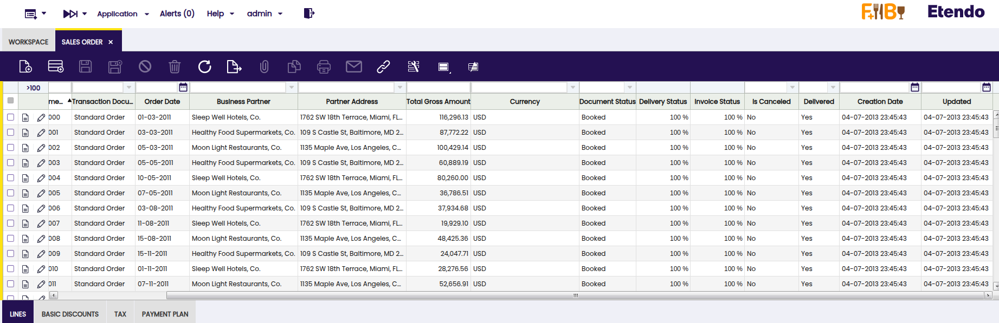
    <figcaption>Etendo Classic UI: dates display in the standard format configured in the system.</figcaption>
</figure>

**Example Etendo New UI with Regional Configuration (en-US):**

<figure markdown="span">
    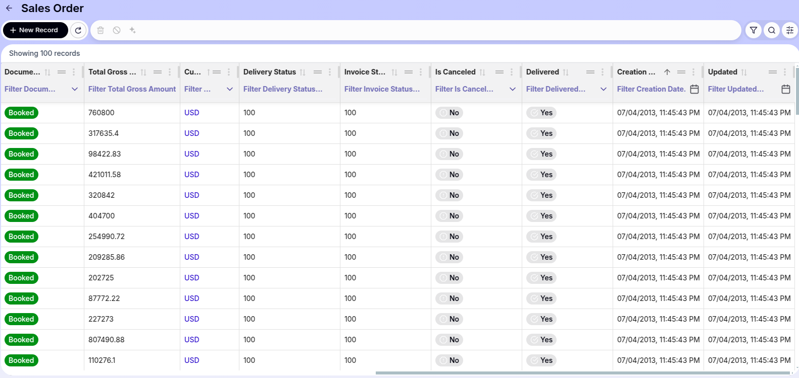
    <figcaption>Etendo New UI: the same table displays dates automatically formatted. In this example `en-US` (United States) is applied, so dates appear in `MM/DD/YYYY` format.</figcaption>
</figure>

## Attachment Management

The **Etendo New UI** introduces a completely redesigned attachment management system. It provides a more agile, visual, and comprehensive way to handle file attachments, both from **form view** and directly from **grid records**.

**Attachments Section in Form View**

The attachments section has been redesigned to be more intuitive. Files are displayed as tags or chips, allowing for quick identification.

<figure markdown="span">
    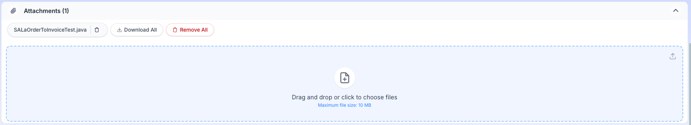
    <figcaption>The attachments section in form view, showing files as chips for quick identification.</figcaption>
</figure>

**File Upload**

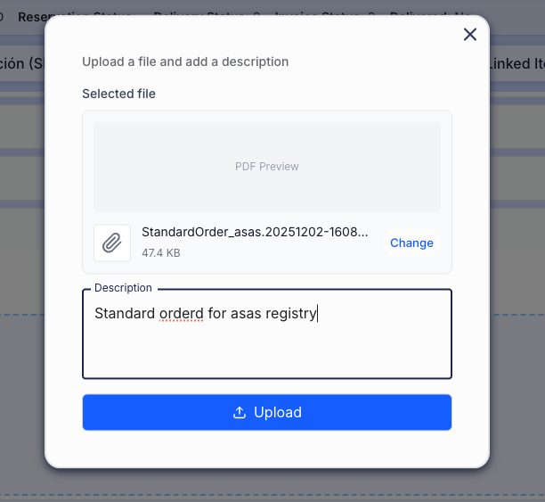{align=right width=300}

There are two main ways to upload files within a record:

1. **Drag & Drop:** Drag one or multiple files directly from your computer to the dotted **Drop Zone** in the attachments section.

    !!! note
        When dropping the file, a confirmation modal opens. Verify the selected file and add an optional description before uploading.

2. **File Explorer:** Click the upload zone (or the upload icon) to open your operating system's file selector.

**Preview and Quick Edit**

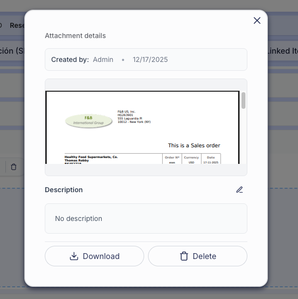{align=right width=300}

Click any uploaded attachment name to open an advanced preview window.

Features within the preview:

- **Integrated Viewer:** View images and PDF documents directly without downloading them.
- **Description Editing:** Modify the file description in place. Click the **Pencil** icon, edit the text, and save with the **Check** icon — all without leaving the preview.
- **Individual Management:** Dedicated buttons to **Download** or **Delete** the file you are viewing.

**Attachments Bulk Actions**

<figure markdown="span">
    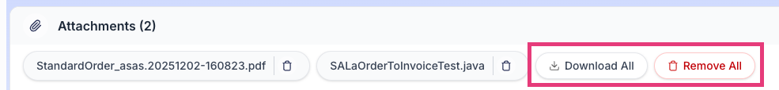
    <figcaption>Global action buttons in the attachments section header for handling multiple files at once.</figcaption>
</figure>

Global action buttons in the attachments section header allow handling multiple files at once:

- **Download All:** Generates and downloads a compressed file (`.zip`) containing all attachments associated with the record.
- **Delete All:** Deletes all attachments from the record in a single step (requires security confirmation).

**Quick Upload from Grid (Drag & Drop on Rows)**

Attach files without entering each record individually. From the main grid view, drag and drop files directly onto any row.

<figure markdown="span">
    
    <figcaption>Dragging and dropping a file directly onto a grid row to attach it to that record.</figcaption>
</figure>

## Advanced Filters

<figure markdown="span">
    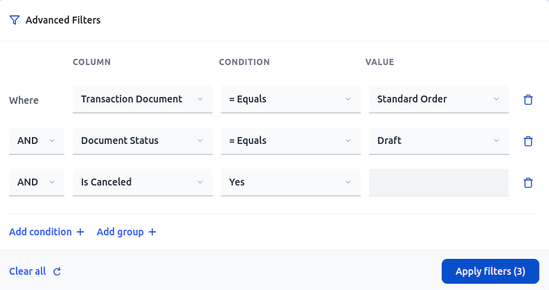
    <figcaption>The Advanced Filters modal, showing filter groups and logical operator selectors.</figcaption>
</figure>

The **Advanced Filters** modal is a powerful filtering component. It enables creating complex, multi-condition filters directly from the grid interface using logical operators and multiple filter groups.

### Supported Operators by Field Type

| Field Type | Supported Operators |
|-----------|---------------------|
| **String** | `=` Equals `≠` Not equals Contains Not contains Starts with Ends with Is empty Is not empty |
| **Number** | `=` Equals `≠` Not equals `>` Greater than `<` Less than `≥` Greater or equal `≤` Less or equal |
| **Date** | `=` Equals `≠` Not equals Before After Today This week This month |
| **Boolean** | yes no |
| **Select (Dropdown)** | `=` Equals `≠` Not equals |

The Advanced Filters panel lets you combine multiple search conditions — for example, show only invoices from a specific customer that are also overdue. You can group conditions and choose whether all of them must match (AND) or any one of them (OR).

**Using the Advanced Filters**

1. Click the **Filter Icon** in the grid header to open the Advanced Filters modal.
2. Select a column from the dropdown in the first filter row.
3. Choose an operator appropriate for the field type.
4. Enter or select a value based on the operator type.
5. Add more conditions by clicking **Add Condition**.
6. Create filter groups for complex logic using **Add Group**.
7. Review your filters — the status indicator shows the number of active filters.
8. Click **Apply Filters** to execute the query.
9. Click **Clear All** to reset all filters and start over.

**Example Scenarios**

<figure markdown="span">
    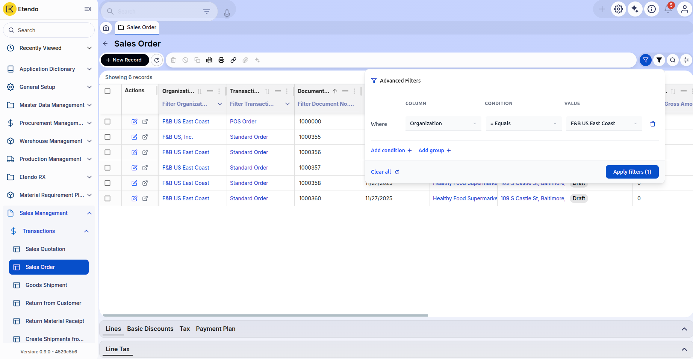
    <figcaption>Example 1: Simple filter with one condition selecting a specific organization.</figcaption>
</figure>

<figure markdown="span">
    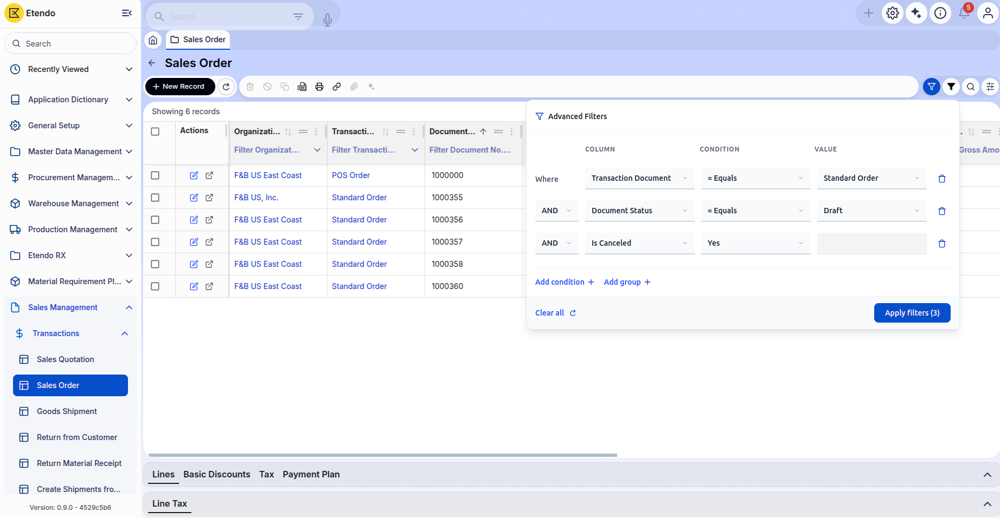
    <figcaption>Example 2: Multiple conditions combined with AND logic to narrow down search results.</figcaption>
</figure>

<figure markdown="span">
    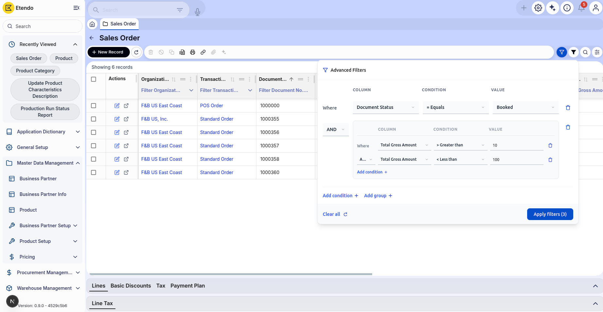
    <figcaption>Example 3: Complex filter with a grouped condition. The main filter checks if Document Status is Booked, AND the group checks if Total Gross Amount is greater than 10 AND less than 100.</figcaption>
</figure>

## Saved Views

A saved view records your preferred setup for any table — which columns are visible, how they are sorted, and any filters you have applied. Open a saved view to restore the full configuration with a single click. To create or manage views, open the **Save View** menu from the toolbar at the top of any table.

<figure markdown="span">
  
  <figcaption>The Save View menu showing saved configurations, the star icon to set a default view, and the delete button.</figcaption>
</figure>

!!! info
    - **Save Current View:** Captures the complete grid state — applied filters, visible columns, column order, and sorting — under a custom name (max 100 characters). The configuration is saved to the backend.
    - **Apply Saved Views:** Opening the menu displays all available views for the current tab. A single click applies the entire saved configuration.
    - **Set as Default:** Any view can be marked as default using the star icon. The default view loads automatically every time the tab is opened. Only one default view per tab is allowed.
    - **Reset to Standard:** Restores the original grid state with no filters or custom configuration.
    - **Delete Views:** Hovering over a view reveals a delete button with a confirmation prompt.

## Configurable Dashboard with Widgets

The Home screen is a configurable dashboard. Add, remove, and rearrange widgets to set up your workspace. It is the first screen displayed after logging in to Etendo.

<figure markdown="span">
  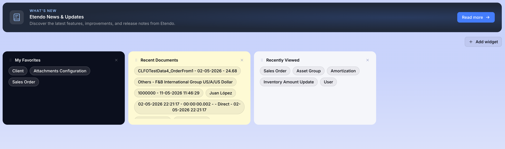
  <figcaption>The Home screen dashboard with multiple widgets arranged on the grid.</figcaption>
</figure>

**Dashboard Management**

- The widget grid supports **drag-and-drop** to reposition widgets.
- The **Add Widget** button opens a dialog listing all available widget types.
- Each widget has a remove button (**X**). Some widgets include an **Edit Parameters** option to customize their data.

<figure markdown="span">
  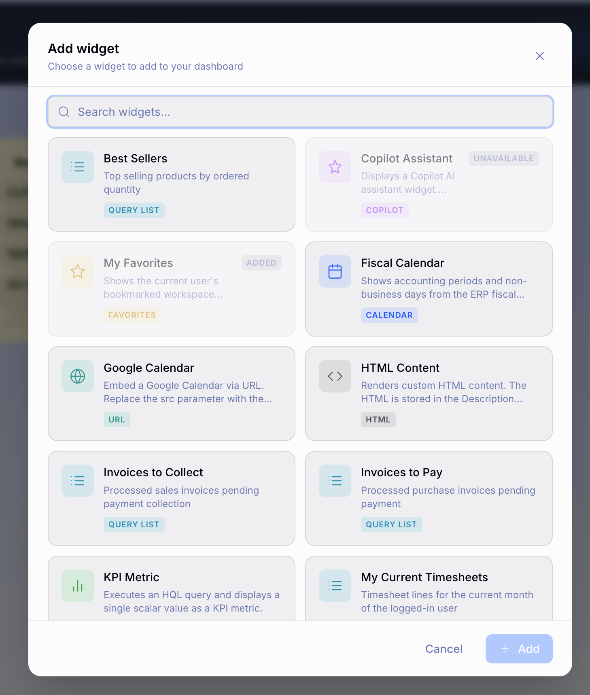
  <figcaption>The Add Widget dialog listing the available widget types.</figcaption>
</figure>

**Available Widget Types**

- **KPI** — Displays a large numeric value with unit, label, and trend indicator (green for positive, red for negative).
- **Calendar** — Calendar interface showing scheduled events.
- **Process** — Shows the status or progress of a background process running in the system.
- **Query List** — Table with pagination, sortable columns, and click-through navigation to the related window.
- **HTML** — Displays a block of custom formatted text or content designed by your administrator.
- **URL** — Displays a web page or external tool directly inside your dashboard, without leaving Etendo.
- **Stock Alert** — Inventory alerts with status indicators.
- **Notification** — Notifications and messages.
- **Favorites** — Favorite windows displayed as clickable chips (see below).
- **Recently Viewed** — Recently viewed documents.
- **Recent Documents** — Recent document activity.

**Favorites Widget**

A dedicated widget that displays all the user's favorite windows as compact, clickable chips.

<figure markdown="span">
  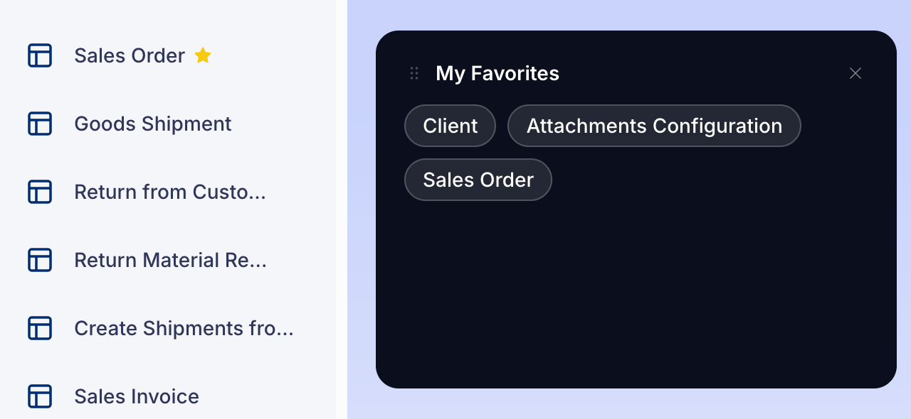
  <figcaption>The Favorites widget showing saved windows as clickable chips.</figcaption>
</figure>

- Click any chip to open that window in a new tab.
- The widget updates in real time when the user marks or unmarks favorites from any part of the UI (star icon in the sidebar).

<figure markdown="span">
  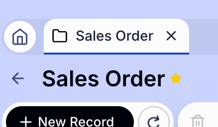
  <figcaption>The star icon in the sidebar used to mark or unmark a window as a favorite.</figcaption>
</figure>

- Displays a dash (**—**) as an empty state when no favorites are configured.

!!! note
    The Favorites widget does not exist in Etendo Classic. It is a feature exclusive to the Etendo New UI.

## Email from Toolbar

The toolbar includes an email modal. Use it to compose and send emails directly from the current record context.

<figure markdown="span">
  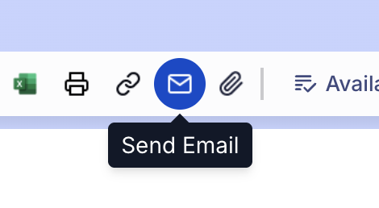
  <figcaption>The email composition modal opened from the toolbar of a record.</figcaption>
</figure>

**Form Fields**

| Field | Details |
|-------|---------|
| **To** (required) | Recipient address, pre-populated from the current record context. |
| **BCC** | Recipients added here receive the email but are hidden from all other recipients. They cannot see each other's addresses, and no one else sees who was BCC'd. |
| **Reply-To** | Reply address. |
| **CC** | Recipients added here receive a copy of the email and are visible to everyone in the **To** and **CC** fields. Available under **Show More Fields**. |
| **Subject** (required) | Email subject line. |
| **Body** | Text area with a reference panel showing available template tokens. |

**Template Tokens**

To personalize the email, type any placeholder directly in the body text. When the email is sent, each placeholder is automatically replaced with the actual data from the current record — no manual entry needed. For example, write `Dear @cus_nam@,` and it will read "Dear Acme Corp," based on the record.

| Placeholder | What it inserts in the email |
|---|---|
| `@cus_ref@` | Customer reference number |
| `@our_ref@` | Your company's internal reference |
| `@cus_nam@` | Customer name |
| `@sal_nam@` | Salesperson name |
| `@bp_nam@` | Business partner name |
| `@doc_date@` | Document date |
| `@doc_desc@` | Document description |
| `@doc_nextduedate@` | Next payment due date |
| `@doc_lastduedate@` | Last payment due date |

**Templates**

A dropdown selector allows choosing pre-defined templates that auto-fill the body and other fields.

**Attachments**

The attachments section displays report files, record attachments, and uploaded files in a table.

- Add local files from your computer.
- Load attachments associated with the record from the database.
- Toggle the **Archive** checkbox on report files.
- Remove individual attachments using the **X** button.

## Image Selector

Image fields in forms feature a complete upload, preview, and editing flow.

<figure markdown="span">
    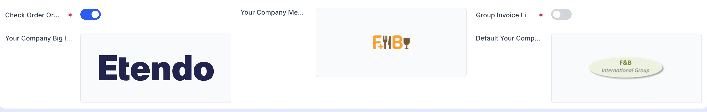
    <figcaption>Image fields in a form record, showing the upload and preview controls.</figcaption>
</figure>

**Upload**

<figure markdown="span">
    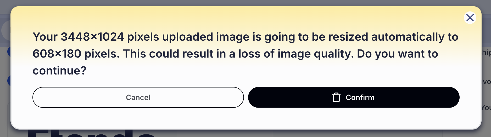
    <figcaption>The image upload dialog, with drag-and-drop support and dimension validation feedback.</figcaption>
</figure>

- Click an image field to open an upload dialog.
- Supports **drag-and-drop** or file selection.
- Validates image dimensions against configured constraints (minimum/maximum).

!!! warning "Dimension Validation"
    - If mandatory constraints are violated, an **error** displays the current dimensions vs. the required dimensions.
    - If constraints are recommended, a **confirmation dialog** allows continuing or cancelling.
    - An optional **auto-resize** feature is available, with a confirmation showing the original and final dimensions.

**Preview and Editing**

<figure markdown="span">
    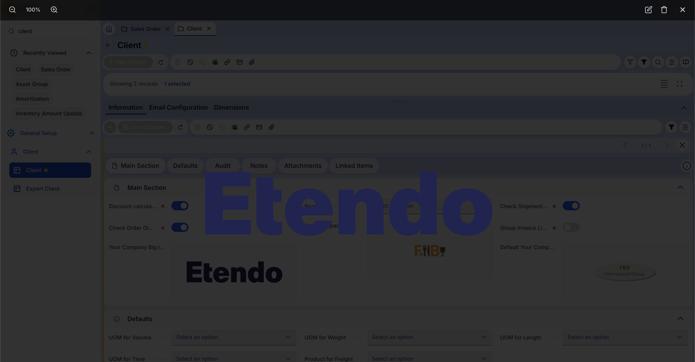
    <figcaption>The full-screen image preview modal, with zoom, pan, re-upload, and delete controls.</figcaption>
</figure>

- The uploaded image appears as a **thumbnail** in the form.
- Click the thumbnail to open a **full-screen preview modal**.
- In the preview modal:
    - **Zoom** with the mouse wheel (0.5x to 5x).
    - **Drag** to pan across the image.
    - **Reset Zoom** to return to the default view.
    - **Re-upload** to replace the current image.
    - **Delete** with a confirmation prompt.

## Keyboard Shortcuts

A centralized keyboard shortcut system covers the most common actions in the Etendo New UI.

| Shortcut | Action |
|----------|--------|
| `Arrow Up` / `Arrow Down` | Navigate between table rows without using the mouse. |
| `Ctrl + S` | Save the current record. |
| `Ctrl + N` | Create a new record. |

!!! info "Behavior Details"
    - Shortcuts are **not triggered** when focus is inside input fields, text areas, or select dropdowns (unless explicitly configured).
    - Browser default behavior is **prevented** (for example, `Ctrl + S` does not open the browser Save Page dialog).
    - Shortcuts are **context-aware**: they only fire within the appropriate UI region.

## Focus System and Prior Saving

The focus system automatically saves unsaved changes when switching between tabs or windows.

- When switching tabs or windows, any **unsaved changes** in the previously focused area are **automatically saved** (asynchronously).
- The system tracks which tab or window is currently active.
- Background tabs **maintain their state**, allowing instant switching without data loss.
- Navigate freely between open tabs without losing in-progress work. Navigation remains fluid and data stays consistent.

## Arrow Key Navigation in Tables

Arrow keys provide keyboard navigation across table rows.

- `Arrow Up`: Moves selection to the previous row.
- `Arrow Down`: Moves selection to the next row.
- Navigation **stops at table boundaries** — it does not wrap past the first or last row.
- Only works when a **single row** is selected.
- Rapid key presses advance rows fluidly (debounced to prevent lag).
- **Disabled in edit mode**.
- The system distinguishes between keyboard navigation and mouse clicks to optimize performance.

## Featured Agents in Copilot

<figure markdown="span">
  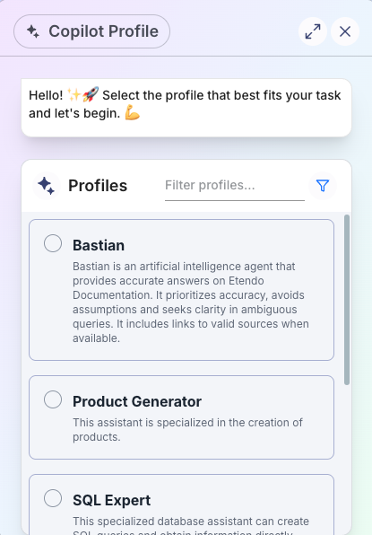
  <figcaption>The Copilot assistant selector showing Featured Agents at the top and Regular Agents below.</figcaption>
</figure>

The Copilot assistant selector organizes agents into two groups for faster access.

- **Featured Agents** section: Certain agents appear highlighted at the top of the list, visually distinguished with a badge or special styling to indicate they are recommended.
- **Regular Agents** section: Non-featured agents appear below.
- This organization helps users quickly find the most useful assistants without scrolling through the entire list.

## Copilot Chat Improvements

The Copilot chat interface includes several usability improvements.

!!! info "Key Features"
    - **Conversation List:** A sidebar displaying the history of past conversations.
    - **Archive/Delete:** Conversations can be archived or deleted.
    - **New Conversation:** A button to start a fresh conversation.
    - **Search Conversations:** Search through conversation history.
    - **Rename Conversations:** Editable titles for better organization.
    - **Improved UI:** Better message formatting, spacing, and visual hierarchy.
    - **Clear States:** Indicators for empty state, loading, and error conditions.
    - **Streaming:** Responses display in real time as the agent generates them.

---

This work is licensed under :material-creative-commons: :fontawesome-brands-creative-commons-by: :fontawesome-brands-creative-commons-sa: [ CC BY-SA 2.5 ES](https://creativecommons.org/licenses/by-sa/2.5/es/){target="\_blank"} by [Futit Services S.L](https://etendo.software){target="\_blank"}.
