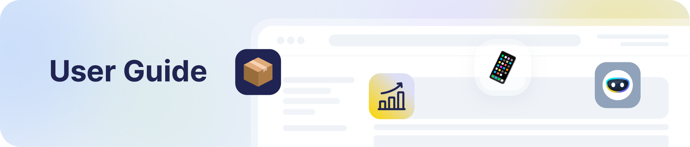
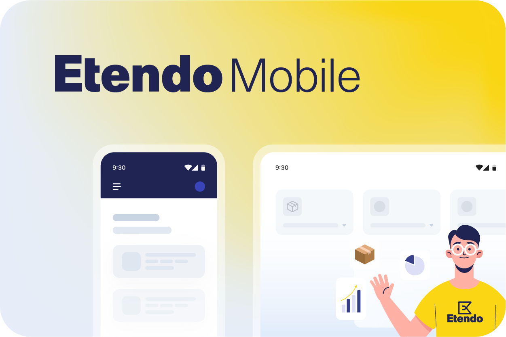
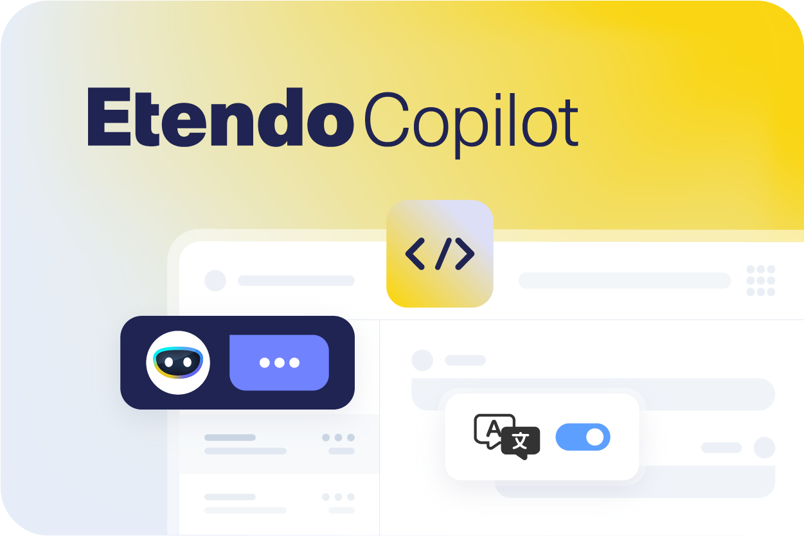

---
hide:
    - toc
---

# 
## Welcome to User Software Documentation

In this section, we welcome you to a complete user guide to facilitate your experience working with each of our products.

### Are you ready to dive into the world of our software?

Whether you're looking to master the basics or explore advanced features, our guides are designed to fit your needs. If you are a developer, we suggest you visit our section created especially for you: [Developer Guide](../developer-guide/overview.md).

---

<figure markdown>
{align=right width=400}
  
### Here you will find user guides on how to use our platform with all Etendo Classic windows, as well as guides for all our bundles in the optional features section.
</figure>

---

<figure markdown>
{align=left width=400}
  
### You will find information on how to use the Etendo mobile application, from downloading it from the Play Store and App Store as well as the complete user interface.
</figure>

---

<figure markdown>
{align=right width=400}
 
### In this section, you will find everything about our Copilot project. Currently you have information about Bastian, our artificial intelligence based chatbot that can answer you all about Etendo.
</figure>