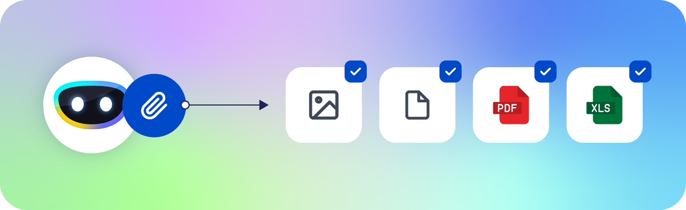

#

## September 2025

### Etendo

- :octicons-rocket-24: **New Etendo release: Version 25.3 Now Available!**

    

    ---

    The latest version [25.3](./release-notes/etendo-classic/release-notes.md) of Etendo is here! All supported modules have been updated for full integration.
    
    In this latest release, a new feature was added: the ability to configure document types for invoices, orders, and shipments/receipts based on the selected business partner: 

    - Documentation: [Document Type](../user-guide/etendo-classic/basic-features/master-data-management/master-data.md#document-type)
    - Blog: [Still Creating Invoices Manually? Discover How Etendo 25.3 Automates Document Type Selection per Customer](https://etendo.software/en/document-type-tab-etendo-25-3/){target="_blank"}

- :octicons-rocket-24: **New Etendo Gradle Plugin release: Version 2.2.0 Now Available!**

    The latest version [2.2.0](./release-notes/etendo-classic/plugins/etendo-gradle-plugin/release-notes.md) of Etendo Gradle Plugin is here!
    
    Enjoy a brand-new interactive installation wizard that guides you through the Etendo setup—configure core system settings and module-specific variables for bundles with ease. Accelerate deployments, reduce configuration errors, and get up and running faster.

    - Documentation: [Interactive Installation](../getting-started/interactive-installation.md)

### Platform Extensions

- :octicons-package-16: **Need to generate printables using print providers? Meet the new module**
    
    In version [3.10.0](./release-notes/etendo-classic/bundles/platform-extensions/release-notes.md) of the Platform Extensions bundle, the [Print Provider](../user-guide/etendo-classic/optional-features/bundles/platform-extensions/print-provider.md) module was added.
    
    It allows you to use the **Print Node** service by default or extend the module to implement multiple services. It also enables you to create print templates that can be executed from different Etendo windows.

### Financial Extensions

- :material-chart-bar: **All Control Over Unposted Documents: Easily identify, review, and post multiple pending documents in one place**

    

    In version [3.4.0](./release-notes/etendo-classic/bundles/financial-extensions/release-notes.md) of the Financial Extensions bundle compatible with **Etendo 25**, the **Not Posted Documents** window, part of the **Bulk Posting** module, introduces a smarter and more efficient way to manage accounting records. Users can now:  

    - **Filter by multiple document types** to target exactly what they need.  
    - **Quickly navigate** directly to any unposted document from the results grid.  
    - **Execute bulk posting actions** for faster and more consistent processing.  
    - **Refine searches** with advanced filters like organization, accounting date, and accounting status.
    --- 
    - Documentation: [Not Posted Documents](../user-guide/etendo-classic/basic-features/financial-management/accounting/transactions.md#not-posted-documents)
    - Blog: [Ready for the Accounting Close? Discover Etendo’s Centralized Window for Not Posted Documents](https://etendo.software/en/not-posted-documents-window-etendo/){target="_blank"}

- :material-chart-bar: **Advanced Trial Balance: Drill into Ledger Entries & Export to PDF and Excel**

    

    In version [3.4.0](./release-notes/etendo-classic/bundles/financial-extensions/release-notes.md) of the Financial Extensions bundle, the **Trial Balance** report gains new capabilities: Discover the revamped Trial Balance report, get instant, actionable insights with one-click navigation to General Ledger entries, full support for all accounting dimensions, and polished exports to Excel and PDF for sharing or audit. Faster analysis, clearer traceability, and professional output to power your financial workflows.

    ---
    - Documentation: [Trial Balance](../user-guide/etendo-classic/basic-features/financial-management/accounting/analysis-tools.md#trial-balance)
    - Blog: [Trial Balance in Etendo: Advanced Features for Superior Accounting Analysis](https://etendo.software/en/trial-balance-in-etendo/){target="_blank"}

- :material-view-list: **Smarter Financial Planning with Budget (Projections)**

    
    
    In version [3.5.0](./release-notes/etendo-classic/bundles/financial-extensions/release-notes.md) and [1.29.0](./release-notes/etendo-classic/bundles/financial-extensions/release-notes.md) of the Financial Extensions bundle compatible with **Etendo 23** and above, the **Budget** window, part of the **Financial Report Budget** module, empowers organizations to plan ahead, control spending, and make data-driven financial decisions — all in one place.

    With **Budget**, users can set income and expense targets, compare them against actual performance, and instantly visualize deviations. Multi-dimensional analysis by **Project**, **Cost Center**, **Business Partner**, or **Product**, combined with tools like **Export to Excel**, **Copy Budget**, and **Actual Data Comparison**, turns budgeting into a dynamic and strategic process.

    - Build flexible budgets and track real-time variances.  
    - Compare planned and actual results directly within accounting.
    - Analyze by multiple dimensions for deeper insights.  
    - Export, copy, and reuse budgets to accelerate financial planning. 
    ---
    - Documentation: [Budget](../user-guide/etendo-classic/basic-features/financial-management/accounting/transactions.md#budget)
    - Blog: [How Budgets and Projections in Etendo Boost Profitability and Financial Control](https://etendo.software/en/budgets-in-etendo/){target="_blank"}

### Warehouse Extensions

- :material-view-list: **Smart Logistics Made Simple: Full Traceability with Pallet and Box Logistic Units**

    With version [3.3.0](./release-notes/etendo-classic/bundles/warehouse-extensions/release-notes.md) of the Warehouse Extensions package, the **Stock Logistic Unit** module transforms the way warehouses track and manage goods. It introduces flexible containers such as **boxes**, **pallets**, or **custom handling units**, which keep every movement under control, from receiving to stock reservation in sales.

    - Track products at every step with real-time traceability and the correct logistics unit.  
    - Automatically create and manage product boxes and pallets during warehouse operations.
    - Define logistics unit types and capacities to match the actual containers for each product.
    - Prioritize reservations and sales by box or pallet

    ---
    - Documentation: [Stock Logistic Unit](../user-guide/etendo-classic/optional-features/bundles/warehouse-extensions/stock-logistic-unit.md)

- :material-view-list: **Next-Gen Warehouse Power: Smarter Receipts, Traceable Products, and Full Mobile Control**

    In version [3.3.0](./release-notes/etendo-classic/bundles/warehouse-extensions/release-notes.md) of the Warehouse Extensions bundle, the **Advanced Warehouse Management** module evolves into a complete ecosystem for modern logistics — faster, more accurate, and fully traceable.  

    **What’s new:**

    - **GS1-128 barcode reading** to identify products, batches, and expiration dates in a single scan.  
    - Full management of **expiration dates, lots, and logistic units** (boxes and pallets) for precise stock control.  
    - A brand-new **Inbound Receipt** window to easily register incoming goods and assign them to pallets or boxes directly upon arrival.  
    - Two new **mobile inventory tasks** — *Inventory Adjustment* and *Inventory Relocation* — that simplify warehouse corrections and internal movements in real time.
    
    ---
    - Documentation: [Advanced Warehouse Management](../user-guide/etendo-classic/optional-features/bundles/warehouse-extensions/advanced-warehouse-management.md)

## August 2025

### Financial Extensions

- :material-chart-bar: **Balance Sheet and P&L Report Advanced: more powerful reporting**

    

    In version [3.3.0](./release-notes/etendo-classic/bundles/financial-extensions/release-notes.md) of the Financial Extensions bundle, the **Balance Sheet and P&L Report Advanced** gains new capabilities:

    - Adds support for additional accounting dimensions.
    - Enables side-by-side comparisons across up to four years.

    ---

    - Documentation: [Balance Sheet and P&L Report Advanced](../user-guide/etendo-classic/basic-features/financial-management/accounting/analysis-tools.md#balance-sheet-and-pl-structure-advanced)
    - Blog: [Unlock the Power of Advanced Financial Analysis with Etendo!](https://etendo.software/en/unlock-the-power-of-advanced-financial-analysis-with-etendo/){target="_blank"}

### Platform Extensions

- :material-new-box: **Try the Alpha of Etendo Main UI, the new Etendo interface**

    
    
    In version [3.7.1](./release-notes/etendo-classic/bundles/platform-extensions/release-notes.md) of the Platform Extensions bundle, we introduced the Alpha release of the Etendo Main UI. Early builds include 0.2.0, 0.4.0, 0.4.1 and 0.5.0.

    Discover a sleek, modern experience designed to boost productivity and simplify daily tasks:

    - Fresh visual identity that modernizes the platform.
    - Enhanced workflows to amplify everything you already do in Etendo.
    - Contemporary, intuitive design for faster navigation and clarity.
    - More functional and easier to use.

    ---

    - Try in demo environment: [Livebuilds](../live-builds/overview.md)
    - Documentation: [Install Etendo Main UI](../developer-guide/etendo-classic/getting-started/installation/install-etendo-main-ui.md) today and help shape the next-generation Etendo experience.
    - Blog: [You Can Now Try Etendo’s New Interface! Discover the Alpha Version](https://etendo.software/en/you-can-now-try-etendos-new-interface-discover-the-alpha-version/)

- :octicons-package-16: **Supercharge observability with OpenTelemetry in your Dockerized services 🚀**

    In version [3.7.0](./release-notes/etendo-classic/bundles/platform-extensions/release-notes.md) of the Platform Extensions bundle, OpenTelemetry has been integrated to provide unified observability for Dockerized services. Collect metrics, traces, and logs in one place to detect latency spikes, bottlenecks, and communication errors before they affect users. Supports common exporters and backends to fit your monitoring stack.

    More information: [How to Use OpenTelemetry](../developer-guide/etendo-rx/how-to-guides/how-to-use-opentelemetry.md)

- :octicons-package-16: **Webhooks make integrations easier than ever 🚀**
    
    From version [3.7.0](./release-notes/etendo-classic/bundles/platform-extensions/release-notes.md) of the Platform Extensions bundle, [Webhooks](../developer-guide/etendo-classic/bundles/platform/etendo-webhooks.md) can now use **POST**. This means Etendo can automatically send information to other apps or services in real time, making your integrations faster and smoother, without technical hassle.

   
### Copilot Extensions

- :material-robot: **Etendo Copilot 3.5.0: Smarter, faster, and easier to use 🚀**

    
    With version [3.5.0](./release-notes/etendo-copilot/bundles/release-notes.md) of the Copilot Extensions bundle, Copilot takes a big step forward. Here’s what’s new:

    -  **More powerful conversations** A new full-screen chat with conversation selector makes it easier to switch and keep track of different tasks.  
    - **Smarter tools**: New tools like [Excel OCR](../developer-guide/etendo-copilot/available-tools/xls-ocr-tool.md) (read data from images of spreadsheets) and [Memory Tool](../developer-guide/etendo-copilot/available-tools/memory-tool.md) help you work faster with complex data.  
    - **Better integrations**: The new MCP Server support lets you connect and manage external tools and APIs in an easy way.
    ---

    - Documentation: [How to Configure MCP Servers on Agents](../developer-guide/etendo-copilot/how-to-guides/how-to-configure-mcp-servers-on-agents.md)
    - Blog: [Tired of slow and expensive integrations? Discover how MCP is changing the game](https://etendo.software/en/discover-how-mcp-is-changing-the-game/){target="_blank"}
    - Blog: [Gmail at Your Fingertips with Etendo Copilot: Seamless Productivity](https://etendo.software/en/gmail-at-your-fingertips-with-etendo-copilot-seamless-productivity/){target="_blank"}

### Warehouse Extensions

- :material-view-list: **All-in-one Warehouse Power: Picking, Packing & Mobile App now in Etendo 25 🚀**

    With version [3.2.2](./release-notes/etendo-classic/bundles/warehouse-extensions/release-notes.md) of the Warehouse Extensions bundle, you get the complete package: smarter picking, faster packing, and a mobile app to take control from anywhere. 
    Streamline your warehouse operations and deliver with speed and accuracy — all included in Etendo 25.

## July 2025

### Etendo

- :octicons-rocket-24: **New Etendo release: Version 25.2 Now Available!**

    The latest version [25.2.x](./release-notes/etendo-classic/release-notes.md) of Etendo is here! All supported modules have been updated for full integration.  

### Copilot Extensions

- :material-robot: **New Invoice Supervisor agent: Uploading purchase invoices to Etendo has never been easier**

    
    
    In version [3.1.0](./release-notes/etendo-copilot/bundles/release-notes.md) of the Copilot Extensions bundle, the **Invoice Supervisor** agent is added to automatically create **purchase invoices** by processing multiple PDFs or images packed in a ZIP. Thanks to OCR, it extracts supplier, invoice number, currency, items, quantities, and totals, then drafts them in Etendo for review.

    - Documentation: [Invoice Supervisor](../user-guide/etendo-copilot/bundles/overview.md#invoice-supervisor)
    - Blog: [How do I reduce the operational burden on my purchasing team? With Agent Invoice Supervisor!](https://etendo.software/en/how-do-i-reduce-the-operational-burden-on-my-purchasing-team-with-agent-invoice-supervisor/){target="_blank"}

- :material-robot: **Bulk data uploads are a thing of the past: Google Drive and Sheets integration in Copilot**

    
    In version [3.2.0](./release-notes/etendo-copilot/bundles/release-notes.md) of the Copilot Extensions bundle, the new feature is added to connect Copilot to **Google Drive** and **Google Sheets** and use agents to create **products** or **business partners** in bulk from a spreadsheet via the **Task** module. Ideal for large-scale data imports.

    - Documentation: [Data Initialization Supervisor](../user-guide/etendo-copilot/bundles/overview.md#data-initialization-supervisor)
    - Blog: [Bulk Data Upload in Etendo with Google Sheets: Automate and Optimize with AI](https://etendo.software/en/bulk-data-upload-in-etendo-with-google-sheets-automate-and-optimize-with-ai/){target="_blank"}

### Platform Extensions

- :octicons-package-16: **Unleash team productivity: Meet the new Task module**
    
    In version [2.14.0](./release-notes/etendo-classic/bundles/platform-extensions/release-notes.md) and [3.2.0](./release-notes/etendo-classic/bundles/platform-extensions/release-notes.md) of the Platform Extensions bundle, the [Task](../user-guide/etendo-classic/optional-features/bundles/platform-extensions/task.md) module was added. Allowing you to organize, automate, and track workflows. Perfect for teams and agents needing structured task management.

- :octicons-package-16: **Etendo SSO: Log in without passwords** 

    
    
    In version [2.14.0](./release-notes/etendo-classic/bundles/platform-extensions/release-notes.md) and [3.2.0](./release-notes/etendo-classic/bundles/platform-extensions/release-notes.md) of the Platform Extensions bundle, the **Etendo SSO Login** was added enabling **Single Sign-On** authentication, simplifying user login and enhancing security using external identity providers, such as Google, Microsoft, LinkedIn, GitHub and Facebook.

    - Documentation: [Etendo SSO Login](../user-guide/etendo-classic/optional-features/bundles/platform-extensions/etendo-rx.md#etendo-sso-login)
    - Blog: [Etendo SSO: Log in without passwords and with complete security](https://etendo.software/en/etendo-sso-log-in-without-passwords-and-with-complete-security/)

### Warehouse Extensions

- :material-view-list: **Picking List: Fulfillment accuracy that scales**

    Boost your accuracy and speed with the [Picking List](../user-guide/etendo-classic/optional-features/bundles/warehouse-extensions/picking.md) module, included in the [1.12.0](./release-notes/etendo-classic/bundles/warehouse-extensions/release-notes.md) version of Warehouse Extensions bundle. Reserve stock instantly as picking lists are generated, eliminating conflicts and streamlining workflows. Choose between efficient Outbound Picking or simplified Direct Picking to Customer, either way, your warehouse team gains structured visibility and control over pending orders. It’s precision, planning, and performance, all in one, to accelerate delivery and customer satisfaction.

- :fontawesome-solid-boxes-packing: **Packing: Streamlined packing, error-free Shipments**

    In version [1.12.0](./release-notes/etendo-classic/bundles/warehouse-extensions/release-notes.md) of Warehouse Extensions bundle, the [Packing](../user-guide/etendo-classic/optional-features/bundles/warehouse-extensions/packing.md) module is added, designed to bring structure and speed to goods shipment. Once a goods shipment document is processed, warehouse staff can select the optimal handling unit (box) for each item, ensuring every product is properly packed and ready for dispatch. This module minimizes handling errors and boosts shipment organization, giving your warehouse the polished finish every order deserves.

- :octicons-device-mobile-16: **Advanced Warehouse Management: Mobile-powered inventory**

    

    In version [1.12.0](./release-notes/etendo-classic/bundles/warehouse-extensions/release-notes.md) of Warehouse Extensions bundle, unlock seamless warehouse operations with [Advanced Warehouse Management](../user-guide/etendo-classic/optional-features/bundles/warehouse-extensions/advanced-warehouse-management.md) module, a feature-packed mobile sub-app that integrates deeply with Etendo Mobile to deliver full traceability and automated warehouse operations.
    
    - Scan barcodes. 
    - Execute **stock adjustments**.
    - Apply **relocation** and automated rules. 
    - Supercharges your **picking** and **packing** flows.
        
    All from your mobile device. Every action synchronizes in real time with Etendo, say goodbye to bottlenecks and ensuring consistent data across your entire operation.

    - Blog: [Perfect Orders in Minutes: the Change Your Warehouse Needs is Called Etendo Mobile](https://etendo.software/en/perfect-orders-in-minutes-the-change-your-warehouse-needs-is-called-etendo-mobile/){target="_blank"}

## May 2025

### Etendo

- :octicons-rocket-24: **New Etendo Release: Version 25.1 Now Available!**

    ---
    The latest version [25.1.x](./release-notes/etendo-classic/release-notes.md) of Etendo is here! This release brings compatibility updates with **Java 17**, **PostgreSQL 16**, **Tomcat 9** and third-party dependencies, ensuring a modern and robust tech stack. All supported modules have been updated for full integration.  
    Want to know more? Check out the [developer updating guide](../developer-guide/etendo-classic/developer-changelog/apichanges.md).

    ---

    <iframe width="560" height="315" src="https://www.youtube.com/embed/OtHb45n2dgU?si=dttVeLQxnf97HGjN" title="YouTube video player" frameborder="0" allow="accelerometer; autoplay; clipboard-write; encrypted-media; gyroscope; picture-in-picture; web-share" referrerpolicy="strict-origin-when-cross-origin" allowfullscreen></iframe>

- :octicons-rocket-24: **New Shipment and Invoicing Statuses in Purchase Orders and Goods Receipts**

    ---  
    This release introduces improved visibility in procurement processes. In the [Purchase Order](../user-guide/etendo-classic/basic-features/procurement-management/transactions.md#purchase-order) window, the status bar now shows shipment and invoicing percentages. At the line level, you’ll see detailed quantities for what has been invoiced and shipped.  
    Similarly, the [Goods Receipt](../user-guide/etendo-classic/basic-features/procurement-management/transactions.md#goods-receipts) window shows invoicing percentages at both header and line levels.

- :octicons-rocket-24: **Easily Exclude Promotions and Discounts with a Simple Checkbox**

    ---
    A new checkbox in the *More Information* section of [Sales Order](../user-guide/etendo-classic/basic-features/sales-management/transactions.md#lines_1) and [Sales Invoice](../user-guide/etendo-classic/basic-features/sales-management/transactions.md#lines_5) lines allows users to **cancel automatic discounts and promotions**. This gives you more control over pricing on a per-line basis.

- :octicons-rocket-24: **Improved Navigation in the Create Invoices from Orders Process**

    ---
    Now it’s easier to work with orders! The [Create Invoices from Orders](../user-guide/etendo-classic/basic-features/sales-management/transactions.md#create-invoices-from-orders) process includes improved navigation features that let you access filtered orders more efficiently.

- :octicons-rocket-24: **Enhanced Purchase Invoice Voiding with Supplier Reference**

    ---  
    When canceling a purchase invoice, Etendo creates a reverse document that now references the supplier’s cancellation document. The [invoice reactivation](../user-guide/etendo-classic/basic-features/procurement-management/transactions.md#reactivate) process includes a new `Supplier Reference` field to ensure clear traceability and alignment.

## April 2025

### Etendo

- :octicons-rocket-24: **Remember: You can simplify the calculation of commissions with Etendo**

    ---

    With **Etendo**, managing [sales commissions](../user-guide/etendo-classic/basic-features/sales-management/setup.md#commission) is streamlined and flexible. Commissions can be calculated based on sales orders or invoices, using different criteria and filters such as quantities sold or amounts invoiced: 

    

    Once calculated, sales agent payments can be generated automatically. 
    You can configure commissions to apply to all invoices or only paid ones, and decide whether to include invoices without an assigned sales agent.
     
    --- 

    <iframe width="560" height="315" src="https://www.youtube.com/embed/vQGzo7cbCYQ?si=2zC3RQmYD1ImkoLo" title="YouTube video player" frameborder="0" allow="accelerometer; autoplay; clipboard-write; encrypted-media; gyroscope; picture-in-picture; web-share" referrerpolicy="strict-origin-when-cross-origin" allowfullscreen></iframe>

### Copilot Extensions

- :material-robot: **Copilot supports multi-vendor models such as  OpenAI, Ollama, Anthropic, and Deepseek, also image input for compatible models**

    ---

    
    
    - In version [1.13.0](./release-notes/etendo-copilot/bundles/release-notes.md) of the Copilot Extensions bundle, Etendo Copilot expands its capabilities by supporting multiple vendors, including:

        - **Anthropic**: Specializes in code generation, making it the best choice for code-related tasks.
        - **Deepseek**: A cost-effective alternative for generative tasks similar to OpenAI.
        - **Ollama (self-hosted models)**: Ideal for users running their own models on their infrastructure.

    - Additionally, images can now be processed directly by language models without requiring a separate tool for pre-processing.

## March 2025

### Etendo Mobile

- :material-share: **Receive and share files with Etendo Mobile**

    ---

    

    A new feature has been added to Etendo Mobile to streamline integration with external applications. With the new [Share files](../user-guide/etendo-mobile/) option, you can now receive files from outside apps and use them directly in subapplications like:

    - **Documents Manager**, where you can view files right in Etendo Mobile.
    - **Copilot**, where specialized agents can extract information from images, transform audios into sales orders, and much more.

    This feature improves data flow and efficiency across your platform.

    Try it now using the *Demo Try* button in the app, or download the latest version from the App Store or Play Store.

### Financial Extensions

- :material-chart-bar: **Now in the advanced financial reports you can view accounting dimensions.**
    ---

    

    In version [1.25.0](./release-notes/etendo-classic/bundles/financial-extensions/release-notes.md) of the Financial Extensions bundle, improvements to advanced financial reporting are included.In this version, the [General Ledger Report Advanced](../user-guide/etendo-classic/basic-features/financial-management/accounting/analysis-tools/#general-ledger-report-advanced) and [Journal Entries Report Advanced](../user-guide/etendo-classic/basic-features/financial-management/accounting/analysis-tools/#journal-entries-report-advanced) will allow you to view and filter by the desired accounting dimensions.
    In addition, you can navigate to related entities in each report!

### Etendo

- :octicons-rocket-24: **25.1 Release Candidate Now Available!**

    The new version [25.1](./release-notes/etendo-classic/release-notes.md) of Etendo introduces the latest stack enhancements. While this version is currently in Release Candidate (RC) status, you can already explore the detailed [API changelog](../developer-guide/etendo-classic/developer-changelog/apichanges.md) to review the changes and improvements included in this release.

- :material-trending-up: **Fixed Issue**
    
    ---
    As of version [24.3.7](./release-notes/etendo-classic/release-notes.md), a bug affecting dropdown selectors in dimensional reports has been fixed. In environments running Etendo 24.3.6 or earlier, the first record in combo boxes was displayed incorrectly, showing a concatenation of all values instead of the correct individual value. This issue was caused by improper handling of `<option>` tags in HTML.

    The bug has been resolved in 24.3.7, and Etendo 24.4.0 or later was not affected, as the refactor to fix the issue was already included in that version. 
    
    *See more details in Issue [#629](https://github.com/etendosoftware/etendo_core/issues/629)*.

## February 2025

### Etendo ISO

- :material-trending-up: **Optimizations**
    
    ---
    As of version [24.4.3](https://etendo-appliances.s3.eu-west-1.amazonaws.com/etendo/iso/etendo-24Q4.3.iso), the Etendo ISO includes performance improvements with optimized memory and database settings to enhance system efficiency. *See more details in Issue [#573](https://github.com/etendosoftware/etendo_core/issues/573)*.

### Copilot Extensions

- :material-robot: **Now, you can clone agents in one click**

    ---

    
    
    In version [1.12.0](./release-notes/etendo-copilot/bundles/release-notes.md) of the Copilot Extensions bundle, the functionality to [clone agents](../user-guide/etendo-copilot/setup-and-usage.md#buttons) and knowledge bases is added, allowing you to modify and customize the agents' wizards according to your needs.

-   :material-robot: **Improvements in agent knowledge bases**

    --- 

    In version [1.12.0](./release-notes/etendo-copilot/bundles/release-notes.md) of the Copilot Extensions bundle, new capabilities are added:

    

    For more info visit [Knowledge Base File](../user-guide/etendo-copilot/setup-and-usage.md#knowledge-base-file-window) windows documentation.

### Financial Extensions

- :octicons-package-16: **Enhanced asset management with accounting dimensions**

    ---

    

    In version [1.22.0](./release-notes/etendo-classic/bundles/financial-extensions/release-notes.md) of the Financial Extensions bundle, with the [Accounting Dimensions Assets](../user-guide/etendo-classic/basic-features/financial-management/assets/overview.md#accounting-dimensions-assets) module improves asset management by allowing users to assign accounting dimensions to assets like Business Partner, Activity, and Cost Center among others. These dimensions transfer to amortization lines. Also, amortizations are now grouped by period (monthly or yearly), enhancing financial reporting accuracy and ensuring consistent asset depreciation tracking.

- :octicons-package-16: **Gain better control with the Not Posted Documents window**

    ---

    

    In version [1.22.0](./release-notes/etendo-classic/bundles/financial-extensions/release-notes.md) of the Financial Extensions bundle, with the last version of [Bulk Posting](../user-guide/etendo-classic/optional-features/bundles/financial-extensions/bulk-posting.md#not-posted-documents-window), the Not Posted Documents windows provides a comprehensive view of all completed financial transactions that have not yet been posted. This report ensures that no pending transactions are overlooked before closing an accounting period or running financial reports.

    Users can filter by date range and navigate directly to unposted documents, including journals, invoices, payments, and financial transactions, among others streamlining the posting process.

## January 2025

### Copilot Extensions 

- :material-robot: **You can now use multiple files in conversations with an agent**

    ---

    

    In version [1.10.0](./release-notes/etendo-copilot/bundles/release-notes.md) of the Copilot Extensions bundle, new functionalities have been added:

-   :material-robot: **[Upload multiple files](../user-guide/etendo-copilot/getting-started.md#attach-files)**
    
    ---
    
    It is now possible to attach multiple files at once in Etendo Copilot, optimizing document management and improving the user experience.

-   :octicons-package-16: **Automatic permissions management**
    
    ---

    When creating a new agent, the necessary permissions will be automatically generated for its execution in the current role, reducing friction in the configuration.

-   :octicons-package-16: **Optimized visualization**
    
    ---
    
    The agent window now shows the module to which each agent belongs, improving organization and navigation.

-  :material-tools: **Tool Pack: New tool to read Excel and CSV files** 
    
    ---
    
    [XLS Tool](../developer-guide/etendo-copilot/available-tools/xls-tool.md) has been added in the available Tools, allowing agents to read and process data directly from Excel or CSV files, facilitating automation and integration of structured information.

## December 2024

### Etendo

- :octicons-rocket-24: **New Etendo Release: Version 24.4 Now Available!**

    Version [24.4.0](./release-notes/etendo-classic/release-notes.md) of Etendo has been released for the last quarter of the year. All packages have been updated to ensure integration with this new release.  In addition this release includes all bugs resolved in the quarter.

- **The document completion process allows the use of Credit Payment as a payment method again.** 

    From now on, the completion is again one record at a time and is added to the [Bulk Completion](../user-guide/etendo-classic/optional-features/bundles/essentials-extensions/bulk-completion.md) button by installing the Essential Extensions bundle.

### Essentials Extensions

- :octicons-package-16: **Managing documents has never been so fast and easy**

    
    
    In version [1.7.0](./release-notes/etendo-classic/bundles/essentials-extensions/release-notes.md) of the Essentials Extensions bundle, you can effortlessly manage multiple records with the [Bulk Completion](../user-guide/etendo-classic/optional-features/bundles/essentials-extensions/bulk-completion.md) feature. Select the records you want to complete, reactivate, or close, and process them all at once with a single click.

### Warehouse Extensions

- :octicons-package-16: **More accurate automatic stock reservation**

    

    In version [1.10.0](./release-notes/etendo-classic/bundles/warehouse-extensions/release-notes.md) of the Warehouse Extensions bundle, with the [Automatic Warehouse Reservation](../user-guide/etendo-classic/optional-features/bundles/warehouse-extensions/overview.md#automated-warehouse-reservation) module the stock reservations can be limited only to the warehouse specified in the order header. This way you can ensure that your orders always use the right warehouse.

### Financial Extensions

- :octicons-package-16: **Automated remittances: Simplify remittance management by automating the settlement and protest process.**

    ---

    

    In version [1.21.0](./release-notes/etendo-classic/bundles/financial-extensions/release-notes.md) of the Financial Extensions bundle, with the [Automated remittances](../user-guide/etendo-classic/optional-features/bundles/financial-extensions/automated-remittance.md) module, when processing remittances, bank instructions are created and automatically settled with the current date. 

    The Protest Remittance button has also been added, making it possible to return receipts in collection remittances from a single place.

- :octicons-package-16: **Bank account and payment management allows for more automation**
    
    --- 

    

    In version [1.21.0](./release-notes/etendo-classic/bundles/financial-extensions/release-notes.md) of the Financial Extensions bundle, with the [Advanced Bank Account Management](../user-guide/etendo-classic/optional-features/bundles/financial-extensions/advanced-bank-account-management.md) module, added the possibility to set a default bank account in the busines partner configuration, as well as to define bank accounts for each location. 
    The possibility to select the bank account when adding payments and even edit payment plans with the Modify Payment button has also been added.

### Copilot Extensions 

- :material-robot: **Copilot allows the use of multiple AI models from different suppliers.**
    
    ---

    In version [1.9.0](./release-notes/etendo-copilot/bundles/release-notes.md) of the Copilot Extensions bundle, Multi-Model Assistant type was added, this agents extends the `Langchain` type with the particularity that it can be used with models from various suppliers such as Anthropic or Gemini, in addition to the existing OpenAI models.
    In addition, the AI Models window was added where the user can manage the models to be used by the different agents.

## November 2024

### Copilot Extensions

:material-robot: **New Etendo Copilot Release Available!**

New Copilot Extensions bundle version [1.8.0](./release-notes/etendo-copilot/bundles/release-notes.md) 

-  **Improve your Python Tools development with the Code Run agent**

    ---
    The [Code Run](../developer-guide/etendo-copilot/bundles/dev-assistant.md#code-run) agent combined with the [Docker Tool](../developer-guide/etendo-copilot/available-tools/docker-tool.md) introduces a safe and efficient way to run Python and Bash code inside isolated Docker containers. This tool revolutionizes the way coding tasks are handled. The wizard specializes in managing Docker containers to execute Python scripts, ensuring a reliable and isolated environment.

    Equipped with advanced capabilities, the agent prioritizes Python for troubleshooting, manages library installations dynamically, integrates Bash commands for flexible operations and handles file processing with precision. Whether you are troubleshooting, automating tasks or testing scripts, this tool ensures efficiency and security. Transform your development workflow with this powerful addition to Etendo.

## October 2024

### Copilot Extensions

:material-robot: **New Etendo Copilot Release Available!**

New Copilot Extensions bundle version [1.7.0](./release-notes/etendo-copilot/bundles/release-notes.md)  

-  **Boost Your Development Workflow with the New Dev Assistant!**

    ---
    The [Dev Assistant](../developer-guide/etendo-copilot/bundles/dev-assistant.md) module streamlines and accelerates your development workflow in Etendo. With specialized agents, you can now easily create buttons, windows, tabs, tables, event controllers, Jasper reports, and background processes. 

    These agent are designed to enhance productivity and reduce complexity, enabling efficient management and construction of all components within Etendo. Take your development process to the next level!

-  **Copilot in Mobile: Try Copilot on Your Mobile Devices and Tablets!**

    ---
    The new [Etendo Copilot sub-application](../user-guide/etendo-copilot/bundles/overview.md#etendo-copilot-subapp) enables you to interact with AI-powered agents from anywhere. Now, you can attach files, access role-specific windows, and receive real-time, personalized assistance directly on your mobile or tablet. Enjoy seamless integration with all the familiar features of Etendo, right from your fingertips!

### Dependency Manager
:octicons-package-16: **Managing Etendo modules and dependencies has never been so easy**

The [Dependency Manager](../developer-guide/etendo-classic/getting-started/installation/dependency-manager.md) module allows users to access all published packages in Etendo Software repositories directly from the Etendo interface. With the Dependency Management window, you can browse available bundles, check version details and dependencies, and easily install new packages. The module also supports updating, removing, and modifying installed modules, giving you full control over your environment.

## September 2024

### Etendo

:octicons-rocket-24: **New Etendo Release: Version 24.3 Now Available!**

Version [24.3.0](./release-notes/etendo-classic/release-notes.md) of Etendo has been released for the third quarter of the year. All packages have been updated to ensure integration with this new release.  In addition this release includes all bugs resolved in the quarter.

### Copilot Extensions

:material-robot: **New Etendo Copilot Release Available!**

New Copilot Extensions bundle version [1.5.0](./release-notes/etendo-copilot/bundles/release-notes.md)  

- **New Feature Update: Zip File Support for LangChain Agents**
    
    

    We are excited to announce a new functionality in LangChain agents: the ability to upload `.zip` files directly into the knowledge base! These `.zip ` files can contain a variety of file formats, including `.txt`, `.pdf`, `.md`, `.py`, `.java`, and `.js`.
    This enhancement allows developers to train agents with example source code.
    Boost your agent’s capabilities with this powerful new feature!

## August 2024

### Copilot Extensions

[:material-robot: **New Etendo Copilot Release Available!**](../user-guide/etendo-copilot/getting-started.md): Boost Your Productivity

The newest version [1.4.0](./release-notes/etendo-copilot/bundles/release-notes.md) of the Copilot Extensions bundle brings the following key enhancements in Etendo Copilot:

-   **New Capabilities:**
    
    ---
    - **Database Queries:** Use system database queries as knowledge bases to automate tasks under specific conditions.
    -  **Copilot Stream:** Track in real-time which agent or tool is working.
    -  **Improved UX:** The chat now retains the last agent used for seamless interaction.

-   **Agents Updates:**
    
    ---
    -  **Langchain Agents:** Now manage local knowledge bases, keeping your data secure.
    -  **LangGraph Agents:** Manage a team of agents, delegating tasks efficiently. 
     

These updates make Etendo Copilot more powerful, secure, and user-friendly, driving efficiency to new heights.

### Platform Extensions

[:simple-docker: **Docker Management**](../developer-guide/etendo-classic/bundles/platform/docker-management.md)

{align=right width=400}

- In version [1.18.0](./release-notes/etendo-classic/bundles/platform-extensions/release-notes.md) of the Platform Extensions bundle, the new **Docker Management** module has been introduced.
- This module simplifies the deployment of services by allowing you to configure the entire infrastructure your service requires using Etendo modules.
- PostgreSQL Database Service is included in the module, making service installation faster and easier than ever.

[:simple-apachetomcat: **Tomcat Dockerized Service**](../developer-guide/etendo-classic/bundles/platform/dockerized-tomcat-service.md)

- In version [1.18.0](./release-notes/etendo-classic/bundles/platform-extensions/release-notes.md) of the Platform Extensions bundle, the new **Tomcat Dockerized Service** module has been introduced, which simplifies the installation of Etendo on any server.
- With this module, setting up Etendo becomes a quick and straightforward process, removing the complexities typically associated with server configuration. 

### Warehouse Extensions
[:octicons-package-16: **Product Operations**](../user-guide/etendo-classic/optional-features/bundles/procurement-extensions/purchase-invoice-validation.md)

In the version [1.8.0](./release-notes/etendo-classic/bundles/warehouse-extensions/release-notes.md) of the Warehouse Extensions bundle, the **Product Operations** functionality has been included. This module allows you to centralize and control all your product movements with Products Operations. View every transaction, from shipments and receipts to costs and location, in one place. Simplify analysis and get a clear view of your operations' performance.

## July 2024

### Copilot Extensions

-   [:material-tools: **Tool Pack**](../developer-guide/etendo-copilot/available-tools/overview.md)

    ---
    
    The Tool Pack module, available from version [1.3.1](./release-notes/etendo-copilot/bundles/release-notes.md) of the Etendo Copilot bundle, includes a collection of tools designed to enhance the capabilities of Etendo Copilot agents. This module enables functionalities such as file reading and writing, directory navigation, and email sending, thereby significantly expanding the operational scope of the agents.

-   [:material-tools: **OCR Tool**](../developer-guide/etendo-copilot/available-tools/ocr-tool.md)

    ---

    From version [1.3.0](./release-notes/etendo-copilot/bundles/release-notes.md) of the Copilot Extensions bundle, the possibility to add a parameter to the OCR Tool to specify and detail the analysis on images has been included, and Codbar tool reader has been added to the tool capable of reading barcodes on images.

-   [:material-robot: **Purchase Expert**](../user-guide/etendo-copilot/bundles/copilot-purchase-expert.md)
    
    ---   

    As of version [1.3.0](./release-notes/etendo-copilot/bundles/release-notes.md) of the Copilot bundle, the [Attach File tool](../developer-guide/etendo-copilot/available-tools/attach-file-tool.md) was included, a tool capable of adding attachments to any record in Etendo.

-   [:material-robot: **Dev Assistant**](../developer-guide/etendo-copilot/bundles/dev-assistant.md)

    ---

    From version [1.1.0](./release-notes/etendo-copilot/bundles/release-notes.md) onwards, the [Reference Creator](../developer-guide/etendo-copilot/bundles/dev-assistant.md#reference-creator) agent was included, capable of creating list type references to be used in the development process.

:material-bug: **Fixed Issues**

In version [1.2.1](./release-notes/etendo-copilot/bundles/release-notes.md), Issue [#5](https://github.com/etendosoftware/com.etendoerp.copilot.extensions/issues/5){target="_blank"} which caused incorrect rendering of line breaks in code blocks, has been resolved.

### Financial Extensions

[:octicons-package-16: **VAT Regularization**](../user-guide/etendo-classic/optional-features/bundles/financial-extensions/overview.md/#vat-regularization)

In version [1.16.1](./release-notes/etendo-classic/bundles/financial-extensions/release-notes.md) of this bundle, the [VAT Regularization](../user-guide/etendo-classic/optional-features/bundles/financial-extensions/overview.md/#vat-regularization) module has been included, which allows you to **easily adjust the accounts** to ensure that the **VAT balance is adjusted**.

---

## June 2024

### Etendo

:octicons-rocket-24: **New Release Available!**

Etendo version [24.2.0](./release-notes/etendo-classic/release-notes.md) has been released, corresponding to the second quarter of the year. All bundles have been updated to ensure seamless integration with this new version.

:material-bug: **Fixed Issues**

In version [24.1.8](./release-notes/etendo-classic/release-notes.md), Issue [#270](https://github.com/etendosoftware/etendo_core/issues/270){target="_blank"}, which caused **unexpected execution of callouts** in the **Sales Order** window, has been resolved.

### Copilot Extensions

:material-trending-up: **Optimizations**

Starting with version [1.2.0](./release-notes/etendo-copilot/bundles/release-notes.md) of this package, bugs have been fixed and stability improvements have been made to Copilot. This update also introduces visual improvements to the chat by making it possible to enter **text on more than one line**.

### Financial Extensions

[:octicons-package-16: **G/L Journal Clone**](../user-guide/etendo-classic/basic-features/financial-management/accounting/transactions.md/#gl-journal-clone)

Starting with version [1.15.0](./release-notes/etendo-classic/bundles/financial-extensions/release-notes.md) of this bundle, the GL Journal Clone module is included, which makes it possible to clone the Simple GL Journal.

---

## May 2024

### Copilot Extensions

[:material-robot: **SQL Expert**](../user-guide/etendo-copilot/bundles/sql-expert.md)

In the version [1.1.0](./release-notes/etendo-copilot/bundles/release-notes.md) of the Copilot Extensions bundle, the SQL Expert has been included.
With this agent, you will be allowed to **formulate questions** in natural language, and the system will automatically generate the necessary SQL query to return data in code or natural language.

---

## April 2024

### Copilot Extensions

[:material-robot: **Purchase Expert Agent**](../user-guide/etendo-copilot/bundles/overview.md#order-expert)

In the version [1.1.0](./release-notes/etendo-copilot/bundles/release-notes.md) of the Copilot Extensions bundle, the Purchase Expert Agent has been included.
Your purchase orders are made easier with the new Copilot agent. Interact via **text or by uploading images or PDFs** with the purchase order data, and the agent will automatically generate a draft.

### Spanish Localization

:material-trending-up: **Optimizations**

As of version [1.9.4](./release-notes/etendo-classic/bundles/localization-spain-extensions/release-notes.md) of this bundle, we have simplified maintenance by replacing the `org.openbravo.util.saaj.impl` and `org.openbravo.util.javax.xml.soap` module dependencies with the new Maven dependencies [Jakarta SOAP Implementation](https://mvnrepository.com/artifact/com.sun.xml.messaging.saaj/saaj-impl/1.5.3){target="_blank"} and [Jakarta SOAP with Attachments API](https://mvnrepository.com/artifact/jakarta.xml.soap/jakarta.xml.soap-api/1.4.2){target="_blank"}.

To take advantage of these enhancements, when upgrading to version [1.9.4](./release-notes/etendo-classic/bundles/localization-spain-extensions/release-notes.md) or higher, be sure to manually remove the old modules from the `/modules` directory so that the new build will use the new dependencies.

---

## March 2024

### Etendo

:material-trending-up: **Optimizations**

As of version [24.1.0](./release-notes/etendo-classic/release-notes.md), the support for [Tomcat 9](https://tomcat.apache.org/download-90.cgi){target="_blank"} has been updated.

### Copilot Extensions

[:material-tools: **OCR Tool**](../developer-guide/etendo-copilot/available-tools/ocr-tool.md)

In the version [1.0.0](./release-notes/etendo-copilot/bundles/release-notes.md) of the Copilot Extensions bundle, the OCR Tool has been included.
With this tool designed for **optical character recognition**, you will be able to extract text from images or PDF files.

### Procurement Extensions

[:octicons-package-16: **Purchase Invoice Validation**](../user-guide/etendo-classic/optional-features/bundles/procurement-extensions/purchase-invoice-validation.md)

In the version [1.0.0](./release-notes/etendo-classic/bundles/procurement-extensions/release-notes.md) of the Procurement Extensions bundle, the Purchase Invoice Validation functionality has been included. Now, you will be able to **avoid the duplication of purchase invoices** through established rules and automatic validations.

### Platform Extensions

:material-trending-up: **Optimizations**

As of version [1.13.2](./release-notes/etendo-classic/bundles/platform-extensions/release-notes.md) of this bundle, the module dependency `org.openbravo.util.javax.xml.soap` has been removed as it was not needed for any module in this bundle. In case this dependency is needed for development, we recommend using the Maven dependency [Jakarta SOAP with Attachments API](https://mvnrepository.com/artifact/jakarta.xml.soap/jakarta.xml.soap-api/1.4.2){target="_blank"}.

---
This work is licensed under :material-creative-commons: :fontawesome-brands-creative-commons-by: :fontawesome-brands-creative-commons-sa: [ CC BY-SA 2.5 ES](https://creativecommons.org/licenses/by-sa/2.5/es/){target="_blank"} by [Futit Services S.L](https://etendo.software){target="_blank"}.

