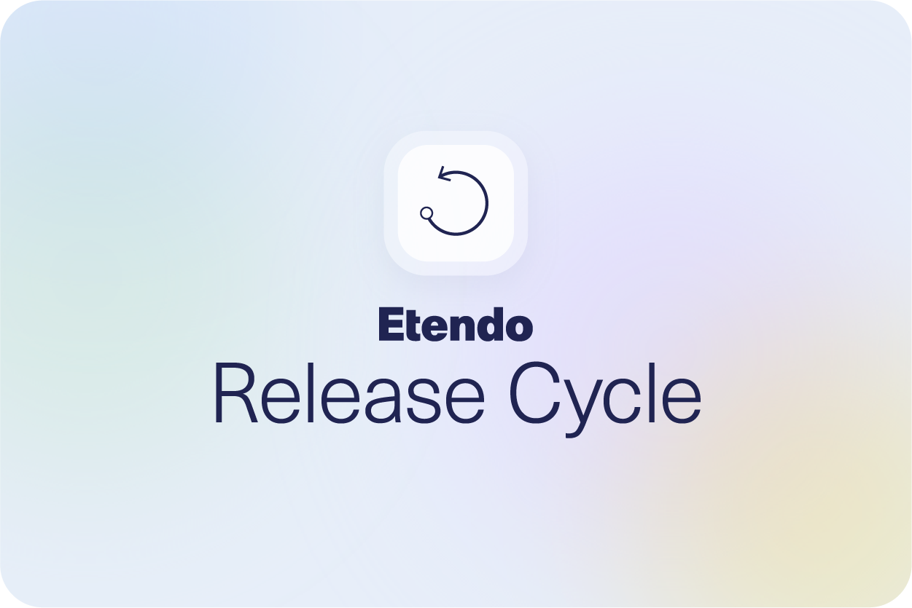
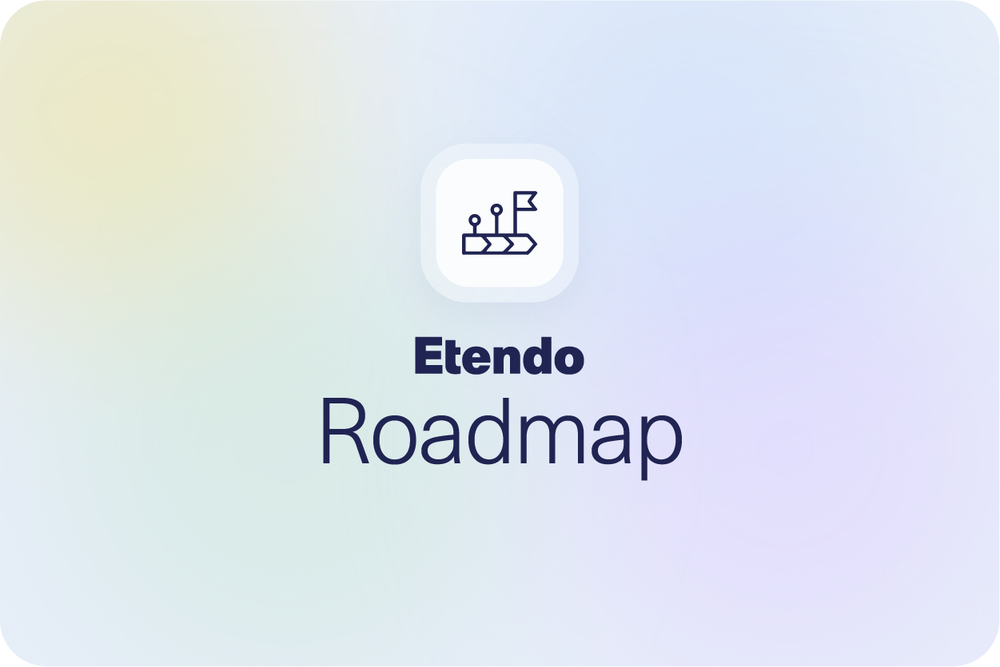
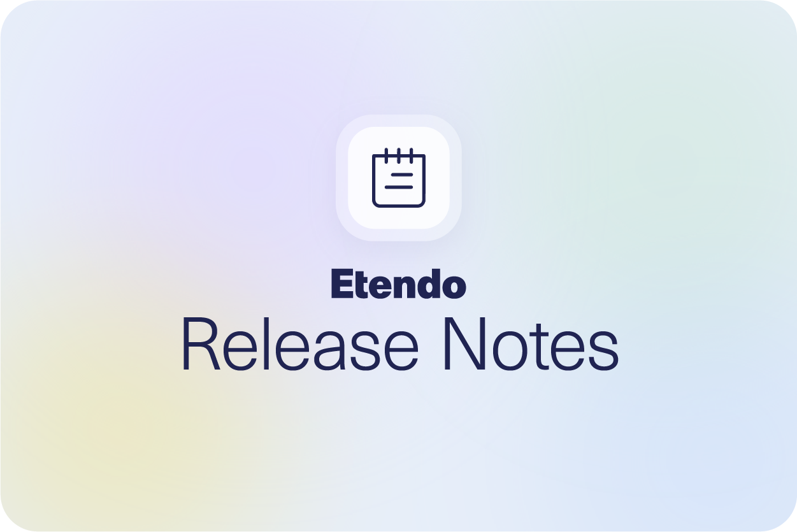

# 
## Welcome to our Release Notes Documentation

Here, you'll discover a comprehensive overview of the latest updates, enhancements, and fixes that have been meticulously crafted to elevate your Etendo software experience.

Stay informed and empowered as we walk you through each new iteration, showcasing the innovative features and improvements that await your exploration. Whether you're a seasoned user or just getting started, our Release Notes provide a roadmap to navigate the ever-evolving landscape of our software.

---

<figure markdown>
{align=right width=400}
  
### In this section you can learn about Etendo's life cycle, when updates are released and valuable information to keep you up to date with our news.
</figure>

---

<figure markdown>
{align=left width=400}
  
### Get to know about our current projects, their  status and future ideas and projects.                                            
</figure>

---

<figure markdown>
{align=right width=400}
  

### In this section, you will find a concise summary of the latest updates and improvements, bug fixes and news introduced in our latest releases for each of our products

</figure>